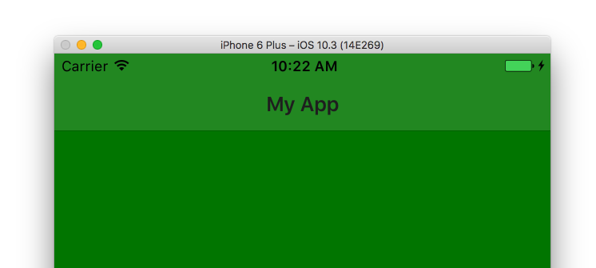
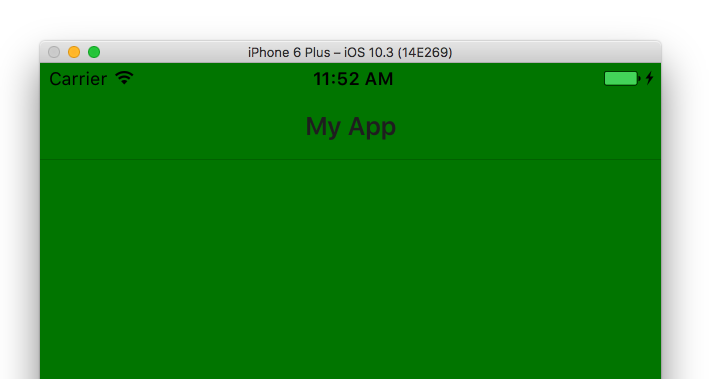
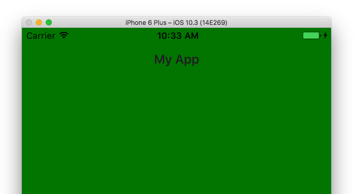

# Making Your iOS ActionBar’s Color Match Your Page

Have you ever tried to get your `ActionBar`’s background color to match the rest of your page? If so you probably tried something like this.

``` XML
<ActionBar backgroundColor="green"></ActionBar>
<GridLayout backgroundColor="green"></GridLayout>
```

And ended up with a UI that had two distinctly different colors.



## What’s going on?

NativeScript’s `<ActionBar>` UI component renders as a `UINavigationBar` on iOS, and that `UINavigationBar` has some quirky built-in behavior. Specifically, when iOS renders a `UINavigationBar` it [adjusts the background color you apply to give the control](https://stackoverflow.com/questions/22844253/uinavigationbar-background-color-not-the-exact-uicolor-i-set-it-to#answer-41928652) a bit of a “glossy” look.

The two colors in the above image don’t match because iOS alters the green color you applied, and therefore it doesn’t match the true green that the `<GridLayout>` uses.

## Getting the colors to match

Luckily, getting the colors to match is relatively simple. The `UINavigationBar` has a `translucent` property that controls whether iOS uses the color-adjusting algorithm. And because lets you access native APIs directly from JavaScript/TypeScript, changing that property is as easy as getting access to the control and setting the appropriate boolean value.

For example, suppose you main page looks something like this.

```
<Page navigatingTo="onNavigatingTo">

  <ActionBar
    backgroundColor="green"
    title="My App"></ActionBar>

  <GridLayout
    backgroundColor="green"></GridLayout>
</Page>
```

To make the `UINavigationBar` translucent you can use the following code, which gets a reference to the `UINavigationBar` through the [NativeScript frame module](https://docs.nativescript.org/cookbook/ui/frame), and sets the bar’s `translucent` property to `false`.

```
import { topmost } from "ui/frame";

export function navigatingTo() {
  if (topmost().ios) {
    var navigationBar = topmost().ios.controller.navigationBar;
    navigationBar.translucent = false;
  }
}
```

After this change you’ll have an `<ActionBar>` that looks like this.



As you can see the colors now match, but there’s still that one pixel border under the `UINavigationBar` control. The border is actually what iOS calls a “shadow image”, and if you also want to get rid of it you need two additional lines of code—one to call the `UINavigationBar`’s `setBackgroundImageForBarMetrics()` method, and another to set its `shadowImage` property. You pass both an empty image, as you really just want the bar to disappear. Here’s what that code looks like.

```
import { topmost } from "ui/frame";

// Declare these so the TypeScript compiler doesn’t complain about these references.
declare var UIImage: any;
declare var UIBarMetrics: any;

export function navigatingTo() {
  if (topmost().ios) {
    var navigationBar = topmost().ios.controller.navigationBar;
    navigationBar.translucent = false;
    navigationBar.setBackgroundImageForBarMetrics(UIImage.new(), UIBarMetrics.Default);
    navigationBar.shadowImage = UIImage.new();
  }
}
```

With this change in place the border under the `<ActionBar>` is now gone.



And that’s really about it. You’ll want to put this code in your first page, as once you set the properties once they’ll stay in effect throughout your application.

One last thing: if you’re using Angular you’ll want to put this code in an `ngOnInit()` handler in your app’s first component. Here’s an example you can refer to.

```
import { Component, OnInit } from "@angular/core";
import { topmost } from "ui/frame";
import { Page } from "ui/page";

// Declare these so the TypeScript compiler doesn’t complain about these references.
declare var UIImage: any;
declare var UIBarMetrics: any;

@Component({
  selector: "ns-demo",
  moduleId: module.id,
  template: `
    <ActionBar backgroundColor="green"></ActionBar>
    <GridLayout backgroundColor="green"></GridLayout>
  `
})
export class MyComponent implements OnInit {
  ngOnInit(): void {
    if (topmost().ios) {
      var navigationBar = topmost().ios.controller.navigationBar;
      navigationBar.translucent = false;
      navigationBar.setBackgroundImageForBarMetrics(UIImage.new(), UIBarMetrics.Default);
      navigationBar.shadowImage = UIImage.new();
    }
  }
}

```

If you’re still having trouble getting the colors to match up in your own app, make sure to let us know in the comments and we’ll try to help you out.