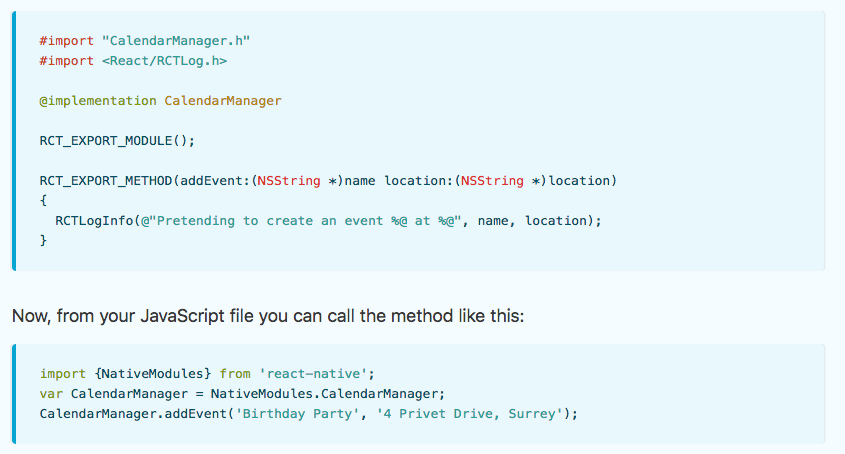
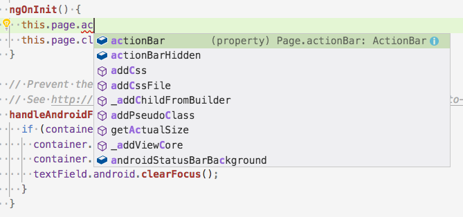
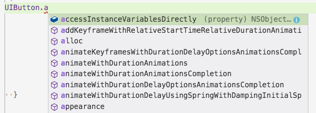
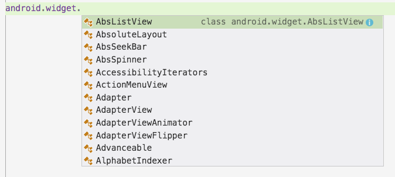

# Would Airbnb Have Fared Better With NativeScript Instead of React Native?

> **BACKGROUND**: Last week, Airbnb’s engineering team published a [5-part series on why they’re moving away from React Native](https://medium.com/airbnb-engineering/react-native-at-airbnb-f95aa460be1c). It’s well written, and worth reading through if you’re looking for some context for this post’s discussion. All quotes you see in this article are from the Airbnb writeup.

As you might imagine, Airbnb’s recent announcement piqued our interest on the NativeScript team. Airbnb’s feedback on React Native was very technical, and interestingly delved into areas where React Native and NativeScript take different approaches to app development. Therefore as we read through the series we couldn’t help but wonder—would Airbnb have fared better with NativeScript?


In this article we’ll walk through Airbnb’s complaints in detail, and talk about how some of those same problems could’ve been handled in NativeScript. We’ll start with things that NativeScript does well (this is the NativeScript blog after all), and then move on to things NativeScript does, well, less well.

Let’s start with what is perhaps the single biggest difference between NativeScript and React Native—how each framework accesses native APIs.

## The bridge

>  “React Native has a bridge API to communicate between native and React Native. While it works as expected, it is extremely cumbersome to write.”

Both React Native and NativeScript provide a series of cross-platform JavaScript APIs for common mobile tasks. For example, in [React Native you use an API named `Animated`](https://facebook.github.io/react-native/docs/network.html) for animations, and in [NativeScript you use an API named `Animation`](https://docs.nativescript.org/angular/ui/animation-code). But despite slightly different names, the APIs provide very similar functionality (animating user interface components). In most cases these frameworks’ cross-platform APIs are similar, and in some cases they’re even identical—for example, both frameworks provide support for the web’s `fetch()` and `XMLHttpRequest` APIs.

The architectural differences between the frameworks show up when you need to do something that _isn’t_ a common mobile task—aka, when you need native functionality that is _not_ provided by the frameworks’ cross-platform JavaScript APIs.

In React Native, to access native iOS and Android APIs you need to use a series of APIs commonly referred to as the bridge APIs. (Here are [React Native’s bridging docs for iOS](https://facebook.github.io/react-native/docs/native-modules-ios.html); and here are [the same docs for Android](https://facebook.github.io/react-native/docs/native-modules-android.html)).

A full breakdown of the bridging APIs is out of the scope of this article. For our discussion, the relevant thing to know is that these bridging APIs require you to write both native and JavaScript code. As a concrete example of that, the image below shows the first example from React Native’s iOS bridging documentation—notice the iOS code on top, and the JavaScript code underneath.



React Native does this because React itself is running in a JavaScript Virtual Machine, and therefore cannot access native iOS and Android APIs directly. Hooks like React Native’s `RCT_EXPORT_METHOD` give native code the ability to tie into the app’s JavaScript context, allowing both to coexist. As Airbnb notes, these APIs do work as expected, and they successfully drive a lot of apps in both the App Store and Google Play. However, this architecture is not without its problems.

> “These bridges were some of the more complex pieces because we wanted to wrap the existing Android and iOS APIs into something that was consistent and canonical for React. While keeping these bridges up to date with the rapid iteration and development of new infrastructure was a constant game of catch up, the investment by the infrastructure team made product work much easier.”

To leverage the bridge in a real-world app you have to write code in three places—once for iOS, once for Android, and once for the web—which creates a lot of moving pieces to keep in sync, especially as iOS, Android, React, and React Native all continue to release new versions.

Another consequence of this architecture is organizational, as not only is your code in three different places, but that code might be written by three different teams that specialize in each platform.

> “In React Native, we started with a blank slate and had to write or create bridges of all existing infrastructure. This meant that there were times in which a product engineer needed some functionality that didn’t yet exist. At that point, they either had to work in a platform they were unfamiliar with and outside the scope of their project to build it or be blocked until it could be created.”

> “In addition, large amounts of bridging infrastructure were required to enable product engineers to work effectively.”

In NativeScript we took a completely different approach to accessing native APIs. Instead of a bridge, NativeScript injects all iOS and Android APIs into the JavaScript Virtual Machines we use directly. (The full technical details of how this works is out of the scope of this article, but it’s [worth a read](https://developer.telerik.com/featured/nativescript-works/) if you find the architectures of these frameworks at all interesting.)

This means that if you need to access a native API in NativeScript... you just do it. For example, the following code is valid NativeScript code that returns a JavaScript integer of `3` on Android.

```
java.lang.Math.min(3, 4)
```

If you’ve developed iOS or Android app using any cross-platform framework, you know just how often you need to access native APIs to tweak the behavior of your app. You probably don’t need `java.lang.Math.min`, but you might need to tweak your app’s status bar, configure how your app uses the native keyboard, or build [an entire plugin](https://market.nativescript.org/) for your app that abstracts these native APIs for others.

Writing your code in one language has some auxillary benefits as well, such as less context shifting during development, better tool reuse (prettier, linting, etc), and the ability to stay in one IDE or editor. The advantages are appealing enough that Airbnb was trying to recreate a NativeScript-like approach in late 2017.

> “We began to investigate automatically generating bridge code from TypeScript definitions towards the end of 2017 but it was too little too late.”

All that said, it’s worth noting that NativeScript’s bridging architecture isn’t a panacea for all your mobile woes. Although you can write native code in JavaScript using NativeScript, there’s a definite learning curve to figure out [NativeScript’s bridging conventions](https://docs.nativescript.org/angular/core-concepts/accessing-native-apis-with-javascript) once you move beyond simple one-line examples. (Look through the [source code of the NativeScript core modules](https://github.com/NativeScript/NativeScript/tree/master/tns-core-modules) if you want to see what that looks like at scale.) Furthermore, even though NativeScript allows you to write your code in one language, you’ll still need iOS and Android development expertise if you want to write non-trivial native code for your applications.

NativeScript’s sweet spot is for apps that need the ability to easily leverage native code in their apps, but still want the majority of their functionality driven by cross-platform friendly JavaScript or TypeScript code.

And speaking of TypeScript, let’s move on to discuss another common pain point when working with these frameworks—type safety.

## Type safety

> “We also experienced many issues in which the types coming from JavaScript were unexpected. For example, integers were often wrapped by strings, an issue that isn’t realized until it is passed over a bridge. To make matters worse, sometimes iOS will fail silently while Android will crash. 

Some of the more, um, _fun_ code in NativeScript is the code that converts values from Java <--> JavaScript, and Objective-C <--> JavaScript. I’m not familiar enough with the inner details of React Native to comment on their exact implementation here, but I’m sure they have some fun stories to tell.

Type conversion between multiple platforms is not fun regardless of what platform you use, but we think we have a bit of an advantage in how we handle things in NativeScript—and that advantage is [TypeScript](https://www.typescriptlang.org/).


I have mixed feelings about using TypeScript in web apps, and I’ve even given [a talk on the subject](https://www.youtube.com/watch?v=w6rdLx2LYz8), but for mobile apps I now consider TypeScript an absolute necessity because of how well the language helps you work with unfamiliar APIs (which are hard to avoid in mobile apps).

In NativeScript we built our [cross-platform modules](https://github.com/nativescript/nativescript) with TypeScript since day one, meaning, you can easily explore the APIs we offer right in your editor.



More importantly, we also provide TypeScript type definitions for the native iOS and Android APIs we inject into the JavaScript Virtual Machine. Meaning, you can write native code—in TypeScript—getting many of the same benefits you would get from writing your code in Xcode or Android Studio.




This benefit helps JavaScript developers write native code without errors, and it helps native developers feel more at home in a JavaScript codebase—something that Airbnb struggled with.

> “JavaScript is an untyped language. The lack of type safety was both difficult to scale and became a point of contention for mobile engineers used to typed languages who may have otherwise been interested in learning React Native.”

> “A side-effect of JavaScript being untyped is that refactoring was extremely difficult and error-prone. Renaming props, especially props with a common name like onClick or props that are passed through multiple components were a nightmare to refactor accurately. To make matters worse, the refactors broke in production instead of at compile time and were hard to add proper static analysis for.”

If there’s any downside to TypeScript it’s that it’s yet another tool for you to maintain, update, and integrate. I personally haven’t run into these issues in my own NativeScript apps, but Airbnb mentioned problems when they attempted to evaluate TypeScript.

> “We also explored TypeScript but integrating it into our existing infrastructure such as babel and metro bundler proved to be problematic. However, we are continuing to actively investigate TypeScript on web.”

Nevertheless, overall, we’ve found that TypeScript helps us develop NativeScript faster, and helps our users avoid some of nastier aspects of type conversion that are inherent to JavaScript-driven native frameworks.

Let’s shift our discussion from working with native APIs over to a user interface component that’s extremely common in mobile apps—lists.

## Lists

A whole lot of mobile apps are nothing more than glorified lists—think Facebook, Twitter, etc. The list is a cornerstone of a mobile app development framework, and it’s something that has caused problems for React Native from the beginning.

> “[Long Lists] React Native has made some progress in this area with libraries like FlatList. However, they are nowhere near the maturity and flexibility of RecyclerView on Android or UICollectionView on iOS. Many of the limitations are difficult to overcome because of the threading. Adapter data can’t be accessed synchronously so it is possible to see views flash in as they get asynchronously rendered while scrolling quickly. Text also can’t be measured synchronously so iOS can’t make certain optimizations with pre-computed cell heights.”

The key thing Airbnb mentions here is “threading”. React Native famously uses a [multi-threaded architecture](https://www.facebook.com/notes/andy-street/react-native-scheduling/10153916310914590/) where JavaScript and the user interface run on separate threads. While this has some definite advantages, mostly that JavaScript processing does not interfere with UI rendering, there are some tradeoffs as well.

Take the `RecyclerView` or `UICollectionView` APIs that Airbnb mentions. These are extremely powerful built-in native APIs for building memory-efficient lists that asynchronously render rows as the user scrolls. However, React Native cannot use these APIs because the native components (`RecyclerView` or `UICollectionView`) cannot asynchronously access data stored in JavaScript—they’re on different threads. As Airbnb noted, React Native has thrown a lot of engineering muscle at solving this problem, and their [newer APIs like `FlatList`](https://facebook.github.io/react-native/docs/flatlist.html) are quite good, but it’s hard to build a custom solution that can compare with the built-in native controls.

In NativeScript we use a [single threaded model](https://developer.telerik.com/featured/benefits-single-threading-model-nativescript/), as it’s what allows us to provide fast access to the native APIs that we discussed earlier. This means that we’re not subject to the same restrictions as React Native, and that we can absolutely leverage native APIs like `RecyclerView` and `UICollectionView`. To give you a sense of what that looks like, the image below shows what happens if I just casually toss 50,000 items into a NativeScript list. It’s worth noting that what I’m showing here is not the power of NativeScript; it’s the power of the built-in native controls.


> **NOTE**: You can check out the above app’s source and run it for yourself in [NativeScript Playground](https://play.nativescript.org/?template=play-js&id=ieaS3B).

The one thing that you need to be aware of in NativeScript is that very processor-intensive JavaScript does have the potential to cause jank in your UI. 

Two things though. First, NativeScript does offer [APIs for offloading these CPU-heavy tasks](https://docs.nativescript.org/core-concepts/multithreading-model) when you do hit them. And second, NativeScript’s architecture is consistent with “raw” native apps you write with Swift or Objective-C on iOS, or Java on Android. By default, native code runs on the same thread as native UI, so CPU-intensive operations in native code can also degrade app performance and cause dropped frames.

Furthermore, React Native must see some benefits in being able to make synchronous calls from JavaScript to native, as the React Native team recently announced that they’re [redesigning their threading model](https://facebook.github.io/react-native/blog/2018/06/14/state-of-react-native-2018) to allow for this exact use case that NativeScript does by default. Once implemented, it’s possible that React Native should be able to close the gap when it comes to list performance.

While on the topic of performance, let’s move on to one thing that you might not realize has a huge impact on the performance of JavaScript-driven native apps—JavaScript virtual machines.

## JavaScript VMs

NativeScript and React Native both use JavaScript virtual machines to drive your native apps. React Native uses Apple’s JavaScriptCore on both iOS and Android, and NativeScript uses JavaScriptCore on iOS and Google’s V8 on Android.

And, just as a browser’s JavaScript engine can have a huge impact on its performance, the same is true of JavaScript-driven native frameworks like NativeScript and React Native.

> “Android doesn’t ship its own JavaScriptCore so React Native bundles its own. However, the one you get by default is ancient. As a result, we had to go out of our way to bundle a newer one.”

Updating a JavaScript VM in a framework like NativeScript and React Native can be very hard, as the VM code is intertwined in some of the gnarliest bits of these frameworks.

At NativeScript we’ve been guilty of letting our VM version languish for this reason, BUT, we very recently updated to a modern version of V8 and got a _huge_ (~50%) boost in startup performance on Android. For example, the image below shows the difference in startup time between a NativeScript app before the V8 update (left), and after the V8 update (right).


Updating a JavaScript VM also opens the door to new JavaScript language features as well. For example, for NativeScript, you can now use almost all ECMAScript 6 features in NativeScript without a precompiler. (We have a bit of work to do on ES6 modules, at which point our ES6 support will be complete.)

---

So, between a new JavaScript VM, better type safety with TypeScript, access to built-in list controls, and easy usage of native APIs, hopefully you have some idea why a company like Airbnb might be interested in giving NativeScript a shot.

But, to try to be fair here, I think it’s worth mentioning a few things that I think Airbnb would’ve not liked about NativeScript before we draw any conclusions.

## React support, or lack thereof

> “Our website is built primarily with React.”

Airbnb talks extensively about how their use of React on the web contributed to them using them React for their native apps. They also talk about how, towards the end of their React Native usage, they started to investigate code sharing between their web and native apps.

> “Late in the React Native exploration, we began building for web, iOS, and Android at once. Given that web also uses Redux, we found large swaths of code that could be shared across web and native platforms with no alterations.”

Over at NativeScript we’ve seen how important framework consolidation can be for a company. The initial version of NativeScript offered no framework support, and although we certainly had usage, when we [unveiled integrated Angular support back in April of 2016](https://www.nativescript.org/blog/n-is-for-nativescript-at-ng-conf) we saw an enormous jump in NativeScript usage.


We’ve seem a similar jump in usage when the NativeScript community released [Vue.js support for NativeScript](https://nativescript-vue.org/). It’s amazing how much more productive developers can be when you already know how concepts like navigation, data binding, and such work out of the box.

That being said, NativeScript does not offer any support for React, which is not ideal for companies heavily invested in React like Airbnb. Supporting frameworks is a lot of work, especially when you think about all the tooling, templates, documentation and such framework support entails. Currently we’re happy with our current Angular integration, and working with the community to support Vue.js. Plus, we don’t think we can do React better than Facebook 🙂

## Hot reload

One of the biggest benefits to using JavaScript for native apps is just how fast your development cycle is. Because your source code is written in JavaScript, you don’t have to compile your code after every change, which can lead to some enormous productivity gains.

> “One thing that was immediately obvious when switching from React Native back to native was the iteration speed. Going from a world where you can reliably test your changes in a second or two to one where may have to wait up to 15 minutes was unacceptable.”

NativeScript and React Native are both able to take advantage these productivity gains inherent to JavaScript. For example, I recently used the gif below to showcase just how easily you can test NativeScript on multiple devices simultaneously. (The change was to showcase [NativeScript’s support for gradient backgrounds](https://docs.nativescript.org/ui/ns-ui-widgets/styling#gradients), in case you’re curious.)


Although NativeScript and React Native both leverage the benefits of JavaScript, React Native takes things farther with a feature they call [hot reloading](https://facebook.github.io/react-native/blog/2016/03/24/introducing-hot-reloading.html). Hot reloading allows React Native to reload an app after a change without losing the application’s state. You can read through the [React Native team’s writeup on the feature](https://facebook.github.io/react-native/blog/2016/03/24/introducing-hot-reloading.html) if you’re curious, but as a developer this feature essentially means you’re able to test your JavaScript changes incredibly fast.

That being said, NativeScript’s LiveSync (which you see in the gif above) is super fast and supports developing on as many devices as you can connect. With NativeScript you see most changes within a second, and not the 15–20 seconds common in native apps.

NativeScript does not offer hot reloading yet, but it’s something we’re actively working on, and we’ll soon be able to measure our update cycles in milliseconds. Stay tuned to the [NativeScript blog](https://www.nativescript.org/blog) for details on future plans and releases. 

## Integrating into native apps

If you’re a company with large existing native iOS and Android apps, the idea of rewriting that entire app to a new technology stack is oftentimes a non-starter.

> “We integrated React Native into large existing apps that continued to move at a very fast pace.”

Although we at NativeScript do offer the ability to run within existing apps (here are [our iOS docs](https://docs.nativescript.org/angular/guides/integration-with-existing-ios-and-android-apps/extend-existing-ios-app); here are [our Android docs](https://docs.nativescript.org/angular/guides/integration-with-existing-ios-and-android-apps/extend-existing-android-app)), our support is currently experimental in nature, and not an officially supported usage scenario.

Meanwhile, the React Native team has [heavily invested in this space](https://facebook.github.io/react-native/docs/integration-with-existing-apps.html) and has a lot of battle tested apps using this approach in production scenarios (including Airbnb). Furtermore, Facebook has [stated better integration with native apps will be a focus of their upcoming rearchitecture](https://facebook.github.io/react-native/blog/2018/06/14/state-of-react-native-2018).

Once again though React Native architecture is not without its problems. Integrating a framework like React Native or NativeScript into an existing app can be complex (just [skim the React Native docs to get an idea](https://facebook.github.io/react-native/docs/integration-with-existing-apps.html)), and the inherent complexity can cause problems, especially as iOS, Android, React Native, NativeScript, etc continue to evolve. We believe some of Airbnb’s problems came from trying to integrate React Native into a complex existing app, rather than starting a new React Native or NativeScript app from the ground up.

At NativeScript, we listen to our users to help prioritize features like this. If you’re interested in seeing us invest more time and resources into this workflow, please [let us know on this GitHub issue](https://github.com/NativeScript/ios-runtime/issues/459).

## Closing thoughts

So given all of this, would Airbnb have been more successful with NativeScript?

Obviously we’ll never know, but we do believe NativeScript would’ve helped with several of the issues that Airbnb encountered, such as working with native APIs, dealing with types, and building fast lists. That being said, NativeScript doesn’t support React, and doesn’t offer the same level of integration into large existing mobile apps.

Like any big technology decision, it’s usually a good idea to build proof-of-concept apps with all of your options before embarking on a full-blown development project. With that in mind, if you’d like to give NativeScript a shot, start with our [tutorials in NativeScript Playground](https://play.nativescript.org/?template=groceries-js&tutorial=groceries-js&autoStart=true), our browser-based experience that’ll help you get up and running quickly. And if you have any questions about NativeScript from this article, feel free to reach out in the comments.

