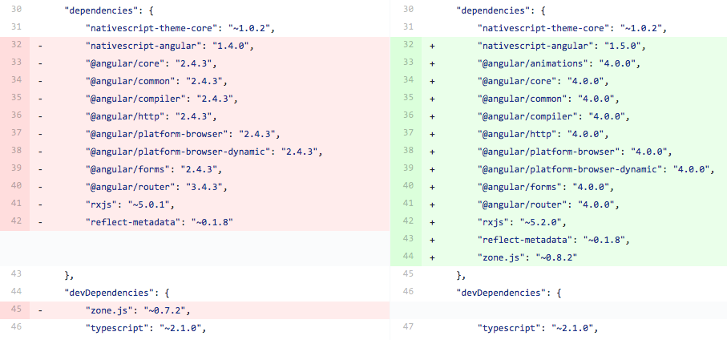

# NativeScript Supports Angular 4

Last week, the Angular team [released Angular 4.0.0](http://angularjs.blogspot.com/2017/03/angular-400-now-available.html), and today we’re happy to announce that NativeScript now support this latest update 🎉

Angular 4 brings smaller application packages and faster runtime speeds. Let’s look at how you can update your NativeScript apps to take advantage of these optimizations.

## Updating

To get the update you’ll need to update a few dependencies in your `package.json` file. Here’s what a typical update will look like.



A couple notes about the changes above.

* The main update here is bumping the `nativescript-angular` package to version 1.5.0, and the various Angular packages to 4.0.0. Note that the `@angular/router` package moved from 3.x to 4.x, rather than 2.x to 4.x. Synching the version numbers of these packages is the reason that the Angular team went from Angular 2 to Angular 4.
* With Angular 4 the various animation libraries now live in their own package, `@angular/animations`. This package is optional, so you only need to depend on it if you intend to use Angular animations in your app. (Note that there’s one extra step you’ll need to take to use Angular animations in your NativeScript apps because of this change—more on that in a minute.)
* The `zone.js` dependency package should now be listed as a dependency rather than a devDependency. This is to resolve some rather arcance npm peer dependency issues to make these various packages play nice together.
* Notice that the TypeScript version remains specified as `~2.1.0`. This is important, as **NativeScript with Angular doesn’t support TypeScript 2.2 quite yet**. Support is coming in our upcoming NativeScript 3.0 release, which you can a release candidate for very soon 😄

## Breaking changes

When you do update your packages there are two trivial breaking changes you should be aware of. First, the path to the `NativeScriptModule` class has changed. You’ll likely be using this only in your `app.module.ts` file, so it should be a quick update.

Before:

```
import { NativeScriptModule } from "nativescript-angular/platform";
```

After:

```
import { NativeScriptModule } from "nativescript-angular/nativescript.module";
```

Second, to use Angular animations in NativeScript, you now need to import the `NativeScriptAnimationsModule` from `"nativescript-angular/animations"` in your root `NgModule`. This works exactly like the `NativeScriptFormsModule`, `NativeScriptHttpModule`, and `NativeScriptRouterModule` classes that you are likely already using. As an example:

```
import { NativeScriptModule } from "nativescript-angular/nativescript.module";
import { NativeScriptAnimationsModule } from "nativescript-angular/animations";
import { NgModule } from "@angular/core";

import { AppComponent } from "./app.component";

@NgModule({
  imports: [
    NativeScriptModule,
    NativeScriptAnimationsModule
  ],
  declarations: [AppComponent],
  bootstrap: [AppComponent],
})
export class AppModule {}
```

> **NOTE**: Make sure that when using Angular animations you’re also including the `@angular/animations` dependency in your `package.json` file, and the previous example showed.

## Final notes

Oh one last thing: the Angular team deprecated `<template>` in favor of `<ng-template>`, so you’re almost certainly going to get this warning when you go to run your apps.

```
The <template> element is deprecated. Use <ng-template> instead.
```

The fix is as simple as updating your `<template>` tags to `<ng-template>` throughout your app. 

And that’s really it. For most users the upgrade to Angular 4 should be seamless. You can [refer to our changelog for a full list of things that changed](https://github.com/NativeScript/nativescript-angular/blob/release/CHANGELOG.md), and if you run into issues like us know on our [issue tracker](https://github.com/NativeScript/nativescript-angular/issues).

Feel free to let us know what you think about this latest Angular update in the comments as well.