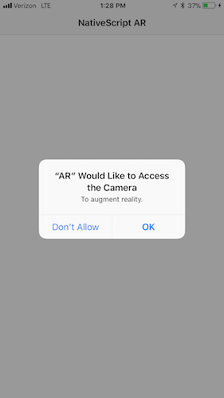
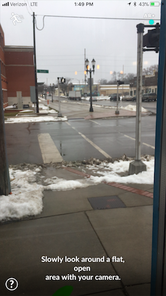

# Getting Started with Augmented Reality in NativeScript

If you haven’t seen Augmented Reality in action on mobile yet, let me demonstrate with this very practical app that lets me add a virtual Christmas tree to my house.

<iframe width="560" height="315" src="https://www.youtube.com/embed/-XhRNmqQZOw" frameborder="0" allow="autoplay; encrypted-media" allowfullscreen></iframe>

This app is [IKEA Place](https://itunes.apple.com/us/app/ikea-place/id1279244498?mt=8), and it’s an iOS app built using Apple’s [ARKit APIs](https://developer.apple.com/arkit/).

NativeScript lets you access iOS and Android APIs to build mobile apps using JavaScript, and ARKit is no exception. In this article we’ll look at how you can build your first AR iOS app using NativeScript.

> **NOTE**:
> * To run ARKit on iOS you must have an iPhone 6S+, a 5th generation iPad, or an iPad Pro. You can find a [full list of supported devices on Apple’s documentation](https://developer.apple.com/library/content/documentation/DeviceInformation/Reference/iOSDeviceCompatibility/DeviceCompatibilityMatrix/DeviceCompatibilityMatrix.html).
> * Support for [Android’s ARCore](https://developers.google.com/ar/discover/) in NativeScript is in progress. We prioritized iOS support because Android’s ARCore is still in a “developer preview” state, whereas a stable version of ARKit shipped in iOS 11.

## Starting your app

NativeScript’s AR support is available through a [nativescript-ar plugin](https://market.nativescript.org/plugins/nativescript-ar). The plugin abstracts ARKit APIs into a set of easy-to-use APIs for common AR tasks. Eventually those same APIs will also support Android’s ARCore, so that you can build cross-platform AR experiences from a single codebase.

To get started with the plugin, let’s first create a new NativeScript app using the NativeScript CLI.

```
tns create AR --template tns-template-blank-ng
cd AR
```

Two notes:

* This command assumes you have the NativeScript CLI installed on your development machine. If you don’t, check out the [CLI installation instructions](https://docs.nativescript.org/start/quick-setup).
* By using the `tns-template-blank-ng` template you create a new NativeScript app that uses Angular. You don’t have to use Angular to work with AR in NativeScript, and you can find [non-Angular usage instructions in the nativescript-ar plugin’s GitHub repository](https://github.com/EddyVerbruggen/nativescript-ar/blob/master/docs/ar-xml.md).

Now that you have a new app, you need to use the `tns plugin add` command to install the nativescript-ar plugin.

```
tns plugin add nativescript-ar
```

From there, open your app’s `app/home/home.component.ts` file and paste in the following code.

``` TypeScript
import { Component, OnInit } from "@angular/core";
import { registerElement } from "nativescript-angular/element-registry";
import { ARMaterial } from "nativescript-ar";
import { Color } from "tns-core-modules/color";

registerElement("AR", () => require("nativescript-ar").AR);

@Component({
  selector: "ar",
  moduleId: module.id,
  template: `
<ActionBar title="NativeScript AR"></ActionBar>

<GridLayout class="page">
  <AR *ngIf="loaded"
    debugLevel="FEATURE_POINTS"
    detectPlanes="true"
    [planeMaterial]="planeMaterial">
  </AR>
</GridLayout>
`
})
export class HomeComponent implements OnInit {
  loaded = false;
  ngOnInit() {
    // Because this is the very first component in the app ensure everything has loaded before starting up.
    setTimeout(() => { this.loaded = true; }, 1000);
  }

  planeMaterial = <ARMaterial>{
    diffuse: new Color("white"),
    transparency: 0.2
  };
}
```

There’s a lot here, so we’ll discuss this code in detail momentarily, but let’s first run this app to see what this basic app looks like in action.

Unlike most other APIs, you cannot test AR apps using a simulator. So as a next step, plug in your iOS testing device via USB, and run the following command to deploy your app to your device.

```
tns run ios
```

The first thing you should see is a prompt for camera permissions, as AR needs camera access.



After you grant permissions, point your device’s camera at a flat surface. After a few seconds you should see a few dots, and then a transparent plane appear.

> **TIP**: Make sure the area you’re testing in has plenty of lighting. If you’re in a dark area, try turning on your device’s flashlight to give the space more light.

<iframe width="560" height="315" src="https://www.youtube.com/embed/tEyyWCSNyzM" frameborder="0" allow="autoplay; encrypted-media" allowfullscreen></iframe>

The way ARKit works is you first need to detect a plane, and once you do, you can start interacting with it. To discuss what’s going on here in more detail, as well as where you might want to go from here, let’s return to the code and break down what’s happening in detail.

## Breaking down the code

In Angular component the `template` property is where you define the UI elements your component should render. In the case of this AR example the `template` looks like this.

``` XML
<ActionBar title="NativeScript AR"></ActionBar>

<GridLayout class="page">
  <AR *ngIf="loaded"
    debugLevel="FEATURE_POINTS"
    detectPlanes="true"
    [planeMaterial]="planeMaterial">
  </AR>
</GridLayout>
```

The `<ActionBar>` and `<GridLayout>` are standard NativeScript UI components. The `<ActionBar>` places a navigation bar on the top of the screen, and the `<GridLayout>` lets you arrange child UI elements in a series of rows and columns. If you use a `<GridLayout>` without providing the `rows` or `columns` attributes—as is the case here—the child element takes up the entire space.

The `<AR>` UI element is where the real magic happens. When you place a `<AR>` component on the screen you designate that portion of the screen to display input from the device’s camera. In this case, the `<AR>` component is the only child of a page-level `<GridLayout>`, and therefore takes up the entire space of the screen. But you could alternatively configure an `<AR>` component to take up only a portion of the screen.

The `<AR>` component takes a number of properties to configure how the AR experience works. You can [refer to the AR plugin’s documentation for a full list of properties](https://github.com/EddyVerbruggen/nativescript-ar/blob/master/docs/tag-properties.md#properties), but here are the ones this example uses.

* `debugLevel`—This demo sets `debugLevel` to `"FEATURE_POINTS"`, which enables the yellow dots that make it easier to find planes. Some apps leave these dots on in production, such as IKEA Place, and others set `debugLevel` to `"NONE"` to hide them. However if you do this you’ll want to provide some clear indication to users that the app needs to find a flat surface. For example, the AR-enabled app Pokémon GO doesn’t use dots, but does instruct the user to look for a “flat, open area”.



* `detectPlanes`—This demo sets `detectPlanes` to `true` so the plugin automatically attempts to find planes. If you want to provide some instructions to the user before attempting to detect a service, you may want to set this property to `false`.

* `planeMaterial`—This property controls how planes display after the plugin detects them. You only need to provide this property if you want to show the user a visual representation of the planes. In this demo you use Angular’s data-binding mechanism to set this property to the following value.

```
{
  diffuse: new Color("white"),
  transparency: 0.2
};
```

You can experiment with different colors and transparency levels to find a display that works for you.

## Using the plugin API

Now that you have the plugin installed and a basic app up and running, let’s start to do something a bit more exciting.

Open your `app/home/home.component.ts` again and paste in the following code, which adds a bit of code that calls the plugin’s `addBox()` method when the user taps on a plane.

``` TypeScript
import { Component, OnInit } from "@angular/core";
import { registerElement } from "nativescript-angular/element-registry";
import { AR, ARMaterial, ARPlaneTappedEventData } from "nativescript-ar";
import { Color } from "tns-core-modules/color";

registerElement("AR", () => require("nativescript-ar").AR);

@Component({
  selector: "ar",
  moduleId: module.id,
  template: `
<ActionBar title="NativeScript AR"></ActionBar>

<GridLayout class="page">
  <AR *ngIf="loaded"
    debugLevel="FEATURE_POINTS"
    detectPlanes="true"
    [planeMaterial]="planeMaterial"
    (planeTapped)="onPlaneTapped($event)">
  </AR>
</GridLayout>
`
})
export class HomeComponent {
  loaded = false;
  ngOnInit() {
    setTimeout(() => { this.loaded = true; }, 1000);
  }

  planeMaterial = <ARMaterial>{
    diffuse: new Color("white"),
    transparency: 0.2
  };

  onPlaneTapped(args: ARPlaneTappedEventData): void {
    const ar: AR = args.object;
    ar.addBox({
      position: {
        x: args.position.x,
        y: args.position.y,
        z: args.position.z
      },
      dimensions: {
        x: 0.1,
        y: 0.1,
        z: 0.1
      },
      mass: 20,
      materials: [new Color("blue")]
    });
  }
}
```

The two new bits of code are this new property your `<AR>` component now has, which `(planeTapped)="planeTapped($event)"` subscribes to the plugin’s `planeTapped` event and calls the file’s `onPlaneTapped()` method. In that method you perform the following call to a new `addBox()` method.

``` TypeScript
ar.addBox({
  position: {
    x: args.position.x,
    y: args.position.y,
    z: args.position.z
  },
  dimensions: {
    x: 0.1,
    y: 0.1,
    z: 0.1
  },
  mass: 20,
  materials: [new Color("blue")]
});
```

What this code does it take the coordinates of the user tap—`args.position.x`, `args.position.y`, and `args.position.x`—and place a blue box with a certain mass and size there.

Here’s what that looks like in action.

<iframe width="560" height="315" src="https://www.youtube.com/embed/bpAouBUqL5c" frameborder="0" allow="autoplay; encrypted-media" allowfullscreen></iframe>

The `addBox()` method is one of many that the nativescript-ar plugin provides. Check out the [plugin’s API documentation](https://github.com/EddyVerbruggen/nativescript-ar/blob/master/docs/api.md) for more information on available methods and what they do. Before we wrap up let’s look at one more method.

## Adding 3D models

Adding boxes, text, and spheres to reality is fun, but oftentimes in AR apps you need to work with custom 3D models. For that, the nativescript-ar plugin provides a custom `addModel()` method.

> **WARNING**: Finding 3D models and getting them to work with ARKit can be painful. The [plugin’s documentation has some suggestions on how to find models and get them working](https://github.com/EddyVerbruggen/nativescript-ar/blob/master/docs/api.md#addmodel), but it can take some trial and error to get things working. The good news is you’re using ARKit, so any existing guides you find about creating models for ARKit will work with NativeScript.

For this demo, start by downloading the following three `.bae` files and placing them in your app’s `app/App_Resources` folder as follows.

```
app/App_Resources/
├── Android
│   └── ...
└── iOS
    ├── Models.scnassets
    │   ├── Ball.dae
    │   ├── Car.dae
    │   └── Tree.dae
    └── ...
```

Next, open your `home.component.ts` file back up and replace its content with the following code, which calls the nativescript-ar plugin’s `addModel()` method.

``` TypeScript
import { Component, OnInit } from "@angular/core";
import { registerElement } from "nativescript-angular/element-registry";
import { AR, ARNode, ARMaterial, ARPlaneTappedEventData } from "nativescript-ar";
import { Color } from "tns-core-modules/color";

registerElement("AR", () => require("nativescript-ar").AR);

@Component({
  selector: "ar",
  moduleId: module.id,
  template: `
<ActionBar title="NativeScript AR"></ActionBar>

<GridLayout class="page">
  <AR *ngIf="loaded"
    debugLevel="FEATURE_POINTS"
    detectPlanes="true"
    [planeMaterial]="planeMaterial"
    (planeTapped)="onPlaneTapped($event)">
  </AR>
</GridLayout>
`
})
export class HomeComponent implements OnInit {
  loaded = false;
  ngOnInit() {
    setTimeout(() => { this.loaded = true; }, 1000);
  }

  planeMaterial = <ARMaterial>{
    diffuse: new Color("white"),
    transparency: 0.2
  };

  onPlaneTapped(args: ARPlaneTappedEventData): void {
    const ar: AR = args.object;
    ar.addModel({
      name: "Models.scnassets/Car.dae",
      position: {
        x: args.position.x,
        y: args.position.y,
        z: args.position.z
      },
      scale: 1,
      mass: 20
    });
  }
}
```

> **TIP**: Replace `Car.dae` with `Bal.dae` or `Tree.dae` to experiment with other models.

When your app refreshes on your device you’ll have the ability to place a virtual car into your local reality. Here’s what it looks like if I use the app to put a new car in my driveway.

<iframe width="560" height="315" src="https://www.youtube.com/embed/2Ztf14HmsA8" frameborder="0" allow="autoplay; encrypted-media" allowfullscreen></iframe>

A couple of warnings.

* First, the car model is large. If you try to place a car on your desk things won’t turn out all that well. You can try playing with the `scale` property to work with a miniature car.
* Second, detecting large planes with ARKit can be... interesting. There’s a good chance you’ll end up doing something like this, which to be fair is kind of fun to play around with.

<iframe width="560" height="315" src="https://www.youtube.com/embed/gY1fRDypmyA" frameborder="0" allow="autoplay; encrypted-media" allowfullscreen></iframe>

## Wrapping up

There’s a whole lot you can do with AR in NativeScript. In this article you learned the basics, such as how to detect planes, how to add boxes, and how to work with simple 3D models.

Have you done anything cool with AR in NativeScript? If so let us know in the comments. And stay turned for some more advanced coverage of AR on this blog in the future 😄