# Biometric Authentication for Enterprise Apps Made Easy

> “My favorite part of development is building login screens.” - No developer, ever

> “My favorite part of this app is the login screen.” - No user, ever

Login screens are mundane to build, full of potential security vulnerabilities, and often require developers to make complex integrations they don’t want to make.

But login screens are also important, and designing a solid login experience can be an enormous productivity boost for your organization. In this article we’ll look at two features that can greatly streamline the login process:

1) The ability to **reuse your existing authentication setup**, which keeps you from having to create a wholly new system for each app you build.
2) **Biometric authentication**, aka logging in with something like your fingerprint or face, which can greatly streamline the login process for your internal apps.

In this article you’ll build enterprise login screens that meet these requirements using [NativeScript](https://www.nativescript.org/) and [Kinvey](https://www.progress.com/kinvey) in three steps.

* [Step #1: Getting an app up and running](#step-1)
* [Step #2: Setting up enterprise auth](#step-2)
* [Step #3: Tying in biometric auth](#step-3)

So that you have a visual of what you’ll be building, here’s a gif showing this article’s final app in action.

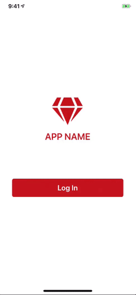

Let’s get started by looking at how to get your app up and running.

> **NOTE**: Don’t feel the need to follow along with every step of this article step-by-step, as the this article’s full source code is [available on GitHub for you to peruse](https://github.com/tjvantoll/BiometricAuth) at any time.

<h2 id="step-1">Step #1: Getting an app up and running</h2>

As a developer, one of the first decisions you have to make when building an app is deciding which platforms the app should run on. When it comes to biometric authentication this decision is rather simple, as mobile platforms (aka iOS and Android) are currently the only platforms that allow developers to access fingerprint and face sensors.

With that in mind, in this article you’ll use NativeScript to make building a cross-platform iOS and Android app as easy as possible, and Kinvey, a powerful backend that integrates well with NativeScript and which will help with some of the trickier authentication tasks you’ll tackle in the next step.

> **TIP**: If you’re new to NativeScript and Kinvey, you might want to read [_How to Get Started With Kinvey and NativeScript—Fast_](https://www.progress.com/blogs/how-to-get-started-with-kinvey-and-nativescript-fast) for some background on each of the technologies.

Let’s start by looking at the starter apps NativeScript provides, and then look at how to run those apps locally using the NativeScript command-line interface.

### Finding NativeScript samples

NativeScript offers a number of templates and samples to help you get apps up and running quickly, and you can view them on the [NativeScript Marketplace](https://market.nativescript.org/?tab=templates&category=all_templates).

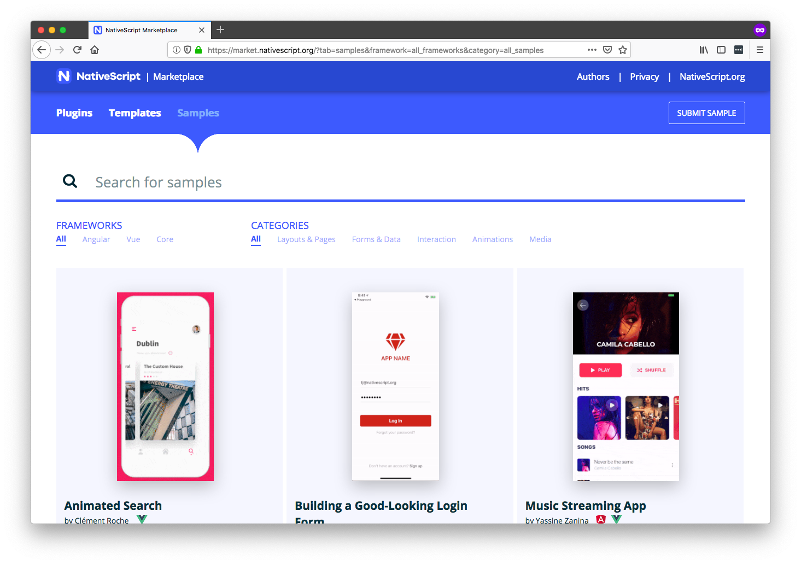

On the sample listing you’ll see an app for building a good-looking login form. Clicking on that sample will [open it in NativeScript Playground](https://play.nativescript.org/?template=play-ng&id=Hqp5UQ&v=3073), a browser-based environment for developing NativeScript apps.

NativeScript Playground is a powerful environment that’s worth experimenting with, especially if you’re interested in building iOS and Android apps with JavaScript. But for today’s purposes you’ll want to use the **Download** button (see image below) to download the sample’s files locally.

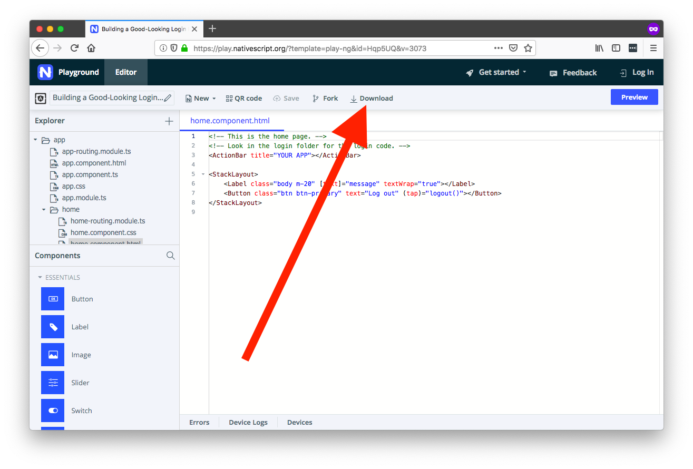

When the download finishes, go ahead and unzip the `NSPlayground.zip` folder. (Feel free to rename the folder to the name of your project.) At this point, you’re ready to run this app on your development machine, and to do that, you’ll need the NativeScript command-line interface.

### Using the NativeScript CLI

The [NativeScript CLI](https://docs.nativescript.org/angular/start/cli-basics) allows you to build, install, and run NativeScript apps on iOS and Android devices. You can install the NativeScript CLI by installing [Node.js](https://nodejs.org/en/), and running the following command on your terminal or command prompt.

```
npm install -g nativescript
```

> **TIP**: You can use the NativeScript CLI on Windows, macOS, and Linux. However, to build apps for iOS devices you’ll need to use a macOS machine, or use [NativeScript Sidekick](https://www.nativescript.org/nativescript-sidekick), which provides the ability to deploy iOS apps from Windows or Linux machines.

Next, you’ll need to install the appropriate iOS and Android dependencies that allow NativeScript to perform builds of your apps. The full instructions on how to set this up are out of scope for this article, but you can find a thorough guide on the NativeScript documentation.

* [NativeScript CLI Setup Documentation](https://docs.nativescript.org/angular/start/quick-setup#step-1-install-ios-and-android-requirements)

With that setup complete, you now have the ability to run your NativeScript app on iOS or Android devices. To do so, connect your mobile device to your machine via USB, and then run either `tns run android` or `tns run ios` (depending on your device’s operating system) to deploy your new app.

```
tns run android
tns run ios
```

After you run your app you should see the following UI on your device.

<div style="display: flex;">
    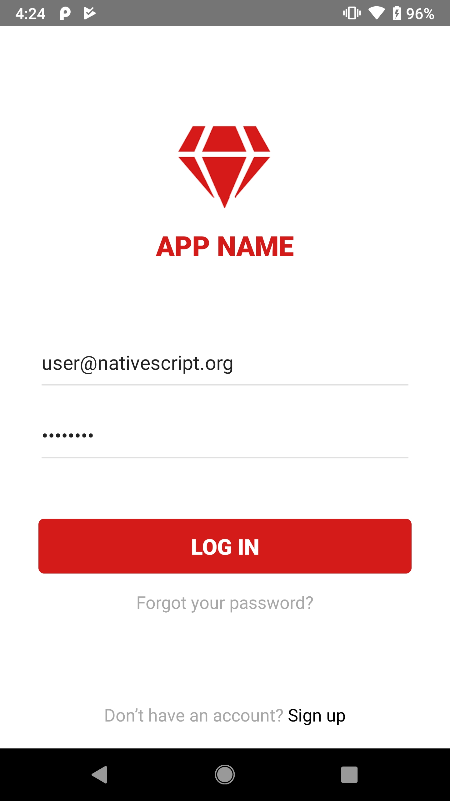
    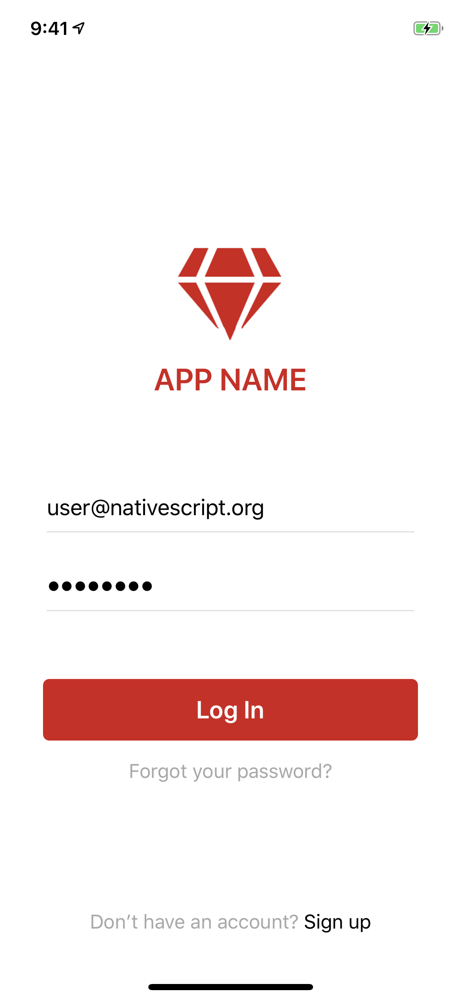
</div>

At this point you now have your app set up and ready to go. With this out of the way, let’s move on to the next step and implement the first of this article’s two requirements—reusing an enterprise auth setup.

<h2 id="step-2">Step #2: Setting up enterprise auth</h2>

In this step we’ll look at how to perform the authentication piece of the login workflow. Although there are tons of potential login workflows, it’s uncommon for enterprise apps to use completely new authentication mechanisms. That is, most companies already have an auth provider like Active Directory in place.

To make connecting to your existing authentication provider as easy as possible, in this step we’ll use Progress Kinvey. Kinvey offers a feature called Mobile Identity Connect, which allows you to connect to a wide variety of existing authentication providers, such as Active Directory, Facebook, or really, any provider that supports common protocols like SAML, OpenID or OAuth.

Let’s look at how to set up a connection to your existing provider, and then how to implement that connection in your NativeScript app.

### Setting up Mobile Identity Connect

Mobile Identity Connect (MIC) is a service that lets mobile applications use existing enterprise identity and single sign-on solutions. MIC enables mobile applications to integrate with a variety of identity solutions using a single OAuth2-based interface.

To set up MIC for your own apps. you’ll first have to set up a new service in [Kinvey Console](https://console.kinvey.com), your dashboard for doing all things Kinvey.

> **TIP**: If you’re new to Kinvey you can sign up for a free account at [console.kinvey.com/signup](https://console.kinvey.com/signup).

Next, you’ll want to use the following two guides to set up the connection to your existing provider.

* [Kinvey documentation on MIC](https://devcenter.kinvey.com/nativescript/guides/mobile-identity-connect)—Start here, as the documentation walks you through the steps you need to take to set up your connection, and covers a number of different providers you might be using.
* [Enterprise Authentication with Kinvey](https://www.progress.com/blogs/enterprise-authentication-kinvey)—Read this next, as it’s a tutorial that walks you through setting up MIC with a sample Azure Active Directory instance. It’s a good reference to refer to as you’re going through the process.

When you have your MIC service set up and ready to go, let’s next look at how to connect your Kinvey backend to your NativeScript app.

### Connecting your app to Kinvey

Connecting NativeScript apps to Kinvey is simple, especially if your apps come from NativeScript Playground (which, if you’ll recall, our login sample did), as Kinvey is already installed in Playground apps by default.

Because of this, the only step you need to take to connect your NativeScript to your Kinvey instance is to add an **App Key** and **App Secret** in the appropriate place. To do that, open your NativeScript app’s `app/package.json` file, and a new `"pluginsData"` key with the following contents.

```
"pluginsData": {
    "kinvey-nativescript-sdk": {
        "config": {
            "appKey": "YOUR APP KEY HERE",
            "appSecret": "YOUR APP SECRET HERE",
            "redirectUri": "sde://"
        }
    }
}
```

Next, you need to replace the two placeholder values in the configuration above with your own values. To get them, visit [Kinvey Console](https://console.kinvey.com/) for your app, and tap the three vertical dots in the top-left corner (see image below). There you’ll see both the **App Key** and **App Secret** values you need.

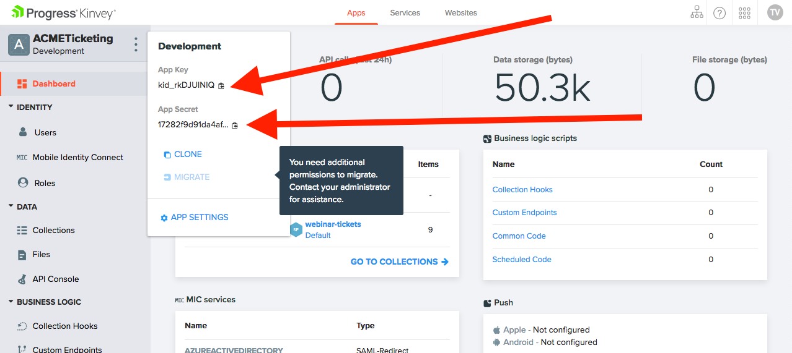

When you’re done, your complete `app/package.json` file should look something like this.

```
{
    "android": {
        "v8Flags": "--expose_gc",
        "forceLog": true
    },
    "main": "main.js",
    "name": "tns-template-blank-ng",
    "version": "3.1.1",
    "pluginsData": {
        "kinvey-nativescript-sdk": {
            "config": {
                "appKey": "kid_rkDJUINIQ",
                "appSecret": "17282f9d91da4af7b398855e32ea4dd0",
                "redirectUri": "sde://"
            }
        }
    }
}
```

To see what this authentication setup looks like in action, let’s move on to this article’s final step and add some code to tie everything together.

<h2 id="step-3">Step #3: Tying in biometric auth</h2>

In this step you’ll switch your app’s login screen to leverage your Kinvey MIC setup, as well as add a biometric auth worflow that allows users to log in with their fingerprint or face. Let’s start by getting the authentication workflow working, and then move on to the biometric piece.

### Wiring up the login process

The default app that you downloaded from NativeScript Playground is set up for a login process where the user provides a user name and password, and currently looks like this.

<div style="display: flex;">
    
    
</div>

In this article’s example though, you’re delegating the login process to your own enterprise auth mechanism, and as such, you can simplify the current login code considerably. To do so, start by opening up your `app/login/login.component.html` file and replacing its contents with the following code.

``` XML
<GridLayout>
    <StackLayout class="form">
        <Image class="logo" src="~/images/logo.png"></Image>
        <Label class="header" text="APP NAME"></Label>

        <Button text="Log In" [isEnabled]="!processing"
            (tap)="login()" class="btn btn-primary m-t-20"></Button>
    </StackLayout>
</GridLayout>
```

Next, open your `app/login/login.component.css` file and replace its contents with the following code.

``` CSS
.form {
  margin-left: 30;
  margin-right: 30;
  vertical-align: middle;
}

.logo {
  margin-bottom: 12;
  height: 90;
  font-weight: bold;
}
.header {
  horizontal-align: center;
  font-size: 25;
  font-weight: 600;
  margin-bottom: 70;
  text-align: center;
  color: #D51A1A;
}

.btn-primary {
  margin: 30 5 15 5;
}
```

If your NativeScript app is still running you should see these changes immediately. If not, head back to your terminal or command prompt and use `tns run ios` or `tns run android` command to redeploy the app to your device. When you’re done, you’ll see that the app now has a simplified look.

<div style="display: flex;">
    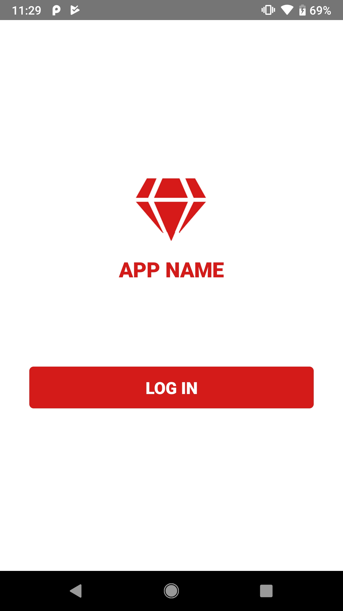
    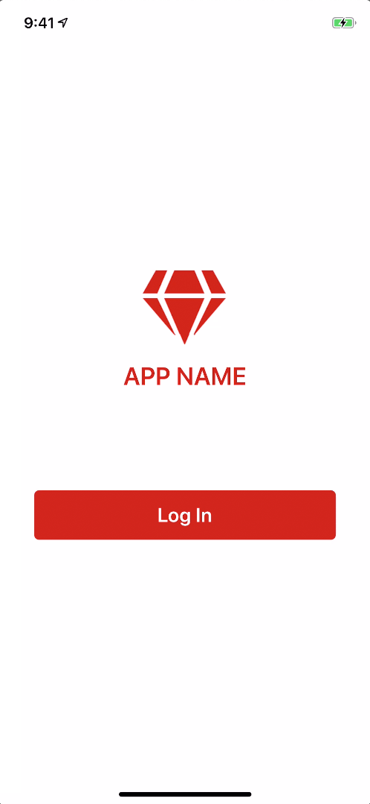
</div>

> **NOTE**: The diamond logo and “APP NAME” heading are placeholders. Feel free to replace these with your own company logo and name.

Next, open your `app/shared/user.service.ts` file and replace its contents with the following code, which adds a few new methods you’ll need for MIC and for biometric authentication. Specifically, the `Kinvey.User.loginWithMIC()` function is what actually integrates this app with the Kinvey auth service you made for connecting to your authentication provider.

``` TypeScript
import { Injectable } from "@angular/core";
import { Kinvey } from "kinvey-nativescript-sdk";
import { getBoolean, setBoolean } from "tns-core-modules/application-settings";

@Injectable()
export class UserService {
    isLoggedIn() {
        return !!Kinvey.User.getActiveUser();
    }

    login() {
        return Kinvey.User.loginWithMIC()
            .catch(this.handleErrors);
    }

    logout() {
        return Kinvey.User.logout()
            .catch(this.handleErrors);
    }

    handleErrors(error: Kinvey.BaseError) {
        console.error(error.message);
        return Promise.reject(error.message);
    }

    setBiometricAuthOptIn(isOptedIn: boolean) {
        setBoolean("biometricAuthOptIn", isOptedIn);
    }

    getBiometricAuthOptIn() {
        return getBoolean("biometricAuthOptIn");
    }
}
```

Finally, open your `app/login/login.component.ts` file, and replace its contents with the following code, which removes a bunch of unneeded sample code, and calls off to the UserService’s `login()` method.

``` TypeScript
import { Component } from "@angular/core";
import { alert, confirm } from "tns-core-modules/ui/dialogs";
import { Page } from "tns-core-modules/ui/page";
import { RouterExtensions } from "nativescript-angular/router";

import { UserService } from "../shared/user.service";

const APP_NAME = "APP NAME";

@Component({
    selector: "app-login",
    moduleId: module.id,
    templateUrl: "./login.component.html",
    styleUrls: ['./login.component.css']
})
export class LoginComponent {
    constructor(private page: Page, private userService: UserService, private routerExtensions: RouterExtensions) {
        this.page.actionBarHidden = true;
    }

    login() {
        this.userService.login()
            .catch(() => {
                alert({
                    title: APP_NAME,
                    okButtonText: "OK",
                    message: "Unfortunately we could not find your account."
                });
            })
            .then(() => {
                this.routerExtensions.navigate(["/home"], { clearHistory: true });
            });
    }
}
```

When you save these changes the NativeScript CLI should automatically update your app on your device. When it does, try your new app out. If all went well, you should now have a mobile app that leverages your existing auth provider.

<div style="display: flex;">
    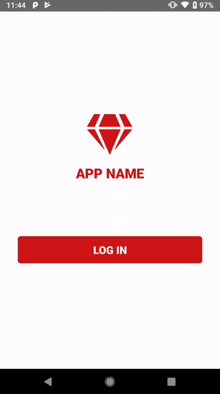
    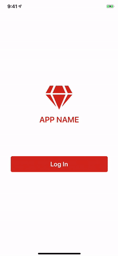
</div>

You now have a cross-platform iOS and Android app that reuses your existing enterprise authentication system. Pretty cool, huh?

Let’s look at how you can add even more power to this setup by integrating biometric authentication.

### Adding biometric auth

One of the big benefits of using NativeScript is you have access to a huge library of free and open source plugins in NativeScript Marketplace. Each plugin allows NativeScript developers to tie into native functionality through JavaScript or TypeScript APIs.

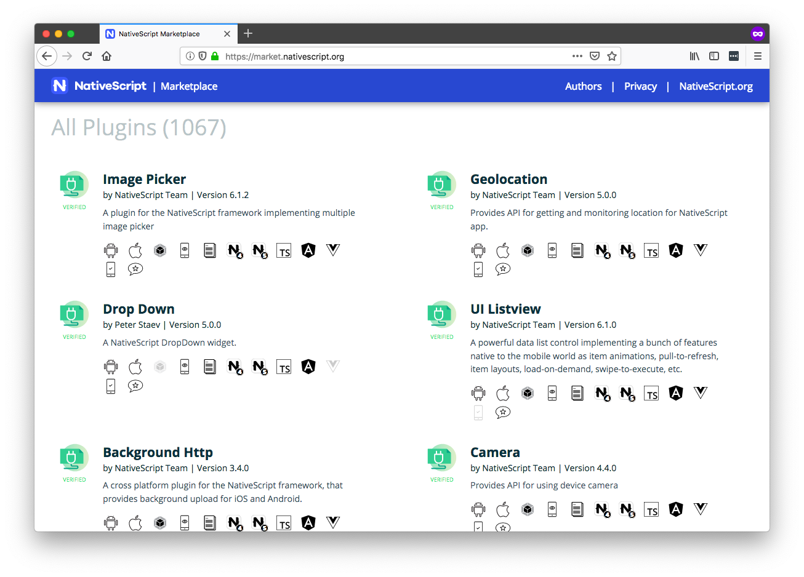

For biometric authentication, you’ll want to search for the [NativeScript “Fingerprint Auth” plugin](https://market.nativescript.org/plugins/nativescript-fingerprint-auth), which is a plugin that gives you access to fingerprint sensors, Touch ID, and Face ID. Once you have the plugin’s page up, copy the installation command on the right-hand side of the screen.

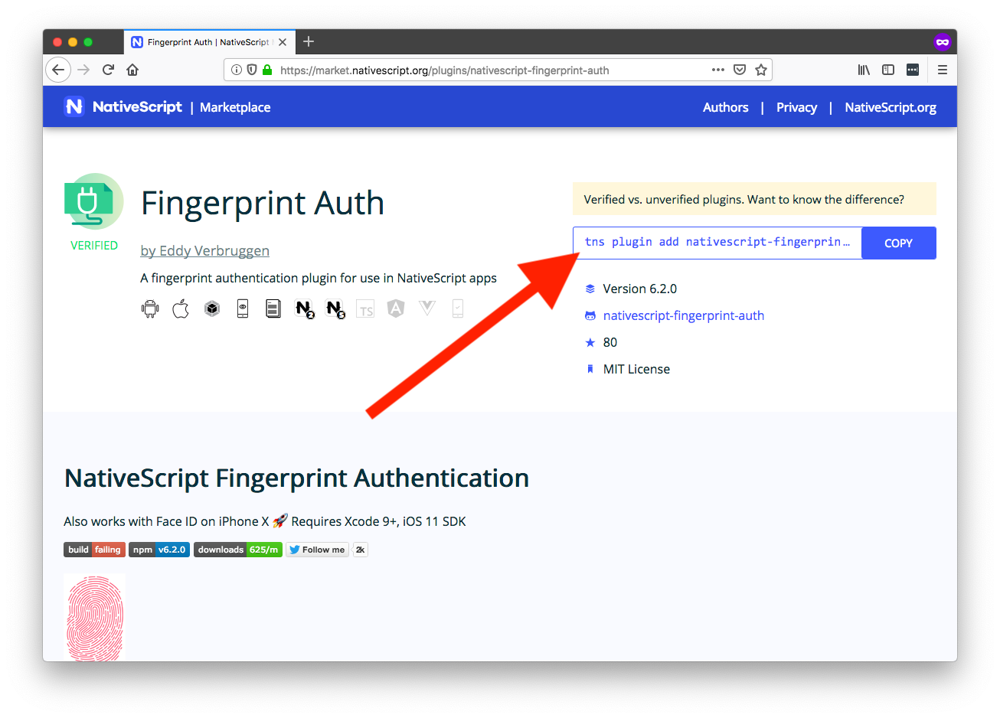

> **NOTE**: The Fingerprint Auth plugin uses Face ID for authentication on iPhone X and XS devices.

With that command copied, return to your terminal or command prompt, use `Ctrl` + `C` to stop the existing `tns run` command (if it’s still running), paste in the `tns plugin` command, and hit `Enter` to kick off the installation.

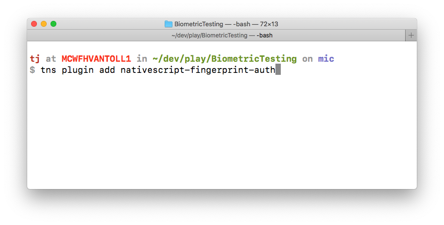

With the plugin installed, go ahead and re-execute either `tns run ios` or `tns run android` to get the app running on your device again. When the app is ready to go, reopen your `app/login/login.component.ts` file and replace its contents with the following code. (We’ll look at what’s happening here in a minute.)

``` TypeScript
import { Component } from "@angular/core";
import { alert, confirm } from "tns-core-modules/ui/dialogs";
import { Page } from "tns-core-modules/ui/page";
import { RouterExtensions } from "nativescript-angular/router";
import { FingerprintAuth, BiometricIDAvailableResult } from "nativescript-fingerprint-auth";

import { UserService } from "../shared/user.service";

const APP_NAME = "APP NAME";

@Component({
    selector: "app-login",
    moduleId: module.id,
    templateUrl: "./login.component.html",
    styleUrls: ['./login.component.css']
})
export class LoginComponent {
    fingerprintAuth: FingerprintAuth;

    constructor(private page: Page, private userService: UserService, private routerExtensions: RouterExtensions) {
        this.page.actionBarHidden = true;
        this.fingerprintAuth = new FingerprintAuth();
    }

    login() {
        if (this.userService.getBiometricAuthOptIn() && this.userService.isLoggedIn()) {
            this.biometricAuth();
            return;
        }

        this.userService.login()
            .catch(() => {
                alert({
                    title: APP_NAME,
                    okButtonText: "OK",
                    message: "Unfortunately we could not find your account."
                });
            })
            .then(() => {
                this.fingerprintAuth.available()
                    .then((result: BiometricIDAvailableResult) => {
                        // Biometric auth is not available. Just navigate them to the home page.
                        if (!result.any) {
                            this.navigateHome();
                            return;
                        }

                        var authName = result.face ? "Face ID" : "your fingerprint";
                        confirm({
                            title: APP_NAME,
                            message: `Would you like to use ${authName} to authenticate on future visits?`,
                            okButtonText: "Yes",
                            cancelButtonText: "No"
                        }).then((result) => {
                            this.userService.setBiometricAuthOptIn(result);
                            if (result) {
                                this.biometricAuth();
                            } else {
                                // User doesn’t want to use biometric auth. Just navigate them to the home page.
                                this.navigateHome();
                            }
                        });
                    });
            });
    }

    private navigateHome() {
        this.routerExtensions.navigate(["/home"], { clearHistory: true });
    }

    private biometricAuth() {
        return this.fingerprintAuth.verifyFingerprint({
            title: APP_NAME,
            message: ""
        }).then((enteredPassword: string) => {
            if (enteredPassword === undefined) {
                this.navigateHome();
            }
        });
    }
}
```

Let’s break down what’s happening in this file, starting with this new block of code that happens after a user successfully logs in.

``` TypeScript
this.fingerprintAuth.available()
    .then((result: BiometricIDAvailableResult) => {
        // Biometric auth is not available. Just navigate them to the home page.
        if (!result.any) {
            this.navigateHome();
            return;
        }

        ...
    });
```

Here you’re using the fingerprint auth plugin’s `available()` method, which checks whether a biometric sensor is available on the user’s device. If there’s not (`!result.any`), you just navigate the user to the home page of your app. If the user does have a sensor of some sort available, however, you next run the following code.

``` TypeScript
var authName = result.face ? "Face ID" : "your fingerprint";
confirm({
    title: APP_NAME,
    message: `Would you like to use ${authName} to authenticate on future visits?`,
    okButtonText: "Yes",
    cancelButtonText: "No"
}).then((result) => {
    this.userService.setBiometricAuthOptIn(result);
    if (result) {
        this.biometricAuth();
    } else {
        // User doesn’t want to use biometric auth. Just navigate them to the home page.
        this.navigateHome();
    }
});
```

Here you use NativeScript’s `confirm()` method to ask the user whether they’d like to use their biometric sensor to authenticate on future visits. You first save the user’s preference (`this.userService.setBiometricAuthOptIn()`), as you’ll use that preference here in a minute. Next, if the user does want to use biometric auth (`if (result)`), you call a `this.biometricAuth` method (below). If not, you again have no work to do so you just navigate the user to the home screen (`this.navigateHome()`).

``` TypeScript
private biometricAuth() {
    return this.fingerprintAuth.verifyFingerprint({
        title: APP_NAME,
        message: ""
    }).then((enteredPassword: string) => {
        if (enteredPassword === undefined) {
            this.navigateHome();
        }
    });
}
```

Finally, if you reach this point in your code you know the user wants to use biometric auth for authentication, so you call the fingerprint auth plugin’s `verifyFingerprint()` method to perform the actual check. If the user passes the check `if (enteredPassword === undefined)` you go ahead and navigate the user to the home page. If the user fails the check they’ll need to reauthenticate to continue.

To see what this all looks like in action return to your app and run through the login process again. After you complete the login, you should see the confirmation prompt asking you if you want to use a fingerprint or face sensor.

<div style="display: flex;">
    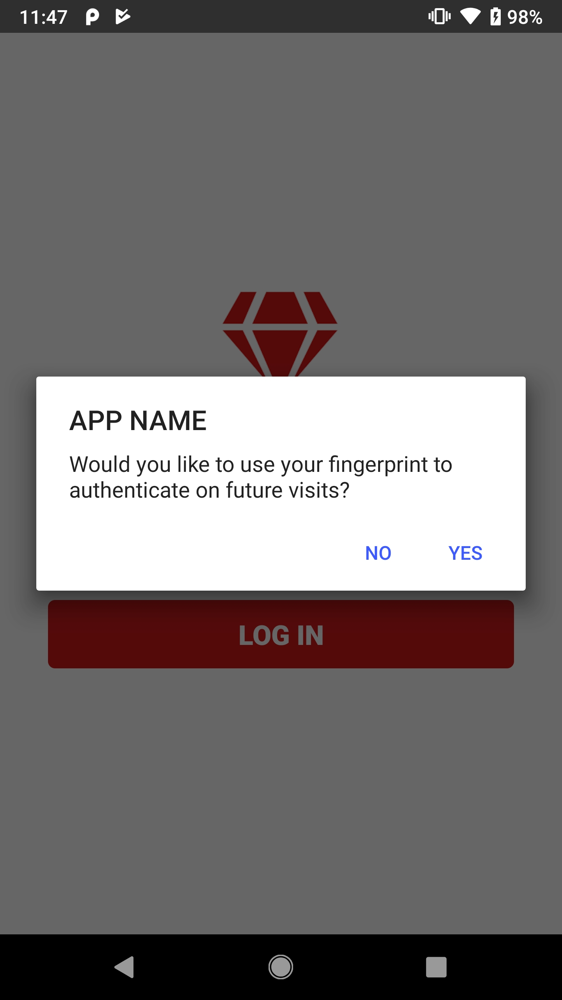
    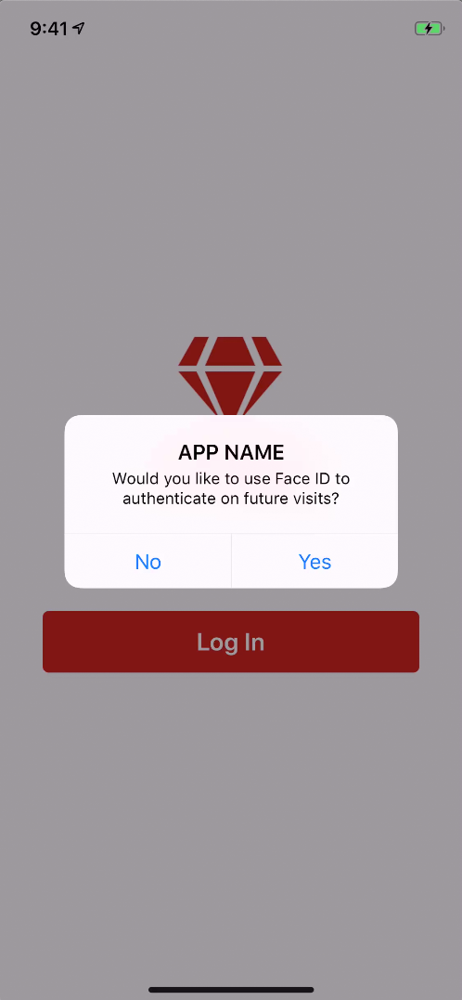
</div>

When you answer **Yes**, you should be prompted to authenticate using a biometric sensor, and when that passes you should be redirected to the app’s home screen.

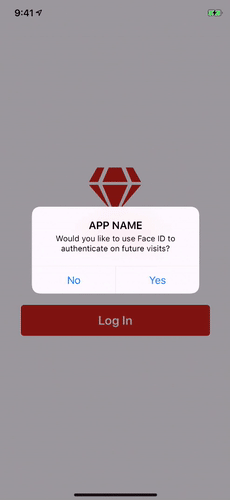

As you can see, NativeScript makes it trivial to tie into biometric sensors through easy-to-use JavaScript APIs. But before we wrap up, let’s cover one last piece of functionality this app has. If you look at the start of the login component’s `login()` method you’ll see the following chunk of code.

``` TypeScript
if (this.userService.getBiometricAuthOptIn() && this.userService.isLoggedIn()) {
    this.biometricAuth();
    return;
}
```

Remember that earlier you stored whether the user wanted to authenticate using biometric authentication. Here, you’re now checking two things: first, whether the user opted in to biometric auth, and second, whether the user is still logged in (aka they still have a valid token).

Why do this? Suppose the user closes your app and returns several hours later. When the user clicks **Login**, normally they’d have to go through your enterprise authentication process, which can be a bit tedious. So instead, here, you’re using the user’s biometric sensor to verify their identity. If it matches, the user can skip the enterprise auth process, and go straight to the home screen.

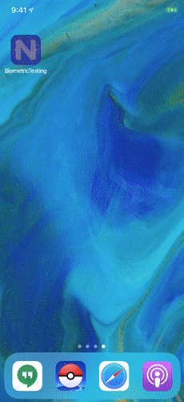

There are a number of ways you might want to alter this code to meet the needs of your app or corporate requirements. For example, you could store a timestamp each time the user successfully authenticates. You could then use that timestamp to determine when the user needs to re-authenticate. You could also require users to re-authenticate using biometric sensors before taking any important actions, such as charging a credit card, or deleting large chunks of data.

Overall, the NativeScript fingerprint auth plugin makes it easy to tap into the biometric sensor available in today’s iOS and Android devices, to allow you to build the best possible authentication experience for your users.

## Wrapping up

In this article you learned how to use NativeScript and Kinvey to build a login screen that leverages both your existing authentication mechanism and biometric sensors. Combined, you now have the tools you need to create a powerful login process for your organization.

You can find the [full code for this article on GitHub](https://github.com/tjvantoll/BiometricAuth). And if you have any questions, feel free to reach out in the comments.