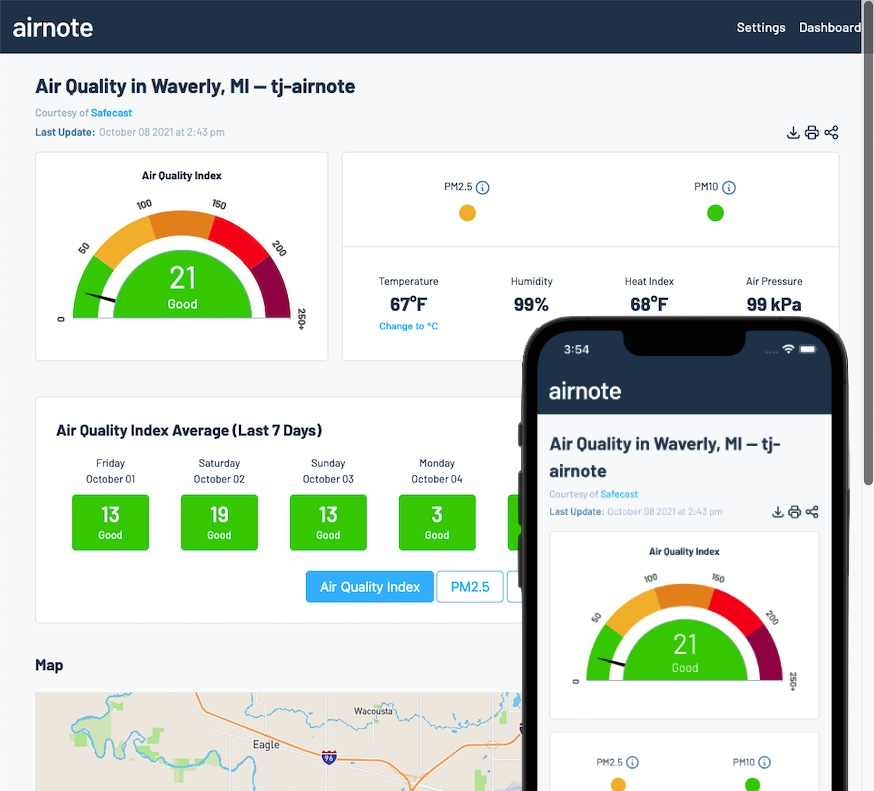
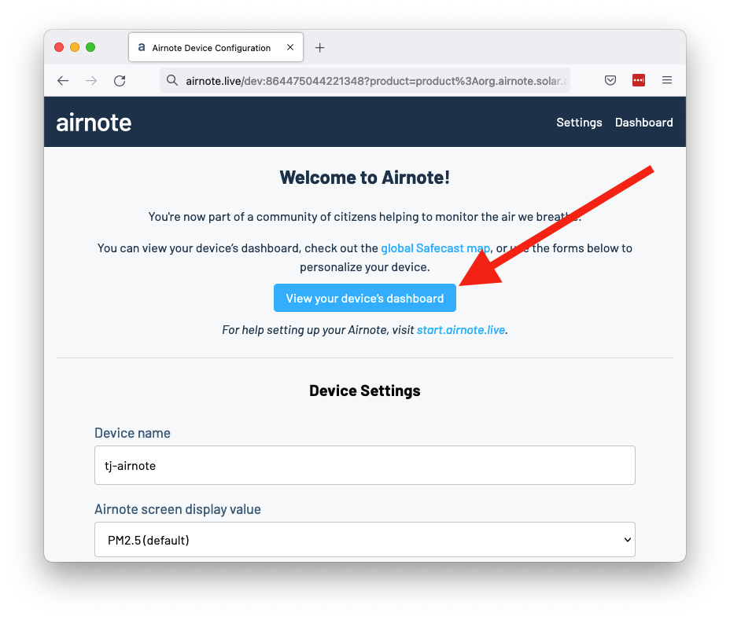
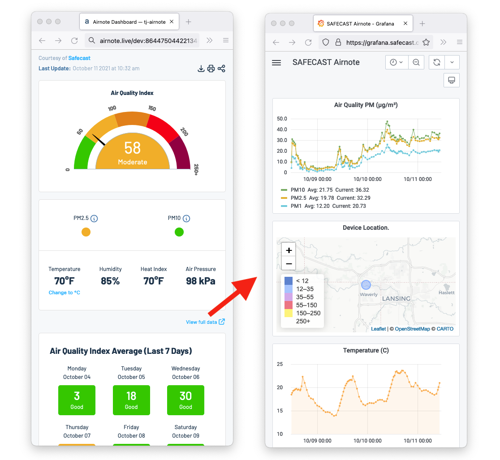

# Announcing a New Dashboard for the Airnote Project

Earlier this year we [released the Airnote](https://blues.io/blog/what-we-can-do-in-a-decade/), a zero-configuration air quality monitoring device. Powered by the Notecard, Notehub.io and the [Safecast](https://safecast.org/) network, the Airnote allows anyone who wants insight into their local air quality to purchase and deploy a device in minutes.

And today we’re announcing a new feature for all Airnote owners: an updated dashboard for quickly and easily viewing device readings.

With this new dashboard we wanted to give you the ability to both view and interpret air sensor data. For example, is your air quality good, moderate, or something you should be concerned about? 

And knowing your air quality at a glance can help you make real-world decisions, like deciding if today is a good day for a long run, or determining if a nearby wildfire is affecting your area.

## Trying the new dashboard

The new dashboard is available immediately for all Airnote users, and you can access it by scanning your Airnote’s QR code, and clicking the dashboard link (shown below).

The Safecast-provided data Airnote owners are familiar with is still available, and helpful for viewing device data over time. You can access it using the dashboard’s “View full data” link as shown below.

So what are you waiting for? Scan your Airnote’s QR code, try the new dashboard out, and [let us know what you think](https://discuss.blues.io/).

And if you don’t have an Airnote, there’s never been a better time to [get one](https://shop.blues.io/products/airnote) and join the Airnote community. We’re just getting started 🙂

