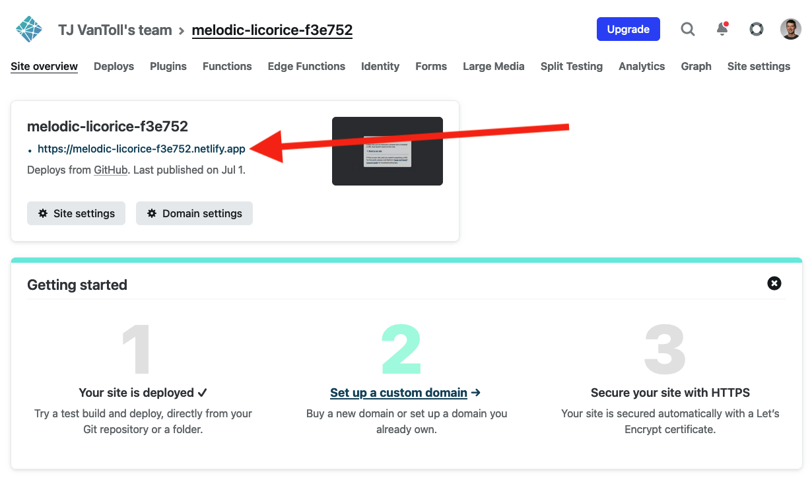
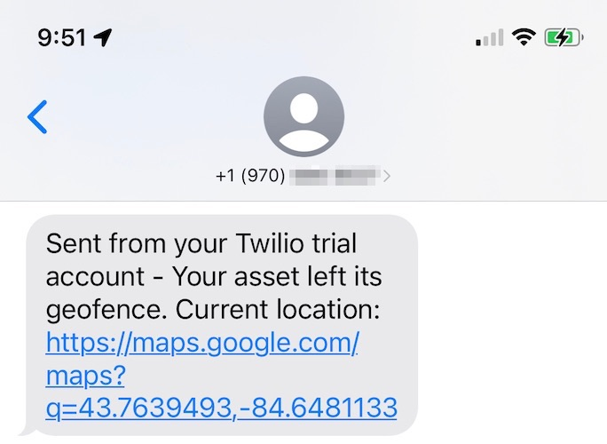

# How to Build an Asset Tracker With Geofence-Driven Alerts

When building an asset tracker, sometimes your main goal is to ensure an asset remains in a certain area.

For instance, you may want to make sure your dog remains in your yard, or that your kids stay in your neighborhood, or that your fleet of commercial trucks stay on their scheduled routes.

The most common way to enforce these boundaries are with geofences, which are virtual fences or perimeters around a physical location.


In this article you’ll learn how to build an asset tracking solution that can take GPS readings, and send out alerts when the tracker leaves a configured geofence. And you’ll do all this using a product that requires no subscription fees, and that you can completely customize to meet your needs.

Let’s get started by looking at the hardware you’ll need.

## How to build the asset tracker

Here at Blues we make the [Notecard](https://blues.io/products/notecard/), a small System-on-Module that makes IoT connectivity dead simple.


To help you get up and running with the Notecard quickly we also make [Notecarriers](https://blues.io/products/notecarrier/), which are companion boards that let you plug in a Notecard, and immediately get both GPS and cellular connectivity (through on-board antennas).

By combining the Notecard with a Notecarrier, you can have everything you need to build a fully functional and customizable asset tracker for around $80.


If you don’t have hardware yet, no worries. I’ll do my best to explain how each geofencing step works so you can get an idea of how things work before you buy.

If you do have a Notecard and Notecarrier, you next to run a few commands to get the Notecard and its cloud backend, [Notehub](https://notehub.io/), configured for asset tracking.

You can watch the video below for a detailed guide on the steps you need to take, or if you prefer written instructions, you can also read through the steps on the [Notecard’s asset tracking documentation](https://dev.blues.io/guides-and-tutorials/notecard-guides/asset-tracking/).

<iframe width="560" height="315" src="https://www.youtube.com/embed/MVYVVkgdDC4" title="YouTube video player" frameborder="0" allow="accelerometer; autoplay; clipboard-write; encrypted-media; gyroscope; picture-in-picture" allowfullscreen></iframe>


Once you complete the asset-tracking setup, your Notecard should be taking regular GPS readings, and you should be able to view them as `_track.qo` events in your Notehub backend. Your event list in Notehub should look something like the following.


At this point you have a simple asset tracker working, which is cool, but the point of this article is to implement geofencing, so we have some more work to do. Specifically, to implement geofencing on top of these readings you need to take three steps.

1) Route your data from Notehub to an external server or service to handle events.
2) Determine whether the GPS coordinates in those events are in, or out, of a geofence.
3) Send alerts when an asset is not within a geofence.

Let’s start by tackling the first step, and look at how to route data from Notehub.

## How to route the data

One great thing about using the Notecard is once you have data in Notehub, it’s trivial to route that data to other services or servers that you want to use. That service could be one of the big clouds like AWS or Azure, it could be an IoT protocol like MQTT, or it could be your own server with at an HTTP/HTTPS endpoint.


> **NOTE**: If you’re new to Notehub, I’d recommend taking a few minutes to complete the [Blues routing tutorial](https://dev.blues.io/guides-and-tutorials/routing-data-to-cloud/general-http-https/), as it’ll walk you through how routes work, and how to create a simple one you can see it in action.

Because you have a lot of options, there are also a lot of different ways you can add geofencing logic—meaning you can get geofencing working with virtually any platform or service you like using.

That being said, sometimes it’s nice to see a specific example of how to implement a solution. With that in mind, I’m going to show how to build a geofencing route using a service I like—Netlify. If you have a different platform in mind, you can use my example as an outline of how to implement the same sort of logic on other platforms.

Let’s look at how it works.

## How to build a serverless function in Netlify

[Netlify](https://www.netlify.com/) is an easy-to-use hosting platform. Netlify makes it simple to spin up web sites and apps, and to host serverless functions when all you need is a bit of logic at an HTTPS endpoint.

And a serverless function is a great fit for geofencing, as all we need is an endpoint that can accept incoming GPS coordinates, and determine whether those coordinates live within a geofence.

> **NOTE**: You may find it handy to refer to my [completed cloud function](https://github.com/tjvantoll/geofencing) throughout the rest of this guide. The code is open source, and free to clone or alter as much you need.

To get started you’ll want to refer to [Netlify’s documentation on starting a new site](https://www.netlify.com/blog/2016/09/29/a-step-by-step-guide-deploying-on-netlify/). Once you have a site, Netlify expects any cloud functions to live a `netlify/functions` directory within your app. For example, here’s the folder structure I used for my geolocation function.

```
.
├── netlify
│   └── functions
│       └── boundary-check
│           └── boundary-check.js
└── package.json
```

> **NOTE**: Netlify’s Cloud Functions also support TypeScript and Go, if you prefer those languages over JavaScript.

If you’re following along you’ll want to create that folder structure, and then use the code below as the contents of `boundary-check.js`—which at the moment just returns a simple message and a `200` response code when you hit the endpoint.

```javascript
exports.handler = async function (event, context) {
  return {
    statusCode: 200,
    body: JSON.stringify({ message: "Hello World" }),
  };
}
```

To test it you can [install the Netlify CLI](https://cli.netlify.com/) and run `netlify dev` from your command prompt or terminal, which start up a local server that runs your cloud function.

Next you’ll want to hit the endpoint, `http://localhost:8888/.netlify/functions/boundary-check`, using `curl` or any HTTP testing tool and ensure that you get a 200 response back.


Eventually you’ll want deploy this function so you can hit the endpoint from a Notehub route. But first let’s look at how to change this code to create and enforce a geofence.

### How to create and enforce a geofencing

As discussed earlier, a geofence is a virtual fence or boundary around a physical area. In code, we’ll represent a geofence as an array of latitude/longitude coordinates that form a shape.

Luckily there are online tools to make deriving these coordinates fairly trivial. (I like using [this polyline tool from Keene State College](https://www.keene.edu).)

For example, these coordinates create a geofence around the lower peninsula of Michigan.

```
-86.6142463, 44.2294566
-86.6142463, 44.2215838
-86.9439933, 41.7549222
-82.3715013, 41.6482883
-82.5034002, 44.0323206
-83.4047087, 45.4524242
-85.0534437, 45.8364541
-86.6142463, 44.2294566
```


If you’re following along, go ahead and create your own set or coordinates to use as a geofence. I’d recommend picking a fairly small area, like one city block, as it’ll make testing easier when you go to try this out.

Once you have a set a set of coordinates, your next step is to determine whether a given latitude and longitude from your tracker is within that virtual fence.

An algorithm than solves this problem is reasonably complex, but luckily there’s a [Stack Overflow thread with solutions in a variety of programming languages](https://stackoverflow.com/questions/217578/how-can-i-determine-whether-a-2d-point-is-within-a-polygon/43822141), including [this JavaScript solution I ended up using](https://stackoverflow.com/questions/217578/how-can-i-determine-whether-a-2d-point-is-within-a-polygon/43822141#answer-17490923).

By adding the `pointIsInPoly()` function from the Stack Overflow link above, and a bit of logic to call it with a set of coordinates, here’s what my first functional version of `boundary-check.js` looked like.


```js
// These are the coordinates to create the geofence that I built on
// https://www.keene.edu/campus/maps/tool/.
const geofence = [
  { x: -86.6142463, y: 44.2294566 },
  { x: -86.6142463, y: 44.2215838 },
  { x: -86.9439933, y: 41.7549222 },
  { x: -82.3715013, y: 41.6482883 },
  { x: -82.5034002, y: 44.0323206 },
  { x: -83.4047087, y: 45.4524242 },
  { x: -85.0534437, y: 45.8364541 },
  { x: -86.6142463, y: 44.2294566 },
];

const handler = async (event) => {
  let body;

  // I expect a “lat” and “lon” in the body of the request as input.
  // This next bit of code does two checks—one to ensure a body is
  // on the request, and another to ensure there’s a “lat” and “lon”
  // provided.
  try {
    body = JSON.parse(event.body);
  } catch (e) {
    return { statusCode: 500, body: "Invalid JSON body" };
  }

  const lat = body.lat;
  const lon = body.lon;

  if (!lat || !lon) {
    return { statusCode: 500, body: "Invalid GPS coordinates" };
  }

  console.log(`Received request for ${lat}, ${lon}`);

  // Determines whether the lat/lon from the request is in the geofence
  // using the algorithm from 
  // https://stackoverflow.com/questions/217578/how-can-i-determine-whether-a-2d-point-is-within-a-polygon/43822141#answer-17490923
  const isInGeofence = pointIsInPoly({ x: lon, y: lat }, geofence);

  return {
    statusCode: 200,
    body: JSON.stringify({
      isInGeofence: isInGeofence,
      lat: lat,
      lon: lon,
    }),
  };
};
```

Once you save this change, you can try sending coordinates and see whether they are within the provided geofence. To do so, you’ll want to send a POST to the same endpoint you used before, and to include a JSON body that includes a valid `lat` and `lon`.

For example in the POST below I send a body of `{ "lat": 42, "lon": -84 }`, which is a point right in the middle of Michigan, and correctly get back `{"isInGeofence":true}`.


And if I bump up the latitude to a value well outside Michigan, I correctly get back `{"isInGeofence":false}`.


If you’ve been following along you now have a cloud function that can determine whether a set of coordinates is within a geofence. As a next step you’ll want to [deploy your cloud function](https://docs.netlify.com/functions/deploy/) so that it’s available on the public internet.

Once deployed you can see your function’s base URL in the Netlify dashboard.



And you can try POSTing your data to the new endpoint to make sure everything is still working correctly.


With this step done, and the function publicly available, let’s next look at how to send data to your function in Notehub.

## Routing your data 

Back in your Notehub project, head to the **Routes** page, click **Create Route**, and then select the **General HTTP/HTTPS Request/Response** route.


Next, give your route a name (like “Geofencing”), and paste in your function’s URL in the **URL** field.


After that, scroll down, and under **Filters** select the `_track.qo` Notefile, as that’s the only type of Notefile you need to send to your function.

Under that, set **Transform Data** to “JSONata Expression”, and set its contents to the following.

```json
{
    "lat": where_lat,
    "lon": where_lon
}
```


> **NOTE**: JSONata is a handy language that allows you to query and transform JSON objects. The code above selects _only_ the GPS latitude and longitude from a `_track.qo` event to send to your endpoint. You can [learn more about JSONata on the Blues documentation](https://dev.blues.io/guides-and-tutorials/notecard-guides/using-jsonata-to-transform-json/).

With these values in place go ahead and hit **Apply changes** to save and activate your route.

Now, the next time a `_track.qo` event comes in from your asset tracker, Notehub will automatically route that event to your cloud function to determine whether it’s within your defined geofence.

To test this you’ll need to generate a `_track.qo` event, which you can do by taking your Notecard for a quick walk or drive. When that `_track.qo` event comes in, you’ll be able to view a new **Route Log** tab, which lists all the places Notehub routed your data, and the result. If all went well, you should see a 200 response from your newly created cloud function.


And at this point, you now have data flowing all the way from the Notecard, to a cloud function which determines whether the location is within a configured geofence—which is pretty cool!

But there’s one last step—although it’s nice to see the `isInGeofence` result in Notehub, the real power of geofencing is getting an alert when an asset leaves its configured territory. Let’s look at how to set that up.

## Sending alerts

Alerts are often critical to geofencing projects, as you usually want to know when your dog leaves your yard, or when your kids leave your neighborhood. The type of alert you want to send can vary based on the project, and there are services for sending email alerts, push notifications, SMS messages and more.

That being said, I again want to show a specific workflow in this article, and my personal favorite way to send alerts is with Twilio.

[Twilio](https://www.twilio.com/) is a service that does many things, but I primarily use it as a very easy way to send SMS messages. Twilio’s [documentation on sending messages](https://www.twilio.com/docs/sms) is quite good, and you’ll want to refer to it for information on how to create a Twilio trial account, and how to register a Twilio phone number for testing.

Once you have an account and number, you’ll next want to add code to send Twilio messages to your cloud function. I started by installing the [twilio](https://www.npmjs.com/package/twilio) and [axios](https://www.npmjs.com/package/axios) npm packages.

```bash
npm install twilio axios
```

After that I added the following new function, which sends the message itself.

```js
const TWILIO_SMS_TO = "YOUR_PERSONAL_PHONE_NUMBER";
const TWILIO_SMS_FROM = "YOUR_TRIAL_NUMBER_FROM_TWILIO";

const sendTwilioSMS = (lat, lon) => {
  return new Promise((resolve, reject) => {
    console.log("Sending Twilio SMS notification");
    twilio.messages
      .create({
        body: `Your asset left its geofence. Current location: https://maps.google.com/maps?q=${lat},${lon}`,
        to: TWILIO_SMS_TO,
        from: TWILIO_SMS_FROM,
      })
      .then(() => {
        console.log("SMS message sent successfully");
        resolve();
      })
      .catch((e) => {
        console.error("SMS message send failed", e);
        reject();
      });
  });
};
```

Then I added the following code to my main `handler()`, which conditionally sends the message if the coordinates are not within a geofence.

```js
const isInGeofence = pointIsInPoly({ x: lon, y: lat }, coordinates);
if (!isInGeofence) {
  try {
    await sendTwilioSMS(lat, lon);
  } catch (e) {
    return { statusCode: 500, body: "Failed while sending SMS notification" };
  }
}
```

> **NOTE**: As a reminder the [project’s full source is available on GitHub](https://github.com/tjvantoll/geofencing).

At this point we’re almost done, but there’s one last problem to solve.

### Rate Limiting

Currently this code sends an SMS message when invoked with a location that lives outside of the geofence—and it does so every time. Meaning, if you take this tracker outside of your geofence, it’ll spam an SMS message every time the tracker takes a reading.

If a tracker being outside a geofence is an emergency situation this might be what you want, but for many projects you only care about the first time a tracker leaves a geofence in a given interval. To implement that you need to introduce some sort of rate limiting.

To rate limit, you have to store the last time you sent a message, and ensure a given amount of time has passed before you send another one.

```js
// Psuedo code to show roughly what you need to do
let lastNotified;
const ONE_HOUR = 1000 * 60 * 60;

if (!isInGeofence) {
  var currentTime = new Date().getTime();
  if ((currentTime + ONE_HOUR) > lastNotified) {
    sendSMSMessage();
    lastNotified = currentTime;
  } else {
    // We’ve already sent a message within the last hour, so do nothing
  }
}
```

The tricky thing is you’re running code in a stateless cloud function—meaning, you can’t store variables like `lastNotified`, because the next time the cloud function runs that variable will be gone.

To to get this working you need to store `lastNotified` outside of the cloud function, and to do that we’re going to use a Notecard’s environment variables.

### Using environment variables

[Blues environment variables](https://dev.blues.io/guides-and-tutorials/notecard-guides/understanding-environment-variables/) allow you to manage state on Notecards, fleets of Notecards, and even entire Notehub projects.

There’s a lot you can do with environment variables, but for our example we’ll keep things simple, and just store a single variable that tracks the last time you sent out an SMS notification.

This is fairly easy, as Notehub has an [HTTP API](https://dev.blues.io/reference/notehub-api/api-introduction/) that makes setting a variable as simple as a quick POST. Here’s the code I used to do the update.

```js
// The current time in seconds
const timestamp = String(new Date().getTime() / 1000);

// Learn how to generate this token at:
// https://dev.blues.io/reference/notehub-api/api-introduction/#authentication
const NOTEHUB_AUTH_TOKEN = "YOUR_VALUE_HERE";

// Make sure to sub in your own project and device ids.
const ENDPOINT = "https://api.notefile.net/v1/projects/app:38591b70-4c0b-40f3-9e0c-c2c319eef1e3/devices/dev:868050040247765/environment_variables";

return new Promise((resolve, reject) => {
  console.log("Updating last notified timestamp in Notehub", timestamp);
  axios
    .put(
      ENDPOINT,
      {
        environment_variables: { last_notified: timestamp },
      },
      {
        headers: {
          "X-SESSION-TOKEN": NOTEHUB_AUTH_TOKEN,
        },
      }
    )
    .then(() => {
      console.log("Last notified timestamp updated successfully");
      resolve();
    })
    .catch((e) => {
      console.error("Failed to update Notehub environment variable", e);
      reject();
    });
  });
};
```

And back in my main `handler()`, I added a bit of code that updates the environment variable before sending out the SMS alert.

``` js
const isInGeofence = pointIsInPoly({ x: lon, y: lat }, coordinates);
if (!isInGeofence) {
  try {
    await updateEnvVar();
  } catch (e) {
    return { statusCode: 500, body: "Failed while updating Notehub" };
  }
  try {
    await sendTwilioSMS(lat, lon);
  } catch (e) {
    return { statusCode: 500, body: "Failed while sending SMS notification" };
  }
}
```

This new code handles updating `lastNotified`, but we still need to read `lastNotified` and use that to enforce the rate limit. We could do that in our cloud function, but there’s one last trick we can do in Notehub to keep our code cleaner.

Back when you were creating a Notehub route, you included the following JSONata to send only a `lat` and `lon` to your cloud function.

```json
{
    "lat": where_lat,
    "lon": where_lon
}
```

In addition to using JSONata to filter your JSON, Notehub also offers a few custom JSONata features you can use to implement some powerful behavior. And for this project we’re going to use `$doNotRoute()` a custom function that allows you to not route an event under certain conditions.

To try it out, return to Notehub and edit your geofencing route. Scroll down to your JSONata, and replace it with the following code.

```json
(
  $result := {
    "lat": where_lat,
    "lon": where_lon
  };
  $result := (received > ($number($last_notified) + (60 * 60))) ?
    $result : $doNotRoute();
)
```

This code implements the rate limiting that we first looked at in pseudo code earlier. We start by storing the result in a JSONata variable.

```json
$result := {
  "lat": where_lat,
  "lon": where_lon
};
```

Next, we check `received`, which is a Notecard-included timestamp, against `$last_notified`, which is the environment variable we set in our cloud function.

If `received > ($number($last_notified) + (60 * 60))`, aka if it’s been an hour since we last notified, we set `$result` equal to itself, ensuring the event gets routed as normal. But if it has _not_ been an hour, we set `$result` to `$doNotRoute()`, which prevents the route from hitting the cloud function at all.

``` json
$result := (received > ($number($last_notified) + (60 * 60))) ?
  $result : $doNotRoute();
```

Once you have everything in place it’s time to try things out. Make sure you save your updated Notehub route, and that you redeploy your cloud function in Netlify with any changes you’ve made. After that, you’ll need to generate a `_track.qo` outside of your configured geofence. (Hopefully you made a small geofence earlier to make testing easier 🙂)

If everything works correctly, as soon as the Notecard reports a `_track.qo` outside of your boundaries, you should see a text message come through with a link to the last recorded location.



## Wrapping up

The Notecard and Notehub make asset tracking simple, and give you a solid foundation for building custom geofencing solutions.

In this article I showed you one way you can implement geofencing, with a JavaScript cloud function on Netlify—but the power of the Notecard and Notehub is how easy you can customize just about everything, and implement geofencing with your backend and hardware of choice.

The code I used in this article is [available on GitHub](https://github.com/tjvantoll/geofencing)—feel free to copy or modify it as much as you’d like. And if you have any questions about getting geofencing working, [reach out in our community forum](https://discuss.blues.io/) and we’ll be happy to help you out.