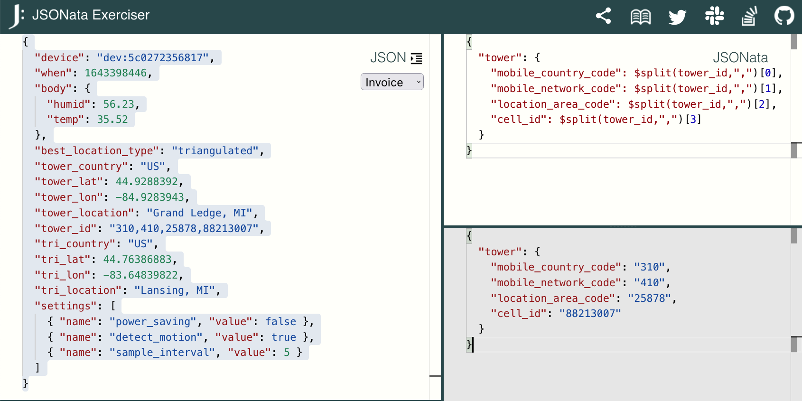

# A Big List of JSONata Examples

JSONata is a JSON query and transformation language. JSONata can do a _lot_, which can make it intimidating to start with. This guide aims to make JSONata easier to use by providing concrete examples of the language in action.

This guide’s examples all take the same input JSON (shown below), and use JSONata to query or transform that input in interesting ways.

**Input JSON**

```json
{
  "device": "dev:5c0272356817",
  "product": "product:com.blues.tj:gettingstarted",
  "req": "note.add",
  "when": 1643398446,
  "file": "sensors.qo",
  "body": {
    "humid": 56.23,
    "temp": 35.52
  },
  "best_location_type": "triangulated",
  "best_lat": 44.76386883,
  "best_lon": -83.64839822,
  "best_location": "Lansing, MI",
  "tower_lat": 44.9288392,
  "tower_lon": -83.9283943,
  "tower_location": "Lansing, MI",
  "tower_id": "310,410,25878,88213007",
  "tri_lat": 44.76386883,
  "tri_lon": -83.64839822,
  "tri_location": "Lansing, MI"
}
```

All screenshots in this guide come from [JSONata Exerciser](https://try.jsonata.org/)—a handy site for testing JSONata in your web browser. To use the JSONata Exerciser you place your input JSON in the left pane and your JSONata in the top-right pane. The Exerciser automatically applies the JSONata to the input JSON, and displays the result in the bottom-right pane.


## 1) Grab one piece of data

Let’s start simple. Sometimes all you want to do is grab one piece of data out of a JSON object. With JSONata you can do that by just referencing the appropriate property name.

```
file
```


You can use the `.` operator to access nested properties.

```
body.temp
```


## 2) Create a smaller JSON object

JSONata can useful for taking a large JSON input, and outputting a separate JSON object that only contains the properties you need. For example, the following JSONata returns a JSON object that only contains the `device` property (and its value).

```json
{
  "device": device
}
```


## 3) Add new fields

Building on the previous example, sometimes you want to create your own JSON structure that includes a mix of data from your input JSON, and completely new properties.

```json
{
  "device": device,
  "a_new_property": "a value"
}
```


## 4) Create a new JSON structure altogether

You can use JSONata to create a JSON object that uses a completely different structure than your input JSON. This can be useful if, for instance, you need send JSON to a system that expects JSON data in a completely different format.

The JSONata below creates a JSON object with a new `data` property that includes two properties from the input JSON.

```json
{
  "data": {
    "device": device,
    "timezone": best_timezone
  }
}
```


## 5) Split up a value

JSONata has several built-in functions that can help you parse data. The example below uses `$split` to break `"tower_id": "310,410,25878,88213007"` into four properties in a new JSON object.

```json
{
  "tower": {
    "mobile_country_code": $split(tower_id,",")[0],
    "mobile_network_code": $split(tower_id,",")[1],
    "location_area_code": $split(tower_id,",")[2],
    "cell_id": $split(tower_id,",")[3]
  }
}
```



## 6) Adding conditional logic

```

```
