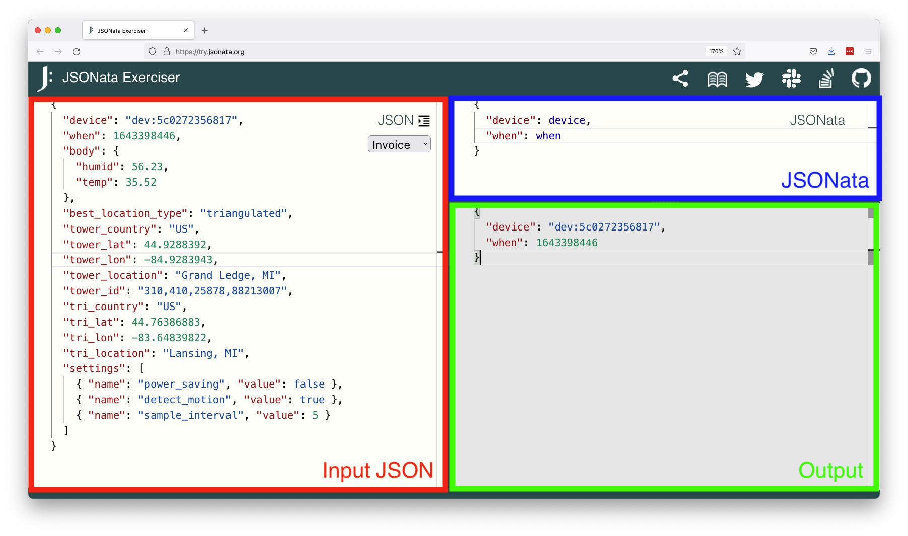
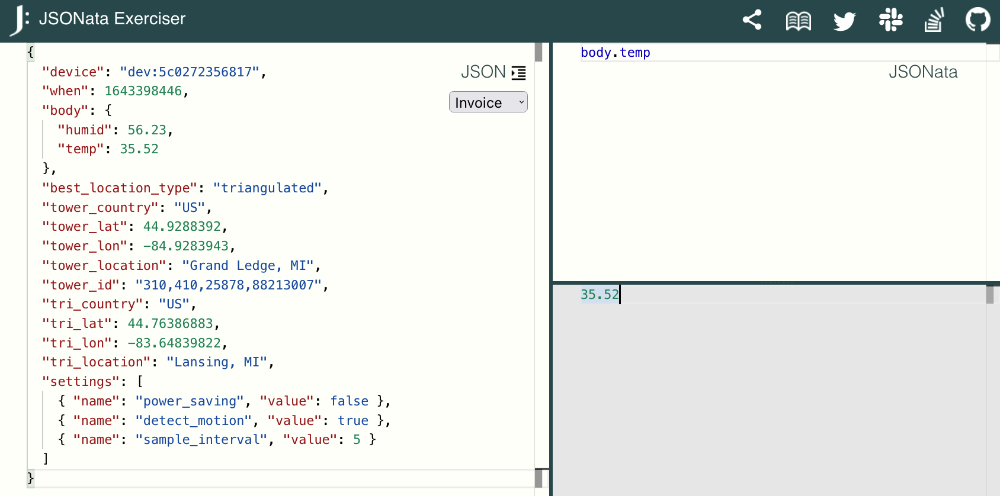

# 10 Examples to Help You Learn JSONata

JSONata is a JSON query and transformation language. JSONata can do a _lot_, which can make it intimidating to start with. This guide aims to make JSONata easier to use by providing concrete examples of the language in action.

This guide’s examples all take the same input JSON (shown below), and use JSONata to query or transform that input in interesting ways.

**Input JSON**

```json
{
  "device": "dev:5c0272356817",
  "when": 1643398446,
  "body": {
    "humid": 56.23,
    "temp": 35.52
  },
  "best_location_type": "triangulated",
  "tower_country": "US",
  "tower_lat": 44.9288392,
  "tower_lon": -84.9283943,
  "tower_location": "Grand Ledge, MI",
  "tower_id": "310,410,25878,88213007",
  "tri_country": "US",
  "tri_lat": 44.76386883,
  "tri_lon": -83.64839822,
  "tri_location": "Lansing, MI",
  "settings": [
    { "name": "power_saving", "value": false },
    { "name": "detect_motion", "value": true },
    { "name": "sample_interval", "value": 5 }
  ]
}
```

All screenshots in this guide come from [JSONata Exerciser](https://try.jsonata.org/)—a handy site for testing JSONata in your web browser. To use the JSONata Exerciser you place your input JSON in the left pane and your JSONata in the top-right pane. The Exerciser automatically applies the JSONata to the input JSON, and displays the result in the bottom-right pane.



## 1) Grab one piece of data

Let’s start simple. Sometimes all you want to do is grab one piece of data out of a JSON object. With JSONata you can do that by just referencing the appropriate property name.

```
device
```


You can use the `.` operator to access nested properties.

```
body.temp
```



## 2) Create a smaller JSON object

JSONata can useful for taking a large JSON input, and outputting a separate JSON object that only contains the properties you need. For example, the following JSONata returns a JSON object that only contains the `device` property (and its value).

```json
{
  "device": device
}
```


## 3) Add new fields

Building on the previous example, sometimes you want to create your own JSON structure that includes a mix of data from your input JSON, and completely new properties.

```json
{
  "device": device,
  "a_new_property": "a value"
}
```


## 4) Create a new JSON structure altogether

You can use JSONata to create a JSON object that uses a completely different structure than your input JSON. This can be useful if, for instance, you need send JSON to a system that expects JSON data in a completely different format.

The JSONata below creates a JSON object with a new `data` property that includes two properties from the input JSON.

```json
{
  "data": {
    "device": device,
    "when": when
  }
}
```


## 5) Using built-in functions

JSONata has several built-in functions that can help you parse data. The example below uses [JSONata’s `$split` function](https://docs.jsonata.org/string-functions#split) to break `"tower_id": "310,410,25878,88213007"` into four properties in a new JSON object.

```json
{
  "tower": {
    "mobile_country_code": $split(tower_id,",")[0],
    "mobile_network_code": $split(tower_id,",")[1],
    "location_area_code": $split(tower_id,",")[2],
    "cell_id": $split(tower_id,",")[3]
  }
}
```


> **TIP**: There are dozens of other built-in functions you might want to experiment with, including [`$trim()`](https://docs.jsonata.org/string-functions#trim) or [`$substring()`](https://docs.jsonata.org/string-functions#substring) for working with strings, or [`$round()`](https://docs.jsonata.org/numeric-functions#round), [`$floor()`](https://docs.jsonata.org/numeric-functions#floor), and [`$ceil()`](https://docs.jsonata.org/numeric-functions#ceil) for working with numbers.

## 6) Working with dates and times

JSONata has [several features that help with date/time processing](http://docs.jsonata.org/date-time). Perhaps the most useful of these is [`$now()`](https://docs.jsonata.org/date-time-functions#now), which gives you an easy way to add a timestamp to your JSON output.

```json
{
  "timestamp": $now()
}
```


You might also find [`$fromMillis()`](https://docs.jsonata.org/date-time-functions#frommillis) useful, as it allows you to convert a millisecond-based time to a formatted string representation.

```json
{
  "time": $fromMillis(when * 1000)
}
```


> **TIP**: You can control the format of the `$fromMillis()` output with its optional `picture` argument. See the [`$fromMillis()` documentation](https://docs.jsonata.org/date-time-functions#frommillis) for more information.

## 7) Adding conditional logic

JSONata also allows you to perform conditional checks using the ternary operator. For example, the JSONata below selects either `tri_location` or `tower_location` depending on the value of `best_location_type`.

```
{
  "location": best_location_type = "triangulated" ? tri_location : tower_location
}
```


## 8) Creating functions

If your logic is more advanced you can [create reusable functions directly in JSONata](https://docs.jsonata.org/programming#defining-a-function).

For example, the code below defines a custom `$localizeTemperature` function, and uses it to convert temperature values to Fahrenheit or Celsius depending on the country.

```json
(
  $localizeTemperature := function($degrees_celcius, $country) {(
    $conversion_ratio := (9 / 5);
    ($country = "US")
      ? (($degrees_celcius * $conversion_ratio) + 32)
      : $degrees_celcius;
  )};
  {
    "temp": $localizeTemperature(body.temp, best_country)
  }
)
```


See [JSONata’s function documentation](https://docs.jsonata.org/programming#defining-a-function) for more information.

## 9) Sorting and filter data

JSONata provides an [order-by operator](https://docs.jsonata.org/path-operators#---order-by) that allows you to sort an array of JSON data. For example, the code below sorts the `settings` array by its `name` property.

```json
{
  "settings": settings^(name)
}
```


The [filter operator](https://docs.jsonata.org/path-operators#---filter) allows you to select items in an array that match a provided condition. For example, the code below selects all objects in `settings` that have a `name` of `"power_saving"`.

```json
{
  "settings": settings[name = 'power_saving']
}
```


## 10) Blues extensions to JSONata

In case all of these examples weren’t enough, JSONata also includes a [series of extension APIs](https://docs.jsonata.org/embedding-extending). Here at Blues we use JSONata a lot, as we find it a handy way to manipulate JSON before [routing data to cloud services](https://dev.blues.io/guides-and-tutorials/routing-data-to-cloud/general-http-https/), so we’ve extended the language with a few new features.

For example, we allow our users to refer to [environment variables](https://dev.blues.io/guides-and-tutorials/notecard-guides/understanding-environment-variables/) using the `$` operator. For example, to read an environment variable named `interval` you can use `$interval` in your JSONata expression.

```json
{
  "interval": $interval
}
```

We also offer a custom function named `$doNotRoute()` that allows you to conditionally route your data to a service based on a variable or calculation. For example, the code only routes data if a `location` exists.

```json
($result := ($exists(location)) ? $result : $doNotRoute();)
```

## Wrapping up

Hopefully you’ve found these examples useful as you’re trying to learn JSONata. For more, check out [JSONata’s extensive documentation site](https://docs.jsonata.org/overview.html).
