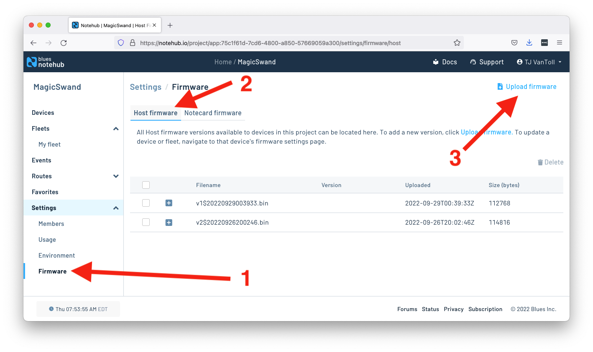
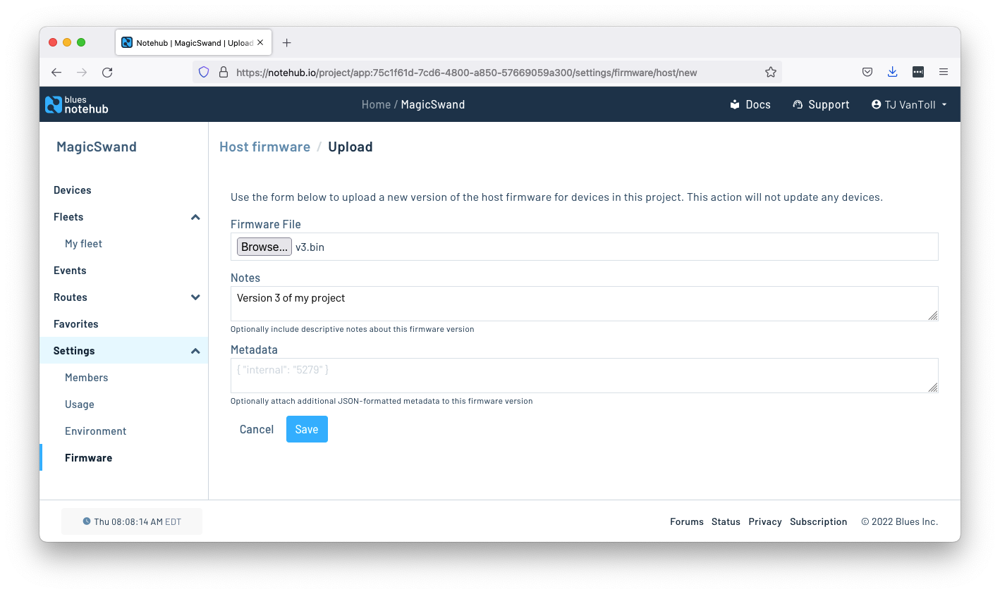
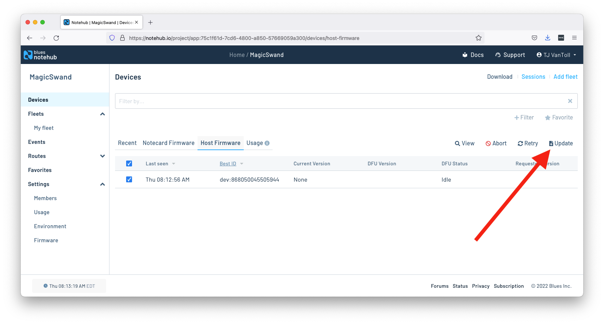
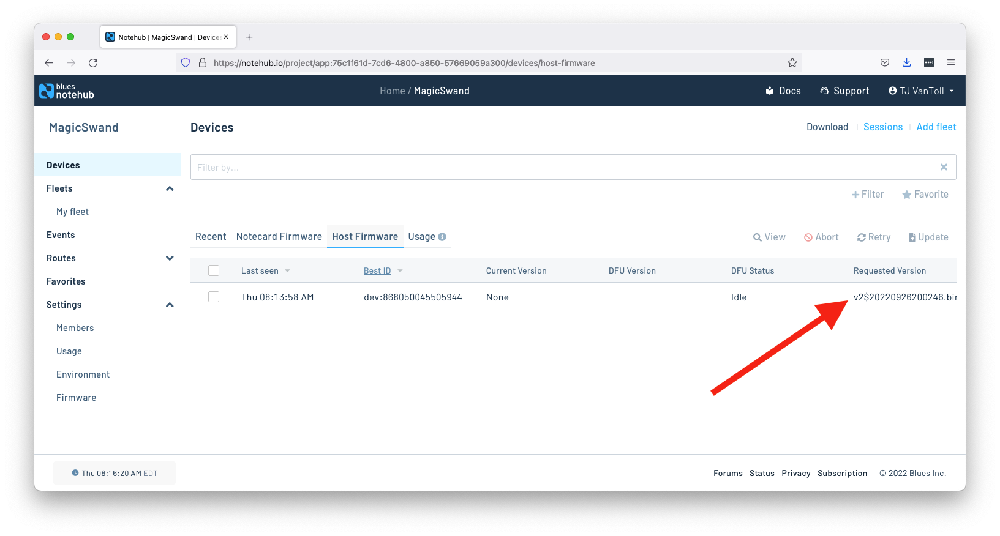
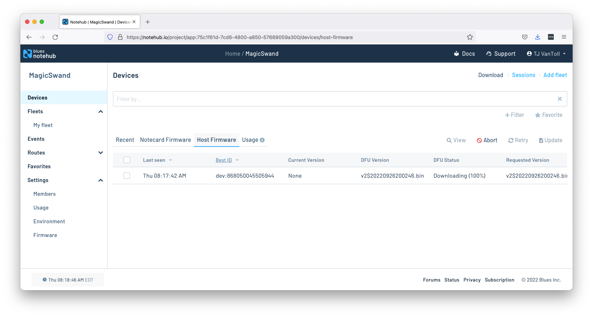
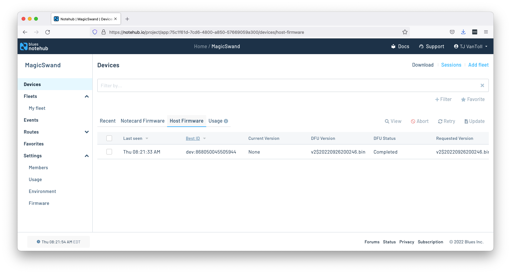

# Announcing the Developer Beta of Outboard DFU

Today is a big day at Blues, as we’re excited to announce the developer beta of Outboard DFU, a new solution for over-the-air host firmware updates.

Let’s dive right in and look at what Outboard DFU is, how it works, and how you can start performing over-the-air firmware updates today.

## How It Works

An increasing number of MCUs are shipped with their primary bootloader “in ROM”, unmodifiable by any user operation.  On these devices, when a RESET pin is asserted, the device enters this ROM bootloader which can load and execute code from a variety of sources. This ROM bootloader’s behavior is controlled by actively probing those I/O ports and by sampling the state of “strapping pins” or specially locked “boot option bytes” in Flash.

These manufacturer-provided ROM bootloaders present exciting new opportunities—specifically, they allow us to perform firmware updates in a manner that is far more flexible in terms of language and RTOS, and far less vulnerable to inadvertent programming bugs.

Beginning with firmware version 3.3.1, the Blues Wireless Notecard is now capable of utilizing these capabilities of modern MCUs, and performing firmware update “from the outside” and **not involving the firmware running on the MCU whatsoever**. The Notecard can update firmware regardless of RTOS or language, and can even be used to switch between them, even modifying Flash memory layout and partitioning any time after-the-fact, at the developer’s choice.

## Hardware Setup

Taking advantage of the Notecard’s new capabilities requires you to lay out several connections between the Notecard’s AUX pins and the host MCU’s, RESET, BOOT, and UART pins.

Today this wiring is available out-of-the-box and supported in the [Notecarrier-F](https://shop.blues.io/products/notecarrier-f), and we have successfully tested with the following MCUs:

- Adafruit nRF52840 Feather
- Adafruit STM32F405 Feather Express
- Blues Wireless Swan (version 3 and greater)

Over time, we intend to greatly expand our list of tested MCUs, and to publish hardware design guidelines to allow you to work with Outboard DFU on other development boards.

## How to Try it Today

If you have a Notecarrier-F and one of the boards listed above, you can use Outboard DFU to perform over-the-air firmware updates today.

To start, first make sure your Notecard is running a firmware version that’s 3.3 or newer. (And if it’s not, see our [guide on updating Notecard firmware](https://dev.blues.io/notecard/notecard-firmware-updates/)).

From there, you need to enable Outboard DFU using the new `card.dfu` request.

```
{"req":"card.dfu","name":"stm32","on":true}
```

Next, in a Notehub project, navigate to the **Firmware** page, select the **Host firmware** tab, and then click **Upload firmware**.



On the next page upload a `.bin` file of the new firmware you want to place on your host.



With the new firmware uploaded to Notehub, you next need to tell Notehub to send that firmware to your devices.

To do that, go to your Notehub project’s **Devices** page, go to the **Host Firmware** tab, select all devices you’d like to update host firmware on, and then click the **Update** button.



After you select the new version you’d like, you’ll see your new firmware appear in the **Requested Version** column.



The next time your Notecard performs a sync, it’ll detect a new host binary is available and will begin downloading it (without interfering with its normal operations). You can view the progress of the download in Notehub.



After the download completes, the Notecard will reprogram the various areas in Flash as directed by instructions within the firmware image file, verifies them via MD5 hashes, and restarts the MCU.

In Notehub you’ll see the **DFU Status** update to **Completed** and your **DFU Version** update to your new binary.



And, that’s it! With those few steps you have the power to perform complete over-the-air firmware updates 🎉

## What’s next?

Outboard DFU is available today as a developer beta, so we’d love you to try it out and let us know what you think. Feel free to [reach out in our forum](https://discuss.blues.io/) with any feedback or questions.

And if you want to stay informed on the latest and greatest Outboard DFU news, make sure to [sign up for our newsletter](https://blues.io/dev-news/) for monthly updates.
