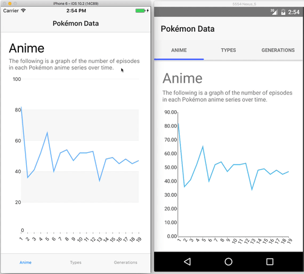
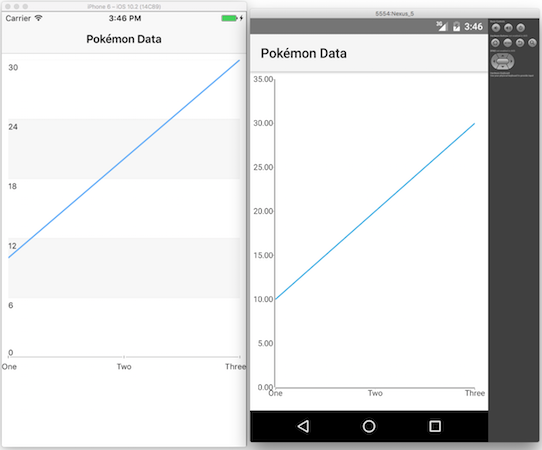
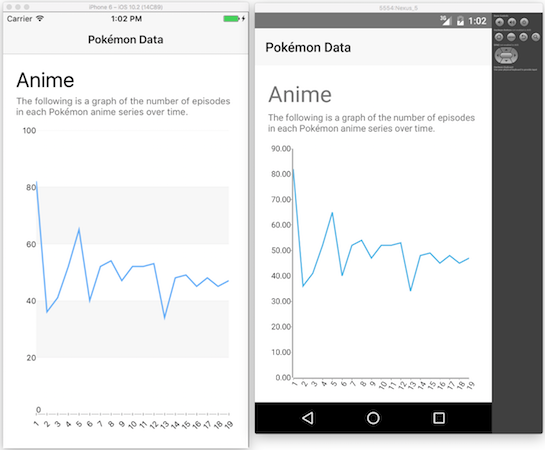
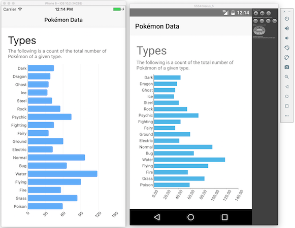
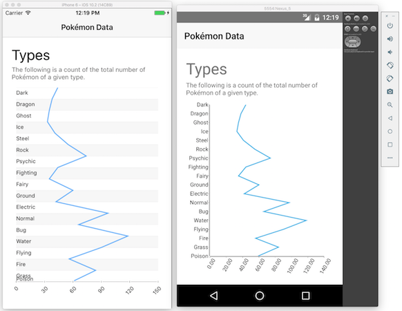
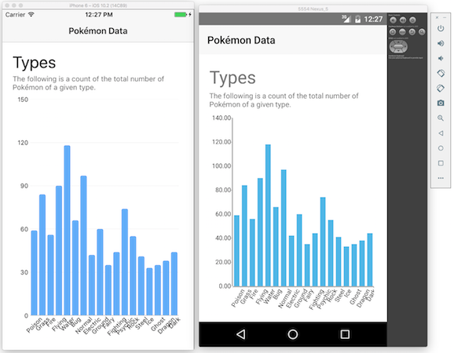
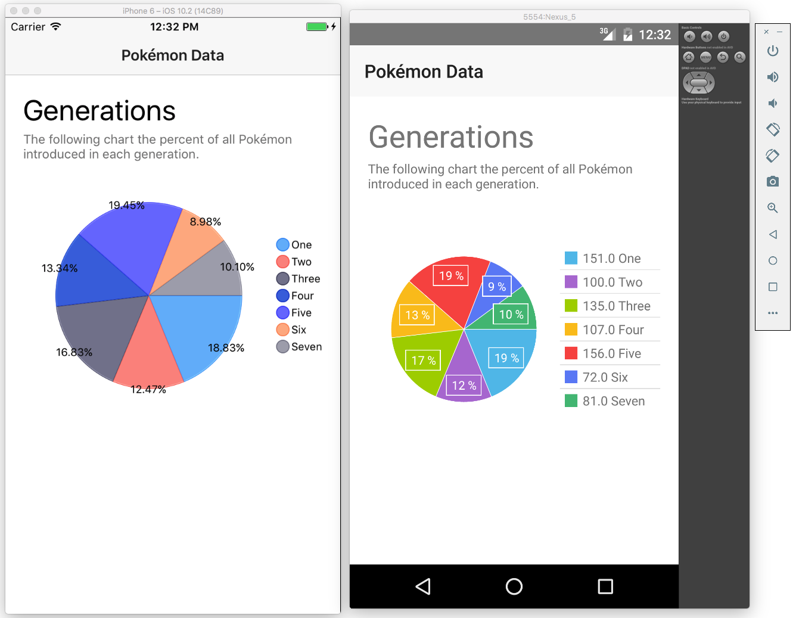

# Building Powerful Data Visualizations with Telerik UI for NativeScript

One of the main reasons developers build apps is to manage and visualize data. [Telerik UI for NativeScript](http://www.telerik.com/nativescript-ui) makes building robust charts and graphs for your data a breeze, with a series of simple JavaScript and markup APIs for creating data visualizations that look great in iOS and Android applications.

Let’s look at how the charts work by visualizing some data on one of my favorite topics—Pokémon! By the end of the article you’ll know how to build the line, bar, and pie charts below in your own apps.

Let’s get started.



> This is the second post in a series of articles that dive deep into each of the UI for NativeScript components. If you’re new to NativeScript or UI for NativeScript, you may wish to start with the [first article in this series](link) for a basic introduction to the component suite.

## Getting Started with RadChart

Telerik UI for NativeScript includes [two distributions](http://docs.telerik.com/devtools/nativescript-ui/introduction#how-is-telerik-ui-for-nativescript-distributed)—a series of free controls, and series of [paid controls]((http://www.telerik.com/purchase/nativescript-ui)) known as UI for NativeScript Pro. UI for NativeScript’s charting controls are part of the paid distribution, but you can download the entire control suite as part of a free trial to test them out. If you’d like to follow along with this article’s examples directly, go ahead and [download a free trial](http://www.telerik.com/download-trial-file/v2/nativescript-ui).

When you start your trial you’ll be given the chance to download a `.tgz` file that contains all of the UI for NativeScript Pro functionality. Make note of where that `.tgz` file is on your hard drive, and then go ahead and use the command below to start a new app that includes the UI for NativeScript controls.

```
tns create pokemon
cd pokemon
tns plugin add <path-to-your-tgz-file>
```

With the setup out of the way, let’s create a simple hello world line chart that we can build on top of. Go ahead and open your new app’s `main-page.xml` file and replace its contents with the code below.

``` XML
<Page 
  xmlns="http://schemas.nativescript.org/tns.xsd"
  xmlns:chart="nativescript-telerik-ui-pro/chart"
  class="page" loaded="pageLoaded">

  <ActionBar class="action-bar" title="Pokémon Data"></ActionBar>

  <StackLayout class="p-20">
    <chart:RadCartesianChart class="m-t-10" height="500">
      <chart:RadCartesianChart.series>
        <chart:LineSeries
          items="{{ data }}"
          categoryProperty="key"
          valueProperty="value">
          <chart:LineSeries.horizontalAxis>
            <chart:CategoricalAxis />
          </chart:LineSeries.horizontalAxis>
          <chart:LineSeries.verticalAxis>
            <chart:LinearAxis />
          </chart:LineSeries.verticalAxis>
        </chart:LineSeries>
      </chart:RadCartesianChart.series>
    </chart:RadCartesianChart>
  </StackLayout>
</Page>
```

> **TIP**: The `p-20` and `m-t-10` class names are from the NativeScript core theme, and apply `padding: 20` and `margin-top: 10`, respectively. See the [NativeScript theme documentation](https://docs.nativescript.org/ui/theme#padding-and-margin) for more details.

Next, open your app’s `main-page.js` file and replace its contents with the code below:

``` JavaScript
var frameModule = require("ui/frame");
var Observable = require("data/observable").Observable;

var pageData = new Observable();
pageData.data = [
  { key: "One", value: 10 },
  { key: "Two", value: 20 },
  { key: "Three", value: 30 }
];

exports.pageLoaded = function(args) {
  var page = args.object;
  page.bindingContext = pageData;
};
```

After you save these files and run your app, you’ll have charts that look something like this on iOS and Android.



Although this code doesn’t produce the world’s most exciting chart, it is pretty cool that you just built completely native charts for both Android and iOS in a few dozen lines of code.

And we’re just getting started. Let’s break down the code above to start to discuss just how configurable these charts are.

## Breaking down how charts work

With UI for NativeScript you build charts from a series of composable APIs that control common chart features such as axes, legends, and labels. Here’s the pertinent code you used to build the previous section’s chart.

``` XML
<chart:RadCartesianChart class="m-t-10" height="500">
  <chart:RadCartesianChart.series>
    <chart:LineSeries
      items="{{ data }}"
      categoryProperty="key"
      valueProperty="value">
      <chart:LineSeries.horizontalAxis>
        <chart:CategoricalAxis />
      </chart:LineSeries.horizontalAxis>
      <chart:LineSeries.verticalAxis>
        <chart:LinearAxis />
      </chart:LineSeries.verticalAxis>
    </chart:LineSeries>
  </chart:RadCartesianChart.series>
</chart:RadCartesianChart>
```

At a high level there are two different chart types in UI for NativeScript—RadCatesignCharts for plotting data points with X and Y axes, and RadPieCharts for plotting data points in a radial coordindate system. The example above uses RadCartesianChart as it’s using X/Y coordinates, and later examples in this tutorial will show off how the RadPieChart works.

Once you choose between RadCartesianChart and RadPieChart you next have to provide a [series](http://docs.telerik.com/devtools/nativescript-ui/Controls/NativeScript/Chart/Series/series), or a more specific means of visualizing the data points you provide. The most common series are BarSeries, LineSeries, and AreaSeries, although there are other options for more niche visualization needs. You can also [stack multiple series](http://docs.telerik.com/devtools/nativescript-ui/Controls/NativeScript/Chart/Series/series#stack-mode) if you have multiple sets of data you want to represent in the same chart.

Our example uses a simple LineSeries for now, and its three properties—`items`, `key`, and `value`—point at an `Observable` object named `data`. In the code below, note how the `categoryProperty` attribute lines up with the `key` property of the `data` object, and how the `valueProperty` attribute lines up with the `value` property of the `data` object.

``` XML
<chart:LineSeries
  items="{{ data }}"
  categoryProperty="key"
  valueProperty="value">
  <chart:LineSeries.horizontalAxis>
    <chart:CategoricalAxis />
  </chart:LineSeries.horizontalAxis>
  <chart:LineSeries.verticalAxis>
    <chart:LinearAxis />
  </chart:LineSeries.verticalAxis>
</chart:LineSeries>
```

```
var pageData = new Observable();
pageData.data = [
  { key: "One", value: 10 },
  { key: "Two", value: 20 },
  { key: "Three", value: 30 }
];
```

The final step to building a chart in UI for NativeScript is declaring your charts axes. In our example that’s done in the code below.

``` XML
<chart:LineSeries.horizontalAxis>
  <chart:CategoricalAxis />
</chart:LineSeries.horizontalAxis>
<chart:LineSeries.verticalAxis>
  <chart:LinearAxis />
</chart:LineSeries.verticalAxis>
```

RadCartesianCharts require you to specify two axes for your charts, a horizontal axis and a vertical axis. You have options for what you specify for each, and you can refer to the [UI for NativeScript documentation on axes](http://docs.telerik.com/devtools/nativescript-ui/Controls/NativeScript/Chart/Axes/axes) for a full list, but for most scenarios you’ll use the CategorialAxis and LinearAxis that the code above uses.

A CategoricalAxis is a simple means of showing your `categoryProperty` on an axes, and is the reason “One”, “Two”, and “Three” appear on the horizontal axis in the image below. A LinearAxis displays your `valueProperty` data linearly, and is the reason the values of `10`, `20`, and `30` are plotted linearly on a vertical axis in the image below.


To wrap up, at a high level NativeScript UI charts require you to take the following steps:

1) Choose between RadCartesianChart and RadPieChart.
2) Specify a series for your data visualization.
3) If you’re using a RadCartesianChart, provide an axis declaration for your horizontal or vertical axis.

These steps are definitely a simplification, as there’s a whole lot of power and customization options in these charts, but it should help you get started with the basics. With this background out of the way, let’s look at how we can apply these rules to visualize some actual data.

## Building a line chart

We’ll start with a line chart since we started one in the previous section, but we’ll add in some more realistic data and configuration options.

First of all though, a fun fact: did you know that there are over 940 episodes of the Pokémon anime (TV show)? Just to give you some context on how absurd that number is, there are currently roughly 600 episodes of The Simpsons, which has been running for 28 years. The scale of the show is so crazy that I wanted to visualize the cadence of episodes—that is, I wanted to see how many episodes the show has released per season.

Luckily that data is conveniently [listed on Wikipedia](https://en.wikipedia.org/wiki/List_of_Pok%C3%A9mon_episodes_(seasons_14%E2%80%93current)#Series_overview), so let’s look at how to get this data into a chart. Go ahead and paste the following code into your `main-page.xml` file.

``` XML
<Page 
  xmlns="http://schemas.nativescript.org/tns.xsd"
  xmlns:chart="nativescript-telerik-ui-pro/chart"
  class="page" loaded="pageLoaded">

  <ActionBar class="action-bar" title="Pokémon Data"></ActionBar>

  <StackLayout class="p-20">
    <Label class="h1" text="Anime"></Label>
    <Label class="body" textWrap="true" text="The following is a graph of the number of episodes in each Pokémon anime series over time."></Label>

    <chart:RadCartesianChart class="m-t-10" height="500">
      <chart:RadCartesianChart.series>
        <chart:LineSeries
          items="{{ animeData }}"
          categoryProperty="season"
          valueProperty="count">
          <chart:LineSeries.horizontalAxis>
            <chart:CategoricalAxis labelFitMode="Rotate" />
          </chart:LineSeries.horizontalAxis>
          <chart:LineSeries.verticalAxis>
            <chart:LinearAxis labelLayoutMode="Outer" />
          </chart:LineSeries.verticalAxis>
        </chart:LineSeries>
      </chart:RadCartesianChart.series>
    </chart:RadCartesianChart>
  </StackLayout>
</Page>
```

And the following code into your `main-page.js` file.

``` JavaScript
var frameModule = require("ui/frame");
var Observable = require("data/observable").Observable;

var pageData = new Observable();
pageData.animeData = [
  { season: "1", count: 82 }, { season: "2", count: 36 }, { season: "3", count: 41 },
  { season: "4", count: 52 }, { season: "5", count: 65 }, { season: "6", count: 40 },
  { season: "7", count: 52 }, { season: "8", count: 54 }, { season: "9", count: 47 },
  { season: "10", count: 52 }, { season: "11", count: 52 }, { season: "12", count: 53 },
  { season: "13", count: 34 }, { season: "14", count: 48 }, { season: "15", count: 49 },
  { season: "16", count: 45 }, { season: "17", count: 48 }, { season: "18", count: 45 },
  { season: "19", count: 47 }
];

exports.pageLoaded = function(args) {
  var page = args.object;
  page.bindingContext = pageData;
};
```

After you do that you’ll have a line chart that looks like this:



The Pokémon franchise seems to have experimented with different season lengths, and then ultimately decided on ~45 shows/season to be about right.

In terms of an implementation the code is pretty much the same as the basic example as before with some real data provided. There are a few new properties being used to customize the axes, specifically `labelFitMode` and `labelLayoutMode`.

``` XML
<chart:LineSeries.horizontalAxis>
  <chart:CategoricalAxis labelFitMode="Rotate" />
</chart:LineSeries.horizontalAxis>
<chart:LineSeries.verticalAxis>
  <chart:LinearAxis labelLayoutMode="Outer" />
</chart:LineSeries.verticalAxis>
```

In this case `labelFitMode="Rotate"` rotates the labels on the horizontal access so they’ll fit a bit better, and `labelLayoutMode="Outer"` renders the labels on the vertical axis outside of the chart itself. These are just a few of the customizations options available to you though.

All of the APIs that we’ve looked at in this article have thorough API documentation that you can refer to for a full list of attributes available. For example, here are the documentation pages for [CategoricalAxis](http://docs.telerik.com/devtools/nativescript-ui/api/classes/categoricalaxis.html) and [LinearAxis](http://docs.telerik.com/devtools/nativescript-ui/api/classes/linearaxis.html), respectively, and you can always perform a search from the [documentation home page](http://docs.telerik.com/devtools/nativescript-ui/api/) to find what you need.

For now, let’s shift our discussion to another common chart type, and look at how we can use UI for NativeScript to visualize data in bar charts.

## Building a bar chart

With UI for NativeScipt implementing a bar chart is very much like implementing a line chart. You’re still using a RadCartesianChart, but you have to switch from a LineSeries to a BarSeries. Let’s look at a concrete example to show the difference in action.

For the bar graph I wanted to show off another bit of Pokémon data. Each of the 800+ Pokémon characters have a type—fire, water, electric, etc—and that type is important when choosing which Pokémon to use in battle. Fire attacks are effective against grass-type Pokémon, water is effective against fire-type Pokémon, and so forth. But it’s actually way more complex than that, as there are currently 18 types with a dizzying set of rules to remember if you want to battle effectively. Because of this scale, I wanted to visualize how the current Pokémon types are distributed, and a bar chart works quite nicely for that.

To see this in action go ahead and paste the following code in for your `main-page.xml` file.

``` XML
<Page 
  xmlns="http://schemas.nativescript.org/tns.xsd"
  xmlns:chart="nativescript-telerik-ui-pro/chart"
  class="page" loaded="pageLoaded">

  <ActionBar class="action-bar" title="Pokémon Data"></ActionBar>

  <StackLayout class="p-20">
    <Label class="h1" text="Types"></Label>
    <Label class="body" textWrap="true" text="The following is a count of the total number of Pokémon of a given type."></Label>

    <chart:RadCartesianChart class="m-t-5" height="500">
      <chart:RadCartesianChart.series>
        <chart:BarSeries
          items="{{ typeData }}"
          categoryProperty="type"
          valueProperty="count"
          showLabels="false">
          <chart:BarSeries.horizontalAxis>
            <chart:LinearAxis labelFitMode="Rotate" />
          </chart:BarSeries.horizontalAxis>
          <chart:BarSeries.verticalAxis>
            <chart:CategoricalAxis />
          </chart:BarSeries.verticalAxis>
        </chart:BarSeries>
      </chart:RadCartesianChart.series>
    </chart:RadCartesianChart>
  </StackLayout>
</Page>
```

And then use the following code for your `main-page.js` file.

``` JavaScript
var frameModule = require("ui/frame");
var Observable = require("data/observable").Observable;

var pageData = new Observable();
pageData.typeData = [
  { type:"Poison", count: 59 }, { type:"Grass", count: 84 }, { type: "Fire",count: 56 },
  { type: "Flying", count: 90 }, { type:"Water", count: 118 },{ type: "Bug", count: 66 },
  { type: "Normal", count: 97 }, { type: "Electric", count: 42 }, { type: "Ground", count: 60 },
  { type: "Fairy", count: 35 }, { type:"Fighting", count: 44 }, { type: "Psychic", count: 74 },
  { type: "Rock", count: 55 }, { type:"Steel", count: 41 }, { type: "Ice", count: 33 },
  { type: "Ghost", count: 35 }, { type: "Dragon", count: 38}, { type:"Dark", count: 44 }
];

exports.pageLoaded = function(args) {
  var page = args.object;
  page.bindingContext = pageData;
};
```

After you save those files you could have a chart that looks something like this.



Apparently water-type Pokémon are the most common. Who knew?

But more importantly, consider just how similar this example and the previous bar chart example are—the only real difference is the use of BarSeries rather than LineSeries. In fact, if you switch all mentions of “BarSeries” in `main-page.xml` to “LineSeries”, you would be able to display the exact same data with lines instead.



Hopefully this gives you a taste of just how configurable the NativeScript charts are. Once you learn how the few base APIs work, you can create very robust data visuzliations in a surprisingly small amount of code. To give one more example of this, consider the following bit of code that configures the chart’s axes.

``` XML
<chart:BarSeries.horizontalAxis>
  <chart:LinearAxis labelFitMode="Rotate" />
</chart:BarSeries.horizontalAxis>
<chart:BarSeries.verticalAxis>
  <chart:CategoricalAxis />
</chart:BarSeries.verticalAxis>
```

This code says to render the chart’s categorical axis (or labels) on the Y axis, and the chart’s value axis on the X axis. If you want to swap the two, all you have to do is swap the two lines of code. Specifically if you switch the code above to use the following approach.

``` XML
<chart:BarSeries.horizontalAxis>
  <chart:CategoricalAxis labelFitMode="Rotate" />
</chart:BarSeries.horizontalAxis>
<chart:BarSeries.verticalAxis>
  <chart:LinearAxis />
</chart:BarSeries.verticalAxis>
```

The app renders the charts with the axes flipped.



Now just because you _can_ render charts in many ways doesn’t mean that you should. You can see that in the chart above, for example, that the labels on the X axis don’t fit especially well.

The goal of UI for NativeScript is to give you plenty of configuration options to build charts that suit the data that you have. I showed some of the configuration options in this article, and you can refer to the [RadCartesianChart docs](http://docs.telerik.com/devtools/nativescript-ui/Controls/NativeScript/Chart/Types/cartesian) for a full list of the things you can do.

For now though, let’s look at one final example to show how to build pie charts with UI for NativeScript.

## Building a pie chart

Pie charts work well when you want to compare parts of your data to the whole, and when you have a relatively small number of data points. To see how to create these charts with UI for NativeScript, let’s look at another Pokémon example.

The Pokémon world currently has 802 Pokémon, and these creatues have been introduced over seven “generations”. Generation one created 151 Pokémon back in 1996, and Generation seven added 81 new Pokémon this past November.

For our purposes I wanted to visualize the proportion of Pokémon each generation contributed to the whole. To see this this in action paste the following in for your app’s `main-page.xml` file.

``` XML
<Page 
  xmlns="http://schemas.nativescript.org/tns.xsd"
  xmlns:chart="nativescript-telerik-ui-pro/chart"
  class="page" loaded="pageLoaded">

  <ActionBar class="action-bar" title="Pokémon Data"></ActionBar>

  <StackLayout class="p-20">
    <Label class="h1" text="Generations"></Label>
    <Label class="body" textWrap="true" text="The following chart the percent of all Pokémon introduced in each generation."></Label>

    <chart:RadPieChart height="300">
      <chart:RadPieChart.series>
        <chart:PieSeries
          selectionMode="None"
          items="{{ generationData }}"
          outerRadiusFactor="0.8"
          valueProperty="count"
          legendLabel="generation"
          showLabels="true">
        </chart:PieSeries>
      </chart:RadPieChart.series>
      <chart:RadPieChart.legend>
        <chart:RadLegendView
          position="Right"
          width="110" />
      </chart:RadPieChart.legend>
    </chart:RadPieChart>
  </StackLayout>
</Page>
```

And then use the following code for your app’s `main-page.js` file.

``` JavaScript
var frameModule = require("ui/frame");
var Observable = require("data/observable").Observable;

var pageData = new Observable();
pageData.generationData = [
  { generation: "One", count: 151 },
  { generation: "Two", count: 100 },
  { generation: "Three", count: 135 },
  { generation: "Four", count: 107 },
  { generation: "Five", count: 156 },
  { generation: "Six", count: 72 },
  { generation: "Seven", count: 81 }
];

exports.pageLoaded = function(args) {
  var page = args.object;
  page.bindingContext = pageData;
};
```

With this code you’ll have a pie chart that looks a little something like this.



Let’s return back to the code to explain how all this works. Remember that with RadCartesianCharts the primary thing you configured was a series and two axes. With RadPieCharts you no longer have axes, but you still have a series, as well as an optional legend. Here’s what that code looks like at a high level.

``` XML
<chart:RadPieChart>
  <chart:RadPieChart.series>
    <chart:PieSeries />
    </chart:PieSeries>
  </chart:RadPieChart.series>
  <chart:RadPieChart.legend>
    <chart:RadLegendView />
  </chart:RadPieChart.legend>
</chart:RadPieChart>
```

The RadChart API supports two series, [PieSeries and DonutSeries](http://docs.telerik.com/devtools/nativescript-ui/Controls/NativeScript/Chart/Series/pie), and a single legend, RadLegendView. Each has a series of properties that you can use to configure the chart’s appearance and behavior. Here are the properties used in our example.

* PieSeries
    * `selectionMode`: Determines whether the user should be able to select chunks of the pie chart. In this case that’s not desirable, so we set the property to `"None"`.
    * `items`: Points at the JavaScript property on the Page’s `Observable` object that contains the data to drive the chart.
    * `outerRadiusFactor`: Controls the size of the generated pie chart. Values greater than 1 increase the radius of the chart, and values under 1 decrease the radius of the chart.
    * `valueProperty`: The JavaScript property on the `items` object that contains the values to display in the chart.
    * `legendLabel`: The JavaScript property on the `items` object that contains the labels to display in the chart’s legend.
    * `showLabels`: Whether to show labels on the of the pie chart.
* RadLegendView
    * `position`: Where to place the legend in relation to the pie chart. `"Bottom"`, `"Top"`, `"Left"`, `"Right"`, and `"Floating"` are valid values.
    * `width`: The width to give the legend.

``` XML
<chart:RadPieChart>
  <chart:RadPieChart.series>
    <chart:PieSeries
      selectionMode="None"
      items="{{ generationData }}"
      outerRadiusFactor="0.8"
      valueProperty="count"
      legendLabel="generation"
      showLabels="true">
    </chart:PieSeries>
  </chart:RadPieChart.series>
  <chart:RadPieChart.legend>
    <chart:RadLegendView
      position="Right"
      width="110" />
  </chart:RadPieChart.legend>
</chart:RadPieChart>
```

You can refer to the [UI for NativeScript API documentation](http://docs.telerik.com/devtools/nativescript-ui/api/index.html) for a full list of the available properties and values you can use to customize the various charts to meet your needs.

## Wrapping up

Regardless of whether you need to visualize sales figures, census data, or numbers from the Pokémon universe, the UI for NativeScript charts should have an API to meet your needs. In this article we looked at how to build line, bar, and pie charts, but UI for NativeScript also provides APIs for [bubble charts](http://docs.telerik.com/devtools/nativescript-ui/Controls/NativeScript/Chart/Series/bubble), [scatter charts](http://docs.telerik.com/devtools/nativescript-ui/Controls/NativeScript/Chart/Series/scatter), [spline charts](http://docs.telerik.com/devtools/nativescript-ui/Controls/NativeScript/Chart/Series/spline), [area charts](http://docs.telerik.com/devtools/nativescript-ui/Controls/NativeScript/Chart/Series/area), [candlestick charts](http://docs.telerik.com/devtools/nativescript-ui/Controls/NativeScript/Chart/Series/Financial/candlestick) (whatever those are), and a whole lot more.

So what are you waiting for? Go ahead and [download a free trial from telerik.com/nativescript-ui]((http://www.telerik.com/nativescript-ui)) and let us know what you think.
