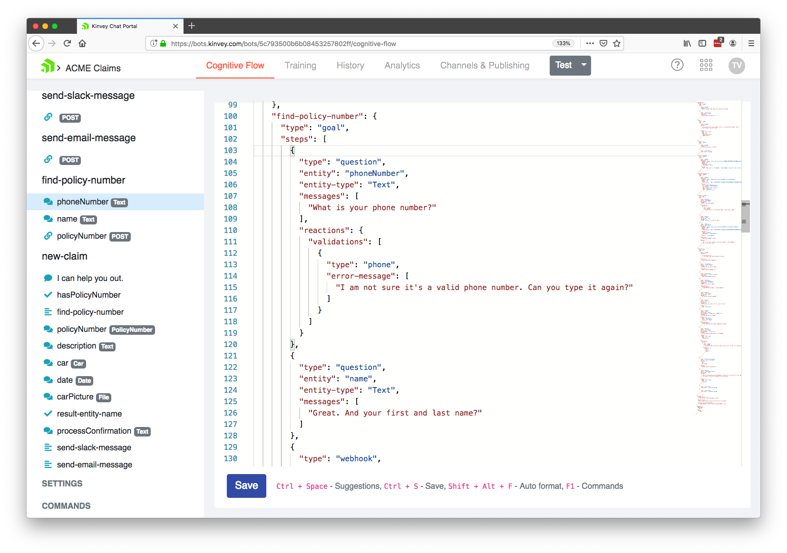
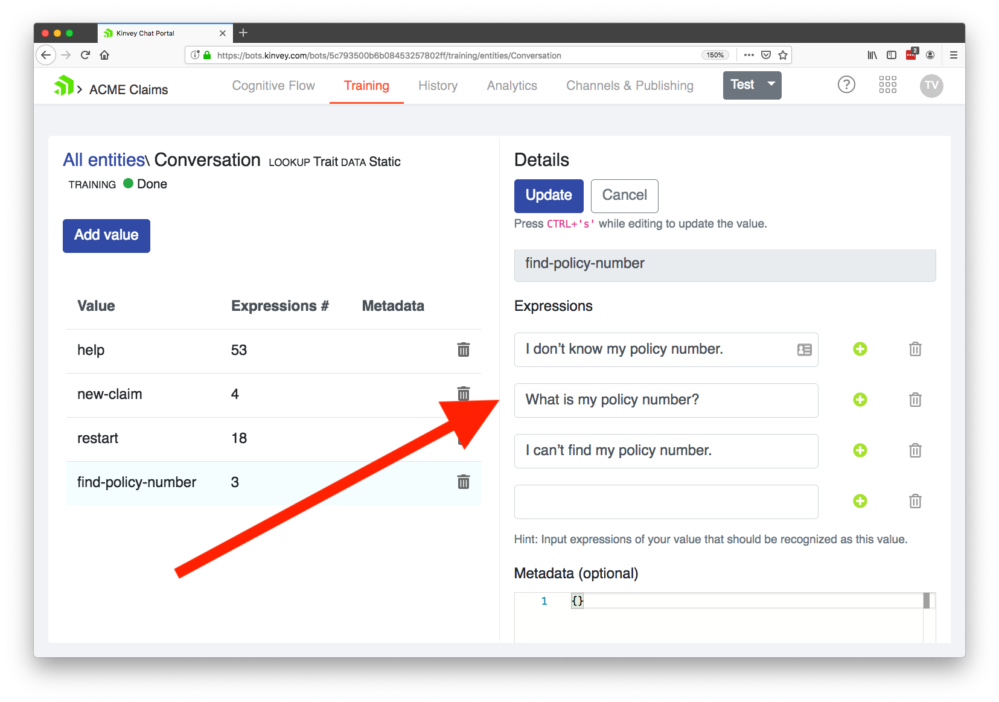
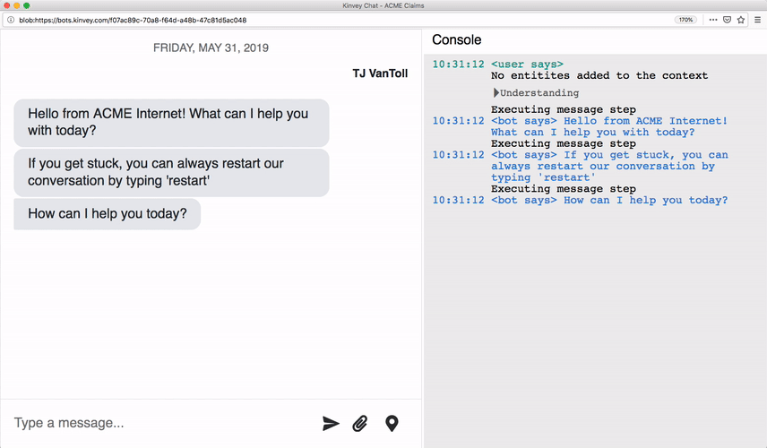
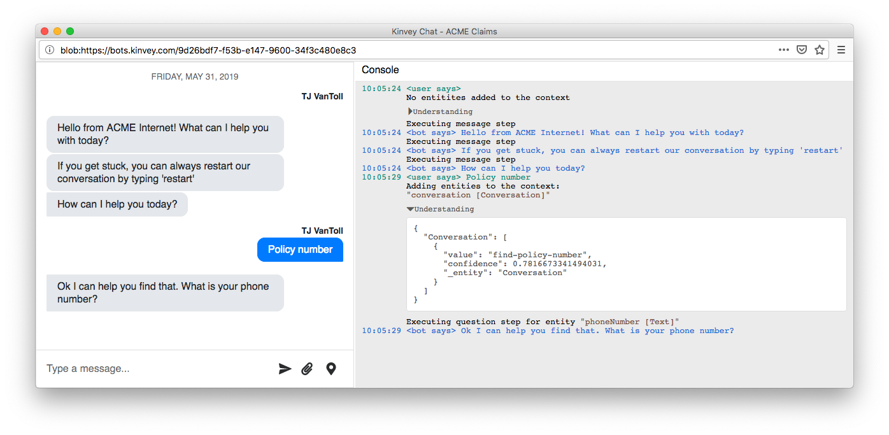
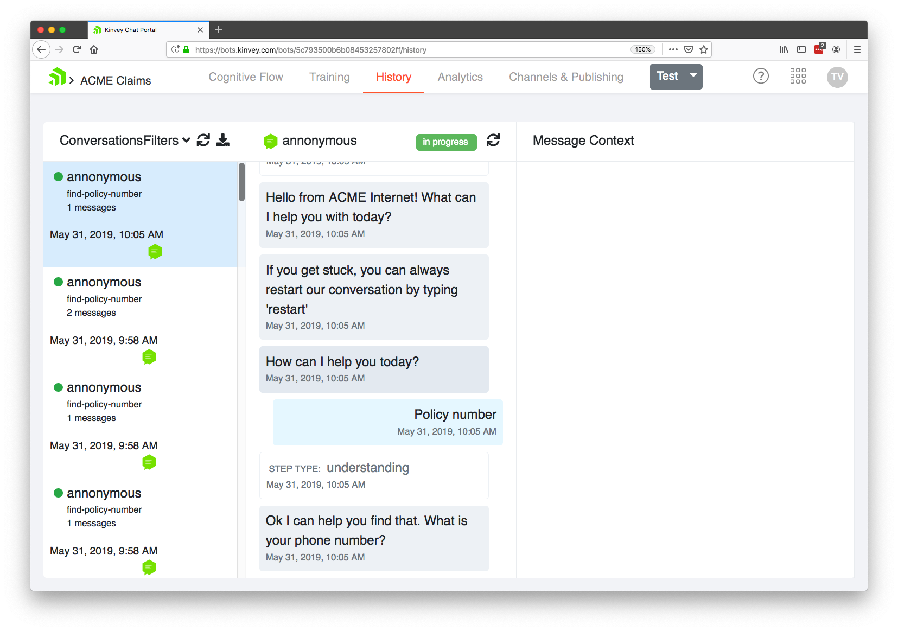
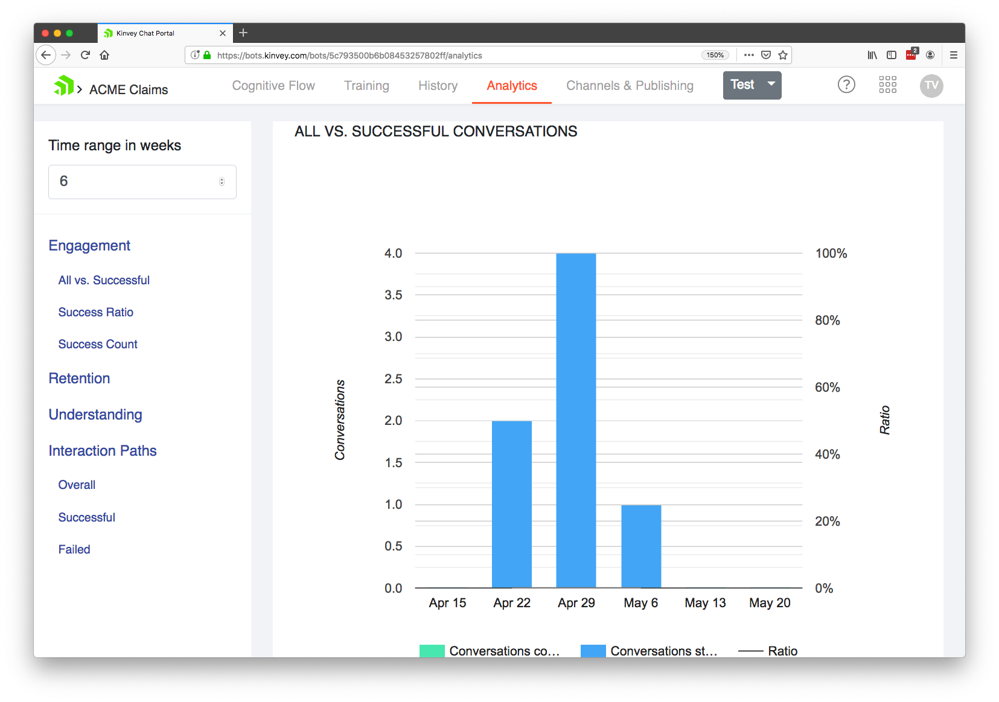
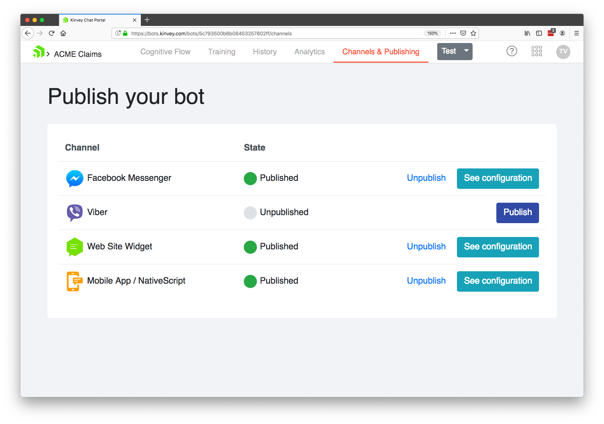

# Building a Customer Service Chatbot

Everyone has a list of companies they dealing with. For me it’s my internet service provider, as every interaction with them involves a multi-step phone call that takes at least 30 minutes to complete.

Poor support workflows like these don’t work for either the user or the company running the support process. The customer has to take an unreasonable amount of time out of their day, and the company has to hire staff to handle the never-ending stream of support requests.

Chatbots offer an appealing alternative to phone-based support workflows like these, as you have the ability to automate common support requests. This automation can reduce your staffing requirements, and help your users get the answers they need faster. In this article we’ll look at what chatbots are, how they can help in customer service workflows, and how you can get started today.

## What is a chatbot?

A chatbot is a computer program designed to mimic conversation with human users. Chatbot programs are often powered by rules and artificial intelligence that aim to provide as realistic of chat experience as possible.

Chatbots have surged in popularity in the last few years. In fact, Gartner predicts that [25% of customer service operations will use virtual customer assistants (aka chatbots) by 2020](https://www.gartner.com/en/newsroom/press-releases/2018-02-19-gartner-says-25-percent-of-customer-service-operations-will-use-virtual-customer-assistants-by-2020). This is up from 2% in 2017, so the rise of chatbots is staggering to say the least.

## How chatbots can help

Chatbots are especially appealing to organizations struggling to handle customer service workloads, as chatbots can help automate common requests that are handled by humans today.

For example, one of the most common reasons I call my internet service provider is to schedule a service appointment. There’s no reason a human has to be involved in this process, as today’s chatbot technology can easily be used to guide users through gathering the necessary information to book an appointment.

And automating processes like these can real substantial benefits. For instance, Gartner reports that organizations that implement a virtual customer assistant or chatbot [experience a reduction of up to 70 percent in call, chat and/or email inquiries, as well as increased user satisfaction](https://www.gartner.com/en/newsroom/press-releases/2018-02-19-gartner-says-25-percent-of-customer-service-operations-will-use-virtual-customer-assistants-by-2020).

Even better, as artificial intelligence has gotten easier to use, it now really easy to build your own chatbots to implement these sort of workflows. To show this, let’s look at you can get started with Progress Kinvey.

## How to get started

[Progress Kinvey](https://www.progress.com/kinvey) is a platform to help you build modern business apps fast. Kinvey includes a [comprehensive chatbot development platform named Kinvey Chat](https://www.progress.com/kinvey/chat), which is perfect for automating customer service workflows.

To get started with Kinvey Chat first [sign up for a free Kinvey account](https://console.kinvey.com/sign-up), and then head to the Kinvey Chat portal at [bots.kinvey.com](https://bots.kinvey.com).

> **NOTE**: In this article we’re going to take a high-level look at how developing bots with Kinvey Chat works. Check out our [comprehensive Kinvey Chat tutorial](https://www.progress.com/kinvey/chat/chatbot-tutorial-intro), if you’re looking for a step-by-step guide that gets into more detail.

What makes Kinvey Chat unique is its approach to helping you build bots, using what’s known as a cognitive flow. In Kinvey Chat you define your cognitive flow in JSON, which makes it really easy to visually see entire conversation flows in one place.

For example, suppose you work at an internet service provider, and one common thing users need is a way of looking up their policy number. Let’s also suppose you need to gather the user’s phone number and name to complete this request. Here’s an example of a Kinvey Chat bot that could fill this need.

Notice how it’s easy to visually see the flow of this conversation. The “find-policy-number” conversation includes three steps: the first gets the user’s phone number, the second gets the user’s name, and the third (shown below), sends that information to an HTTP endpoint and prints out the user’s policy number.

As you can see, Kinvey Chat makes it trivial to get started building your own chatbots, but what really sets Kinvey Chat apart is how easy it is to add artificial-intelligence-based training into your conversations.

For example, to initiate the above “find-policy-number” conversation, you must define a series of expressions that the user might type, which might look something like this.

As you might expect, when the user asks that chatbot one of these phrases verbatim, the chatbot initiates the appropriate policy number workflow. You can see this in action below.

But, if the user doesn’t type in a phrase verbatim, Kinvey Chat’s built-in artificial intelligence tries to match their input to its training data. For instance, suppose the user came into this chat and simply typed “policy number”.

As you can see, Kinvey Chat was able to determine the user’s likely intent, and the Chat testing console even includes a confidence metric (in this case 78%), to tell you how confident the chatbot was in its decision. 

Futhermore, Kinvey Chat includes a comprehensive set of history and analytic tools, allowing you to find conversation patterns, and to further refine your bots to maximize your successful conversations.

Once you have everything configured and ready to go, Kinvey Chat gives you a number of deployment options—meaning, you can deploy the same bot to your web sites, mobile apps, and even to chat platforms like Facebook Messenger.

> **NOTE**: Support for voice-based chat platforms, such as Amazon Alexa and Google Assistant are coming soon as well.

## Next steps

Overall, chatbots offer a new and compelling approach to help businesses deal with support backlogs. Kinvey Chat is a great place to get started with chatbots, as it offers an intuitive way to build bots that you can continue to evolve to meet your business needs.

If you’re interested in trying this out for yourself, first [sign up for a free Kinvey account](https://console.kinvey.com/sign-up). Next, go through our [comprehensive Kinvey Chat tutorial](https://www.progress.com/kinvey/chat/chatbot-tutorial-intro), which will help you go beyond the basics and start building real-world chatbots for your company.
