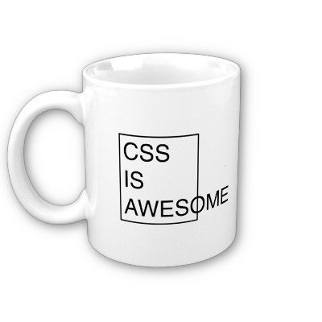
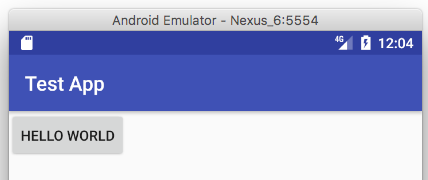
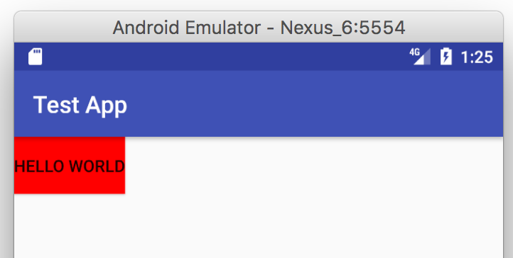
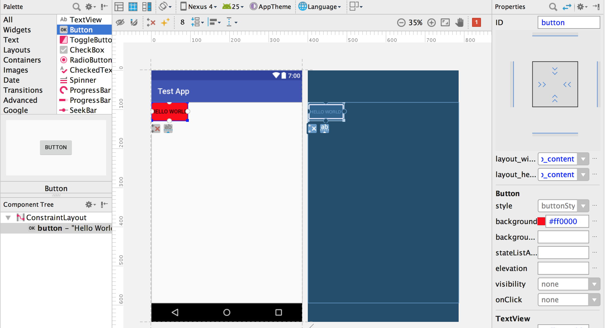
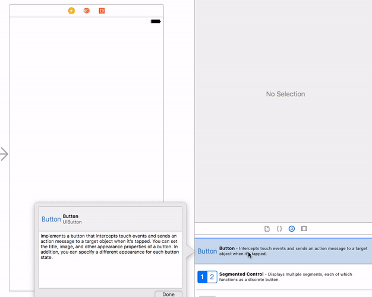
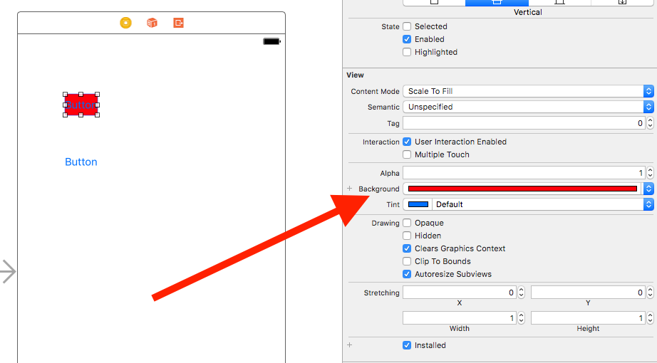

# A Love Letter to CSS

When I tell coworkers of my unabated love for CSS they look at me like I’ve made an unfortunate life decision.

> “Let’s sit down TJ, and talk about the poor choices you made during childhood that set you up for failure.”

Sometimes I feel that developers, some of the most opinionated human beings on the planet, can only agree on one thing: that CSS is totally the worst.

<https://twitter.com/SaraJChipps/status/864547782610362368> (embed)

One of the best ways to get consistent laughs at tech conferences is to take a jab at CSS, and CSS memes are so common that I’m contractually obligated to include two of them in this article.




But today I’m going to blow your mind. Today, I’m going to convince you that not only is CSS one of the best technologies you use on a day-to-day basis, not only is CSS incredibly well designed, but that you should be thankful—thankful!—each and every time you open a `.css` file.

My argument is relatively simple: creating a comprehensive styling mechanism for building user interfaces of all shapes and sizes is _startlingly_  hard, and every alternative to CSS is much worse. Like, it’s not even close.

To prove my point I’m going to start by taking you back in time.

## OMG, remember Java applets?

In college I built a few apps with this powerful, about-to-be-obsolete technology called Java applets. Java applets were basically Java apps that you could haphazardly embed in a browser using an `<applet>` tag. On a good day half of your users would have the correct version of Java installed on their machines, and they’d be able to run your apps successfully.


_A sample Java applet so you can take yourself back to the late 90s_

Java applets debuted in 1995 and started to get popular a few years later. If you were around in the late 90s, you’ll remember real debates about whether you should build your next great app using web technologies, or whether you should build using Java applets.

Like most technologies that let you create user interfaces, Java applets let you change the appearance of the controls that you place on the user’s screens. And because Java applets were seen as a plausible alternative to web development, the ease of styling controls in applets was sometimes compared to how you accomplish that same task on the web.

Java applets obviously didn’t use CSS, so how exactly do you style UI controls in a Java applet? Not easily. Here’s a code snippet from the [first Google result for “change button color Java applet”](http://www.java-examples.com/change-button-background-color-example).

```
/*
        Change Button Background Color Example
        This java example shows how to change button background color using
        AWT Button class.
*/
 
import java.applet.Applet;
import java.awt.Button;
import java.awt.Color;
 
public class ChangeButtonBackgroundExample extends Applet{
 
    public void init(){
            
        //create buttons
        Button button1 = new Button("Button 1");
        Button button2 = new Button("Button 2");
        
        /*
          * To change background color of a button use
          * setBackground(Color c) method.
          */
        
        button1.setBackground(Color.red);
        button2.setBackground(Color.green);
        
        //add buttons
        add(button1);
        add(button2);
    }
}
```

The first thing to note is that Java applets offer no real way to separate your logic and styling code, like you might do on the web with HTML and CSS. This will be a theme for the rest of this article.

The second thing to note is that this is a _lot_ of code to create two buttons and change their background colors. If you’re thinking something like _“wow, this approach seems like it would get out of control really quickly in a real-world app”_, then you’re starting to get an idea of why the Web won and Java Applets didn’t.

That being said I know what you’re thinking.

> “TJ, you’re not exactly winning me over by saying CSS styling is better than changing colors in Java code for applets. Way to set a high bar.”

Yes, because Java applet’s visual APIs aren’t exactly the gold standard of user interface design, let’s shift our attention to something developers actually build nowadays—Android apps.

## Why styling Android apps is hard

In some ways, Android is a modern, way-better version of the Java applets from years ago. Like Java applets, Android uses Java as a development language. But unlike Java applets, Android includes a series of conventions that makes building user interfaces a whole lot easier, and a lot more like building for the web.

On Android you define your user interface controls in an XML file, and interact with that markup in a separate Java file. It’s very similar a web app with markup in HTML files, and logic in separate JavaScript files.

Here’s what the markup of a very simple Android “activity” (basically a page) might look like.

```
<?xml version="1.0" encoding="utf-8"?>
<android.support.constraint.ConstraintLayout xmlns:android="http://schemas.android.com/apk/res/android"
    xmlns:app="http://schemas.android.com/apk/res-auto"
    xmlns:tools="http://schemas.android.com/tools"
    android:layout_width="match_parent"
    android:layout_height="match_parent"
    tools:context="com.telerik.tj.testapp.MainActivity">

    <Button
        android:id="@+id/button"
        android:layout_width="wrap_content"
        android:layout_height="wrap_content"
        android:text="Hello World" />

</android.support.constraint.ConstraintLayout>
```

This might look a bit arcane if you’re a web developer, but remember that a basic `index.html` has its share of quirks as well. What you’re seeing here is two UI components, an `<android.support.constraint.ConstraintLayout>` and an `<android.widget.Button>`, each with various attributes used for configuration. Just to give you a visual, here’s what this simple app looks like running on an Android device.



So to bring this discussion back to the topic of this article, how do you style these components? Much like the web’s `style` attribute, there are a variety of attributes you can apply to pretty much every Android UI component to change their appearance.

For example, if you want to change the background color of the previous example’s button, you can apply the `android:background` attribute. In the code below I apply that attribute so that the button appears red.

```
<Button
    android:id="@+id/button"
    android:layout_width="wrap_content"
    android:layout_height="wrap_content"
    android:text="Hello World"
    android:background="#ff0000" />
```



So far so good. Android Studio, Google’s recommended Android development environment, even provides a robust visual editor that makes configuring some of these common properties really easy. The image below shows Android Studio’s design view for this sample app. Note how you can easily configure properties such as “background” using the pane on the right-hand side of the screen.



Through things like the design view, Android makes the basics of applying styles to user interface controls very simple. But that being said, this is where the pro-Android portion of this article ends.

Real-world development requires you to go well beyond the basics, and, at least in my experience, this is where the verbosity of Android and the simplicity of CSS really starts to show. For example, suppose you want to create a collection of property name/value pairs that you can easy reuse, something kind of like CSS class names. You can kind of do that in Android, but it gets messy very quickly.

Android apps have a `styles.xml` file, and you can create XML chunks in that file that build on top of each other. For instance, suppose you wanted to make all your app’s buttons have red backgrounds. On Android you could use the following code to create a “RedTheme” style.

```
<style name="RedTheme" parent="@android:style/Theme.Material.Light">
  <item name="android:buttonStyle">@style/RedButton</item>
</style>

<style name="RedButton" parent="android:Widget.Material.Button">
  <item name="android:background">#ff0000</item>
</style>
```

And then apply a `android:theme="@style/RedTheme"` attribute to the top-level UI component you want this theme to apply to.

```
<android.support.constraint.ConstraintLayout
    ...
    android:theme="@style/RedTheme">
```

This works, and all buttons within elements with the `android:theme="@style/RedTheme` will indeed be red, but remember that all the above code is what you can accomplish in CSS using `button { background: red; }`. And it doesn’t get easier as your Android apps get more complex.

Non-trivial styling implementations on Android tend to involve either nested XML configuration files, or a bunch of Java code to create extensible components—neither of which fill with me with much joy. 

Consider animations. Android has some built-in animations, and those tend to be nice and easy to use, but custom animations must be implemented in code. (Here’s [an example](https://developer.android.com/training/animation/crossfade.html).) There’s no equivalent of something like CSS animations that lets you configure and manage your animations along with your app’s styling.

Consider media queries. Android lets you implement some CSS-media-query-like properties to your UI components, but it’s entirely done in markup, which doesn’t lend itself to reusability across pages or views. Just to give you a sense of what I’m talking about, this is the very first code example from Android’s documentation on [Supporting Multiple Screen Sizes](https://developer.android.com/training/multiscreen/screensizes.html). I’ll offer it below verbatim as some food for thought the next time you complain about CSS media queries.

```
<LinearLayout xmlns:android="http://schemas.android.com/apk/res/android"
    android:orientation="vertical"
    android:layout_width="match_parent"
    android:layout_height="match_parent">
    <LinearLayout android:layout_width="match_parent" 
                  android:id="@+id/linearLayout1"  
                  android:gravity="center"
                  android:layout_height="50dp">
        <ImageView android:id="@+id/imageView1" 
                   android:layout_height="wrap_content"
                   android:layout_width="wrap_content"
                   android:src="@drawable/logo"
                   android:paddingRight="30dp"
                   android:layout_gravity="left"
                   android:layout_weight="0" />
        <View android:layout_height="wrap_content" 
              android:id="@+id/view1"
              android:layout_width="wrap_content"
              android:layout_weight="1" />
        <Button android:id="@+id/categorybutton"
                android:background="@drawable/button_bg"
                android:layout_height="match_parent"
                android:layout_weight="0"
                android:layout_width="120dp"
                style="@style/CategoryButtonStyle"/>
    </LinearLayout>

    <fragment android:id="@+id/headlines" 
              android:layout_height="fill_parent"
              android:name="com.example.android.newsreader.HeadlinesFragment"
              android:layout_width="match_parent" />
</LinearLayout>
```

We could keep going through CSS features, but hopefully you’re seeing a pattern: you can accomplish styling tasks on Android, but the solutions almost always require a whole lot more code than it does on the Web.

And while it’s easy to gawk at some of Android’s XML verbosity, here’s the thing: it’s really, really hard to come up with a mechanism of styling UI components that’s clear, concise, and that works well in large-scale applications. Sure you could find CSS examples that are subjectively as bad as Android’s solutions in some cases, but having worked in both I’ll personally take CSS’s approach without a second thought.

To round out my argument let’s look at one other popular platform for rendering UI components—iOS.

## Why styling iOS apps is hard

iOS is a bit unique in the software development world, as it’s one of the only software platforms I know of where the majority of your UI development is done through a visual tool. That tool is called [storyboards](https://developer.apple.com/library/content/documentation/General/Conceptual/Devpedia-CocoaApp/Storyboard.html), and you use them within Xcode to build apps for iOS and macOS.

Just to give you an idea of what I’m talking about, here’s what it looks like to add two buttons to a view in an iOS app.



You don’t have to build iOS apps using storyboards, but the alternative is generating your most of your user interface in Objective-C or Swift code, and therefore storyboards are the development path that Apple recommends for iOS development.

> **NOTE** A complete discussion of when storyboard development is and isn’t appropriate for iOS apps is out of the scope of this article. If you’re interested, check out this [debate about the topic on Quora](https://www.quora.com/How-many-iOS-developers-dont-use-NIBs-Storyboards-and-Constraints).

So to bring the conversation back to the top of this article, how do you style this UI components? Well as you might expect from a visual editor, there are easy ways to configure individual properties of UI controls. For example, if you want to change the background color of a button, you can do so pretty easily from a menu on the right-hand side of the screen.



Much like Android, the task of applying individual properties is very simple. But also like Android, things get much harder when you move beyond the basics. For example, how do you make multiple buttons look the same in an iOS app? Not easily.

iOS has this concept of [outlets](https://developer.apple.com/library/content/documentation/General/Conceptual/Devpedia-CocoaApp/Outlet.html), which are essentially a mechanism for your Objective-C or Swift code to get a reference to user interface components. You can think of outlets sort of like `document.getElementById()` calls on the Web. To apply styling code to multiple components you need to get an explicit reference, or outlet, for each control on your storyboard you want to control, loop over them, and apply your changes. Here’s an example of what a Swift view controller that changes the background color of all buttons looks like.

```
import UIKit

class ViewController: UIViewController {

    @IBOutlet var buttons: [UIButton]!

    func styleButtons() {
        for button in self.buttons {
            button.backgroundColor = UIColor.red
        }
    }
    
    override func viewDidLoad() {
        super.viewDidLoad()
        self.styleButtons()
    }
}
```

The point here is not the specifics, so I’m not going to go over what each and every line of Swift code is doing here. The point is that styling multiple controls inevitably involves Objective-C or Swift code, something you can easily accomplish in CSS by defining a simple class name.

And as you might expect, more complex iOS styling tasks don’t involve less code as the styling challenges grow in complexity. For example creating a simple iOS “theme” involves [a whole bunch of `UIAppearance` APIs](https://www.raywenderlich.com/108766/uiappearance-tutorial), and dealing with multiple device types requires that you learn about the non-trivial topic of [auto layout](https://developer.apple.com/library/content/documentation/UserExperience/Conceptual/AutolayoutPG/).

To be fair, native developers can make somewhat similar arguments about there being some bizarre things about CSS, and to a certain extent they’re right. After all, whether we’re talking about the web, or a native platform such as iOS or Android, the task of positioning, styling, and animating user interface components, across all sorts of devices, is no easy task. So matter what system you use you’re inevitably going to need to make some tradeoffs, but having worked in a number of software ecyosystems CSS stands out to me for a number of reasons.

## Why CSS is more awesome

**CSS is amazingly flexible**. CSS lets you separate your app’s concerns so that your styling logic is completely separate from your app’s main logic. Or you could not do that. The [separation of concerns principal](https://en.wikipedia.org/wiki/Separation_of_concerns) has been a bedrock of web development for the last two decades, and CSS’s architecture is one of the main reasons this is possible.

But CSS is flexible enough that you could ignore all that advice and handle all your styling through application code, using a model that’s more similar to iOS or Android development. Because CSS is so flexible, frameworks like React were able to take this approach without needing to change the CSS language or architecture in any way.

Android and iOS have relatively strict mechanisms when it comes to styling your user interface controls, on the web you have options, and you pick the option that best suits your application’s needs.

**CSS is a simple language, and therefore an excellent compiler target.**

Perhaps one of the most common complaints of CSS is the language’s inability to keep up with developer demand for new features, such as CSS variables and selector nesting. But because CSS is a relatively simple language—think about it, at a high level all you have is a collection of selectors, with one to many rules assigned—the greater web community was able to innovate on top of CSS with tools like SASS and LESS.

Tools like SASS and LESS have not only improved developer productivity, they’ve also helped influence the CSS specification itself, with features like CSS variables now [being available in most major browsers](http://caniuse.com/#feat=css-variables).

And CSS’s simplicity enables more than just transpilers. Every theme builder or drag & drop building tool you see on the web is possible because of just how easy CSS is to output. The concept of a theme builder isn’t even a thing in the iOS or Android worlds, because the tool’s output would need to be a complete iOS or Android app (so instead you’ll see things like app templates).

Here’s one more: you know how your browser’s developers tools are awesome and let you easily tweak the look and feel of your application? This is again CSS’s simplicity at work. iOS and Android have nothing that come close to comparing to the visual development tools we have on the web.

To give you one more example of what’s CSS simplicity makes possible: on the [NativeScript project](https://docs.nativescript.org/) we were able to allow developers to [style native iOS and Android controls using subset of CSS](https://docs.nativescript.org/ui/styling), for example using `Button { color: blue; }` to style a `UIButton` or `android.widget.Button`. We were only able to do this because CSS is a flexible and easy to parse language.

**CSS lets you do some amazing stuff.**

And finally, the single biggest reason CSS is awesome is the sheer range of things developers have been able to build with a language of simple selectors and rules. The internet is full of 10 AMAZING CSS-ONLY EXAMPLES to prove this point, but I’m going to embed a few of my favorites right here because I can.

<p data-height="265" data-theme-id="0" data-slug-hash="YPJWaz" data-default-tab="css,result" data-user="waynedunkley" data-embed-version="2" data-pen-title="Full CSS 3D Solar System" class="codepen">See the Pen <a href="http://codepen.io/waynedunkley/pen/YPJWaz/">Full CSS 3D Solar System</a> by Wayne Dunkley (<a href="http://codepen.io/waynedunkley">@waynedunkley</a>) on <a href="http://codepen.io">CodePen</a>.</p>
<script async src="https://production-assets.codepen.io/assets/embed/ei.js"></script>

<p data-height="265" data-theme-id="0" data-slug-hash="whxbF" data-default-tab="css,result" data-user="fbrz" data-embed-version="2" data-pen-title="CSS 3D Bending Effect - Page Flip" class="codepen">See the Pen <a href="http://codepen.io/fbrz/pen/whxbF/">CSS 3D Bending Effect - Page Flip</a> by Fabrizio Bianchi (<a href="http://codepen.io/fbrz">@fbrz</a>) on <a href="http://codepen.io">CodePen</a>.</p>
<script async src="https://production-assets.codepen.io/assets/embed/ei.js"></script>

<p data-height="265" data-theme-id="0" data-slug-hash="gajVBG" data-default-tab="css,result" data-user="r4ms3s" data-embed-version="2" data-pen-title="STAR WARS  AT-AT Walker" class="codepen">See the Pen <a href="https://codepen.io/r4ms3s/pen/gajVBG/">STAR WARS  AT-AT Walker</a> by r4ms3s (<a href="http://codepen.io/r4ms3s">@r4ms3s</a>) on <a href="http://codepen.io">CodePen</a>.</p>
<script async src="https://production-assets.codepen.io/assets/embed/ei.js"></script>

So does CSS have its quirks? Sure. The box model is a bit weird, flexbox isn’t the easiest thing to learn, and it’d be great if features like CSS variables were available years ago.

Every layout system has its warts, but CSS’s flexibility, simplicity, and pure power have stood the test of time, and have helped to make the web the powerful development platform it is today. I’m happy to defend CSS against developers that make snarky jokes at the language’s expense, and I encourage you to do the same.