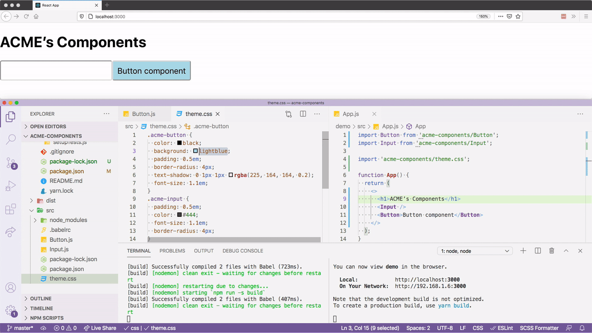
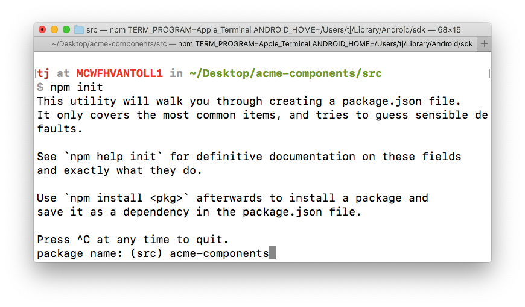
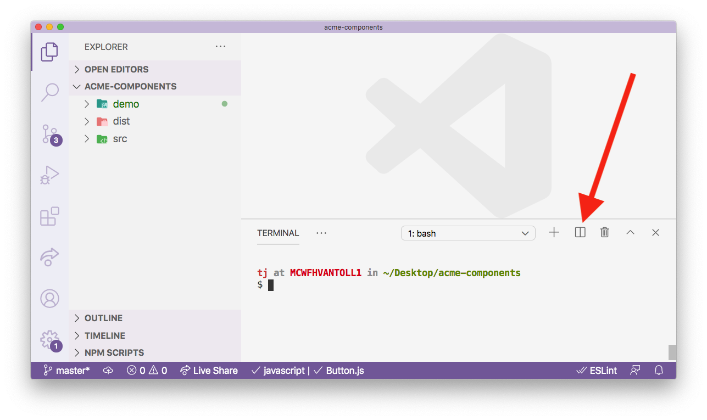
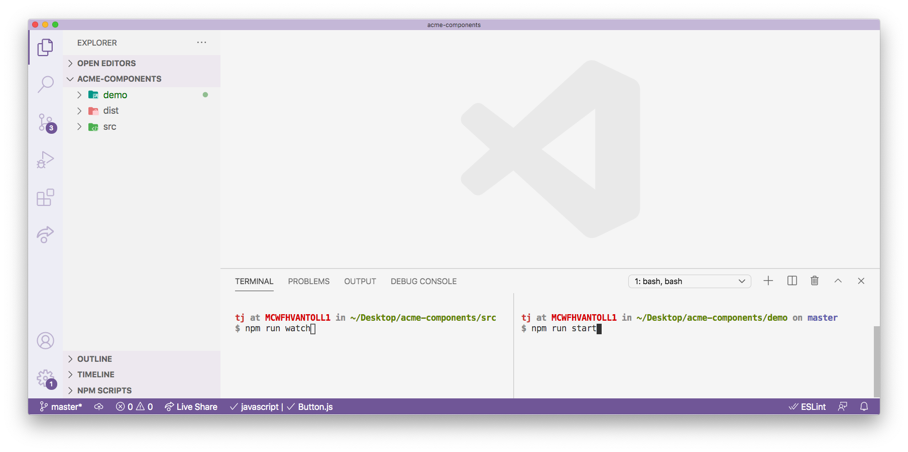

# The Ultimate Guide to Building a UI Component Library—Part 2: Establishing a Development Environment

_This article is the second part in a series on how to build a complete UI component library for your organization. If you missed part 1, you might want to [check it out](https://www.telerik.com/blogs/ultimate-guide-to-building-ui-component-library-part-1-plan) before continuing._

In part 1 of this series you learned how to plan a UI component library, including how to choose which components to start with, as well as which JavaScript framework to use. With that prep out of the way—it’s time to start coding 🙂

In this article I’m going to walk you through an opinionated set of steps to get a component library up and running fast. My focus will be on helping you set up a development environment that allows to develop your components, and also see those components running in a live app. I’ll also cover builds, so that you can have a built npm package ready to distribute to other developers at your company.

If you follow the tutorial to the end, you’ll have a development environment for building your library that looks like this.



Let’s get started.

## Getting started

For the purposes of this article we’re going to assume we work for a fictitious company named ACME, and we’re creating a handful of components that ACME will use throughout their organization.

Let’s start by creating the npm package that will contain all of ACME’s components. To do so, run the following commands from your terminal or command prompt to create a directory for your project.

```
mkdir acme-components
cd acme-components
```

Next, create two new subdirectories named `demo` and `src`.

```
mkdir demo src
```

The idea here is the `src` directory will contain all of your company’s components, aka the actual component source code, and the `demo` directory will contain a demo app that lets you test your components in a live running app.

At this point you should have a folder structure that looks like this.

```
acme-components
├── demo
└── src
```

In the next two sections we’ll look at how to start writing your components, and then how to build a demo app so that you can test your components as you code them.

Let’s start with the components themselves.

## Creating your components

Let’s return to your project, which currently has the following directory structure.

```
acme-components
├── demo
└── src
```

In this section you’ll start building in the `src` directory, which will contain the components’ source code.

To start, go ahead and `cd` into the `src` directory on your terminal or command prompt.

```
cd src
```

Next, run `npm init` to generate a `package.json` file for your components.

```
npm init
```

The `init` command will start by prompting you for a package name. When it does, type in `"acme-components"`, as otherwise npm will set the package name to `src` (because `src` is the name of the folder you’re in).



Feel free to accept the defaults for all subsequent questions, which you can do by hitting the Enter key without typing anything.

Now that you have your `package.json` file, let’s create a few new files that you’ll use to write your components. While still in your `src` directory, create three new files, `Button.js`, `Input.js` and `theme.css`. Your directory structure should now look like this.

```
acme-components/
├── demo
└── src
    ├── Button.js
    ├── Input.js
    ├── package.json
    └── theme.css
```

Next, open your three new files and paste in the code below.

> **NOTE**:
> * These components are purposefully simple so we can focus on the workflow. You’ll build more complex components in the third part of this article series.
> * If you use Angular or Vue, you would write these components with those Angular or Vue syntax, and not the React syntax you see below.

``` JavaScript
// Button.js
import React from 'react';

const Button = (props) => {
  const { type } = props;
  return (
    <button
      type={type || "submit"}
      className="acme-button">
      {props.children}
    </button>
  )
}

export default Button;
```

``` JavaScript
// Input.js
import React from 'react';

const Input = (props) => {
  return (
    <input {...props} className="acme-input" />
  )
}

export default Input;
```

``` CSS
/* theme.css */
.acme-button {
  color: #444;
  background: lightblue;
  padding: 0.5em;
  border-radius: 4px;
  text-shadow: 0 1px 1px rgba(0, 0, 0, 0.2);
  font-size: 1.1em;
}
.acme-input {
  padding: 0.5em;
  color: #444;
  font-size: 1.1em;
  border-radius: 4px;
}
```

The idea here is that these Button and Input components are standard components to be used throughout ACME, and the `theme.css` file provides a way to style these components (and any future ones) consistently.

As a next step, you’ll need to be able to run these components in a browser, and to do that you’ll need to run them through a build.

## Building your components

Pretty much every modern JavaScript framework requires you to use a build step to process your source files. For React, you need a build process that can take syntax like JSX, and turn it into code that the browser can interpret and run.

Although you have options for how you do this compilation, the most standard way to handle this in React is with [Babel](https://babeljs.io/). In this section you’ll add Babel to your component project, and use it to build an npm package that you distribute to other applications.

Your first step is to install Babel in your project, which you can do by running the following command in your terminal or command prompt. (And make sure you’re in your project’s `src` directory when you run this.)

```
npm install --save-dev @babel/cli @babel/core @babel/preset-env @babel/preset-react
```

Along with Babel itself, this command also installs [Babel presets](https://babeljs.io/docs/en/presets), which are sets of configuration options. In this case you’re using `@babel/preset-env`, which is a common set of JavaScript defaults, and `@babel/preset-react`, which is a common set of React defaults.

> **TIP**: There is also a [popular Babel preset for Vue](https://cli.vuejs.org/core-plugins/babel.html#configuration).

To tell Babel to use these presets, go ahead and create a `.babelrc` file within your `src` directory.

```
acme-components/
├── demo
└── src
    ├── .babelrc   <-- HERE
    ├── Button.js
    ├── Input.js
    ├── package.json
    └── theme.css
```

Next, open your newly created `.babelrc` file and paste in the following configuration.

``` JavaScript
{
  "presets": ["@babel/react", "@babel/env"]
}
```

> **TIP**: You can read about [more advanced ways of configuring Babel](https://babeljs.io/docs/en/config-files) on their docs.

With the presets in place, you now have everything you need to build your components with Babel. To do so, open your `package.json` file, and replace the current `"scripts"` key-value pair with the code below.

``` JavaScript
"scripts": {
  "build": "babel *.js *.css package.json --out-dir ../dist --copy-files"
},
```

Let’s break down what’s happening here. First, adding a new script to your `package.json` file gives you a new command that you can use with `npm run`—meaning, after you save your `package.json` with this change, you can run your new `"build"` script by executing `npm run build`.

The build command itself tells Babel to operate on all JavaScript files (`*.js`), all CSS files (`*.css`), and your `package.json` file. The command says to place your built files in a new `dist` directory (`--out-dir ../dist`), and to copy all the files it operates on to that new directory (`--copy-files`).

> **NOTE**: By default Babel copies all JavaScript files it builds to the `--out-dir`. The `--copy-files` option is necessary for copying over your CSS files and `package.json` file.

To see this for yourself, go ahead and run your build by executing the following command in your terminal or command prompt.

```
npm run build
```

After the build runs, you should have a new `dist` directory that contains built versions of your JavaScript files.

```
acme-components
├── demo
├── dist
│   ├── Button.js
│   ├── Input.js
│   ├── package.json
│   └── theme.css
└── src
    └── ...
```

At this point you have an npm package that’s ready to distribute to other applications at your organization. However, what you have is still far from ideal. There’s currently no way to test these components in a real app, which makes it difficult to develop new features without a lot of manual steps.

Let’s look at how to create a development environment for these reusable components.

## Building your demo

In this section you’re going to add a demo app to your project for testing your components. You can build your demo app with any technology you’d like, but for this guide we’ll use [Create React App](https://github.com/facebook/create-react-app) so that we have a standard React environment.

> **TIP**: If your components will be used in multiple types of environments, it might make sense to create multiple demo apps so you can test your components in each. In that case I’d recommend creating multiple demo directories with descriptive names, for example `demo-react` and `demo-angular`.

To get started, return to your terminal or command prompt and `cd` into your project’s root directory.

```
acme-components <-- go here
├── demo
├── dist
│   └── ...
└── src
    └── ...
```

Next, run the following command, which uses Create React App to build a new app named “demo”.

```
npx create-react-app demo
```

In order to use your components in this new demo app, you’ll have to install them. To do that, start by switching to your `demo` directory.

```
cd demo
```

Next, run the following command (which we’ll discuss momentarily), to do the actual install.

```
npm install ../dist
```

When you use `npm install` you almost always want to install npm packages from the global npm registry. For example, `npm install react` tells npm to look for a package named "react" in its registry, and to install it into your application.

However, npm can also install local packages (aka a directory on your local machine that has a `package.json` file in it), and you can do so by passing npm a path to the directory to install. So in this case, `npm install ../dist` tells npm to install the package in `../dist` in your demo app.

And if you open your demo application’s `package.json` file, you’ll see a new dependency for `"acme-components"`.

```
"acme-components": "file:../dist",
```

This link gives you the ability to use your components and CSS files in your demo app. To do so, open your project’s `demo/src/App.js` file, and replace its contents with the following code.

``` JavaScript
import Button from 'acme-components/Button';
import Input from 'acme-components/Input';

import 'acme-components/theme.css';

function App() {
  return (
    <>
      <h1>ACME’s Components</h1>
      <Input />
      <Button>Button component</Button>
    </>
  );
}

export default App;
```

To see this code running in your browser, return to your terminal or command prompt, and execute `npm run start`, which is Create React App’s built-in way of starting up your application.

```
npm run start
```

After the command finishes, open your browser and go to `http://localhost:3000/`, where you should see your components in an app that looks like this.


At this point you now have a set of reusable components, as well as a demo app for testing these components in a live app. This is pretty powerful, but we still have one last big problem to solve.

Consider what happens if you make an update to your `src/Button.js` file. Currently, in order to see that change, you’d have to `cd` into your `src` folder and re-execute `npm run build`. Although you _can_ do this, it’s a very manual and error-prone process.

Let’s look at how you can optimize this.

## Establishing a development workflow

In this section you’ll learn how to set up a development workflow that lets you see component updates live in your demo app.

To do so you’ll set up a watcher that listens for changes to files in your `src` directory, and then triggers a build that updates your project’s `dist` directory.

To implement this, first `cd` back into your project’s `src` directory.

```
acme-components
├── demo
├── dist
│   └── ...
└── src <-- go here
    └── ...
```

Next, use the command below to install the [`npm-watch` package](https://github.com/M-Zuber/npm-watch).

```
npm install --save-dev npm-watch
```

npm-watch is a simple utility package that lets you watch files and take action when those files change. To use it you’ll need to make two changes in your project’s `src/package.json` file.

First, replace package’s existing `"scripts"` with the code below, which adds a new `watch` command that runs `npm-watch`.

```
"scripts": {
  "build": "babel *.js *.css package.json --out-dir ../dist --copy-files",
  "watch": "npm-watch"
},
```

Next, use the code below to add a new top-level "watch" key-value pair.

```
"watch": {
  "build": {
    "patterns": ["*"],
    "extensions": "css, js"
  }
},
```

The first bit of configuration `"watch": "npm-watch"` makes it so `npm run watch` invokes your newly installed `npm-watch` command.

The second bit of configuration tells `npm-watch` what files to watch, and what command to run when those files change. In this case, the above configuration tells `npm-watch` to run your `build` command anytime `.css` or `.js` files change within any directory.

To test this, return to your terminal or command prompt, ensure you’re still in your project’s `src` directory, and then execute `npm run watch`.

```
npm run watch
```

With the watcher running, open your `src/theme.css` file and change `color: #444` to `color: black`. When you save your change, your watcher should detect the change, trigger a new build, and copy the updated file to `dist/theme.css`.

Now that you have a watcher in place for your components, let’s put everything together. Your end goal is to have a workflow that allows you to develop your components while seeing them running in a live application. To do that you’re going to need to have two terminals running—one that watches your components, and another that runs your demo application. Specifically, you need to have `npm run watch` executing in your `src` directory, while also having `npm run start` executing in your `demo` directory.

There are many ways you can accomplish this depending on your terminal or command prompt client, but personally I like setting up this workflow entirely within Visual Studio Code.

Visual Studio Code has an [integrated terminal](https://code.visualstudio.com/docs/editor/integrated-terminal) that you can open with `Ctrl` + <code>`</code> (backtick). With the terminal open, you can use the button below to split the terminal, which creates two terminal instances that appear side by side.



With this split in place, you can then navigate the left terminal to your `src` directory and run `npm run watch`, and then you can navigate your right terminal to your `demo` directory and run `npm run start`.



Next, you can use VS Code’s [side-by-side editing](https://code.visualstudio.com/docs/getstarted/userinterface#_side-by-side-editing), and open your component files in editing column that lines up with your `src` terminal, and open your demo files in an editing column that lines up with your `demo` terminal.


With all of these steps in place, you now have the ability to change files in either your components or your demo, and to see those changes instantly.


I like using Visual Studio Code because I really like the side-by-side interface for both editing and terminals, but you can accomplish the same workflow in other environments. As long as you can come up with some way to execute `npm run watch` in your `src` directory and `npm run start` in your `demo` directory, you’re good to go.

## Wrapping up

In this article you learned an opinionated way to set up a complete development environment for a component library.

But real-world component libraries are complex, and require more than a project with a Button and Input component. Therefore, in the last article in this series we’ll discuss building more complex components, including a discussion on whether you should build your own components from scratch, add dependencies on existing libraries, or do some combination of both. We’ll also discuss the options you have for unit testing and documenting your components as well.

Stay tuned 🙂

