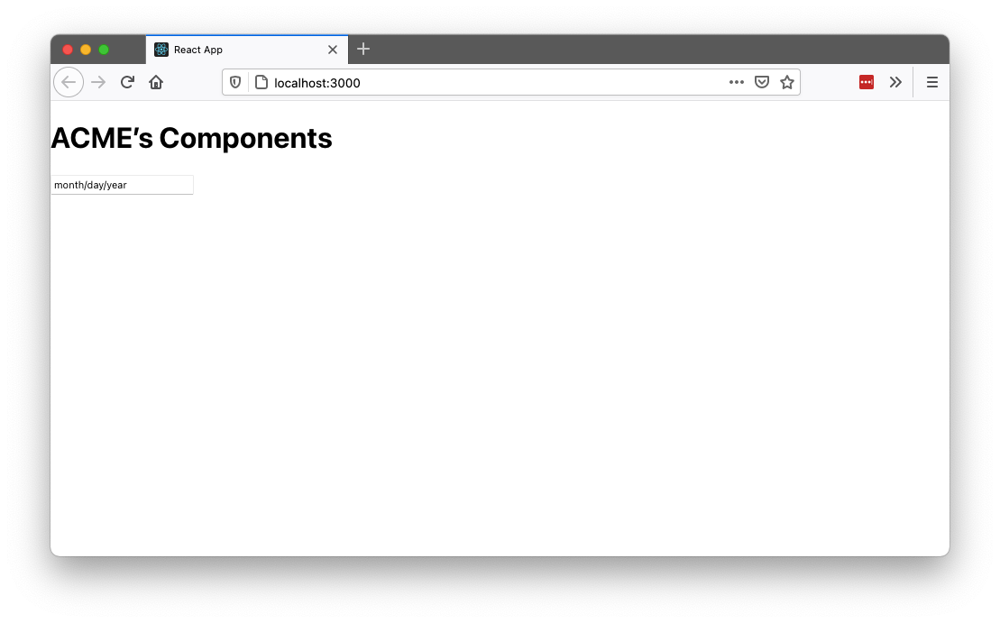
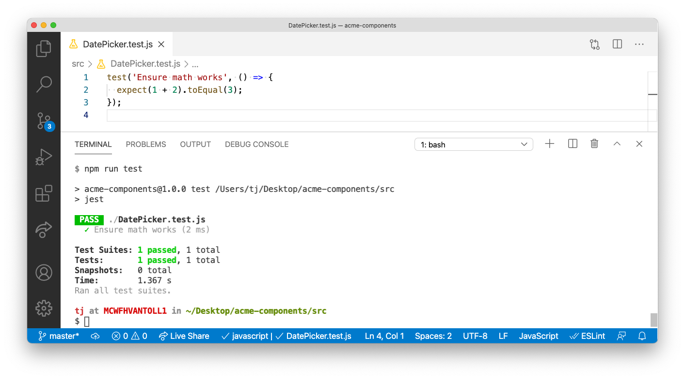
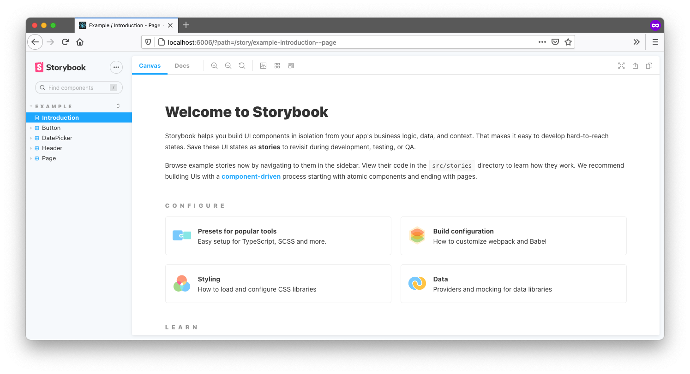

# The Ultimate Guide to Building a UI Library for Your Company—Part 3: Building Robust Components

*This article is the third part in a series on how to build a complete UI component library for your organization. If you found this article first, you might want to read [part 1](https://www.telerik.com/blogs/ultimate-guide-to-building-ui-component-library-part-1-plan) and [part 2](https://www.telerik.com/blogs/ultimate-guide-to-building-ui-component-library-part-2-environment) before continuing.*

In part 1 of this series you learned how to plan a UI component library, and in part 2 you learned how to set up a development environment for coding components for your library.

In this article we’ll shift our focus to writing the UI components themselves. We’ll start with a discussion of when to code components by hand, and when to build on top of third-party libraries. Next, we’ll set up a unit testing structure for your components and write a few tests with it. And finally, we’ll wrap up showing a few options you have for writing documentation for your components.

There’s a lot to discuss, so let’s start by talking about when to code components yourself, and when to use third-party libraries.

## When to use third-party libraries

Building a full component library for a large company often involves building dozens (if not hundreds) of UI components. Building these components can take a ton of time, especially once you move beyond basic components like inputs and buttons, and start needing advanced components like datepickers, autocompletes, dialogs, and more.

You can make your life easier by using existing UI component libraries, as there are plenty of high-quality datepickers, autocompletes, and dialogs available on npm. But adding dependencies on other libraries comes with downsides, like larger client-side bundles for your users to download, and having less control over how much you can customize your components.

So what do you do? I have a few recommendations when you’re deciding whether to use a library or not.

### Recommendation #1: Lean towards libraries for complex components

Most front-end developers can build a high-quality button component in a reasonable amount of time.

But almost all developers will struggle to build a calendar or data grid—and even if they’re capable, it’ll take them weeks or months to build one with the features your company needs. (And even more time if you want those components to be accessible, well-documented, and so on.)

Although it can be tempting to take the time to build a complex component yourself, in most situations you’re better off leveraging the work another library has already done, and saving your time for working on features that are unique to your business.

There are exceptions to this. For example, if you work for a company that builds calendars, it might make sense to build your own calendar control, as it’s critical to your business and something you probably need to heavily customize. But for most situations it makes sense to depend on existing libraries for complex components.

### Recommendation #2: Wrap your third-party dependencies

The UI component library we’ve been building in this article series is designed to be used by multiple other applications at a company. As such, when you add a dependency to your component library, you’re also adding that dependency to every application that uses your library.

This coupling can be problematic if you want to switch libraries in the future, as any dependency change in the component library forces all consumers of the library to update as well.

You can mitigate this risk by wrapping all third-party controls you use with your own API. For example, suppose you want to use a DatePicker component from a hypothetical LibraryX component library. 

Instead of encouraging your company’s apps to use LibraryX’s DatePicker directly, which would look something like this.

```tsx
import { DatePicker as LibraryDatePicker } from 'LibraryX';

<DatePicker />
```

You could instead create a wrapper of the third-party control in your component library, and have your company’s apps use that wrapper instead. Here’s an example of what that wrapper might look like.

``` tsx
import { DatePicker as LibraryXDatePicker } from 'LibraryX';

const DatePicker = (props) => {
  return (
    <LibraryXDatePicker {...props} />
  );
}

export default DatePicker;
```

In addition to making it easier to switch libraries in the future, this approach also gives you a consolidated place to control all DatePicker controls throughout your organization. For example, if your design team suddenly decides all your company’s datepickers should use a different date format, you now have a single place where you can make that change and affect all of your organization’s datepicker controls.

### Recommendation #3: Limit the number of third-party libraries you use.

Although there are many advantages of using third-party libraries, one downside is that it’s often difficult to style third-party components to match your company’s design guidelines.

This problem gets harder with each new library you introduce, as each library has its own author, and therefore also its own approach to determining what a component’s markup structure, CSS class names, and so on that a component uses.

Because of that, when possible, I encourage developers to lean towards libraries that offer multiple components that use the same design (for example Material-UI, Ant Design, KendoReact), over trying to bring in several small components that you have to manually figure out how to make work together.

There are exceptions to this rule as well. If you find a bespoke component on npm that solves your problem perfectly, and you can’t find any alternatives in bigger libraries—then absolutely use it. But in general it makes sense to limit the number of dependencies you use when possible.

### Recommendation #4: Look for libraries that have accessibility built in

Building a corporate component library gives you a single place to implement UI accessibility for your controls. That is, if you build accessible components in your library, all of your corporate apps that use your library get those accessibility benefits “for free”—which is awesome!

That does mean it’s important to get accessibility right in your components though. And therefore, it’s also worth making sure that any library you use adheres to accessibility best practices.

With these recommendations for working with UI component libraries in mind, let’s now look at how to put this guidance into practice, and build a component for your library that uses a third-party dependency.

## How to build components that use third-party libraries

If you’ve followed along through [part 2 of this article series](https://www.telerik.com/blogs/ultimate-guide-to-building-ui-component-library-part-2-environment), you should have a small component library set up that includes a Button and Input component.

Button and inputs are relatively easy, so let’s now look at how to build a DatePicker, which is a far more complex component that most companies won’t want to build themselves.

There are lots of React datepickers out there, but for this article we’ll use the [KendoReact DatePicker](https://www.telerik.com/kendo-react-ui/components/dateinputs/datepicker/), both because KendoReact provides a [wide variety of components](https://www.telerik.com/kendo-react-ui/components/), and because [KendoReact adheres to numerous accessibility standards](https://www.telerik.com/kendo-react-ui/components/accessibility/). That being said, the advice in this section applies for other third-party components you might want to build on top of.

> **NOTE**: KendoReact is a [paid library](https://www.telerik.com/kendo-react-ui/pricing/) that requires a license to use in production. You can [start a free 30-day trial](https://www.telerik.com/download-login-v2-kendo-react-ui) if you want to complete this article’s steps without licensing warnings.

To start, remember that your component library current has a structure that looks like this.

```
.
├── demo
│   └── ...
└── src
    ├── Button.js
    ├── Input.js
    ├── theme.css
    └── ...
```

To start, go ahead and create a new `DatePicker.js` file in your `src` directory.

```
.
├── demo
│   └── ...
└── src
    ├── Button.js
    ├── DatePicker.js <-- create this
    ├── Input.js
    ├── theme.css
    └── ...
```

Next, go ahead and paste in the following code, which creates a new DatePicker component that wraps the KendoReact DatePicker control.

``` tsx
import React from 'react';
import { DatePicker as KendoDatePicker } from '@progress/kendo-react-dateinputs';

const DatePicker = (props) => {
  return (
    <KendoDatePicker {...props} />
  )
}

export default DatePicker;
```

When you save this file you might gets errors in your editor, as you’re referencing a `@progress/kendo-react-dateinputs` package that doesn’t exist yet. To fix that, head to your terminal and first `cd` into your `src` directory (if you haven’t already).

```
cd src
```

Next, run the following command to install `@progress/kendo-react-dateinputs` as well as its dependencies.

```
npm install @progress/kendo-react-dateinputs @progress/kendo-licensing @progress/kendo-react-intl
```

With that dependency installed, you’re good to run your build to compile your new DatePicker component. To do so, make sure you’re still in your `src` directory, and run the following command.

```
npm run build
```

This command will compile your new component, and place the outputted file in your `dist` directory.

To use this component in your demo, open your `demo/src/App.js` file, and replace its contents with the code below.

```tsx
import DatePicker from 'acme-components/DatePicker';
import 'acme-components/theme.css';

function App() {
  return (
    <>
      <h1>ACME’s Components</h1>
      <DatePicker />
    </>
  );
}

export default App;
```

Next, return to your terminal or command prompt, and change to your project’s `demo` directory.

```
cd ../demo
```

After that, install the same KendoReact DatePicker dependencies.

```
npm install @progress/kendo-react-dateinputs @progress/kendo-licensing @progress/kendo-react-intl
```

And finally, while still in your `demo` directory, use the following command to run your demo app.

```
npm run start
```

> **NOTE**: You might get warnings about using KendoReact without a license at this step. If they annoy you, you can remove them by [setting up your KendoReact license key](https://www.telerik.com/kendo-react-ui/my-license/).

When you run this command you’ll see your new DatePicker in the browser, which shows up as an input, but doesn’t look quite like a datepicker yet.



If you use your browser’s developer tools you’ll see that KendoReact is in fact working, as a number of class names are now applied to your input, but there’s no CSS being applied to your markup.


To fix that, let’s next look at how to implement CSS for this control.

## How to implement CSS with third-party libraries

Because of that, when using third-party libraries I recommend encapsulating third-party CSS within your library. The reason being—you want other applications to use your library with as few steps as possible. To see what I mean, let’s go ahead and implement the CSS of KendoReact’s DatePicker in your component library.

To start, head back to your terminal or command prompt and navigate back to your `src` folder.

```
cd ../src
```

Next, install KendoReact’s default theme using the command below.

```
npm install @progress/kendo-theme-default
```

> **TIP**: KendoReact also [offers both bootstrap and material themes](https://www.telerik.com/kendo-react-ui/components/styling/) that you can experiment with later.

With the theme installation out of the way, your next step is to import the theme’s CSS in your library. Remember from the previous article in this series that you have a `src/theme.css` file, which currently looks like this.

``` css
.acme-button {
  color: #444;
  background: lightblue;
  padding: 0.5em;
  border-radius: 4px;
  text-shadow: 0 1px 1px rgba(0, 0, 0, 0.2);
  font-size: 1.1em;
}
.acme-input {
  padding: 0.5em;
  color: #444;
  font-size: 1.1em;
  border-radius: 4px;
}
```

This file is the logical place to import KendoReact’s CSS, but how exactly do you do that? My first instinct when trying this was to use the following syntax.

``` css
@import '@progress/kendo-theme-default/dist/all.css';

.acme-button { ... }
.acme-input { ... }
```

But if you try this approach your demo app won’t recognize this syntax, and your app will crash with the following error.

```
Error: Can't resolve '@progress/kendo-theme-default/dist/all.css' in '/Users/tj/Desktop/acme-components/dist'
```

The problem is CSS on its own doesn’t know how to import files from `node_modules`. To do that you either need to introduce something like webpack, which [allows you to import files from `node_modules` with a `~` character](https://stackoverflow.com/questions/49518277/import-css-from-node-modules-in-webpack), or you need to use a CSS preprocessor like SASS.

For this article we’ll use SASS, as I prefer to avoid more complicated tooling like webpack unless I absolutely need it, and also because KendoReact itself uses SASS, so by using SASS for our library we can optimize the CSS that we import.

To install SASS first you need to install it in your `src` folder (as well as a small `copyfiles` utility you’ll use to move some files around).

```
npm install sass copyfiles --save-dev
```

Next, you need to alter your scripts in your `package.json` file so that they now run the SASS compiler. To do so, replace the existing `"scripts"` block in your `src/package.json` file with the code below.

```
"scripts": {
  "build": "npm run build-js && npm run build-css",
  "build-js": "babel *.js --out-dir ../dist --copy-files && copyfiles *.json ../dist",
  "build-css": "sass theme.scss theme.css && copyfiles *.css ../dist",
  "watch": "npm-watch"
},
```

This change adds a new `"build-css"` script that tells SASS to compile a `theme.scss` file into a `theme.css` file. This change also updates the `"build"` script, so that it triggers both a JavaScript and CSS build.

With that update in place, next, update your `src/package.json` file’s `"watch"` configuration with the code below.

```
"watch": {
  "build-js": {
    "patterns": [
      "*.js"
    ],
    "extensions": ".js"
  },
  "build-css": {
    "patterns": [
      "*.scss"
    ],
    "extensions": ".scss"
  }
},
```

This change tells the watcher we set up in the previous article to additionally watch for changes to `.scss` files, and when it detects a change, to trigger the `"build-css"` script.

With the configuration complete, next find your `src/theme.css` file and rename it to `theme.scss`, as it will now contain SASS code. And then finally, open your `theme.scss` file, and place the following import right on top.

``` css
@import "node_modules/@progress/kendo-theme-default/scss/datetime/_index.scss";
```

This line of code imports CSS from KendoReact’s default theme. And because KendoReact uses SASS itself, this code is also smart enough to import just the `datetime` styles, so that you don’t have to ship the CSS for all of KendoReact’s components to your users.

And with that your SASS changes are complete. To try this all out first run a new build of your code by running the following command from your `src` directory.

```
npm run build
```

Next, return to your `demo` directory.

```
cd ../demo
```

And then start your app up to try out your new styles.

```
npm run start
```

If all went well, you should see your DatePicker component styled correctly.


What’s cool here is your demo app didn’t have to worry about CSS at all—all it needed to do is import `acme-components/theme.css`, and the rest happened automatically.

And really this entire component setup is pretty powerful. If you’ve followed along to this point in the article, you now have a workflow that allows you to write components that can either be hand written, or wrap third-party libraries—and you can make that decision on a component-by-component basis. Pretty cool!

With this setup in place, let’s next discuss one of the other trickier aspects of any development environment—unit testing.

## How to unit test your components

Unit testing is important in any environment, but it’s especially important in component libraries, as the controls you build are intended to be used throughout your entire organization—so you want to make sure they work correctly.

The good news is the setup we’ve built so far is a pretty standard JavaScript environment, so you can test your components using pretty much any unit-testing tool you have in mind.

For this article we’ll use both [Jest](https://jestjs.io/) and [Testing Library](https://testing-library.com/), as they’re a pretty standard testing setup for React applications, and Testing Library is especially well suited to testing UI components.

To try out unit testing in our library, first open your `src/DatePicker.js` file and replace its contents with the following code.

```jsx
import React from 'react';
import { DatePicker as KendoDatePicker } from '@progress/kendo-react-dateinputs';

const DatePicker = ({ className, ...otherProps }) => {
  className = className ? ('acme-datepicker ' + className) : 'acme-datepicker';
  return (
    <KendoDatePicker
      {...otherProps}
      className={className} />
  )
}

export default DatePicker;
```

This change adds a `className` prop that allows users to pass in custom CSS class names, as well as a bit of logic that ensures that an `acme-datepicker` class name ends up on the DatePicker regardless of whether a custom class name gets passed or not.

This logic is the exact sort of thing that’s great to verify with a unit test.

To do that, let’s start by installing both Jest and Testing Library. You can do that by heading back to your terminal or command prompt, and running the following commands.

```
npm install jest @testing-library/react --save-dev
```

Next, open your `src/package.json` file and add a new `"test": "jest"` command to your `"scripts"` configuration. The full `"scripts"` block should now look like this.

```
"scripts": {
  "build": "npm run build-js && npm run build-css",
  "build-js": "babel *.js --out-dir ../dist --copy-files && copyfiles *.json ../dist",
  "build-css": "sass theme.scss theme.css && copyfiles *.css ../dist",
  "test": "jest",
  "watch": "npm-watch"
},
```

With this configuration you can now run `npm run test` to trigger Jest, which finds and runs your tests for you.

To get our tests started, create a new `src/DatePicker.test.js` file with the following contents, which are currently simple so you can see how Jest works.

```jsx
test('Ensure math works', () => {
  expect(1 + 2).toEqual(3);
});
```

Next, return to your terminal and run your new `npm run test` command, which tells Jest to find and run all of your unit tests. In this case, Jest should find your new `DatePicker.test.js` file and show the following successful result.



> **NOTE**: You can [learn more about how Jest works on its documentation](https://jestjs.io/docs/tutorial-react).

Now that you have Jest in place to run your tests, let’s look at how you can use Testing Library to test your components themselves. Return to your `src/DatePicker.test.js` file, and replace its contents with the following code.

```jsx
import React from 'react';
import { render, screen } from '@testing-library/react';
import DatePicker from './DatePicker';

describe('DatePicker tests', () => {
  test('Ensure acme class name gets added', () => {
    render(<DatePicker />);
    expect(screen.getByRole('group').classList.contains('acme-datepicker'));
  });

  test('Ensure additional class names get added', () => {
    render(<DatePicker className="foo" />);
    const picker = screen.getByRole('group');
    expect(picker.classList.contains('acme-datepicker'));
    expect(picker.classList.contains('foo'));
  });
});
```

Whereas Jest provides the ability to run your tests, as well as methods like `describe()` and `test()` to organize them, Testing Library provides a number of methods that makes testing your components themselves easy.

For example, Testing Library’s `render()` method allows you to “render” a component, and then find individual pieces of your component with methods like `screen.getByRole()` and perform checks. The code above uses this approach to render a DatePicker with and without a `className` prop, and ensures the `"acme-datepicker"` class name is in place under both scenarios.

> **NOTE**: A full tutorial on Testing Library is out of scope for this article, but if you want to learn more about Testing Library, I highly recommend reading through this [Testing Library introduction from Robin Wieruch](https://www.robinwieruch.de/react-testing-library).

To run these new tests return to your terminal or command prompt, and again run `npm run test`. Jest should find your new tests automatically and they should both pass.


> **NOTE**:
> * If you get a `Cannot find module 'react'` error you need to run `npm install react react-dom` to install React as a dependency of your library.
> * If you get KendoReact licensing warnings and want to remove them, you’ll need to [add the KendoReact license key](https://www.telerik.com/kendo-react-ui/my-license/) to your `src` folder.

At this point you have a complete testing setup in place for your components. When you write new components and want to test them, all you need to do is create a new `ComponentName.test.js` file. Pretty cool!

And at this point you now have a development workflow for building, demoing, and unit testing components for your company or organization. That just leaves us with one final topic—figuring out how to document your components so others know how to use them.

## How to document your components

Documentation is important for any set of reusable components, as developers need to figure out how to install and use your components, or they’ll never get started building anything.

Exactly how you document your components sometimes depends on your company’s policies and infrastructure, but in this section I’ll walk you through two documentation implementations that have worked for me for you to consider.

### Documentation option #1: Turn your demo app into documentation

The development environment we’ve built throughout this article series includes a full demo app for testing your components in a real app. The great thing about that demo app is that it’s just a web app, so there’s nothing stopping you from turning your demo app into your components’ documentation, and then deploying that demo app somewhere at your organization.

To give you a quick example of what’s possible, open your `demo/src/App.js` file and replace its contents with the following code.

```jsx
import React from 'react';
import DatePicker from 'acme-components/DatePicker';

import 'acme-components/theme.css';

function App() {
  return (
    <>

<h1>DatePicker</h1>

<h2>Default usage</h2>

<pre>
{`
import DatePicker from 'acme-components/DatePicker';
<DatePicker />
`}
</pre>

<DatePicker />

<h2>Setting a default value</h2>

<pre>
{`
import DatePicker from 'acme-components/DatePicker';
<DatePicker defaultValue={new Date(2022, 0, 1)} />
`}
</pre>

<DatePicker defaultValue={new Date(2022, 0, 1)} />

<p>The ACME DatePicker is built on top of the KendoReact DatePicker, and you can <a href="https://www.telerik.com/kendo-react-ui/components/dateinputs/datepicker/">refer to KendoReact’s documentation</a> for additional properties that you can for customization.</p>

    </>
  );
}

export default App;
```

Next, return to your terminal or command prompt and navigate to your `demo` directory (if you aren’t there already).

```
cd ../demo
```

And then use `npm run start` to run your demo app with these changes.

```
npm run start
```

You should see a UI that looks something like this.


This is some basic documentation that shows other developers how your DatePicker component works. You could additionally show installation instructions, best practices, design guidelines—or really, anything you’d like.

And this is just a really basic implementation to give you a sense of what’s possible. Most documentation sites like this create one page per component, as well as some means to navigate between components (tabs, a drawer, etc).

Regardless of how you choose to write the documentation, there’s one big benefit of treating your demo app as documentation: you’re forced to update documentation as you update the components themselves—which in my opinion is better than putting that same documentation on something like a wiki that you’ll constantly forget to update.

Let’s look at one additional option you have for documentation that builds on these same principles.

### Documentation option #2: Use Storybook

[Storybook](https://storybook.js.org/) is an open-source tool that provides a number of tools for building component documentation. The Storybook approach is similar to what we discussed in the previous section—the difference being: Storybook makes building the documentation site itself super easy.

If you want to try it out, return to your terminal or command prompt, make sure you’re still in your `demo` directory, and run the following command to install Storybook.

```
npx sb init
```

This command takes a while to run, as Storybook is building a new `stories` folder in your `demo/src` directory, complete with sample documentation to help teach you how Storybook works.

To try it, you can next run `npm run storybook`, and then visit `http://localhost:6006` in your web browser. You should see something like this.



To get a sense of how Storybook works, create a new `stories/DatePicker.js` file and paste in the following code.

``` jsx
import React from 'react';
import DatePicker from 'acme-components/DatePicker';
import 'acme-components/theme.css';

export default {
  title: 'Example/DatePicker',
  component: DatePicker,
};

export const Default = () => <DatePicker />
export const Disabled = () => <DatePicker disabled />
```

This file creates two “stories”, or ways of using your DatePicker component—one for the default usage of the DatePicker, and one for a DatePicker when it’s disabled.

After you save this change you can return to `http://localhost:6006` to see these new stories in a live app.


The idea behind Storybook is you have a place to test all or your stories, or ways of using your components, and you could then distribute this Storybook to other developers so they can also learn how your components work.

Plus, I’m just showing the basics here. Storybook has [an entire section of its site devoted to building documentation sites](https://storybook.js.org/docs/react/writing-docs/introduction), my favorite part being [Storybook’s integration with MDX](https://storybook.js.org/docs/react/writing-docs/mdx), which is [an interesting technology that lets you write JSX in Markdown documents](https://mdxjs.com/).

Overall Storybook is definitely a project that’s worth checking out as an option for documenting components for your company.

## Wrapping up

Phew, it’s been quite a ride. If you’ve finished this whole article series you’ve learned how to plan out a component library, how to set up a full development environment, and—in this article—how to build, test, and document your components.

Even though I’ve tried to cover most common topics and questions, building component libraries is challenging and complex. With that in mind, if any questions came up while reading through this series feel free to reach out in the comments, or to me personally on Twitter ([@tjvantoll](https://twitter.com/tjvantoll)). And best of luck building your library 😃

> **NOTE**: The [full source code for this article series is available on GitHub](https://github.com/tjvantoll/acme-components)—feel free to use that as a reference, or as a starting point for your own component library.
