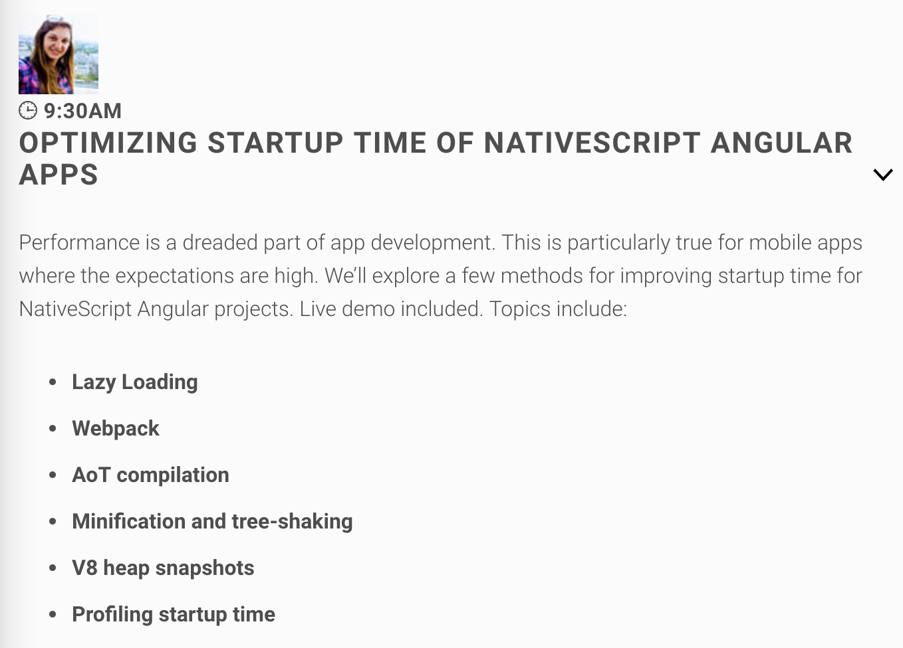
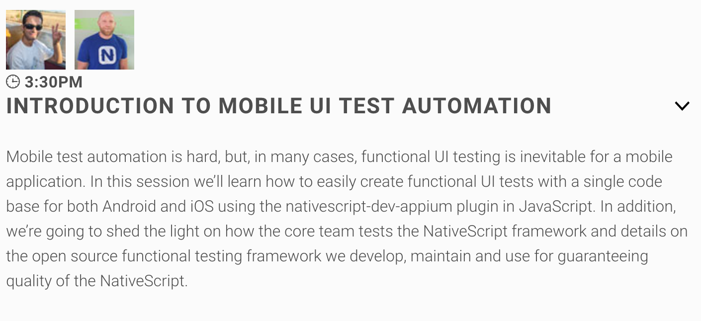
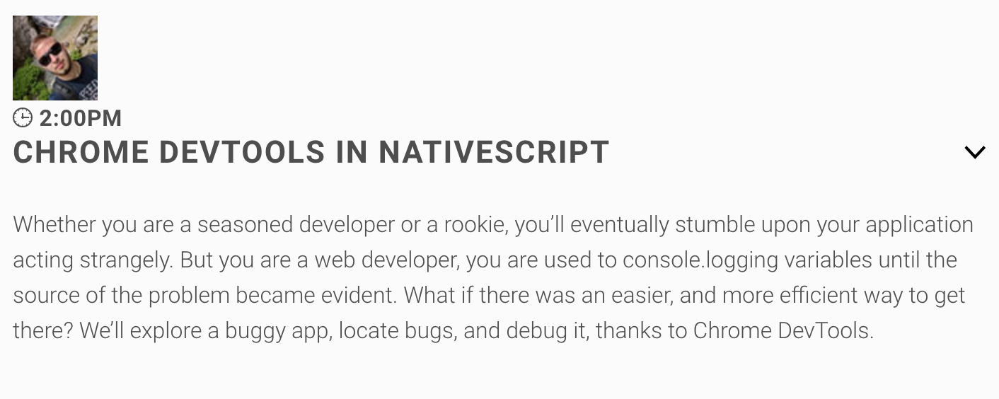
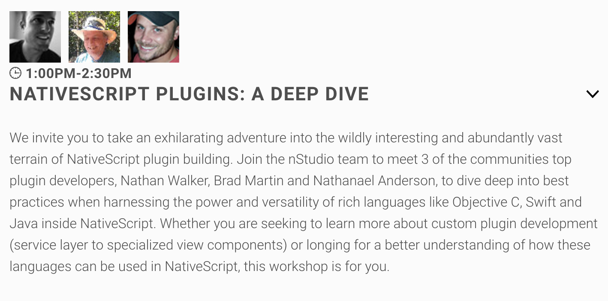
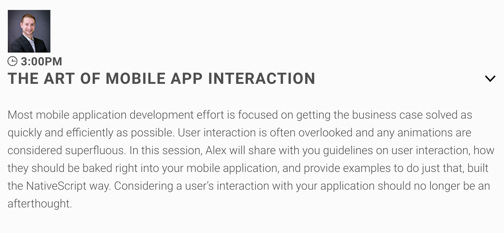

# The Speaker List is Now Final for NativeScript Developer Day

We’re happy to announce that the speaker list is now final for [NativeScript Developer Day](http://developerday.nativescript.org/) 🎉

What is NativeScript Developer Day? I’m glad you asked! NativeScript Developer Day is a two-day gathering of NativeScript developers in New York City on September 18th–19th. It’s _the_ place to learn about the latest and greatest in NativeScript from speakers on the NativeScript team and throughout the NativeScript community.

> **NOTE**: Yes, yes, we named a two-day event NativeScript Developer _**Day**_. Naming things is hard ya’ll.

Now that the speaker list is final, there are some sessions you need to know about.

## NativeScript Engineering

What better way to learn about NativeScript than from the team behind the tool itself? We’re happy to announce that a large contingent of the NativeScript engineering team will be making the trip all the way from Sofia, Bulgaria. And as such, NativeScript Developer Day attendees will get to hear these awesome talks.

Stanimira Vlaeva is #1 contributor to the NativeScript webpack plugin, and one of the leading contributors on the NativeScript Angular integration. NativeScript Developer Day attendees will get to hear tips on optimizing your apps from her first hand.

Vasil Chimev and Svetoslav Tsenov are both members of the NativeScript QA teams, which help test the crazy number of templates, samples, and demos that the NativeScript team maintains. NativeScript Developer Day attendees will hear tips on how to automate tests from a team that does it full time.

Peter Kanev is one of the leading contributors to the NativeScript Android runtime, and helped lead the [implementation of the Chrome DevTools for NativeScript Android apps](https://www.nativescript.org/blog/chrome-devtools-integration). NativeScript Developer Day attendees will learn tips & tricks about the DevTools from Peter himeself.

## NativeScript Community

While it’s exciting to hear from NativeScript engineering, I’m equally excited to hear from people throughout the NativeScript community that will be in New York for the event.

If you’ve built a NativeScript app before, you’ve almost certainly used a plugin built by Nathan Walker, Nathanael Anderson, or Brad Martin. Seriously, these three have well over 60 plugins to their names, and Nathan started what is today the [official NativeScript plugin seed](https://docs.nativescript.org/plugins/building-plugins).

These three will be speaking on day one of NativeScript Developer Day, or “deep dive” day. That means you get 90 minutes on plugins from three of the most prolific NativeScript plugin authors.

> **NOTE**: Brad and Nathanael are both giving day two sessions as well. Brad will be speaking about NativeScript layouts, and Nathanael will be speaking about NativeScript performance tips. You won’t want to miss either!

Alex Ziskind is the most prolific author of NativeScript video content, with NativeScript courses on Lynda, Pluralsight, and of course the [awesome nativescripting.com courses](https://nativescripting.com/).

At Developer Day Alex Ziskind will be talking about a topic I’m very interested in—animations! Alex has recorded an entire Pluralsight course on the topic, and I’m very much looking forward to see him cover the topic in person.

## More

There’s not enough space in this article to cover all the great sessions at NativeScript Developer Day.

I mean, I didn’t even get to talk about an Angular deep dive from Jeff Whelpley and Rob Laverty, or a TypeScript and ES6 deep dive from Daniel Zen, or hearing first-hand hybrid and native experiences from Nic Raboy.

The entire NativeScript DevRel team will be speaking as well, so you’ll also get to hear from Jen Looper, Sebastian Witalec, Rob Lauer, and yours truly 😄

## Join us!

All of these speakers will be in one place for this special two-day event, making NativeScript Developer Day a great place to meet, greet, and network with people from across the NativeScript community.

So what are you waiting for? Tickets are just $100, so [grab yours while we still have open seats](http://developerday.nativescript.org/) 🎉