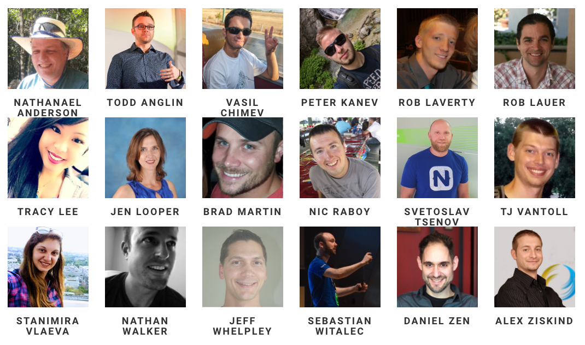

# The Speaker List is Now Final for NativeScript Developer Day

We’re happy to announce that the speaker list is now final for [NativeScript Developer Day](http://developerday.nativescript.org/) 🎉

What is NativeScript Developer Day? I’m glad you asked! NativeScript Developer Day is a two-day gathering of NativeScript developers in New York City on September 18th–19th. It’s _the_ place to learn about the latest and greatest in NativeScript from speakers on the NativeScript team and throughout the NativeScript community.

> **NOTE**: Yes, yes, we named a two-day event NativeScript Developer _**Day**_. Naming things is hard ya’ll.

Now that the speaker list is final, there are some sessions you need to know about.

## NativeScript Engineering

What better way to learn about NativeScript than from the team behind the tool itself? We’re happy to announce that a large contingent of the NativeScript engineering team will be making the trip all the way from Sofia, Bulgaria. And as such, NativeScript Developer Day attendees will get to hear these awesome talks.

![](stanimira.pn