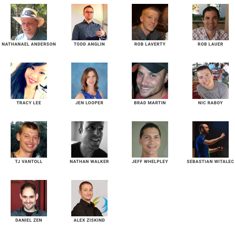
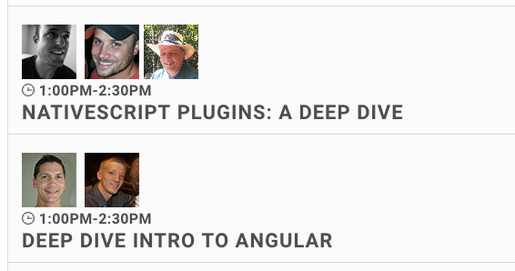
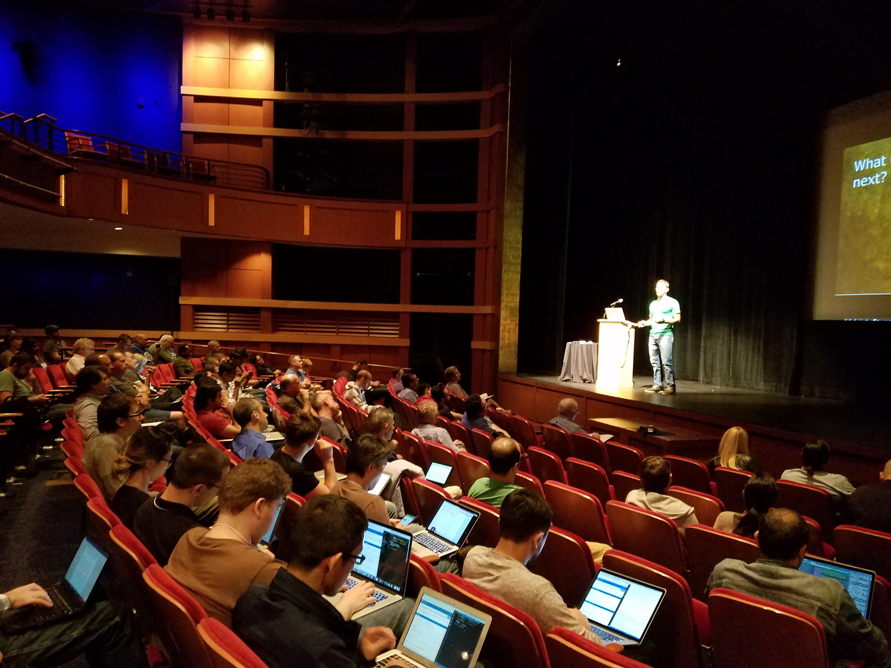

# Announcing NativeScript Developer Day 2017

[NativeScript Developer Day](http://developerday.nativescript.org/) is back and bigger than ever. This year our one-of-a-kind event will take place at the [gorgeous Scandinavia House](http://www.scandinaviahouse.org/) on **September 18th and 19th** in New York City.

So what can you expect? A lot!

## Great talks

While our speaker list isn’t 100% final, we already have 15+ confirmed speakers with names you might recognize from the NativeScript team and the NativeScript community.

NativeScript Developer Day is a 2-day event with content for both seasoned and novice mobile developers.

The first day features [a series of deep dives](http://developerday.nativescript.org/#schedule) that give you the chance to learn about NativeScript from industry experts. We have already have deep dives on ES6, TypeScript, Angular, code sharing, and NativeScript plugins on the calendar—and we’ll have a few more to announce in the coming days.

The second day features 30-minute sessions from prominent members of the JavaScript and NativeScript communities, as well as from the NativeScript team. Learn how to optimize your app’s startup times, how to use native iOS and Android APIs, how to use the new Chrome DevTools integration, how to write effective tests, and a whole lot more.

## Networking opportunities

There’s never been a better chance to get to know the people NativeScript project. With NativeScript team members and community members flying in from around the country and around the world, Developer Day is a rare chance to interact with the people you normally only see in Slack channels and GitHub issues.

## New York!

And finally, the conference venue is on Park Avenue in Manhattan—within a few blocks of the Empire State Building, and within a mile-and-a-half of Central Park.

## Get your ticket now

So what are you waiting for? Tickets are **just $100** for this one-of-a-kind two-day event. [Get yours now!](http://developerday.nativescript.org/#registration)

Any if you have any other questions about the event, let us know in the comments.