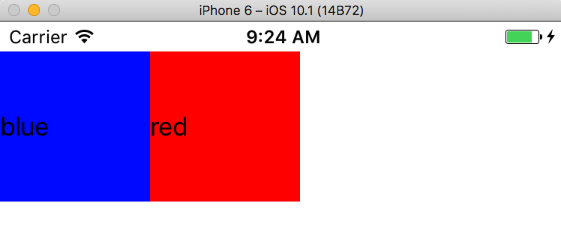
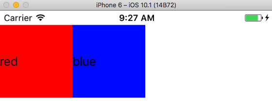
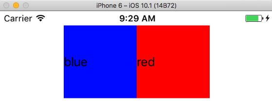
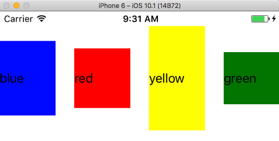
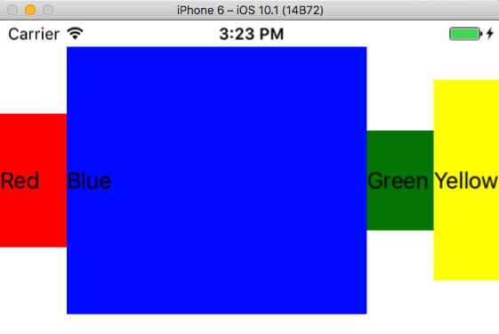

Learning layouts in NativeScript can be tricky if you’re coming from a web development background. NativeScript’s 2.4 release included a familiar layout mechanism to help ease the learning curve for web developers—flexbox!

NativeScript’s FlexboxLayout was designed to be as similar to the web’s flexbox implementation as possible, while still allowing you to build highly performant native Android and iOS user interfaces. Let’s look at how the new layout system works.

## How flexbox works

Like all layout systems, flexbox is a way of aligning UI components on the screen. Flexbox is best known for providing an elegant syntax for arranging child components both horizontally and vertically.

To see what this looks like in action, check out the following flexbox example in NativeScript. 

```
<FlexboxLayout>
  <Label text="blue" backgroundColor="blue" height="100" width="100"></Label>
  <Label text="red" backgroundColor="red" height="100" width="100"></Label>
</FlexboxLayout>
```

If you come from a web development background you can think of a `<FlexboxLayout>` as the equivalent of a `<div>` with `display: flex` applied—the result is the same. In this case NativeScript applies the default flexbox action and renders these two labels side by side.



From there though you can apply any of the [numerous flexbox configuration options](https://css-tricks.com/snippets/css/a-guide-to-flexbox/) to alter how NativeScript positions these components. For instance, with the `order` attribute you can flip which box appears first. In the following code the `order` attribute on the two `StackLayout` components flips their rendering order.

```
<FlexboxLayout>
  <Label order="2" text="blue" backgroundColor="blue" height="100" width="100"></Label>
  <Label order="1" text="red" backgroundColor="red" height="100" width="100"></Label>
</FlexboxLayout>
```



The `justifyContent` attribute lets you choose how the components are spaced horizontally. In the following example the two labels are horizontally centered by setting the `justifyContent` attribute to `"center"`.

```
<FlexboxLayout justifyContent="center">
  <Label text="blue" backgroundColor="blue" height="100" width="100"></Label>
  <Label text="red" backgroundColor="red" height="100" width="100"></Label>
</FlexboxLayout>
```



The `alignItems` attribute lets you choose how the components are spaced vertically, which is especially handy when you have components with variable heights. In the following example the various labels are set to a variety of heights to show the effect of `alignItems` in action.

```
<FlexboxLayout alignItems="center" justifyContent="space-between">
  <Label text="blue" backgroundColor="blue" height="100" width="75"></Label>
  <Label text="red" backgroundColor="red" height="80" width="75"></Label>
  <Label text="yellow" backgroundColor="yellow" height="140" width="75"></Label>
  <Label text="green" backgroundColor="green" height="70" width="75"></Label>
</FlexboxLayout>
```



There are a lot more flexbox properties than the handful I introduced above, and you can use them to position elements in a multitude of ways. The definitive flexbox resource is Chris Coyier’s _[A Complete Guide to Flexbox](https://css-tricks.com/snippets/css/a-guide-to-flexbox/)_, and it’s a great reference whenever you’re trying to figure out how to accomplish a task using flexbox. [Flexbox Froggy](http://flexboxfroggy.com/) is a fun interactive game that teaches the various flexbox properties and values. You may find it useful if you’re new to flexbox.

For the most part using flexbox in NativeScript is exactly like using flexbox on the web, but let’s look at some commonly asked questions to show the handful of differences.

## Can I use flexbox via CSS?

Absolutely. All of the attributes applied in this article’s previous examples can also be applied as CSS properties. For example, suppose you used the following code to align a variety of labels.

```
<!-- Use alignItems of center to vertically align label text -->
<FlexboxLayout alignItems="center">

  <Label text="Red"
    backgroundColor="red"
    width="50" height="100"></Label>

  <!-- Use flexGrow to allocate all leftover horizontal space to this label -->
  <Label text="Blue"
    flexGrow="2"
    backgroundColor="blue"
    height="200"></Label>

  <Label text="Green"
    backgroundColor="green"
    width="50" height="75"></Label>

  <Label text="Yellow"
    backgroundColor="yellow"
    width="50" height="150"></Label>
</FlexboxLayout>
```

This renders a UI that looks like this:



If you would prefer to handle these various style declarations in CSS, you can change the example to use the code below; it renders the exact same UI.

```
<FlexboxLayout class="main-container">
  <Label text="Red" class="red"></Label>
  <Label text="Blue" class="blue"></Label>
  <Label text="Green" class="green"></Label>
  <Label text="Yellow" class="yellow"></Label>
</FlexboxLayout>
```

```
.main-container {
  align-items: center;
}
Label {
  width: 50;
}
.red {
  background-color: red;
  height: 100;
}
.blue {
  flex-grow: 2;
  background-color: blue;
  height: 200;
}
.green {
  background-color: green;
  height: 75;
}
.yellow {
  background-color: yellow;
  height: 150;
}
```

You’ll notice that the one big difference is in the property name syntax. In NativeScript you use camel case attribute names in markup, e.g. `alignItems`, and dash case syntax in CSS, e.g. `align-items`.

## Are there any differences between flexbox in NativeScript and flexbox on the web?

A few, because of how we have to transfer flexbox concepts to native iOS and Android user interface paradigms. Refer to [our flexbox documentation](https://docs.nativescript.org/cookbook/ui/layouts/flexbox-layout) a full list of limitations.

## Do I have to use flexbox?

Nope. If you’re not a fan of flexbox you can continue to use NativeScript’s other [layout containers](https://docs.nativescript.org/ui/layout-containers). Like on the web, there are often multiple ways to arrange UI components the same way.

## Where can I get some samples of flexbox in NativeScript apps?

Our newly added [code samples documentation](https://docs.nativescript.org/angular/code-samples/overview.html) has a [variety of flexbox examples](https://docs.nativescript.org/angular/code-samples/ui/layouts.html#flexbox-layout-one) that you can refer to.

You’ll also see us start to use flexbox a lot more in our examples as it makes sense. For instance, one of the [new “common screens](https://docs.nativescript.org/angular/code-samples/common-screens/content-screens.html) on our documentation leverages flexbox layouts.

## Anything else?

If you have any questions about flexbox in NativeScript let us know in the comments below, or [ask on Stack Overflow with the “NativeScript” tag](http://stackoverflow.com/questions/tagged/nativescript)—we’ll do our best to help you out.

And as always, happy NativeScript-ing! 🚀

