# Bringing Arduino Cloud to Every Device With Blues Notecard

Hi there 👋

TJ from [Blues](https://blues.com/) here, and today I want to give you an early preview of something we’ve been working on with the Arduino team.

[Arduino Cloud](https://cloud.arduino.cc/) is Arduino’s platform for remotely monitoring and controlling IoT devices through a cloud-based interface. The platform is quite powerful (I’ve been impressed as I’ve used it over the last few weeks at least), but it does come with one pretty big limitation: Arduino Cloud is only natively supported on [~15 different devices](https://support.arduino.cc/hc/en-us/articles/360016077320-What-devices-can-be-used-with-Arduino-Cloud).

That’s where Blues comes in. With the [Blues Notecard](https://blues.com/products/notecard/) you can add cellular, Wi-Fi, and LoRa connectivity to virtually any device. And with [Blues Notehub](https://blues.com/notehub/) you can seamlessly integrate your data with virtually any cloud.

Over the last few months we’ve been working with the Arduino team to bring seamless Notecard integration to Arduino Cloud, and today I want to give you an early preview of how it all works.

In this article I’ll build a simple dashboard in Arduino Cloud that lets you control a board’s LED and read its temperature—all over cellular. Along the way you’ll see just how easy the Notecard makes it get any device up and running in Arduino Cloud. Let’s get started.

## Hardware Setup

At Blues everything starts with the Notecard, our system-on-module we designed to make connectivity easy for any embedded application. For this article I’m going to be using the [Notecard Cell+WiFi](https://blues.com/notecard-cell-wifi/), which includes both a cellular modem and Wi-Fi module, allowing you to leverage two different communication protocols in one integration.

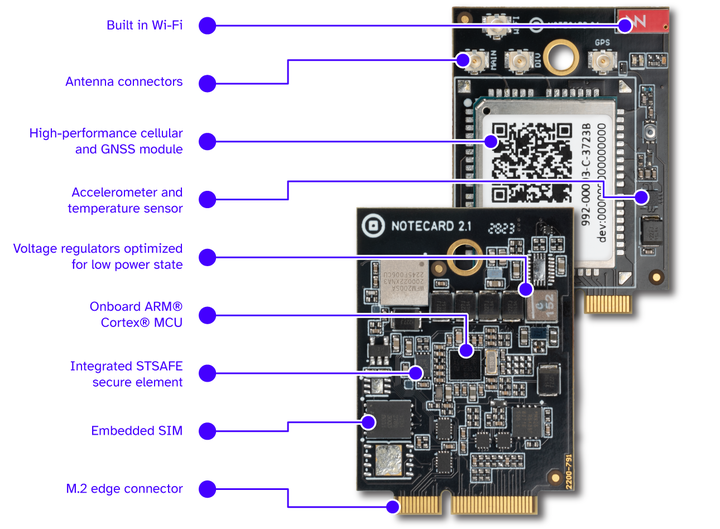

You can use the Notecard with virtually any host microcontroller, but the easiest way to start is with a [Blues Starter Kit](https://shop.blues.com/products/blues-global-starter-kit). The Blues Starter Kit for Cell+WiFi includes a Notecard Cell+WiFi, an [STM32-based host microcontroller](https://blues.com/products/swan/), and a [carrier board](https://blues.com/products/notecarrier/notecarrier-f/) that makes connecting your hardware dead simple.

Here’s what the hardware looks like with everything assembled.

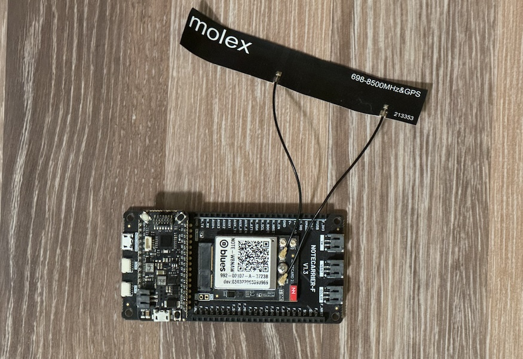

## Cloud Setup

On the cloud side of things you’ll need to create two free accounts.

### Notehub

[Notehub](https://blues.com/notehub/) is the Notecard’s companion cloud service, and the Notecard knows how to talk to Notehub out of the box (even over cellular!).

To follow along with this article you’ll need to [create a free Notehub account](https://dev.blues.io/notehub/notehub-walkthrough/#create-a-notehub-account) and [create a new project](https://dev.blues.io/notehub/notehub-walkthrough/#create-a-new-project).

Once you create your project make note of your ProductUID, as you’ll need that value later in this article.

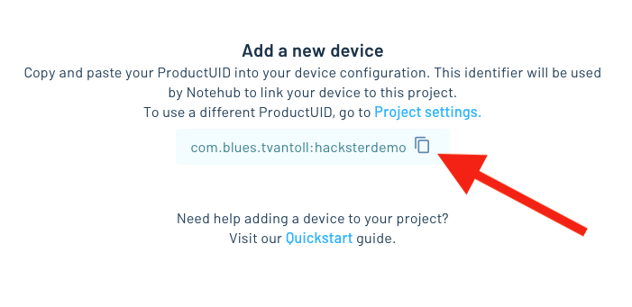

### Arduino Cloud

Next, head over to Arduino Cloud and [create a free account](https://app.arduino.cc/?get-started=true) there as well.

Once you have an account, you’ll next need to add a new device on your [cloud’s devices page](https://app.arduino.cc/devices). When you do, select the **Manual** option, as we’re not using an official Arduino board.

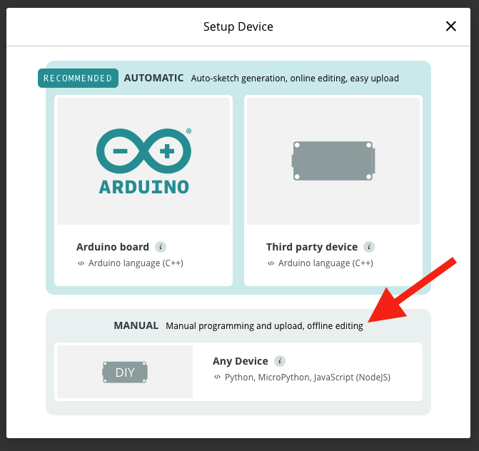

When you get to the screen that shows your **Device ID** and **Secret Key** go ahead and copy those values as well, as you’ll also need them in a later step.

With that your cloud setup is complete for now, so let’s next talk about how to get firmware ready for your device.

## Firmware Setup

The firmware for your project is responsible for connecting any sensors or peripherals you want to use to the cloud.

To make that process simple the Arduino team provides the [ArduinoIoTCloud library on GitHub](https://github.com/arduino-libraries/ArduinoIoTCloud), which is an Arduino library you can install and set up to connect your device to Arduino Cloud.

To use the library start by downloading and installing [Arduino IDE](https://www.arduino.cc/en/software) (if you haven’t already).

Within Arduino IDE, go to the libraries tab (third icon down on the left), and install both the “ArduinoIoTCloud” and “Blues Wireless Notecard” libraries.

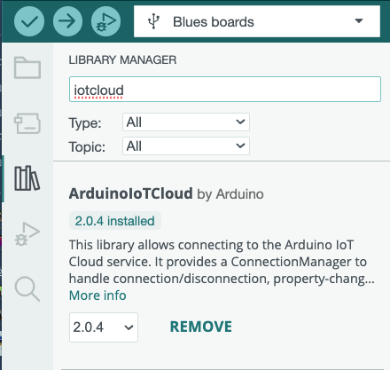
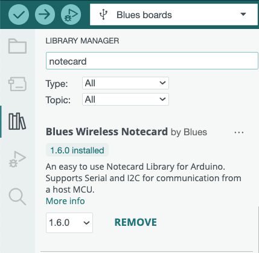

Next, there’s one temporary step you’ll need to do, (remember this article is an early preview) as the Blues updates to the ArduinoIoTCloud library are not in production quite yet.

Find the location on your computer where Arduino IDE stores library installations. On Windows this is typically `C:\Users\[YourUsername]\Documents\Arduino\libraries`, and on macOS / Linux it’s either in `~/Arduino` or `~/Documents/Arduino`.

Here you’ll need to replace the `ArduinoIoTCloud` and `Arduino_ConnectionHandler` with the following updated libraries.

* [ArduinoIoTCloud](https://github.com/zfields/ArduinoIoTCloud/tree/notecard)
* [Arduino_ConnectionHandler](https://github.com/zfields/Arduino_ConnectionHandler/tree/notecard)

You can either manually replace the folders, or use the following commands if you’re comfortable using a terminal.

```bash
cd ~/Documents/Arduino/libraries # or wherever your installation folder is
rm -rf ArduinoIoTCloud/
rm -rf Arduino_ConnectionHandler
git clone https://github.com/zfields/ArduinoIoTCloud.git -b notecard
git clone https://github.com/zfields/Arduino_ConnectionHandler.git -b notecard
```

The updated ArduinoIoTCloud library has a sample sketch you can use to start your firmware. To use it, open your **File** --> **Examples** menu in Arduino IDE and scroll to the find the **ArduinoIoTCloud-Notecard** example within the **ArduinoIoTCloud** menu.

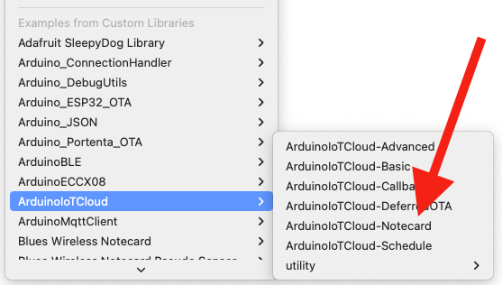

In this new project there are a few things you have to configure to get your firmware up and running. First, open your sketch’s `thingProperties.h` file, find the `NOTECARD_PRODUCT_UID` constant, and update it with the ProductUID you copied from the Notehub project you created earlier.

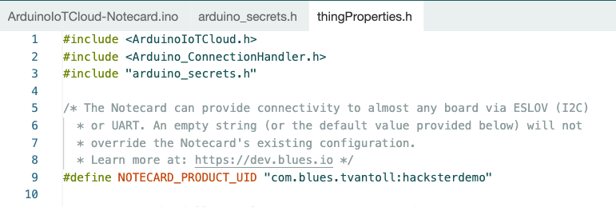

Next, if you’re using an interrupt-cable host (like the Blues Swan that comes in the Blues Starter Kit), open your project’s `ArduinoIoTCloud-Notecard.ino` file, and uncomment the `#define ATTN_PIN 9` line.

```c
#define ATTN_PIN 9
```

By utilizing the interrupt, the Notecard will signal each time new data arrives, so the host can process it without delay. Without the interrupt the host has to continuously poll the Notecard for new information.

The `ATTN_PIN` constant tells the Notecard which pin is connected to the Notecard’s `ATTN` pin. If you’re following along with a Blues Starter Kit you can make this connection by running a jumper between `N_ATTN` and `F_D9` on your Notecarrier F.

While you have your hardware out, run one additional jumper between `F_A0` and `GND`. Arduino Cloud expects a potentiometer on `A0` and grounding it will prevent the Notecard from spamming the cloud with hardware noise.

Here’s what your hardware should look like with the two jumpers in place.

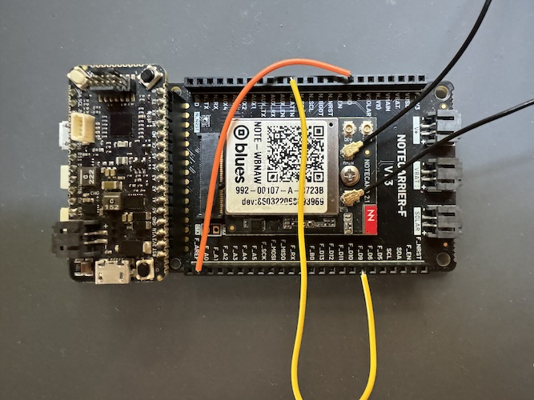

## Trying it Out

With everything connected you’ll next need to run the firmware on your device. If you haven’t done this before on the Blues Swan, see our guide on [Using Arduino IDE with Swan](https://dev.blues.io/swan/using-arduino-ide-with-swan/).

With the firmware running, next return to your web browser and open back up your Notehub project. You’ll know things are working if you see your device listed on your project’s **Devices** list.

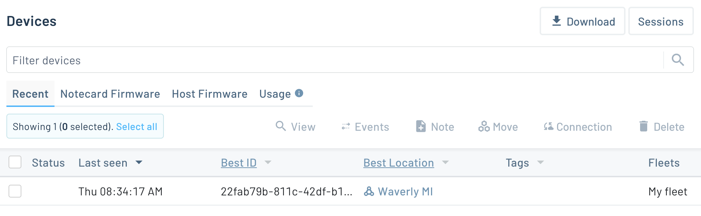

To connect this new Notehub device to Arduino Cloud, double click your device and go to the **Environment** tab. Create two environment variables, `_sn_` and `_secret_key`, and set their values to the **Device ID** and **Secret Key** you copied from Arduino Cloud earlier.

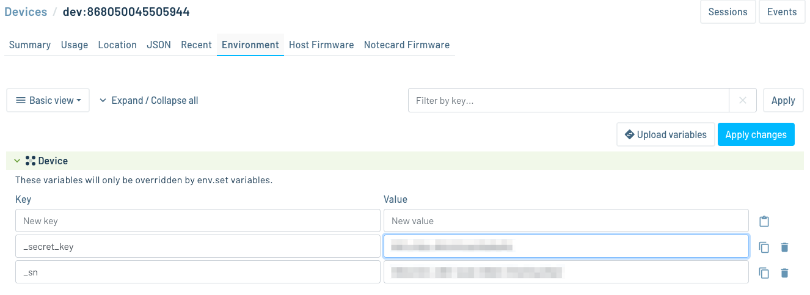

Hit the reset (`RST`) button on your Swan so that it picks up on the new environment variables. With the two clouds connected, if you return to Arduino Cloud you should see your device listed as online.

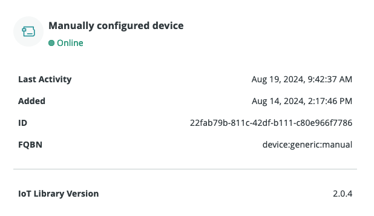

It’s worth taking a second to pause here and think about what just happened. With the Blues Notecard you were just able to connect a device to Arduino Cloud—over a cellular connection. And you did it without having to mess with SIM cards or programming a cellular modem!

With the connection established let’s next build a dashboard in Arduino Cloud so you can see what this integration makes possible.

## Building a Dashboard

To set up a dashboard in Arduino Cloud first you must create a **Thing**. Per the [Arduino Cloud Things documentation](https://docs.arduino.cc/arduino-cloud/cloud-interface/things/):

> The communication between IoT devices and the Arduino Cloud is handled through something called Things. Things are a virtual twin of your hardware/setup, where you perform a lot of the configurations for your projects.

To create your own Thing, head to the [Things menu in Arduino Cloud](https://app.arduino.cc/things), and click the **+Thing** button.

On the next screen do the following steps:

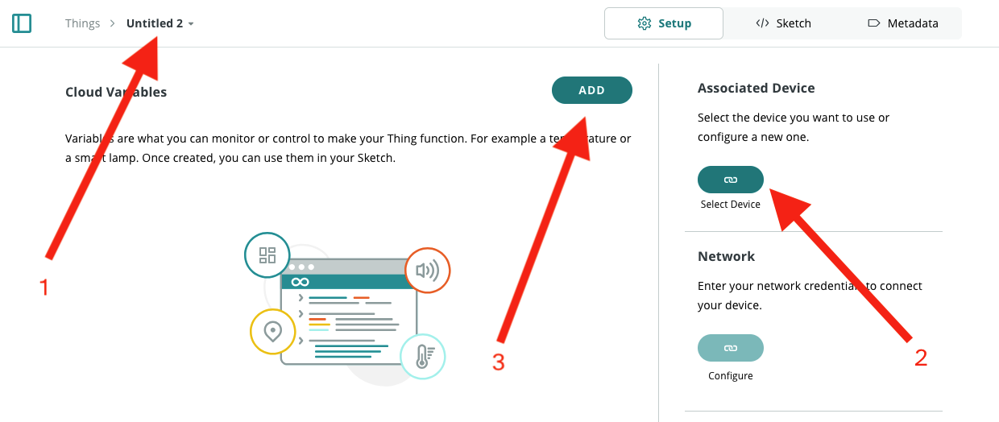

1) Give your new thing a name.
2) Associate your thing with your device.
3) Add cloud variables.

For the cloud variables start by creating the following two variables:

* LED
  * Name: `led`
  * Type: Boolean
  * Permission: Read & Write
  * Update Policy: On change

* Temperature
  * Name: `temp`
  * Type: Floating Point
  * Permission: Read Only
  * Update Policy: Periodically, every 15 seconds

The example firmware we started from knows how to read & write the Blues Swan’s LED out of the box, and we’ll add support for the temperature in a later section of this article.

With your Thing in place, next head to the [Dashboards section of Arduino Cloud](https://app.arduino.cc/dashboards). Here, hit the **+ Dashboard** button to create a new dashboard.

On the next screen take the following steps:

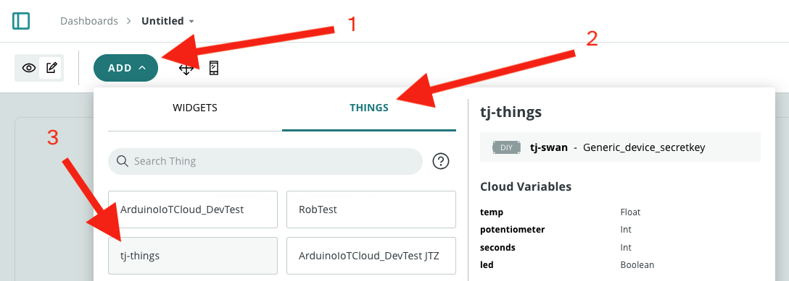

1) Click the **Add** button.
2) Click the **THINGS** tab.
3) Select your thing from the list.

On the next screen you can click the **Create Widgets** button, and Arduino will automatically generate a starting point for your new dashboard.

From the starting point you may want to [edit your dashboard widgets](https://docs.arduino.cc/arduino-cloud/cloud-interface/dashboard-widgets/) until you’re happy with how things look. Here’s what my basic dashboard looks like.

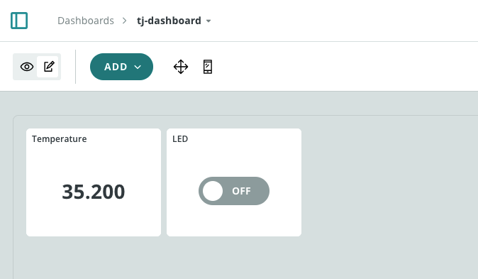

The cool thing is that these widgets are already tied to live data. Meaning, if everything is connected correctly, you can toggle the LED switch and it will toggle the LED on the Blues Swan—instantly, and over cellular. How cool is that?

[Video](light.mov)

Before we wrap up, let’s next look at how to turn the temperature widget into a live value, as it will serve as a good example of how you can add custom data into this setup.

## Adding New Data

Let’s return to this project’s firmware in Arduino IDE. To add a new variable, start by opening up your `thingProperties.h` file, and add the following line near the top (under `bool led`):

```c
float temp;
```

This creates a global temperature variable we’ll be using throughout the sketch. To tell Arduino Cloud about this variable, next, find the `initProperties()` function and add the following line.

```c
ArduinoCloud.addProperty(temp, 4, Permission::Read).publishEvery(15);
```

This tells Arduino Cloud about the `temp` variable, that dashboards should only be able to read the variable (you can’t set a temperature), and that the sketch should publish updates to that variable every 15 seconds.

To update the variable with a real temperature, open your sketch’s `ArduinoIoTCloud-Notecard.ino` file and find the `loop()` function. At the bottom of the function add these lines of code, which use the [Notecard’s `card.temp` request](https://dev.blues.io/api-reference/notecard-api/card-requests/latest/#card-temp) to get a temperature reading from the Notecard’s onboard temperature sensor.

```c
float temp;
J *req = NoteNewRequest("card.temp");

if (J *rsp = NoteRequestResponse(req))
{
    temp = JGetNumber(rsp, "value");
    NoteDeleteResponse(rsp);
}
```

And... that’s it! The magic of this integration is just by creating a variable, registering it with Arduino Cloud, and updating it in `loop()`—you have a complete solution for reading and writing data to _any_ device over cellular or LoRa. Pretty cool!

In my case, once I deployed my updated sketch to my device, I instantly saw the real temperature of my office, and saw it update every 15 seconds.

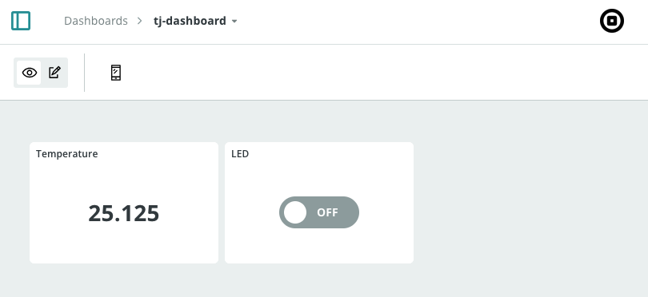

## What’s Next

In this article we looked at how the Blues Notecard and Blues Notehub make it easy to use Arduino Cloud from any device.

Today’s article was an early preview, and you can expect an official release in the weeks to come. If you want to be notified of all the things we’re working on at Blues, sign up for the [Blues Developer Newsletter](https://dev.blues.io/developer-news/) for monthly updates.

It’s a good time to sign up, as there might be some new Blues + Arduino hardware on the way as well 🤫 Stay tuned :)
