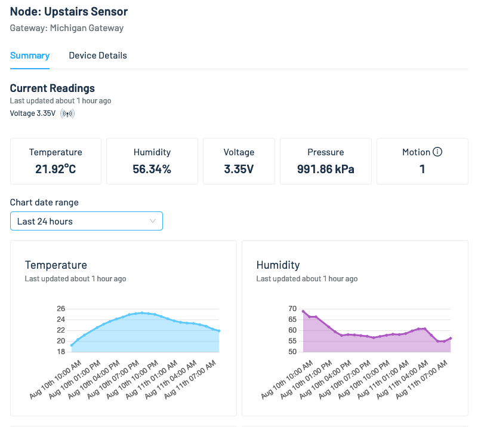
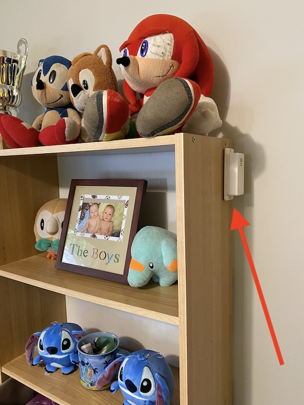

# Sensor Clusters Made Easy w/LoRa and Blues Wireless Sparrow

I deployed an array of LoRa-based sensors to monitor the temperature and humidity throughout my house.

## Story

My house isn’t a mansion, but I do have three floors (a main floor, an upstairs, and a basement), and trying to keep all floors at a reasonable temperature can be quite the challenge throughout hot summers and cold winters.

As a first step I wanted a way to monitor the temperatures throughout my house, and to build a dashboard that would let me see how much temperatures fluctuate as outdoor conditions change.

To do so I deployed four LoRa-based sensors, all of which report data to a single gateway, which in turn relays the data to a cloud dashboard for me to monitor.

> **NOTE**: [LoRa](https://en.wikipedia.org/wiki/LoRa) (from “long range”) is a radio communication technique, and is an alternative to cellular, Wi-Fi, and bluetooth for connectivity.

Here’s what my dashboard looks like. (And it’s online, so [you can view it too](https://sparrowstarter.netlify.app/)!)

And here’s a more detailed look at one of my sensor’s readings over time.

In this article I’ll show you how it all works, and how you can build this sort of setup for yourself. Let’s start by looking at the hardware I used.

## Assembling the Hardware

All components of my build came from the [Blues Wireless Sparrow Development Kit](https://shop.blues.io/products/sparrow-dev-kit). (Full disclosure: I work at [Blues](https://blues.io/), and I do so because we’re making awesome stuff like this.)

Sparrow refers to the Blues architecture that makes it easy to set up a LoRa network, where a single **gateway** that can speak to multiple sensor **nodes**. This architecture allows you to add cloud connectivity to a local cluster of sensor nodes, while keeping per-device costs reasonably low.

The Sparrow Development Kit contains everything you need to set this network up, including a gateway and two sensor nodes.

When set up, the gateway is made up of two boards connected by a Qwiic cable.

* The Sparrow Essentials Board (left, in image below) is a microcontroller that acts as the radio that performs the LoRa-based communication with the sensor nodes.
* The Notecarrier-A (right, in image below) houses the [Notecard](https://blues.io/products/notecard/), a system-on-module that makes network communication simple. The Sparrow Developer Kit comes with a Wi-Fi Notecard, but you can swap in a [cellular Notecard](https://shop.blues.io/collections/notecard) if you want your Sparrow network to work outside the range of a Wi-Fi network.

The Sparrow sensor nodes come preassembled, and all you need to do is insert a pair of AAA batteries.

You can find full instructions on how to set up the dev kit on the [Blues Sparrow quickstart guide](https://dev.blues.io/quickstart/sparrow-quickstart). I covered most of the steps, but you do additionally need to tell the Wi-Fi Notecard about your home Wi-Fi network, and pair the sensor nodes to the gateway (which works a lot like Bluetooth pairing).

Each Sparrow sensor node contains both a PIR motion sensor and a BME280 environmental sensor. And once you have your sensor nodes paired, they’ll automatically start reporting motion, connectivity, and environmental data to the Blues cloud backend, [Notehub](https://notehub.io).

And with those minimal steps complete, you actually already have a LoRa network set up and reporting data for you. By default, the sensor nodes take an environmental reading (temperature, humidity, and air pressure) every hour, and the motion sensors report on motion immediately at first, and then every 15 minutes afterwards to save on battery.

> **NOTE** The Sparrow network is highly configurable. The device’s [firmware is open source](https://github.com/blues/sparrow-reference-firmware), and you tweak is to add your own custom behavior or new sensors. But if all you want to do is monitor environmental data or motion, everything you need comes in the development kit.

And with the network ready, it was time for me to start setting up the sensor nodes around my house.

## Deploying the Sensors

If you remember back to the start of this article, my goal was to monitor the temperature on all three floors of my house. Luckily, because I work at Blues and was involved in Sparrow early on, I am the proud owner of two development kits, and therefore have four sensor nodes to place around my house.

I decided to hang my sensor nodes with [Command strips](https://www.command.com/3M/en_US/command/) to avoid putting holes in my wall, and because the nodes are pretty light so the strips hold them up easily.

Here’s the node I put in my main floor office.

Here’s the one in my upstairs bedroom.

And here’s the one in my basement.

And as a bonus, because I had four nodes, I put one outside so I could compare the outdoor temperature against my indoor readings. Here’s the node I put on my deck.

> **NOTE**: Although the sensor nodes are in a plastic enclosure, they are not rain proof. If you place a sensor outside make sure that it’s in a covered location.

Depending on your home or location, you might need to be careful about how far away you place your sensors nodes from the gateway. The optimal distance depends on whether your devices have a clear line-of-sight, or the signal needs to penetrate walls, concrete, and the like.

Out in the open, devices can communicate across 1 KM or more. In a home or building, your devices may need to be placed closer together, ideally less than a hundred meters apart—but you really just have to test in your own environment to know for sure.

My house is relatively open so I had no signal issues, and in my testing I was able to take my sensors several hundred meters down my road before I started having communication problems.

And the cool thing was, once I had the sensor nodes in place, I immediately started to get data flowing in from all the locations around my house.

## Building a Dashboard

At this point, I now had a constant stream of sensor data coming into Notehub that I could view in a table—which is cool, but to actually make that data actionable I wanted to visualize the readings, and to do that I had to get them out of the simple table.

Luckily Blues offers several ways that you can [route data from Notehub](https://dev.blues.io/notehub/notehub-walkthrough/#routing-data-with-notehub) to other cloud services. You can use this approach to place your data in one of the big clouds like AWS or Azure, to IoT platforms like Datacake or Ubidots, or to a custom HTTP/HTTPS endpoint.

For Sparrow specifically though, Blues provides an [open-source reference web application](https://github.com/blues/sparrow-reference-web-app) that you can easily configure with your own device identifiers, and immediately view your data in an online dashboard.

The full instructions for getting the app up and running are [available on GitHub](https://github.com/blues/sparrow-reference-web-app). And because the app is open source, you’re welcome (encouraged!) to use the app as a starting point of your own projects, and customize everything you see to meet your needs. When you’re ready, we even have documentation on [how to deploy the reference web app](https://github.com/blues/sparrow-reference-web-app#cloud-deployment) to a number of different cloud providers.

> **NOTE**: As a reminder, the dashboard with my home’s data is [available online](https://sparrowstarter.netlify.app/) if you want to view live environmental readings from around my house.

So after setting all of this up, what did I find? 

Unsurprisingly, my basement is the place to be during the summer, as during the day it’s up to 5°C (~9°F!) colder than my upstairs.

And surprisingly, my office apparently gets really hot during the day. My wife and I share a small room and both have computers running, and it seems that heat adds up, as the office is often hotter than my upper floor during the middle of the day.

I’m not sure what actionable steps I’ll take based off this data. (I’m sure my wife will love being told that the office is warm because of her—literally.) But knowing is half the battle, and if nothing else I had a lot of fun setting up the sensors and seeing the data flow in—and Sparrow made it super easy to do.

## Final Thoughts

The Blues Sparrow architecture makes it trivial to set up a LoRa network, and to get data flowing from a cluster of sensors up to your cloud of choice.

The Sparrow Development Kit is the easiest way to get started with the Sparrow architecture. Within 30 minutes you can have a LoRa network up and running at your house, and within a hour or two you can set up a web dashboard for viewing your data in a web browser.

From there, you can customize everything you saw in this article. Want to [customize the firmware’s behavior](https://github.com/blues/sparrow-reference-firmware)? Great! Want to [customize the web app](https://github.com/blues/sparrow-reference-web-app)? Great! Want to [route your data to your own service](https://dev.blues.io/sparrow/what-to-do-with-sparrow-data) and build something completely custom? Amazing, go for it!

If you want to try Sparrow for yourself, start by buying a [Sparrow Developer Kit](https://shop.blues.io/products/sparrow-dev-kit) and completing the [Sparrow quickstart](https://dev.blues.io/quickstart/sparrow-quickstart). And if you have any questions about how it all works feel free to [reach out on our forum](https://discuss.blues.io/).

Have fun building!
