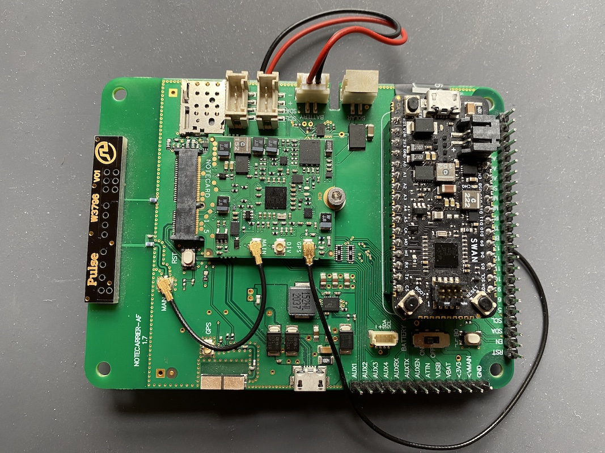
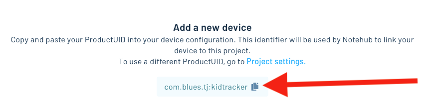
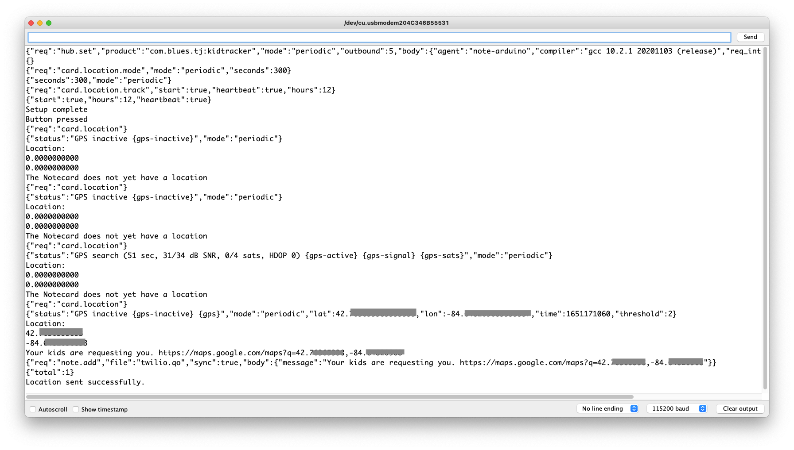
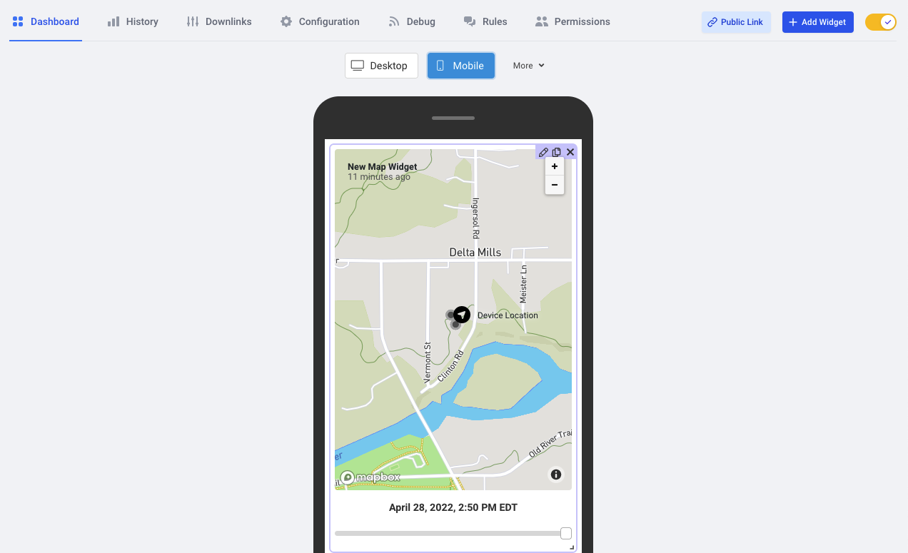
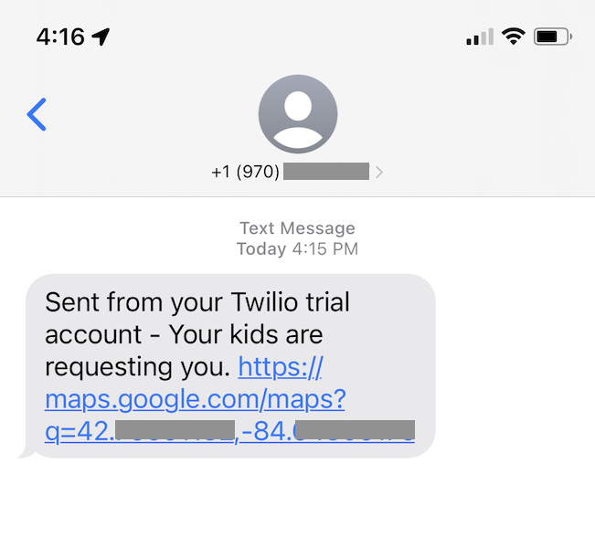

# Building Your Own Inexpensive GPS Kid Tracker

I built a GPS tracker that monitors my kids’ location, and gives them the ability to request a pickup.

## Story

Here in Lansing, Michigan we’re very proud of our river trail system, which has over 20 miles of paved paths.

-- image of park sign --

My twins love to ride the trails on their bikes, and they’ve (unfortunately) reached an age where they can do so way faster than me. As a parent I want to encourage them to explore on their own, but I also want to keep tabs on their location in case something goes wrong. (Flat tires are very common.)

My kids are a bit young for their own cell phones, and I’m trying to avoid paying for more data plans for as long as possible. There are [a whole bunch of commercial kid GPS trackers](https://www.safewise.com/resources/wearable-gps-tracking-devices-for-kids-guide/) available, but virtually all of them also come with a monthly subscription fee.

All this got me thinking—I’m a software developer, and I work for [a company](https://blues.io/) that makes a [low-cost device with cellular and GPS capabilities](https://blues.io/products/notecard/). I should be able to build something like this for myself.

So I did 🙂



My custom tracker takes GPS readings every five minutes and displays them on a map. Additionally, the tracker includes a button that kids can press to send their location to a parent over SMS.

In this article I’ll show you how I built my own custom GPS tracker, and teach you how you can replicate some (or all) of this setup for yourself. Let’s get started.

## Step #1: Assemble the hardware

The majority of the hardware I used came in the [Blues Wireless Feather Starter Kit for Swan](https://shop.blues.io/products/notecarrier-swan). The Feather Starter kit contains a Notecard, a Notecarrier AF, and a Swan MCU. Let’s break down what each of those are.

### Notecard

The [Notecard](https://blues.io/products/notecard/) is a small system-on-module that can add connectivity to just about any IoT project. Blues makes both cellular and and Wi-Fi Notecards, but for GPS tracking you’ll basically always want to use a cellular Notecard.


I used the Notecard to gather GPS coordinates from an external antenna (which I’ll show momentarily), and to send those coordinates to the cloud over a cellular connection.

### Notecarrier AF

Notecarriers are companion boards that make it easy to prototype and deploy IoT projects with the Notecard. The Notecarrier gives you a convenient place to connect a Notecard, supply it with power, access embedded antennas, and to connect to I2C peripherals through Qwiic ports.


The Notecarrier AF also contains Feather-compatible headers, making it easy to embed any Feather-compatible device to use with the Notecard.

### Swan

The embedded Feather-compatible device I used with the Notecarrier AF was the [Swan](https://blues.io/products/swan/). The Swan can drive just about any IoT project, as it has a hefty 640KB of RAM, is expandable to 55 pins for access to additional I/O and buses, and has built-in support for C/C++, Arduino, and CircuitPython.


For my purposes the Swan runs the code I use to interface with the Notecard.

### Putting it all together

To assemble this build you need to slot both the Notecard and the Swan into the Notecarrier AF. Blues has a [good guide with pictures](https://dev.blues.io/quickstart/notecard-quickstart/notecarrier-af/) that I’d recommend following if you’re setting this up for the first time.

When you have the pieces assembled you’ll have a setup that looks like this.


To complete the build I did add two final things. First, I added an external [Molex antenna](https://shop.blues.io/collections/accessories/products/flexible-cellular-or-wi-fi-antenna) to the `GPS` socket on my Notecarrier AF. Although the Notecarrier AF has a built-in antenna, the external one is able to pick up a GPS signal a bit quicker, which was important to me for this project.

Next, I added in a small Lipo battery, and connected it to the `BATTERY` JST connector on the Notecarrier AF. The Lipo battery powers the device when I’m using it outside of my office.

Here’s what the setup looks after attaching the antenna and the battery.


> **NOTE**: The Notecarrier-AF includes a Micro USB slot, and if you provide power via that USB slot with a Lipo battery connected, you can recharge your Lipo battery.

Finally, because I didn’t want things a bunch of loose pieces flying around as my kids use this, I duct taped the lipo battery to the back of my Notecarrier AF, and applied the sticky side of the Molex antenna to the back as well (with a bit of cardboard in between).


Long term I’d love to build a nice enclosure for the device, but for prototyping this gave me single item my kids can carry around to try out.


Now that you’ve seen what the hardware looks like, let’s next look at how to set up the cloud backend.

## Step #2: Setting up the cloud backend

One of the great things about the Notecard is it knows how to send data to a cloud backend, [Notehub](https://notehub.io), out of the box. Notehub is a hosted service designed to connect to Notecard devices and synchronize data.

If you’re following along and want to build this project yourself, you’ll need to set up an account on [notehub.io](https://notehub.io), and create a new project.


After you create the project, make sure to copy your new project’s ProductUID (see screenshot below), as you’ll need that identifier to connect your Notecard to your new Notehub project.



You’ll learn more about Notehub throughout this article, but now that you have the basics set up, let’s next look at the code you need to write to get this kid tracker up and running.

## Step #3: Writing the code

If you recall from step #1, I’m using a Swan MCU to execute the code that drives the kid tracker. The Swan supports both CircuitPython and Arduino, so you can use either, but I went with Arduino because it’s a platform I’ve used on the Swan several times before.

If you’re new to Swan, you’ll want to start by going through the [Swan quickstart](https://dev.blues.io/quickstart/swan-quickstart/), which will help you set up your development environment. If you want to use the same environment as me, complete the [Using the Arduino IDE](https://dev.blues.io/quickstart/swan-quickstart/#using-the-arduino-ide) section.

Once you have your development environment set, you’re ready to move on to the code itself. And in the code there are three primary things you need to handle:

1) Configuring the Notecard
2) Configuring how often to take GPS readings
3) Handling button presses

Let’s tackle each of these in turn.

> **NOTE**: This [project’s full source code](https://github.com/tjvantoll/kid-tracker) is available on GitHub.

### Configuring the Notecard

Our first coding task is to set up the Notecard. The Notecard’s API is JSON-based, and therefore configuring the Notecard is as easy as sending a few JSON requests.

You can send those requests through an [online playground](https://dev.blues.io/notecard-playground/), through a [CLI](https://dev.blues.io/tools-and-sdks/notecard-cli/), or through [SDKs for Arduino, Python, C/C++, or Go](https://dev.blues.io/tools-and-sdks/). In this case we’re running on the Swan MCU, so we’ll be using [note-arduino](https://dev.blues.io/tools-and-sdks/arduino-library/), which is the official library for communicating with the Notecard via Arduino-compatible microcontrollers.

Specifically, you’ll want to make sure to [install the `note-arduino` library in Arduino IDE using the project’s installation instructions](https://dev.blues.io/tools-and-sdks/arduino-library/#installation).

After that, you’ll want to start with the following code in your Arduino sketch.

```cpp
#include <Notecard.h>

#define serialDebug Serial
#define productUID "com.blues.tj:kidtracker"

Notecard notecard;

void setup() {
  serialDebug.begin(115200);

  notecard.begin();
  notecard.setDebugOutputStream(serialDebug);
 
  J *req1 = notecard.newRequest("hub.set");
  JAddStringToObject(req1, "product", productUID);
  JAddStringToObject(req1, "mode", "periodic");
  JAddNumberToObject(req1, "outbound", 5);
  notecard.sendRequest(req1);

  serialDebug.println("Setup complete");
}
```

> **NOTE**: If you’re following along, make sure to change `"com.blues.tj:kidtracker"` to your own ProductUID that you copied in the previous step.

This code does a few different things. First, it initializes the Notecard (`notecard.begin()`) and sets the debug output stream (`notecard.setDebugOutputStream(serialDebug)`), which allows you to view logs using the Arduino IDE’s Serial Monitor.

Next, the code uses the note-arduino library to format a new [`hub.set` command](https://dev.blues.io/reference/notecard-api/hub-requests/#hub-set) and sends it to the Notecard.

``` cpp
J *req1 = notecard.newRequest("hub.set");
JAddStringToObject(req1, "product", productUID);
JAddStringToObject(req1, "mode", "periodic");
JAddNumberToObject(req1, "outbound", 5);
notecard.sendRequest(req1);
```

The `hub.set` command controls which Notehub project you want to send your data to, and allows you set some basic configuration for how the Notecard should work.

Setting the `"mode"` to `"periodic"` tells the Notecard to connect to a cellular network periodically, and setting `"outbound"` to `5` tells the Notecard to attempt that connection every five minutes. The Notecard can also work in continuous mode (`"mode": "continuous"`), but maintaining a constant cellular modem connection uses a considerable amount of battery.

Sending data every five minutes is already fairly power hungry, but for this project I want to see data often while my kids are out on their bikes, and I also have no issue charging the device’s lipo battery in between uses. If your project needs to be more conservative with battery usage, you’ll want to set the `"outbound"` value to a considerably higher number.

At this point you can [send your program to the Swan](https://dev.blues.io/quickstart/swan-quickstart/#programming-swan-arduino-ide) to test it out. If all went well you should see the following in the Arduino Serial Monitor.


> **NOTE**: If you’re not seeing logs, you can add `while (!serialDebug)` after your `serialDebug.begin()`, which forces the program to wait until the debugger is available before continuing. Just make sure to remember to remove `while (!serialDebug)` when you’re ready to deploy your device, as it’ll cause an infinite loop if running where no serial debugger exists.

If you return to your Notehub project you should now see your device listed.


At this point you have your Notecard connected to Notehub, which means you’re ready to send location data. Let’s next look at how to configure the Notecard to gather that location information.

### Configuring how often to take GPS readings

The Notecard has a number of requests that allow you to configure exactly how GPS readings should be taken. There are two primary commands you need to send to the Notecard: `card.location.mode` and `card.location.track`.

The code below (which you can add under the existing `hub.set` code) makes those two requests.

```cpp
J *req2 = notecard.newRequest("card.location.mode");
JAddStringToObject(req2, "mode", "periodic");
JAddNumberToObject(req2, "seconds", 300);
notecard.sendRequest(req2);

J *req3 = notecard.newRequest("card.location.track");
JAddBoolToObject(req3, "start", true);
JAddBoolToObject(req3, "heartbeat", true);
JAddNumberToObject(req3, "hours", 12);
notecard.sendRequest(req3);
```

In the `card.location.mode` call, setting the `"mode"` to `"periodic"` tells the Notecard to activate its GPS module periodically (as opposed to continuously), and setting the `"seconds"` to `300` tells the Notecard to attempt to take a GPS reading every 300 seconds, or five minutes.

The `card.location.track` request starts the actual tracking process. When in periodic GPS mode, the Notecard is smart enough to only take GPS readings if the device has moved (which it knows using its built-in accelerometer). Setting the `heartbeat` option to `true` tells the Notecard to take a reading every 12 hours (because we set `"hours"` to `12`), even if the Notecard hasn’t moved.

In short, these requests tell the Notecard to start taking GPS readings; to take a reading every five minutes if the device is moving; and to take a reading every twelve hours if it has not.

> **NOTE**: If you’re looking to learn more about how to configure the Notecard as an asset tracker, make sure to read through the [Notecard’s comprehensive guide to asset tracking](https://dev.blues.io/guides-and-tutorials/notecard-guides/asset-tracking/).

If you send this program to your Swan, you should see the following output in your Serial Monitor.


More importantly, if you check out the **Events** tab in your Notehub project, you should start to see `_track.qo` files coming in.


If you double click an event and go to the next page’s JSON tab, you can view the captured GPS information.


It may take several minutes to see your first event, as it can take some time for the Notecard to establish a GPS connection. Try to place your device in a location that has a clear line of sight to the sky, and avoid confined places like basements if possible.

Also, remember that the Notecard only takes new GPS readings if the device is moving, so you may need to shake the device a bit to see subsequent `_track.qo` files come in during testing.

In a moment we’ll look at how to visualize your GPS readings on a map, but let’s first wrap up this project’s code, and look at how to make a button press send an SMS message with a location.

### Handling button presses

One of the main features I wanted my tracker to have was the ability for kids to press a button, and have that button send an SMS message to a parent with their current location. This is a feature of most commercial kid trackers, so I’m confident this is something other parents would want as well.

There are a lot of ways you could handle a button press in an IoT app, but the Swan includes a user button (`USER_BTN`), for handling this exact sort of scenario.


To be use this button, you can start by adding the following `#define` line to the top of your sketch.

```cpp
#define BUTTON_PIN USER_BTN
```

Next, add the following boolean that you’ll use to track whether the user requested their location.

```cpp
bool locationRequested = false;
```

After that, add the following code to the end of your existing `setup()` function. This code attaches an interrupt to your Swan’s button, and when triggered, calls a function named `ISR`.

```cpp
pinMode(BUTTON_PIN, INPUT_PULLUP);
attachInterrupt(digitalPinToInterrupt(BUTTON_PIN), ISR, FALLING);
```

You’ll need to define `ISR` (interrupt service routine), which you can do by adding the following function to your sketch.

```cpp
void ISR(void) {
  serialDebug.println("Button pressed");
  locationRequested = true;
}
```

Your program now changes the `locationRequested` boolean when a user presses the Swan’s user button. To respond to that change you’ll want to monitor that boolean in your Arduino `loop()` function. You can do that by using the code below.

```cpp
void loop() {
  if (!locationRequested) {
    return;
  }

  J *req = notecard.newRequest("card.location");
  J *resp = notecard.requestAndResponse(req);
  serialDebug.println("Location:");
  double lat = JGetNumber(resp, "lat");
  double lon = JGetNumber(resp, "lon");
  serialDebug.println(lat, 10);
  serialDebug.println(lon, 10);

  if (lat == 0) {
    serialDebug.println("The Notecard does not yet have a location");
    // Wait a minute before trying again.
    delay(1000 * 60);
    return;
  }

  // http://maps.google.com/maps?q=<lat>,<lon>
  char buffer[100];
  snprintf(
    buffer,
    sizeof(buffer),
    "Your kids are requesting you. https://maps.google.com/maps?q=%.8lf,%.8lf",
    lat,
    lon
    );
  serialDebug.println(buffer);

  J *req2 = notecard.newRequest("note.add");
  JAddStringToObject(req2, "file", "twilio.qo");
  JAddBoolToObject(req2, "sync", true);
  J *body = JCreateObject();
  JAddStringToObject(body, "message", buffer);
  JAddItemToObject(req2, "body", body);
  notecard.sendRequest(req2);

  locationRequested = false;
  serialDebug.println("Location sent successfully.");
}
```

There’s a lot here, so let’s break this code down. First, note that all the logic here is gated by an `if (!locationRequested) { return; }` check. Aka, if the user hasn’t pressed the button, there’s nothing to do in `loop()`.

If the user has requested a location, we next use the Notecard’s `card.location` request to get the current location and print it out.

```cpp
J *req = notecard.newRequest("card.location");
J *resp = notecard.requestAndResponse(req);
serialDebug.println("Location:");
double lat = JGetNumber(resp, "lat");
double lon = JGetNumber(resp, "lon");
serialDebug.println(lat, 10);
serialDebug.println(lon, 10);
```

The Notecard might not have a location yet (it takes a few minutes to acquire a GPS location when the project starts up), therefore we next check to see if `card.location` returned a valid location. If not, we log another message, and wait a minute before trying again.

```
if (lat == 0) {
  serialDebug.println("The Notecard does not yet have a location");
  // Wait a minute before trying again.
  delay(1000 * 60);
  return;
}
```

If we do have a valid location, we next format a message that includes a Google Maps link to the tracker’s current location.

```cpp
char buffer[100];
snprintf(
  buffer,
  sizeof(buffer),
  "Your kids are requesting you. https://maps.google.com/maps?q=%.8lf,%.8lf",
  lat,
  lon
  );
serialDebug.println(buffer);
```

After that, we then send the message to Notehub using the Notecard’s `note.add` request.

```cpp
J *req2 = notecard.newRequest("note.add");
JAddStringToObject(req2, "file", "twilio.qo");
JAddBoolToObject(req2, "sync", true);
J *body = JCreateObject();
JAddStringToObject(body, "message", buffer);
JAddItemToObject(req2, "body", body);
notecard.sendRequest(req2);
```

And finally, we flip the boolean back to `false` as we’ve now finished handling the button press.

```cpp
locationRequested = false;
serialDebug.println("Location sent successfully.");
```

And with that, you’re done writing the code you need to make this project run! Before pushing the code out to the device one last time, go into Arduino IDE’s **Tools** menu, and switch the **C Runtime Library** to one that supports floating point printing and scanning, as we’re using that in our logic that places the latitude and longitude into a Google Maps URL.


> **NOTE**:
> * Floating point support uses a _lot_ of memory, so you should use some caution before building with it in any IoT project. This is one reason I chose the Swan for this project, as it comes with a hefty 640KB of RAM which is great for situations like this.
> * As a reminder, this [project’s full source code](https://github.com/tjvantoll/kid-tracker) is available on GitHub. Feel free to jump there for a copy-and-paste friendly version of the entire sketch.

And with that, go ahead and upload your code to your Swan one last time. Once you do, go ahead and press the user button on your Swan. You should see the following in your Serial Monitor (remembering it may take a few minutes to acquire a GPS signal, so you might see “The Notecard does not yet have a location” several times on start up).



Back in Notehub, if you return to your **Events** list you should see a new `twilio.qo` event that contains the GPS coordinates from your device.


And with that your code is now complete, and you have two different types of data flowing into Notehub. The first is location data, in the form of `_track.qo` events, and the second is pickup requests, in the form of `twilio.qo` events.

In the next two sections you’ll learn how view your location data on a map, and how to send pickup requests as SMS messages.

## Step #4: Building a dashboard

Perhaps the best feature of Notehub is how easy it is to send data to other places. Those places could be one of the big clouds, like AWS, Azure, or Google Cloud; they could be an IoT platform like Datacake or Ubidots; or they could be a completely custom HTTP API.

For my kid tracker I wanted an easy place to visualize location data, so I ended up going with Datacake, as they have a Notecard template that makes setting up a dashboard as easy as clicking a few buttons.

To set this up for yourself, check out the [Blues guide to routing data to Datacake](https://dev.blues.io/guides-and-tutorials/routing-data-to-cloud/datacake/). At the end you’ll have a dashboard that includes the Notecard’s location, voltage, temperature, and RSSI (signal strength). Here’s what my dashboard looked like after first setting up my route.


Datacake also allows you to set up a mobile dashboard view, which I found helpful as I usually want to track my kids on my phone. For the mobile view I placed the map in top, as that’s the main thing I’m interested in, and clicked the “Public Link” button to generate a URL I can load on my device.



If you’re following along, you should now have an online dashboard you can use to track your device’s location, which is pretty cool!

As a last step before we take this device out in the wild, let’s next look at how to make the SMS messages work.

> **TIP**: If you want to dive deep into what you can do with Datacake, check out [Mastering Global Asset Tracking With a Cellular Notecard and Datake](https://www.youtube.com/watch?v=gzQEJyIeobU), an in-depth webinar we did with the Datacake team.

## Step #5: Sending SMS messages

SMS messages are critical to this project as I want my kids to be able to let me know if they get lost, or if something goes wrong. Luckily, implementing SMS messages with the Notecard is fairly trivial.

One of the services you can route to from Notehub is Twilio, and connecting the two is as easy as signing up for a Twilio trial account, and creating a new Notehub route.

If you want to set this up for yourself, check out the [Blues guide on setting up a Twilio route](https://dev.blues.io/guides-and-tutorials/routing-references/twilio-route/), which walks you through setting everything up.

> **NOTE**: If you’re following this guide exactly, use `"&Body=" & body.message & "&From=+1234567890&To=+1234567890&"` (swapping in your own numbers) as your route’s **JSONata Expression**. I like to store my phone numbers on the route in Notehub, as it’s more configurable there than as a variable in my Arduino code.

With everything configured, go ahead and press the user button on your Swan again. Pressing the button will create a new `twilio.qo` note on your device and immediately sync it to Notehub, which will immediately route the data to Twilio—the end result being a message on your phone with a Google Maps link.



And with that, everything is working 🎉 Which means it’s time to try out the project in the field.

## Trying everything out

GPS trackers are hard to test because gathering data requires you to move around the world. Kid trackers are even harder to test because, if you want to test them right, you have give your kids a device, send them off, and see what happens.

So I did!

Since I was most interested in bike tracking, I decided to test out the project by giving my kids the tracker, sending them out on their bikes, and telling them to press the button after a while so I could come find them. What could go wrong?


As it turns out, things can go wrong 😅 My big problem is that for test run #1 I had still not taped up everything in my device. Aka, the blue bag my son is holding in the image above contains this.


As it turns out, bouncing loose electrical components are a problem waiting to happen. Not only can this setup to electricial shorts, but a lose battery is actually dangerous, as [a punctured lipo battery is basically a small bomb](https://www.youtube.com/watch?v=wUFxlf4fXjo). Fun!

Luckily things didn’t go _that_ wrong, but about 13 minutes into my kids’ first bike ride I stopped getting `_track.qo` events, and noticed this concerning “brown-out & hard reset” health event come through.


Fortunately, I had given my kids a backup location, and they showed up there about an hour later, confused about what had went wrong 😅

By a few days later I had regrouped and was determined to learn from my mistakes. First, I had now taped up my device into a far more stable build, with no loose cables or batteries.


Second, I purchased an [under-seat storage bag for bikes](https://www.amazon.com/gp/product/B08PNSZNP6/ref=ppx_yo_dt_b_asin_title_o00_s00?ie=UTF8&psc=1). This pouch holds the tracker snugly, which greatly reduced the amount of bouncing the device would have to withstand.


Here are my kids, confident that attempt #2 would go much better.


And it did! As my kids were riding I was able to monitor their location on my Datacake dashboard. (Those three dots next to each other is them turning around.)


And after about a half hour I got a text message when they were ready for me to come and get them.


Plus, the device has continued to work as expected as we’ve tried it out on a handful of walks and bikes rides the last few days.

## Wrapping up

Overall I’m pretty happy with how things turned out. I now have a small device I can attach to my kids bikes, and let them roam around knowing they have a button they can press if anything goes wrong.

And as a bonus, I don’t have to worry about any subscription fees, as the Notecard comes with 500MB of cellular data included, which I’m never going to come close to using for this simple project.

Long term I’d love to build a plastic enclosure for my hardware, both to add a bit of weather proofing, and to further ensure everything stays together as the device bounces on bumpy trails.

Hopefully you found this writeup interesting, especially if you’re considering building a tracker like this yourself.

