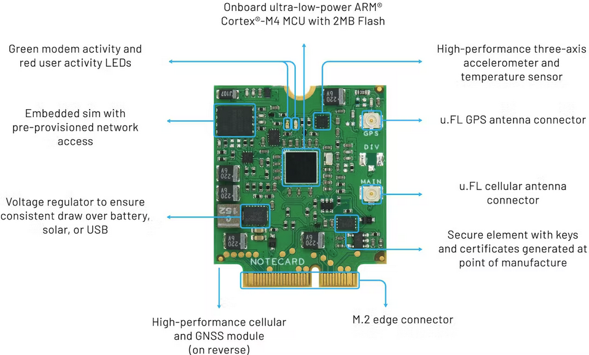
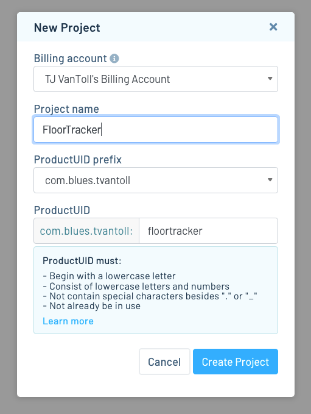

# Building an Indoor Floor-Level Tracker for Response Teams

A highly accurate floor-level tracker for response teams at emergency events.

## Story

When a response team converges on a multi-floor facility to respond to an event (for example, a fire safety team responding to a fire), it’s common to have a response coordinator that tracks the position and well being of all team members.

The problem is tracking position within buildings is hard, as GPS/GNSS is too unreliable to use indoors in emergency scenarios. There are some indoor positioning solutions based on BLE (Bluetooth Low Energy) and NFC, but those typically rely on hardware deployed within a facility in a fixed fashion—and in our case we’re bringing in external devices on a mobile team.

That’s why we at [Blues](https://blues.io/) built our own tracker with a slightly different approach: instead of using an existing positioning technology like GPS/GNSS, instead we use a highly accurate barometric pressure sensor that, when calibrated with a baseline pressure, can be used to determine the floor level of a tracker within a facility.


To accompany the devices, we built a companion web application that allows response coordinators to view all members of their team within a facility. The coordinator can view floor-level information, and importantly, see alerts if a team member has not moved within a configurable amount of time.


In this article we’ll walk you through the full solution, including how to build the devices themselves, how to use the firmware that gathers sensor data and sends it to the cloud, and how to run the web dashboard to see your device data live.

Let’s start by taking a look at the hardware.

> **NOTE**: This project’s firmware and web application are both open source and [available on GitHub](https://github.com/blues/app-accelerators/tree/main/indoor-floor-level-tracker).

### Hardware

The hardware for this project has to solve two important problems: measuring the barometric pressure, and sending that data to the cloud.

For a barometric pressure sensor we went with the [Bosch BMP581](https://www.sparkfun.com/products/20170). The BMP581 is accurate  to ±30 Pa, which, when converted to altitude, gives you a reading that’s accurate within ±10 centimeters.


> **NOTE**: To show off the accuracy of their sensor, Bosch runs a demo at events where they [move a Lego character between floors of a small building](https://www.youtube.com/watch?v=-I9pN4P_hWw).

The sensor data is only useful if we have some way to send that data to the response coordinator. And to do that, here at Blues we make the [Notecard](https://blues.io/products/notecard/).  If you've not yet heard of the Notecard, it's a cellular and GPS/GNSS-enabled device-to-cloud data-pump that comes with 500 MB of data and 10 years of cellular.



Cellular is perfect for this project, as we won’t have a consistent Wi-Fi network, and we don’t want to be limited by the range of technologies like Bluetooth and LoRa.

The Notecard itself is a tiny 30x35 system on module with an m.2 connector. To make integration into an existing prototype or project easier, we also make a series of host boards called [Notecarriers](https://shop.blues.io/collections/notecarrier). For this project we went with a [Notecarrier-F](https://shop.blues.io/collections/notecarrier/products/notecarrier-f) because it includes a set of headers for any Feather-compatible MCU.


And for that MCU we went with the [Swan](https://blues.io/products/swan/). The Swan is an STM32L4-powered board with 2MB of flash and 640KB of RAM. It supports C/C++, Arduino and CircuitPython, and is Feather-compatible so it slots nicely into the Notecarrier-F.

> **NOTE**: You can get the Notecard, a Notecarrier-F, and a Swan together in the [Feather Starter Kit for Swan](https://shop.blues.io/collections/development-kits/products/notecarrier-swan) on the Blues shop.

Now that we have all the pieces, all that’s left is to put everything together. After you have the Notecard and Swan in the Notecarrier-F, you’ll next want to attach the BMP581 into one of the Notecarrier-F’s Qwiic ports.


Finally you’ll want to attach a dual LTE and GPS/GNSS antenna (which is included in the Feather Starter Kit for Swan), and a LiPo battery to use for power.


> **NOTE**: You may want to add an enclosure to keep your build stable. We’ve been using a [standard Pelican 1040 case](https://www.pelican.com/us/en/product/cases/micro/1040) with a bit of tape to keep the battery stable during testing.

And with that, you now have a device ready to take pressure readings and send them to the cloud, so let’s next look at how to set up the cloud backend.

## Setting up the cloud backend

One of the great things about the Notecard is it knows how to send data to a cloud backend, Notehub, out of the box. [Notehub](https://notehub.io) is a hosted service designed to connect to Notecard devices and synchronize data.

If you’re following along and want to build this project yourself, you’ll need to set up an account on notehub.io, and create a new project.



After you create the project, make sure to copy your new project’s ProductUID (see screenshot below), as you’ll need that identifier to connect your Notecard to your new Notehub project.


You’ll learn more about Notehub throughout this article, but now that you have the backend set up, let’s next look at the code that makes the floor tracker work.

### Writing the Firmware

The firmware for this project is responsible for taking pressure readings from the BMP581, and communicating with the Notecard to sync that data to the cloud.

The full source code needed to make that happen is [available on GitHub](https://github.com/blues/app-accelerators/tree/main/indoor-floor-level-tracker/firmware), but we’ll show off the most important parts here. We used [Platform.io](https://platformio.org/) for building the app, using an Arduino application with Swan as the target. (And here are the [instructions for getting all of that running on your device](https://github.com/blues/app-accelerators/tree/main/indoor-floor-level-tracker/firmware).)

#### Working With Sensor Data

Within the firmware the first task is to get data from the BMP581. To do that we first bring in the included BMP581 library and define a `bmp` reference to an individual sensor.

```cpp
#include "Adafruit_BMP581.h"

Adafruit_BMP581 bmp;
```

Next, in `setup()`, we start communicating with the sensor over I2C.

```cpp
if (!bmp.begin_I2C())
{
  serialDebugOut.println("Could not find a valid BMP581 sensor, check wiring!");
  while (1);
}
```

And finally we define a `captureSensorReadings()` function for capturing and returning data from the BMP581.

```cpp
sensorReadings captureSensorReadings() {
  sensorReadings readings;

  if (!bmp.performReading()) {
    serialDebugOut.println("Failed to perform reading from pressure sensor.");
  }

  readings.readingTimestamp = millis();
  readings.temp = bmp.temperature;
  readings.pressure = bmp.pressure / 100.0;

  readings.altitude = bmp.readAltitude(state.baselineFloorPressure);
  readings.floor =
      ((readings.altitude / state.floorHeight)) + state.baselineFloor;

  readings.currentFloor = (int)(readings.floor + FLOOR_OFFSET);

  return readings;
}
```

> **NOTE**: Ignore the use of `state` in the example above for now. Those are environment variables that we retrieve from Notehub, which we’ll cover momentarily.

Now that we have a way of capturing sensor readings, we next have to get them to the cloud, and to do that we use the [Notecard’s Arduino SDK](https://dev.blues.io/tools-and-sdks/libraries/arduino-library/).

To do that we start by using the Notecard’s `hub.set` request to associate the Notecard with a Notehub backend.

```cpp
J *req = notecard.newRequest("hub.set");
if (req != NULL)
{
  JAddStringToObject(req, "product", PRODUCT_UID);
  JAddStringToObject(req, "mode", "continuous");
  notecard.sendRequest(req);
}
```

This `PRODUCT_UID` points at your specific Notehub project, so if you’re following along you’ll want to find that constant and replace its value with the Notehub product UID you copied to your clipboard earlier.

```cpp
#define PRODUCT_UID "YOUR.VALUE.HERE"
```

Now that the Notecard knows where to send data, we next need to gather the sensor data and send it out. The code below does that using the Notecard’s `note.add` request, which accepts an arbitrary JSON object as its `body`.

```cpp
J *req = notecard.newRequest("note.add");
if (req != NULL)
{
  JAddBoolToObject(req, "sync", true);
  JAddStringToObject(req, "file", "floor.qo");
  J *body = JCreateObject();
  if (body != NULL)
  {
    JAddNumberToObject(body, "floor", readings.currentFloor);
    JAddNumberToObject(body, "prevFloor", state.lastFloor);
    JAddNumberToObject(body, "altitude", readings.altitude);
    JAddNumberToObject(body, "pressure", readings.pressure);
    JAddNumberToObject(body, "temp", readings.temp);
    JAddNumberToObject(body, "direction",
                        readings.currentFloor - state.lastFloor);
    JAddItemToObject(req, "body", body);
    notecard.sendRequest(req);

    serialDebugOut.println("Sending floor.qo");
  }
}
```

At this point if you [flash the firmware](https://github.com/blues/app-accelerators/tree/main/indoor-floor-level-tracker/firmware#flashing) to your device, you’ll immediately start taking sensor readings and sending them to the cloud. To see them, you’ll need navigate to your Notehub project’s events tab, where you should see the pressure, temperature, and floor readings from your device.


If you’re in a building with multiple floors, you can take your device up or down the stairs, and you should see the pressure and floor readings change as you go.

Now that you know how the basics work, let’s look at how we allow users to configure the way this project works through environment variables.

#### Working With Environment Variables

One powerful feature of the Notecard is its ability communicate in two directions. That is, the Notecard can send your data up to the cloud (outbound), but it can also retrieve data (inbound) as well. And one of the most useful things you can do with this ability is to work with [environment variables](https://dev.blues.io/guides-and-tutorials/notecard-guides/understanding-environment-variables/).

Environment variables allow you to synchronize state and settings across fleets of devices of any size. And for our project, environment variables allow our users to remotely configure devices as they’re being used in an emergency scenario.

We use a handful of environment variables (which are [all documented here](https://github.com/blues/app-accelerators/tree/main/indoor-floor-level-tracker#configuring-environment-variables) if you’re curious), but we’ll focus on two of them in this article to show how environment variables work: `live` and `no_movement_threshold`.

#### The live Environment Variable

To make a floor-level tracker work with pressure readings you need to start by setting an initial baseline pressure. That is, you need a trigger that associates the current pressure with the building’s first floor. That way, when the device’s pressure changes as the device moves up or down floors, the firmware will know how to calculate a floor number.

We use a boolean environment variable, `live`, to provide that trigger. To use an environment variable we start by defining its initial state on our fleet of devices in Notehub, ([here’s how to do that](https://github.com/blues/app-accelerators/tree/main/indoor-floor-level-tracker#configuring-environment-variables)). We start by setting `live` to `false`.


Next, in our firmware we call the Notecard’s `env.modified` request every second to see if any environment variables have changed.

```cpp
J *rsp = notecard.requestAndResponse(notecard.newRequest("env.modified"));
```

If they have, we use the Notecard’s `env.get` request to get the current value of the environment variables.

```cpp
J *req = notecard.newRequest("env.get");

J *names = JAddArrayToObject(req, "names");
JAddItemToArray(names, JCreateString("live"));
JAddItemToArray(names, JCreateString("baseline_floor"));
JAddItemToArray(names, JCreateString("floor_height"));
JAddItemToArray(names, JCreateString("no_movement_threshold"));

J *rsp = notecard.requestAndResponse(req);
```

And if `live` changed we determine the baseline pressure to use for floor calculation.

```cpp
char *liveStr = JGetString(body, "live");
bool wasLive = vars.live;
vars.live = (strcmp(liveStr, "true") == 0 || strcmp(liveStr, "1") == 0);
if (vars.live && vars.live != wasLive)
{
  // this triggers the necessary math to compute the floor from last pressure reading
  setBaselineFloor = true;
}
```

> **NOTE**: You can check out the [firmware’s full source code](https://github.com/blues/app-accelerators/blob/main/indoor-floor-level-tracker/firmware/src/main.cpp) for full context on how we use the `live` environment variable.

The cool thing here is just how easy Notehub makes it to synchronize settings across all devices in a fleet. For our project, that means a response coordinator can turn all devices live once, remotely, and have that change immediately apply instantly.

You can test this yourself by changing the `live` environment variable in your Notehub backend (and we’ll look at an easier way to manage environment variables momentarily). When you do, you should see the next `floor` reading set to `1`.

Next, let’s look at another of this project’s environment variables: `no_movement_threshold`.

#### The no_movement_threshold Environment Variable

It’s very important for a response team to know whether a team member has stopped moving. In our firmware we implemented this by monitoring a device’s floor level over time, and sending out a notification if the floor has not changed within a configurable amount of time.

As a first step we start by storing off the user’s current floor in the firmware’s `loop()`.

```cpp
readings.currentFloor = readings.floor;
```

Then in each loop we check whether the floor has changed.

```cpp
if (readings.currentFloor != state.lastFloor)
{
  floorChange = true;
  serialDebugOut.println("New floor detected.");
}
```

To avoid spamming notifications, we allow the user to configure how many minutes to allow no motion for in a `no_movement_threshold` environment variable.

```cpp
if (readings.currentFloor != state.lastFloor && 
  ((currentMillis - state.lastFloorChangeAt) > (state.noMovementThreshold * NO_MOVEMENT_THRESHOLD_SCALE_MS)))
{
  floorChange = true;
  serialDebugOut.println("New floor detected.");
}
```

If the device exceeds the `no_movement_threshold` and has not changed floors, we need to send the user a notification. To do so we again use the `note.add` request to send data from the Notecard to Notehub.

When we previously used `note.add` we sent sensor data in a `floor.qo` file. This time we’re going to send an alarm in a new `alarm.qo` flag.

```cpp
if (floorChange)
{
  J *req = notecard.newRequest("note.add");
  if (req != NULL)
  {
    JAddBoolToObject(req, "sync", true);
    JAddStringToObject(req, "file", "alarm.qo");
    J *body = JCreateObject();
    if (body != NULL)
    {
      JAddBoolToObject(body, "alarm", true);
      JAddItemToObject(req, "body", body);
      notecard.sendRequest(req);

      serialDebugOut.println("Sending alarm.qo");
    }
  }
}
```

By using a different file we have the ability to handle alarms and floor data differently in Notehub. For example, we could route all `alarm.qo` files to Twilio and send text messages every time an alarm comes through. (Check out out our [Twilio SMS guide](https://dev.blues.io/guides-and-tutorials/twilio-sms-guide/) for details on exactly how to set that up.)

But in our case we decided to show all data, floor and alarms, in a web dashboard.

### Building a Dashboard

One of the cool things about working with Notehub is there are lots of different ways you can get access to your data. The easiest way is to route your data to another server, and we offer a [routing tutorial](https://dev.blues.io/guides-and-tutorials/routing-data-to-cloud/) that gives you instructions on how to do that with a wide variety of options.


As another option, you can also use the [Notehub API](https://dev.blues.io/guides-and-tutorials/using-the-notehub-api/) to access event data, as well as manage environment variables.

We used the Notehub API to build the web dashboard below, which allows a response team to view device data in a table, and provides simple controls for managing environment variables, such as the `live` variable we discussed earlier.


> **NOTE**: See the [web app’s documentation](https://github.com/blues/app-accelerators/tree/main/indoor-floor-level-tracker/web-app) for instructions on how to run this application yourself.

For example, when the user toggles the “Enable Live Track” switch in the web app, the app sends a request to the [Notehub API’s `/projects/<projectUID>/environment_variables`](https://dev.blues.io/reference/notehub-api/environment-variable-api/#set-environment-variables) endpoint to change the value of the environment variable in Notehub. Once Notehub receives that change, it immediately pushes that change out to all connected Notecards. On the devices, the firmware will detect this change to the environment variable, take a baseline pressure reading, and prepare the device to enter a building for tracking.

Pretty cool!

Overall, this dashboard provides a mission control for a response team at an emergency event. Once the team is ready to enter a building, the response coordinator can turn the devices live, monitor their progress throughout the building remotely, and take action if any no-motion alarms come up.

### Wrapping Up

From hardware, to firmware, to a web application, our indoor floor-level tracker provides an elegant solution for monitoring response teams within a building.

If you’re interested in trying this yourself you’ll want to start on [this project’s README on GitHub](https://github.com/blues/app-accelerators/tree/main/indoor-floor-level-tracker). From there, you’ll want to pick up a [Feather Starter Kit for Swan](https://shop.blues.io/products/notecarrier-swan), flash the project’s firmware, and head to your nearest multiple-floor building to give it a shot.

If you run into any issues feel free to reach out on the [Blues forum](https://discuss.blues.io) for help.

Oh, and P.S., this is the first of a number of app accelerators we’re building at Blues 🤫 [Sign up for our newsletter](https://blues.io/dev-news/) if you want to get notified of new apps as we release them 😉

