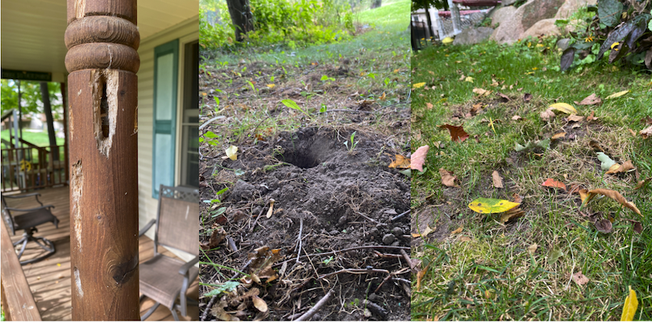
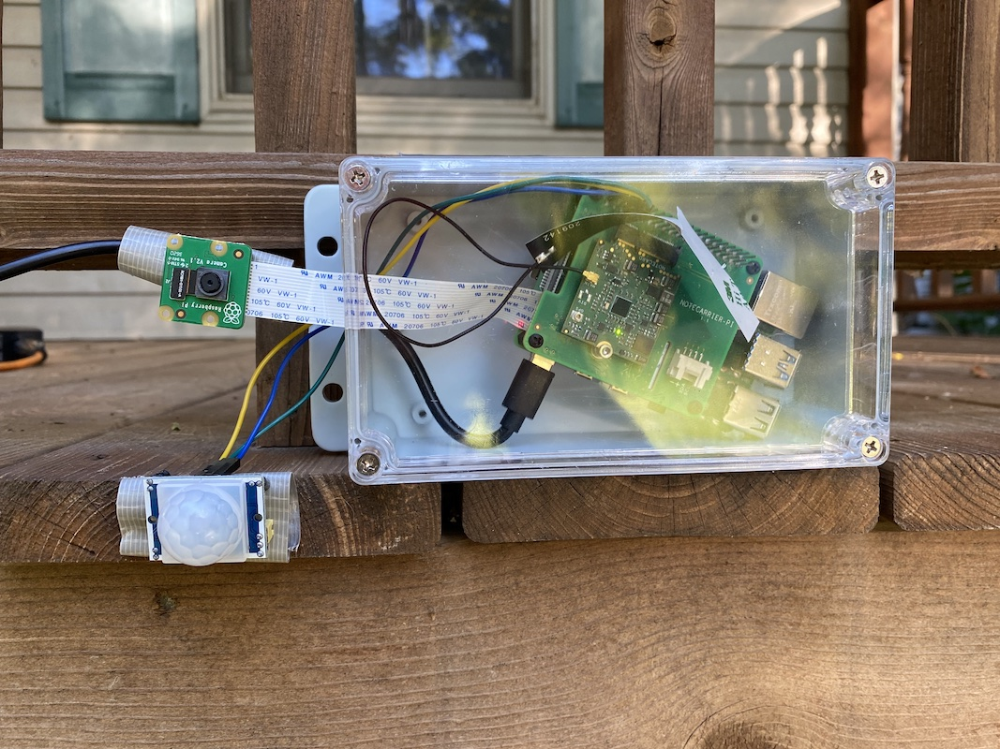
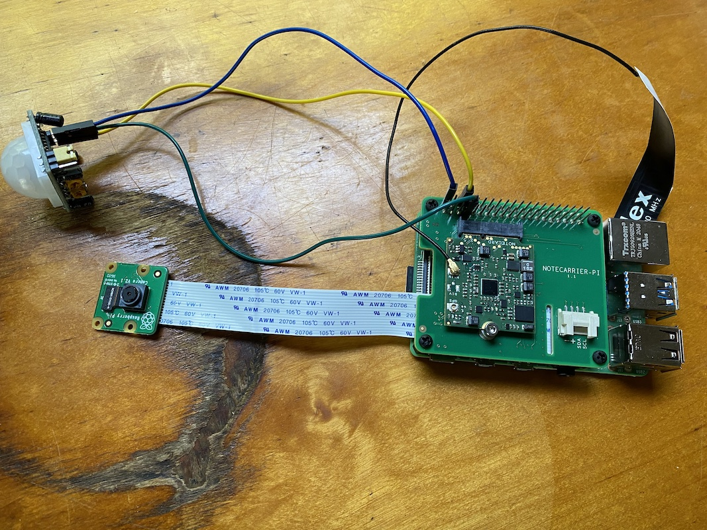
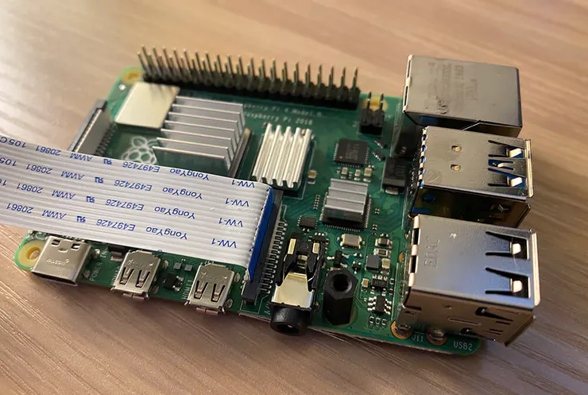
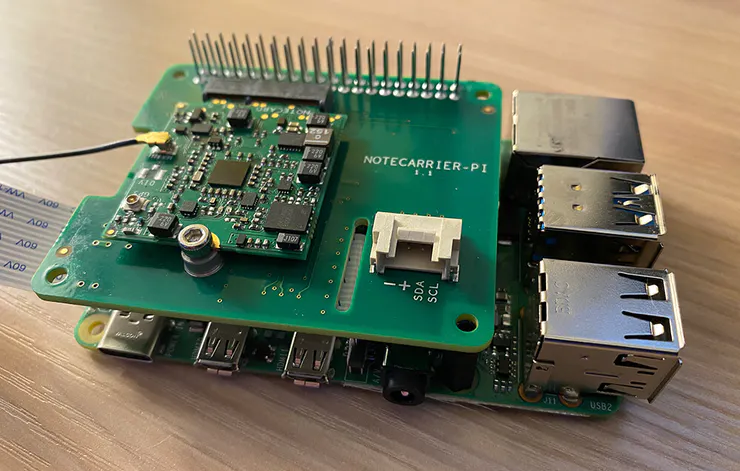
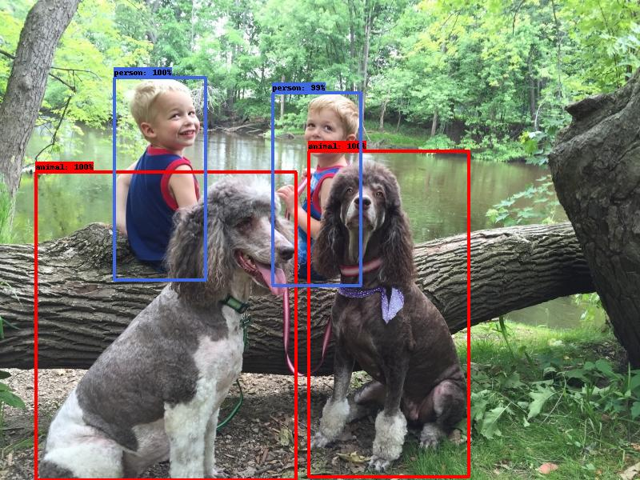
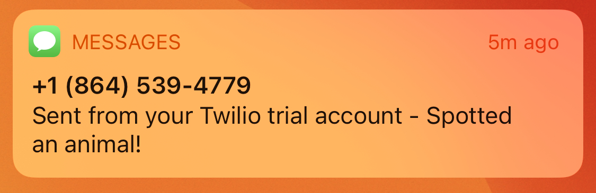
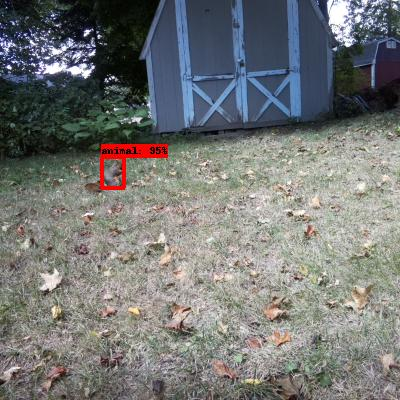

# What’s Destroying My Yard? Pest Detection With Raspberry Pi

My yard is under attack. Woodpeckers are drilling holes in my deck, something is living under (and destroying) my shed, and moles have dug a series of tunnels that rival most city’s subway systems.


*Picture of the battlefield—aka my yard*

I’ve watched a lot of war movies, so I know the first step to winning any war is to understand your enemy. And as a software developer, I’m constantly looking for an excuse to overengineer solutions to my problems.

That’s why I used a Raspberry Pi, a Pi camera, and a bit of machine learning to try to catch my yard’s attackers in action. More specifically, here’s a high-level overview of what I did.

* I put a Raspberry Pi in my yard.
* I connected a motion detector to the Pi.
* I connected a Pi camera to the Raspberry Pi.
* When the detector detects motion, I take a picture with the Pi camera.
* I analyze the photo using a machine-learning algorithm.
* If the photo contains an animal, I store the photo and send myself a notification.
* If the photo does _not_ contain an animal, I delete the photo.



In this article I’ll run through these steps in detail, and teach you how you can replicate some (or all) of this setup if you so choose. Let’s get started!

* [Step #1: Connect everything](#step-1)
* [Step #2: Detect motion](#step-2)
* [Step #3: Take a picture](#step-3)
* [Step #4: Analyze the picture with machine learning](#step-4)
* [Step #5: Send notifications](#step-5)
* [Step #6: Place outdoors](#step-6)
* [Step #7: Running it](#step-7)
* [Potential improvements](#potential-improvements)

> **NOTE**: The full source code for this project is [available on GitHub](https://github.com/tjvantoll/pest-detector).

> **FUN MOLE FACT**: The star-nosed mole—the species that happens to be in my yard—is [considered the world’s fastest eater](https://www.nationalgeographic.com/animals/article/star-nosed-mole-touch-pain-senses), and can find and eat an insect or worm in a quarter of a second. They also look weird—like, [really weird](mole.webp).

<h2 id="step-1">Step #1: Connect everything</h2>

Let’s start by talking about how to hook everything up. For this project I’m using a Raspberry Pi 4, a PIR motion sensor (for detecting motion), a Raspberry Pi Camera (for taking pictures), and a [Blues Wireless Raspberry Pi Starter Kit](https://shop.blues.io/products/raspberry-pi-starter-kit?utm_source=hackster&utm_medium=web&utm_campaign=featured-project) (for wireless cellular connectivity). Here’s what things look like when they’re all connected.



If you’re looking to set this up for yourself, you’ll want to start by connecting the Pi Camera to the Pi Camera slot on the Pi.



Next, you’ll want to attach the Blues Wireless Notecarrier on top of the Raspberry Pi by lining up the pass-through headers.



And finally, you’ll need to connect a motion sensor of your choice to the Pi. I went with a [cheap sensor off Amazon](https://www.amazon.com/gp/product/B08N64S1TF/ref=ppx_yo_dt_b_asin_title_o00_s00?ie=UTF8&psc=1), which I later regretted (more on that later), so I’d recommend doing some searching around to find one that gets good reviews. (And if you find a good one tell me in the comments 🙂 )


Once you have everything hooked up, you’re ready to start coding!

> **FUN MOLE FACT #2**: You didn’t think there’d be two of these, did you? Remember our friend the star-nosed mole? They’re [one of two animals in the world known to smell underwater](https://www.nationalgeographic.com/animals/article/star-nosed-mole-touch-pain-senses), and they do so by blowing air bubbles and sucking them back into their nose. Creepy!

<h2 id="step-2">Step #2: Detect motion</h2>

Detecting motion was the first problem I wanted to tackle, because I use it as the trigger for everything that happens next. Plus, the machine-learning algorithm I use (and which we’ll discuss in step 4) is fairly processor intensive, so I want to make sure we’re only running that process when an animal might actually be in the picture.

Here’s the Python code I ended up using.

``` python
import RPi.GPIO as GPIO

pir_sensor_pin = 4
GPIO.setmode(GPIO.BCM)
GPIO.setup(pir_sensor_pin, GPIO.IN)

def main():
  while True:
    sensor_state = GPIO.input(pir_sensor_pin)
    if sensor_state == GPIO.HIGH:
      print('Motion detected')

    time.sleep(5)

main()
```

The idea here is to check the state of the motion sensor by checking the state of the Pi GPIO pin that it’s connected to every 5 seconds. If the pin is pulled high, that means the sensor detected motion. And when that happens the code is above is just printing a string for debugging, but in later sections we’ll use this trigger to do more interesting things.

If you’re setting this up yourself, go ahead and save this code in a new Python file on your Pi, e.g. `pest.py`, and run it with `python3 pest.py`. If everything is working correctly, you should be able to wave your hand in front of the sensor and see `Motion detected` in your terminal output.

> **NOTE**: The code you need to use might vary based on the sensor you’re using and the GPIO pin you connect to. [This article](https://learn.sparkfun.com/tutorials/raspberry-gpio/all) is a pretty good reference to check which pin you’re using with the Python `GPIO` API.

Now that we have the code to sense motion in place, let’s move on to the next logical step, and look at how to use the Pi Camera.

<h2 id="step-3">Step #3: Take a picture</h2>

In order to analyze an image with machine learning you need a picture. Luckily the Pi has a common camera that works great and is [very well documented](https://projects.raspberrypi.org/en/projects/getting-started-with-picamera).

> **NOTE** If you’re new to the Pi camera, make sure you [enable the camera on your Pi](https://projects.raspberrypi.org/en/projects/getting-started-with-picamera/2) before continuing.

Here’s the code I used to take a picture.

``` python
import os
import picamera
import time

def get_image_name():
  path, dirs, files = next(os.walk('images'))
  file_count = len(files)
  return 'images/' + str(file_count + 1) + '.jpg'

def take_picture():
  image_name = get_image_name()
  camera = picamera.PiCamera()
  camera.resolution = (400, 400)
  camera.rotation = 180
  camera.start_preview()
  time.sleep(2)
  camera.capture(image_name)
  camera.stop_preview()
  camera.close()
  return image_name

take_picture()
```

A couple of things need a bit of explanation here. First, the `get_image_name` function does a bit of logic to determine the name of the image when I save it to disk.

```
def get_image_name():
  path, dirs, files = next(os.walk('images'))
  file_count = len(files)
  return 'images/' + str(file_count + 1) + '.jpg'
```

The code here names the image after the number of images currently in the `images` directory, which will eventually create a file structure that looks like this.

```
└── images
    ├── 1.jpg
    ├── 2.jpg
    ├── 3.jpg
    └── etc...
```

The rest of the code is fairly standard Pi camera logic, but I’ll add a few notes about this section.

``` python
def take_picture():
  image_name = get_image_name()
  camera = picamera.PiCamera()
  camera.resolution = (400, 400)
  camera.rotation = 180
  camera.start_preview()
  time.sleep(2)
  camera.capture(image_name)
  camera.stop_preview()
  camera.close()
  return image_name
```

* `camera.rotation = 180` flips the image upside down. I installed the camera in my yard upside down, so you can remove that line if you install things sensibly.
* `time.sleep(2)` gives the camera two seconds to sense light levels before taking pictures, which the Pi Camera’s documentation recommends.
* `camera.close()` is required if you’re taking one than more photo in a program. If you forget this you’ll get an error that does not point you in the right direction.

And finally, the end of `take_picture()` returns an image name, which will help our next step access the photo to see if it contains an animal. Here’s what that looks like if we add the call to `take_picture()` into our `main()` function.

```
def main():
  while True:
    sensor_state = GPIO.input(pir_sensor_pin)
    if sensor_state == GPIO.HIGH:
      image_name = take_picture()
      // determine if the photo contains an animal

    time.sleep(5)

main()
```

Now that we have a photo to work with we next have to determine if that photo contains an animal. Let’s look at how to do that.

> **FUN MOLE FACT #3**: [Moles can dig up to 18 feet in one hour](https://easyscienceforkids.com/all-about-moles/). And they appear to be attempting that in my yard.

<h2 id="step-4">Step #4: Analyze the picture with machine learning</h2>

One of the most common applications of machine learning is image classification—or the ability to take an image and figure out what’s in it.



The image classification process depends on a model, which is a file that has been trained to recognize certain kinds of patterns. You can either build this file yourself, using a platform like [Edge Impulse](https://www.edgeimpulse.com/), or find a [pre-trained model on a platform like TensorFlow](https://tfhub.dev/).

For this project, my ideal model would be able to identify common yard animals yard—squirrels, chipmunks, racoons, skunks, and so on—but unfortunately I was unable to find one pre-built (if you know of one please tell me in the comments). Building my own model was an option, but I don’t have a catalog of rodent images ready, and finding enough on the internet is a tough task.

Ultimately I ended up using a project from Microsoft called [CameraTraps](https://github.com/microsoft/CameraTraps). CameraTraps includes a model known as the [MegaDetector](https://github.com/microsoft/CameraTraps/blob/master/megadetector.md), which besides having an amazing name, also has the ability to detect animals and people in still images.


CameraTraps works amazingly, BUT, because the tool can detect basically every animal in existence, it is _very_ processor-intensive for a Raspberry Pi to run. The Pi _can_ run the detector, and I’ll show you how momentarily, but individual photos can take 1–2 minutes to process—so if you do plan on using the MegaDetector it might be worth capturing images on the Pi, and doing the actual processing on a beefier setup. For my purposes I decided to keep things simple and running everything on the Pi.

If you want to try to get this running yourself, start by going through the [MegaDetector’s setup instructions](https://github.com/microsoft/CameraTraps/blob/master/megadetector.md#2-run_tf_detector_batchpy), which involve downloading the most recent model (`.pb`) file, as well as the MegaDetector’s dependencies using `pip`.

Next, you’ll want to use the following code to run the detector itself. Feel free to toy with the `confidence_threshold`, but I set it quite low (60%), as I’m happy to accept anything animal-like, especially while trying this out.

``` python
from pathlib import Path
from run_tf_detector_batch import load_and_run_detector_batch

# This just gets a reference to the MegaDetector’s model (.pb) file
model = './md_v4.1.0'
model = ''.join([str(f) for f in Path('.').rglob('*.pb')])

def process_image(file_name):
  # This runs the detector itself and tosses the output in an
  # output.json file.
  return load_and_run_detector_batch(
    model_file=model,
    image_file_names=[file_name],
    checkpoint_path='./output.json'
    confidence_threshold=0.6,
  )
```

The `load_and_run_detector_batch` function returns an array of images (you can process multiple images at once), each of which contains an array of things the MegaDetector detected.

```

{
 "images": [
  {
   "file": "images/1.jpg",
   "max_detection_conf": 0.971,
   "detections": [
    {
     "category": "1",
     "conf": 0.971,
     "bbox": [
      0.3231,
      0.004868,
      0.6683,
      0.3121
     ]
    }
   ]
  }
 ]
```

This means that we next need a bit of code to parse that JSON and determine if the MegaDetector detected an animal. That code looks a little something like this.

``` python
def is_animal_image(ml_result):
  for detection in ml_result['detections']:
    # A detection of '1' is an animal ('2' is a human)
    if detection['category'] == '1':
      return True
  return False
```

And to put everything together, if we zoom back out to our `main` function our code now looks like this.

``` python
def main():
  while True:
    sensor_state = GPIO.input(pir_sensor_pin)
    if sensor_state == GPIO.HIGH:
      image_name = take_picture()

      # This is the new stuff that processes the image from
      # the camera. If the image does not contain an animal,
      # delete the image.
      ml_result = process_image(image_name)[0]
      if is_animal_image(ml_result):
        print('Animal detected!')
      else:
        print('No animal detected')
        os.remove(image_name)

    time.sleep(5)

main()
```

And with this, we now have an algorithm that can detect motion, take pictures, and analyze those photos to determine if they contain an animal. Pretty cool!

But there’s one final coding task I want to cover, and that’s notifications, as I wanted to know when my camera spotted an animal so I can run out and try to see it too.

<h2 id="step-5">Step #5: Send notifications</h2>

When this project started I knew that I wanted to send notifications when I detected an animal, but I didn’t know exactly how to do it. Most of the places I wanted to monitor weren’t right next to my house, and therefore had shaky access to my home WiFi (at best).

I ended up using the Notecard from [Blues Wireless](https://blues.io/?utm_source=hackster&utm_medium=web&utm_campaign=featured-project), as it allows you to easily send data over cellular, so that you’re not dependent on a WiFi network to send http requests. (Full disclosure: I now work at Blues, and it’s because we’re making awesome stuff like this 🙂 )

As a quick reminder from step #1, the Notecard and its Notecarrier are this bit of hardware that slots right on top of the Pi.


If you want to try the Notecard out, start by going through its [quickstart tutorial](https://dev.blues.io/get-started/quickstart/notecarrier-pi/?utm_source=hackster&utm_medium=web&utm_campaign=featured-project), which will teach you the basics and help you set up a [Notehub](https://notehub.io) account, which is where the Notecard sends its data by default.

Blues also has an [extremely comprehensive guide on routing Notehub data to Twilio](https://dev.blues.io/notehub/routing-guides/twilio-route/?utm_source=hackster&utm_medium=web&utm_campaign=featured-project), which is what I ended up using for my project. If you want to follow along, start by going through the steps in [the Blues tutorial](https://dev.blues.io/notehub/routing-guides/twilio-route/?utm_source=hackster&utm_medium=web&utm_campaign=featured-project), which will show you how to create a Twilio account and set everything up. Once that’s done you can use the following Python code to connect to the Notecard and send a Twilio-based notification.

``` python
import keys
import notecard

# Replace this with your own Notehub project UID
notehub_uid = 'com.blues.tvantoll:pestcontrol'
port = I2C('/dev/i2c-1')
card = notecard.OpenI2C(port, 0, 0)

def init_notecard():
  req = {'req': 'hub.set'}
  req['product'] = notehub_uid
  req['mode'] = 'continuous'
  req['sync'] = True
  res = card.Transaction(req)
  print(res)

def send_to_notehub():
  req = {'req': 'note.add'}
  req['file'] = 'twilio.qo'
  req['sync'] = True
  req['body'] = {
    'body': 'Spotted an animal!',
    'from': keys.sms_from,
    'to': keys.sms_to,
  }
  res = card.Transaction(req)
  print(res)
```

The Notecard works by sending JSON commands, which makes the code very readable. In this case you’re doing a bit of setup and then defining two functions, one which initializes the Notecard, and another which sends a simple “note” to Notehub. And sending that note is what triggers Notehub to route that data to Twilio and send a text message.

> **NOTE**: In my repo I have a `keys.py` file that defines `sms_from` and `sms_to` variables. The `sms_from` is a Twilio-generated number that the Blues tutorial helps you create, and the `sms_to` is my personal number, which I won’t be providing here 🙂

If we return back to the `main` function we’ve been building throughout this article, it now looks like this.

``` python
def main():
  # One time initialization of the Notecard
  init_notecard()

  while True:
    sensor_state = GPIO.input(pir_sensor_pin)
    if sensor_state == GPIO.HIGH:
      image_name = take_picture()
      ml_result = process_image(image_name)[0]
      if is_animal_image(ml_result):
        # Send myself a text message when the detector finds an animal
        send_to_notehub()
        print('Animal detected!')
      else:
        print('No animal detected')
        os.remove(image_name)

    time.sleep(5)

main()
```

And with that, we’re done, at least with code (which as a reminder is [available on GitHub](https://github.com/tjvantoll/pest-detector)).

At this point we have a setup that can detect motion, take a picture when it does, analyze that photo, and send a text message when a ML algorithm detects an animal in that photo. Now that the code is ready, let’s put this thing into action.

<h2 id="step-6">Step #6: Place outdoors</h2>

A Raspberry Pi is not water proof, and neither is its camera, so I wanted to build something that provided a bit of protection for my hardware, even if it was a bit clunky.

And that “even if it was a bit clunky” bit ended up being fairly relevant, as what I ended up building isn’t getting me a job on Apple’s design team anytime soon.


The big piece of plastic is an [Awclub ABS Plastic Junction Box](https://www.amazon.com/gp/product/B07BQD3SZV/ref=ppx_yo_dt_b_asin_title_o01_s00?ie=UTF8&psc=1), which does a pretty good job at holding the Pi itself. I did have to drill a hole in the top for running a power cord to the Pi.

I then attached the Pi Camera and my sensor to my deck (and eventually various surfaces around my yard) with duck tape, which worked surprisingly well. Long term I’d love to come up with a solution that can protect the camera while still allowing it to take good pictures, but for my simple purposes this setup worked well enough, and if was left the project outdoors for a long period of time I made sure I covered up the camera or brought it inside.

I powered the Pi with its standard USB-C cable and a series of extension cords. I could of powered everything by battery, but the current ML algorithm is pretty processor heavy, so I decided to ensure the Pi was constantly fully charged and lived with the clunkiness of the cord for now.

And when I got to this point, it was time to start detecting animals!

> **FUN MOLE FACT #4**: [Moles paralyze worms and insects with poison in their saliva](https://easyscienceforkids.com/all-about-moles/). Then they store the insects in an underground room to eat later. Cute!

<h2 id="step-7">Step #7: Running it</h2>

The very last step to this project is to start up the code itself. During testing I had been SSHing into my Pi and manually running the `main.py` command.

```
python3 main.py
```

This works, but the command would stop when my SSH session disconnected, which isn’t great for a process I want to run continuously. To fix this I ended up using the [Linux `nohup` command](https://linuxize.com/post/linux-nohup-command/), which allows you run a command in a way that ignores the signal the Pi’s OS fires when an SSH session disconnects.

```
nohup python3 main.py
```

With this everything was truly in place and I could sit back and wait. And it took a few hours, but eventually I found my first victim.



I ran over to find that my code does indeed work, and that a squirrel was very interested in something just behind my deck.


And a few hours later the same critter (or their friend) came back for more.



And after having this project deployed for several days, so far all I’ve found is a bunch of squirrels, which is fun, but I was hoping to catch something more exotic in action (if I do I’ll post pictures in the comments). And before I leave, I want to discuss some reasons why I think I’m not getting as many animal images as I’d like, and give you some tips if you’re trying to build something like this yourself.

<h2 id="potential-improvements">Potential improvements</h2>

**A better motion sensor**

The cheap motion sensor I got off Amazon works, but it’s super sensitive—even on its lowest sensitivity configuration. This thing triggers every few seconds when nothing is going on in my yard, so either this thing is picking up paranormal activity, or it’s too sensitive to be practical for outdoor use.

**A more efficient ML model**

Microsoft’s MegaDetector is amazing, but it was clearly not designed to be run on Raspberry Pi. Ideally I would custom train a model to look just for small rodents—which, if I might try if I get enough images from my current setup.

**Better weather proofing**

I want to be able to set and forget my setup for days at a time, and with my current casing that isn’t possible. I need to find a way to include a sensor and camera within a case, while ensuring they continue to work as expected.

**More battery conscious**

My significant other isn’t all that pleased that I’m running extension cords around our yard for “important work business”. If I can find or build a more efficient ML model then I can easily run this project entirely on battery power, or maybe solar.

## Wrapping up

Overall I was pretty happy with how this project turned out. It’s kind of neat to get pictures of the random animals in my yard, and I’m hoping that with enough time I’ll be able to catch a broader collection of critters in action.

And even if I don’t, I learned a lot from going through this process—like how to work with ML models, how to send notifications with the Notecard and Twilio, and how to do a bit of weatherproofing—even if I did a bad job at it 🙂