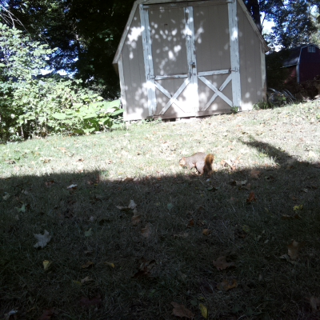
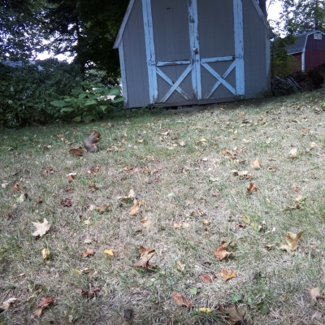

# What’s Destroying My Yard? Pest Detection With Raspberry Pi

My yard is under attack. Woodpeckers are drilling holes in my deck, something is living under (and destroying) my shed, and moles have dug a series of tunnels that rival most city’s subway systems.

-- image of holes--
*Actual picture of the battlefield—aka my yard*

> **Fun mole fact**: The star-nosed mole—the species that happens to be in my yard—is [considered the world’s fastest eater](https://www.nationalgeographic.com/animals/article/star-nosed-mole-touch-pain-senses), and can find and eat an insect or worm in a quarter of a second. They also look weird—like, [really weird](https://static.wikia.nocookie.net/animals-are-cool/images/0/01/Star-nosed-mole-tentacles.jpg/revision/latest?cb=20180322022203).

I’ve watched a lot of war movies, so I know the first step to winning any war is to understand your enemy. And as a software developer, I’m constantly looking for an excuse to overengineer a solution to a problem.

That’s why I used a Raspberry Pi, a Pi camera, a bit of machine learning, and some Twilio notifications to try to catch my yard’s attackers in action. More specifically, here’s a high-level overview of what I did.

* I put a Raspberry Pi in my yard.
* I connected a motion detector to the Pi.
* I connected the Pi camera to the Raspberry Pi.
* When the detector detects motion, I take a picture with the Pi camera.
* I analyze the photo using a machine-learning algorithm.
* If the photo contains an animal, I store the photo and send myself a notification.
* If the photo does _not_ contain an animal, I delete the photo.


In this article I’ll run through these steps, and teach you how you can replicate some (or all) of this setup if you so choose. Let’s get started!

-- put toc here --

> **NOTE**: The full source code for this project is [available on GitHub](https://github.com/tjvantoll/pest-detector).

## Step #1: Connect everything

First things first, let’s talk about how to hook everything up. For this project I’m using a Raspberry Pi 4, a PIR motion sensor (for detecting motion), a Raspberry Pi Camera (for taking pictures), and a Blues Wireless Raspberry Pi Starter Kit (for wireless cellular connectivity). Here’s what things look like when they’re all connected.


If you’re looking to set this up for yourself, you’ll want to start by connecting the Pi Camera to the Pi Camera slot on the Pi.


Next, you’ll want to attach the Blues’ Notecarrier-Pi HAT on top of the Raspberry Pi by lining up the pass-through headers.


And finally, you’ll need to connect a motion sensor of your choice to the Pi. I went with a [cheap sensor off Amazon](https://www.amazon.com/gp/product/B08N64S1TF/ref=ppx_yo_dt_b_asin_title_o00_s00?ie=UTF8&psc=1), which I later regretted (more on that later), so I’d recommend doing some searching around to find one that gets good reviews. (And if you find a good one tell me in the comments 🙂 )


Once you have everything hooked up, you’re ready to start coding!

> **Fun mole fact #2**: You didn’t think there’d be two of these, did you? Remember our friend the star-nosed mole? They’re [one of two animals in the world known to smell underwater](https://www.nationalgeographic.com/animals/article/star-nosed-mole-touch-pain-senses), and they do so by blowing air bubbles and sucking them back into their nose. Creepy!

## Step #2: Detect motion

Detecting motion was the first problem I wanted to tackle, because I use it as the trigger for everything that happens next. Plus, the machine-learning algorithm I use (and which we’ll discuss in step #4) is fairly processor intensive, so I want to make sure we’re only running that process when an animal might actually be in the picture.

Here’s the Python code I ended up using.

``` python
import RPi.GPIO as GPIO

pir_sensor_pin = 4
GPIO.setmode(GPIO.BCM)
GPIO.setup(pir_sensor_pin, GPIO.IN)

def main():
  while True:
    sensor_state = GPIO.input(pir_sensor_pin)
    if sensor_state == GPIO.HIGH:
      print('Motion detected')

    time.sleep(5)

main()
```

The idea here is to check the state of the motion sensor by checking the state of the Pi GPIO pin that it’s connected to every 5 seconds. If the pin is pulled high, that means the sensor detected motion. At the moment this code is just printing a string for debugging, but in later sections we’ll use this trigger to do more interesting things.

If you’re setting this up yourself, go ahead and save this code in a new Python file on your Pi, e.g. `_pest.py`, and run it with `python3 pest.py`. If everything is working correctly, you should be able to wave your hand in front of the sensor and see `Motion detected` in your terminal output.

> **NOTE**: The code you need to use might vary based on the sensor you’re using and the GPIO pin you connect to. [This article](https://learn.sparkfun.com/tutorials/raspberry-gpio/all) is a pretty reference to check which pin you’re using with the Python `GPIO` API.

Now that we have code to sense motion, let’s move on to the next logical step, and look at how to take a picture.

## Step #3: Take a picture

In order to analyze a picture with machine learning you need, well, a picture. Luckily the Pi has a common camera that works great and is [very well documented](https://projects.raspberrypi.org/en/projects/getting-started-with-picamera).

> **NOTE** If you’re new to the Pi camera, make sure you [enable the camera on your Pi](https://projects.raspberrypi.org/en/projects/getting-started-with-picamera/2) before continuing.

Here’s the code I used to take a picture.

``` python
import os
import picamera
import time

def get_image_name():
  path, dirs, files = next(os.walk('images'))
  file_count = len(files)
  return 'images/' + str(file_count + 1) + '.jpg'

def take_picture():
  image_name = get_image_name()
  camera = picamera.PiCamera()
  camera.resolution = (400, 400)
  camera.rotation = 180
  camera.start_preview()
  time.sleep(2)
  camera.capture(image_name)
  camera.stop_preview()
  camera.close()
  return image_name

take_picture()
```

A couple of things need a bit of explanation here. First, the `get_image_name` function does a bit of logic to determine the name of the image when I save it to disk.

```
def get_image_name():
  path, dirs, files = next(os.walk('images'))
  file_count = len(files)
  return 'images/' + str(file_count + 1) + '.jpg'
```

The code here names the image after the number of images currently in the `images` directory’s, which will eventually create a file structure that looks like this.

```
└── images
    ├── 1.jpg
    ├── 2.jpg
    ├── 3.jpg
    └── etc...
```

The rest of the code is fairly standard Pi camera logic, but I’ll add a few notes.

``` python
image_name = get_image_name()
camera = picamera.PiCamera()
camera.resolution = (400, 400)
camera.rotation = 180
camera.start_preview()
time.sleep(2)
camera.capture(image_name)
camera.stop_preview()
camera.close()
return image_name
```

* `camera.rotation = 180` is in there because I set up the camera in my yard upside down, so you can remove that line if you install things sensibly.
* `time.sleep(2)` gives the camera two seconds to sense light levels before taking pictures.
* `camera.close` is required if you’re taking one than more photo in a program. If you forget this you’ll get an error that does not point you in the right direction.

Finally, I’m returning the image name at the end because our next step will be evaluating this photo to see if it contains an animal. Specifically, here’s what our code looks like if we return back to the `main` function.

```
def main():
  while True:
    sensor_state = GPIO.input(pir_sensor_pin)
    if sensor_state == GPIO.HIGH:
      image_name = take_picture()
      // determine if the photo contains an animal

    time.sleep(5)

main()
```

But how exactly do you tell if a photo contains an animal?

> **Fun mole fact #3**: [Moles can dig up to 18 feet in one hour](https://easyscienceforkids.com/all-about-moles/). And they appear to be attempting new world records in my yard.

## Step #4: Analyze the picture with machine learning

One of the most common applications of machine learning is image classification—or the ability to take an image and figure out what’s in it.

-- image classifier in action --

The image classification process depends on a model, which is a file that has been trained to recognize certain kinds of patterns. You can either build this file yourself, using a platform like [Edge Impulse](https://www.edgeimpulse.com/), or find a [pre-trained model on a platform like TensorFlow](https://tfhub.dev/).

The ideal model for my purposes would be able to identify a handful of the most common yard animals yard—squirrels, chipmunks, racoons, skunks, and so on—but unfortunately I was unable to find one of these pre-built (if you know of one please tell me in the comments). Building a pest model is an option, but I would have to use pictures of random animals from the internet, and my goal is to identify animals I might not know of, so the chance of screwing something up seemed high.

Ultimately I ended up using a project from Microsoft called [CameraTraps](https://github.com/microsoft/CameraTraps). CameraTraps includes a model known as the [MegaDetector](https://github.com/microsoft/CameraTraps/blob/master/megadetector.md), which besides haing an A+ name, also has the ability to detect animals and people in still images.


CameraTraps works amazingly, BUT, because the tool can detect basically every animal in existence, it is _very_ processor-intensive for a Raspberry Pi to run. The Pi _can_ run the detector, and I’ll show you how momentarily, but individual photos can take 1–2 minutes to process, so if you do plan on using the MegaDetector it might be worth capturing images on the Pi, and doing the actual processing on a beefier setup. For now though I’m keeping things simple and running everything on the Pi.

If you want to try to get this running yourself, start by going through the [MegaDetector’s setup instructions](https://github.com/microsoft/CameraTraps/blob/master/megadetector.md#2-run_tf_detector_batchpy), which involve downloading the most recent model (`.pb`) file, as well as the MegaDetector’s dependencies using `pip`.

Next, you’ll want to use the following code to run the detector itself. Feel free to to toy with the `confidence_threshold`, but I set it quite low (60%), as I’m happy to accept anything animal-like, especially while trying this out.

``` python
from pathlib import Path
from run_tf_detector_batch import load_and_run_detector_batch

# This just gets a reference to the MegaDetector’s model (.pb) file
model = './md_v4.1.0'
model = ''.join([str(f) for f in Path('.').rglob('*.pb')])

def process_image(file_name):
  # This runs the detector itself and tosses the output in an
  # output.json file.
  return load_and_run_detector_batch(
    model_file=model,
    image_file_names=[file_name],
    checkpoint_path='./output.json'
    confidence_threshold=0.6,
  )
```

The result of `load_and_run_detector_batch` looks a little something like this, and per the MegaDetector’s documentation a `"category"` of `"1"` means an animal was detected.

```

{
 "images": [
  {
   "file": "images/1.jpg",
   "max_detection_conf": 0.971,
   "detections": [
    {
     "category": "1",
     "conf": 0.971,
     "bbox": [
      0.3231,
      0.004868,
      0.6683,
      0.3121
     ]
    }
   ]
  }
 ]
```

Meaning we need a bit of code to parse that JSON and determine that in Python code. That code looks a little something like this.

``` python
def is_animal_image(ml_result):
  for detection in ml_result['detections']:
    if detection['category'] == '1':
      return True
  return False
```

And to put everything together, if we zoom back out to our `main` function our code now looks like this.

``` python
def main():
  while True:
    sensor_state = GPIO.input(pir_sensor_pin)
    if sensor_state == GPIO.HIGH:
      image_name = take_picture()

      # This is the new stuff. After you get an image from
      # the camera. If the image does not contain an animal,
      # delete the image.
      ml_result = process_image(image_name)[0]
      if is_animal_image(ml_result):
        print('Animal detected!')
      else:
        print('No animal detected')
        os.remove(image_name)

    time.sleep(5)

main()
```

And with this, we now have an algorithm that can detect motion, take pictures, and analyze those photos to determine if they contain an animal. Pretty cool!

But there’s one final thing I wanted to cover, and that’s notifications, as I want to know when my camera spots an animal so I can run out and try to see it too.

## Step #5: Send notifications

I knew from starting this project that I wanted to notify myself when I detected an animal, but I didn’t know exactly how to do it. Most of the places I wanted to monitor weren’t right next to my house, and therefore had shaky access to my home WiFi (at best).

I ended up using the Notecard from [Blues Wireless](https://blues.io/), as it allows you to easily send data over cellular, so that you’re not dependent on a WiFi network to make a project like that. (Full disclosure: I now work at Blues, but it’s because we’re making awesome stuff like this 🙂 )

As a quick reminder, the Notecard and its Notecarrier are this bit of hardware that slots right on top of the Pi.


The Notecard’s API is JSON, which is super developer friendly, especially if you’ve ever tried to work with cellular in a more manual way.

If you want to try it out, start by going through the [quickstart tutorial](https://dev.blues.io/get-started/quickstart/notecarrier-pi/), which will teach you the basics and help you set up a [Notehub](https://notehub.io) account, which is where the Notecard sends its data by default.

Blues also has an [extremely comprehensive guide on routing Notehub data to Twilio](https://dev.blues.io/notehub/routing-guides/twilio-route/), which is what I ended up using for this tutorial. If you want to follow along, start by going through the steps in that tutorial, which will tell you how to create a Twilio account and set everything up, and then use the following Python code.

``` python
import keys
import notecard

# Replace this with your own Notehub project UID
notehub_uid = 'com.blues.tvantoll:pestcontrol'
port = I2C('/dev/i2c-1')
card = notecard.OpenI2C(port, 0, 0)

def init_notecard():
  req = {'req': 'hub.set'}
  req['product'] = notehub_uid
  req['mode'] = 'continuous'
  req['sync'] = True
  res = card.Transaction(req)
  print(res)

def send_to_notehub():
  req = {'req': 'note.add'}
  req['file'] = 'twilio.qo'
  req['sync'] = True
  req['body'] = {
    'body': 'Spotted an animal!',
    'from': keys.sms_from,
    'to': keys.sms_to,
  }
  res = card.Transaction(req)
  print(res)
```

The Notecard primarily works by sending JSON commands, which makes the code very readable. In this case you’re doing a bit of setup and then defining two functions, one which initializes the Notecard, and another which sends a simple “note” to Notehub. And sending that note is what triggers Notehub to route that data to Twilio and send me a text message.

> **NOTE**: In my repo I have a `keys.py` file that defines `sms_from` and `sms_to` variables. The `sms_from` is a Twilio-generated number that the Blues tutorial helps you create, and the `sms_to` is my personal number, which I won’t be providing here 🙂

If we return back to our `main` function we’ve been building throughout this article it now looks like this.

``` python
def main():
  # One time initialization of the Notecard
  init_notecard()

  while True:
    sensor_state = GPIO.input(pir_sensor_pin)
    if sensor_state == GPIO.HIGH:
      image_name = take_picture()
      ml_result = process_image(image_name)[0]
      if is_animal_image(ml_result):
        # Send myself a text message when the detector finds an animal
        send_to_notehub()
        print('Animal detected!')
      else:
        print('No animal detected')
        os.remove(image_name)

    time.sleep(5)

main()
```

And with that, we’re done, at least with code (which as a reminder is [available on GitHub](https://github.com/tjvantoll/pest-detector)).

At this point we have a setup that can detect motion, take a picture when it does, analyze that photo, and send a text message when a ML algorithm detects an animal in that photo. Now that the code is ready, let’s put this thing into action.

## Step #6: Place outdoors

A Raspberry Pi is not water proof, and neither is its camera, so I wanted to build something that provided a bit of protection for my hardware, even if it was a bit clunky.

And that “even if it was a bit clunky” bit ended up being fairly relevant, as what I ended up building isn’t getting me a job on Apple’s design team anytime soon.


The big piece of plastic is an [Awclub ABS Plastic Junction Box](https://www.amazon.com/gp/product/B07BQD3SZV/ref=ppx_yo_dt_b_asin_title_o01_s00?ie=UTF8&psc=1), which does a pretty good job at holding the Pi itself. I did have to drill a hole in the top for running a power cord.

I’ve been attaching the camera and sensor to various surfaces around my yard with duck tape, which works surprisingly well. Long term I’d love to come up with a solution that can protect the camera while still allowing it to take good pictures, but for my simple purposes this setup worked well enough, and if was leaving the project outdoors for a long period of time I made sure the camera was covered.

I power the Pi with its standard USB-C cable and a series of extension cords. I could power everything by battery, but the current ML algorithm is pretty processor heavy, so I decided to live with the clunkiness of the cord for now.

And at this point we have everything physically in place, so it’s time to start detecting animals!

> **Fun mole fact #4**: [Moles paralyze worms and insects with poison in their saliva](https://easyscienceforkids.com/all-about-moles/). Then they store the insects in an underground room to eat later. Cute!

## Step #7: Running it

The very last step to this project is to figure out how to start up the code itself. During testing I had been SSHing into my Pi and manually running the `main.py` command.

```
python3 main.py
```

This works, but the command stops when my SSH session disconnects, which isn’t great for a process I want to run continuously. To fix this I ended up using the [Linux `nohup` command](https://linuxize.com/post/linux-nohup-command/), which allows you run a command in a way that ignores the signal the Pi’s OS fires when an SSH session disconnects.

```
nohup python3 main.py
```

With this everything was truly in place and I could sit back and wait. And it took a few hours, but eventually I found my first victim.



And a few hours later the same critter (or their friend) came back for more.



I haven’t found captured anything more exotic on camera yet, but if I do I’ll post some new images in the comments. And before I leave you I want to discuss some reasons why I’m not getting as many animal images as I’d like.

## Potential improvements

**A better motion sensor**

The cheap motion sensor I got off Amazon works, but it’s super sensitive—even when I set it to its lowest sensitivity configuration. This thing is triggering every few seconds when looking at a static yard, so either this thing is picking up paranormal activity, or manufactured to be so sensitive that the sensor isn’t practical to use.

**A more efficient ML model**

Microsoft’s MegaDetector is amazing, but it was clearly not designed to be run on Raspberry Pi. Ideally I would custom train a model to look just for small rodents—which, if I get enough images from my current setup is maybe something I could try.

**Better weather proofing**

I want to be able to set and forget my setup for days at a time, and with my current rigged casing this isn’t possible. I need to find a way to include a sensor and camera within a case, while ensuring they continue to sense and take pictures as expected.

**More battery conscious**

My significant other isn’t super pleased at me running extension cords around the house for “important work business”. If I can find or build a more efficient ML model then I should be able to run this project entirely on battery power.

## Wrapping up

Overall I was pretty happy with how this project turned out. It’s kind of neat to get pictures of the random animals in my yard, and I’m hoping that given enough time I’ll be able to catch a broader collection of critters in action.

And even if I don’t I learned a lot from going through this process, like how to work with ML models, how to send notifications with the Notecard and Twilio, and how to do a bit of weatherproofing—even if I did a bad job at it 🙂