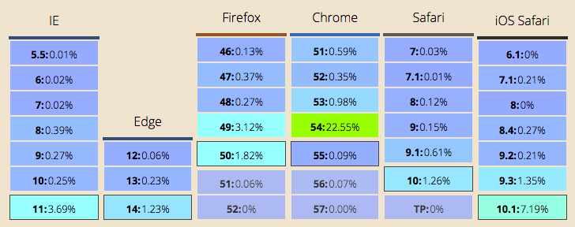
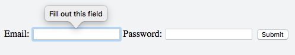
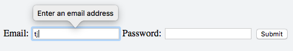

# Cross-Browser HTML5 Form Validation is Finally Here! Now What?

Last week the Safari team [released a new Technology Preview](https://webkit.org/blog/7093/release-notes-for-safari-technology-preview-19/), and the release contained a feature that caught my eye.

https://twitter.com/tjvantoll/status/806563094801551360

I’m irrationally excited because this is more than just a mundane feature shipping in a random browser preview. Safari was the last browser to implement HTML5 form validation—a feature that offers massive time savings for web developers—and it’s been a long time coming.

In this article I’d like to take a quick look at how we got here, what this change means, and what why cross-browser form validation may change the way we build forms on the web. Let’s start with a very brief history of browser support for form validation. 

## How did we get here?

Way back in 2008, Opera 9.5 become the [first browser to ship with support for form validation](http://cssgallery.info/tag/validate-forms/)—complete with a UI that looked very 2008.


*Opera 9.5’s implementation of email validation. Image from the illustrious [Dive Into HTML5](http://diveinto.html5doctor.com/forms.html) guide*

Just to give you some perspective on how long ago this feature first shipped, at the time Android 1.0 was still a few months away, IE 8 wasn’t a thing, and George W. Bush was the president of the United States. It’s been awhile.

Other browsers took a few years to match Opera’s early work, but all of them not named Safari eventually came around. Firefox and Chrome [each added support in March of 2011](http://caniuse.com/#feat=form-validation), and the IE team followed by adding to support to IE 10 in September of 2012. After that we started the four-year-long wait for the Safari update that has just occurred.

## What does this Safari update mean?

Although form validation has landed in Safari’s Technology Preview, it’ll be some time before the feature ships as part of a stable release. Although Safari has traditionally done yearly releases that conincide with iOS and macOS updates, they have given signs that they intend to ship more frequently.

Last March, [Safari 9.1 shipped](https://developer.apple.com/library/content/releasenotes/General/WhatsNewInSafari/Articles/Safari_9_1.html#//apple_ref/doc/uid/TP40014305-CH10-SW1) outside of an OS release, and included several non-trivial features like the picture element and CSS variables. It seems very possible that Apple may do this again, especially when all competing browsers now ship fairly regularly. If Apple stays to the same schedule we might see a Safari 10.1 release sometime around the Spring of 2017.

But even when Safari ships that won’t be the end of the story, as it’ll take older versions of the browser to die off. According to caniuse, [Safari 9.1 still has about half as much usage as Safari 10.0](http://caniuse.com/usage-table), and older versions of iOS Safari are still used at rates that can’t be ignored by most web applications.


*Excerpt of worldwide browser version usage from caniuse.com. Safari 9.1 and iOS Safari 9.3 still receive a non-trivial amount of traffic.*

But form validation is a bit unique when it comes to browser features, and this wait may not be as big of a deal as it first appears. To explain what I mean, let’s take a quick look at how browser-based form validation works.

## How the Web’s Form Validation Works

Suppose you’re building a login form for your web application. You will probably use markup that looks a little something like this.

``` HTML
<form>
  <label>
    Email:
    <input>
  </label>

  <label>
    Password:
    <input>
  </label>

  <button>Submit</button>
</form>
```

To activate the browser’s native form validation all you need to do is add one of a [small handful of attributes](https://developer.mozilla.org/en-US/docs/Web/Guide/HTML/HTML5/Constraint_validation) to your form controls. In the case of a login form the most relevant ones are `required` and `type`.

``` HTML
<form>
  <label>
    Email:
    <input type="email" required>
  </label>

  <label>
    Password:
    <input type="password" required>
  </label>

  <button>Submit</button>
</form>
```

Because the code above now contains `required` and `type="email"`, the browser will automatically prevent submission until the user types something in each form control, including a valid email address. Here’s what the errors look like in the new Safari Tech Preview.


*A required error in the Safari Technology Preview*


*An invalid email error in the Safari Technology Preview*

The main appeal of the web’s form validation is its simplicity. You can apply a handful of attributes and get functionality that used to require a non-trivial amount of JavaScript. And that simplicity is important, because the majority of forms on the web are nothing more than a user-friendly way to interact with some server-side API. To give a concrete example I’ll use a [small little grocery-management app](https://nativescript.github.io/sample-Groceries/) my colleague Jen Looper & I built earlier this year.


This form gathers data and sends it as a POST request to `https://api.everlive.com/oauth/token`. Most web forms do something like this—collect data, format it, send it to a backend, and handle the response. But this common workflow poses a question that has plagued developers for years: where do you put your form’s validation logic? The client? The server? Both?

Conventional wisdom says that you absolutely must validate input data in your server-side code. Although most people will use the user-friendly interfaces you create, there’s nothing to stop a malicious user from hitting your backend endpoints directly. Robust client-side validation cannot prevent bad, invalid, or dangerous data from reaching your backend.

Therefore as a front-end developer you have a problem: do you add client-side validation that duplicates your server-side code, or do you send everything to the backend blindly, and display an error messages that the backend returns? Traditionally the answer has been a little bit of both, and developers are forced to parse [rather complicated UX guidelines](https://medium.com/@andrew.burton/form-validation-best-practices-8e3bec7d0549#.bdzsrad3x) to try to build a quality experience for their users.

But I think cross-browser form validation has a chance to change this.

## How cross-browser form validation could change how we build forms

Tons of research has been done into how to [present error messages so users recognize their mistakes](https://www.smashingmagazine.com/2009/07/web-form-validation-best-practices-and-tutorials/). As I’m writing this, thousands of developers and designers are debating whether their error messages should appear above their inputs, alongside them, in tooltips, or whether they should use some other approach altogether.

It’s a shame that we’re all still building custom solutions to this problem rather than collectively using something built into the browser. Users tend to learn the UX features of their browsers if they’re exposed to them enough. We don’t debate whether a user will have  trouble inputting text into an `<input>`, or selecting an option from a `<select>`, because these are controls that the user sees in their browser of choice all the time. What if users expected to see errors using the browser’s built-in way of displaying them?


*A custom error message in Google Chrome*

The errors look different depending on the user’s browser of choice, but in theory users would learn how their browser handles this situation and how to act accordingly.


*A custom error message in the latest Safari Technology Preview*

The [web’s form validation APIs](https://developer.mozilla.org/en-US/docs/Web/Guide/HTML/HTML5/Constraint_validation) are surprisingly comprehensive and able to handle a number of common scenarios, but we’ve never really put them to the test. Can you name a major web application that uses the browser’s built-in form validation?

And one big site can make a big difference here. Imagine if google.com added `required` to their single `<input>`, or amazon.com to their search’s `input`; it would help teach users the browser’s validation UX, and also persuade developers that native form validation is something you can use in your own apps.

So here’s what I’m recommending: if you are responsible for a form in web application, give HTML-based form validation a real chance. The majority of your users already support it, and with upcoming Safari support the overwhelming majority of users will have built-in validation soon. If your form has a backend counterpart, your server-side validation logic isn’t going anywhere, so you might as well make your life as easy as possible on the front end. Wire up some simple way to show user-friendly error messages from your backend and you’ll have a fallback that’ll work for everyone.

Let’s give browser-based form validation a go—finally.
