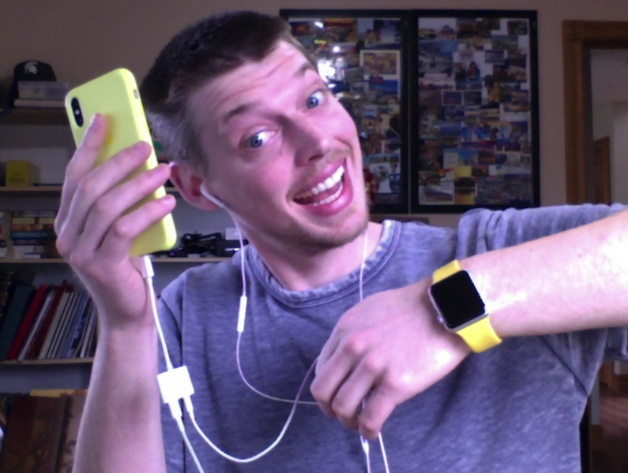

# Customizing the iOS Keyboard in Your NativeScript Apps

In the iOS versus Android developer war I’m long-time member of team iOS. I proudly [charge my Apple Mouse like a psychopath](https://fstoppers.com/gear/apples-magic-mouse-2-charged-major-design-flaw-92045), use the word “courage” unironically, and wear the [most ridiculous dongles](https://www.theverge.com/circuitbreaker/2017/10/1/16393078/apple-belkin-rockstar-iphone-adapter-headphone-lightning) in public.

_I seriously use this crap. Also, I think my skin is melting?_

I do all of this because iOS provides marginally better software than Android, and as a software developer, I’ve been trained to take life-or-death stances over the most trivial of details. It’s what defines us.

But there’s one part of iOS that even I cannot defend—its keyboard behavior. Specifically, iOS, a platform with over 2 million deployed applications, is surprisingly awful at providing a decent default keyboard for developers. If you’ve worked in NativeScript apps you’ve probably hit a situation like this at least once.

--image of the keyboard problem--

_iOS, the operating system that lets you authenticate with your face, has trouble allowing users to see what they’re typing 🤦🏻‍♂️_

> **NOTE**: For you Android lovers out there, yep, Android doesn’t have this problem. You’ve got this one, but if you bring it up in an argument with me prepare to answer for [this hot mess](https://developer.android.com/about/dashboards/index.html#Platform).