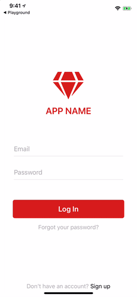
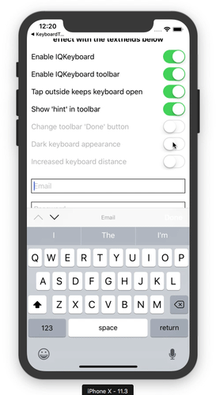
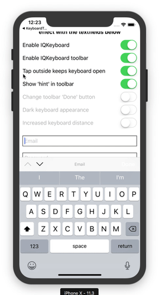

# Customizing the iOS Keyboard in Your NativeScript Apps

In the iOS versus Android developer war I’m long-time member of team iOS. I proudly [charge my Apple Mouse like a psychopath](https://fstoppers.com/gear/apples-magic-mouse-2-charged-major-design-flaw-92045), use the word “courage” unironically, and wear the [most ridiculous dongles](https://www.theverge.com/circuitbreaker/2017/10/1/16393078/apple-belkin-rockstar-iphone-adapter-headphone-lightning) in public.


_I seriously use this crap. Also, I think my skin is melting?_

I do all of this because I believe iOS provides marginally better software than Android, and as a software developer, I’ve been trained to take life-or-death stances over the most trivial of details. It’s what defines us.

But there’s one part of iOS that even I cannot defend, and that’s its bizarre keyboard behavior. Specifically, iOS, a platform with over 2 million deployed applications, is surprisingly awful at providing a decent default keyboard for developers.

If you’ve worked in NativeScript apps for more than a few hours, you’ve probably hit the situation in the gif below at least once. (I move focus to the second form field, and then can’t see what I’m typing because the keyboard is covering the input.)


_iOS, the operating system that lets you authenticate with your face, has trouble allowing users to see what they’re typing._

> **NOTE**: For you Android lovers out there, yes, Android [doesn’t have this problem](https://raw.githubusercontent.com/tjvantoll/articles/master/iqkeyboardmanager/android-keyboard.gif). You’ve got this one, but if you bring it up in an argument with me prepare to answer for [this hot mess](https://developer.android.com/about/dashboards/index.html#Platform).

Luckily, there’s a pretty easily solution to these problems that you can drop in rather easily.

## IQKeyboardManager

The iOS [IQKeyboardManager library](https://github.com/hackiftekhar/IQKeyboardManager) is a drop-in solution that will likely solve all of your iOS keyboard issues out of the box. To try it, install the [NativeScript wrapper of the library](https://github.com/tjvantoll/nativescript-IQKeyboardManager) using the `tns plugin add` command.

```
tns plugin add nativescript-iqkeyboardmanager
```

And, that’s it, as IQKeyboardManager works without you needing to write any code. For example if I just rerun the same app I showed earlier, not only does the keyboard no longer block my input, I also get a few helpful keyboard controls and labels for free.


_IQKeyboardManager handles the keyboard like iOS should by default._

> **TIP**: You can [try this example out for yourself on NativeScript Playground](https://play.nativescript.org/?template=play-ng&id=Hqp5UQ&v=205).

## Customizing IQKeyboardManager

Although IQKeyboardManager solves most of the common issues you’ll have with the iOS keyboard out of the box, there are some additional customization options you might want to try out. Let’s look at how they work.

### Grouping related textfields

Note in the gif above how IQKeyboardManager provides helpful arrow buttons to navigate between textfields. IQKeyboardManager is only able to provide those arrows if your textfields are sibling elements, aka if your markup looks something like this.

``` XML
<StackLayout>
  <TextField hint="Email"></TextField>
  <TextField hint="Password"></TextField>
</StackLayout>
```

The problem is oftentimes in real-world forms you need additional markup to make your form look good. In those cases you’ll want to use the IQKeyboardManager plugin’s `<PreviousNextView>` element. The usage of the element varies depending on whether you’re using NativeScript Core or NativeScript with Angular.

In NativeScript Core apps you need to bring in IQKeyboardManager as an XML namespace, which looks a little something like this.

``` XML
<Page xmlns:IQKeyboardManager="nativescript-iqkeyboardmanager">
  ...

  <!-- This is the wrapper that enables the previous/next buttons -->
  <IQKeyboardManager:PreviousNextView>

    <!-- This single StackLayout child of the PreviousNextView is also necessary. -->
    <StackLayout>

      <!-- Your textfields go here. -->
      <StackLayout>
        <TextField hint="Email"/>
      </StackLayout>
      <StackLayout>
        <TextField hint="Password"/>
      </StackLayout>

    </StackLayout>

  </IQKeyboardManager:PreviousNextView>
  ...
</Page>
```

If you’re using Angular, you need to register the `<PreviousNextView>` element with the following two lines of code in your TypeScript component.

``` TypeScript
import { registerElement } from "nativescript-angular";
registerElement("PreviousNextView", () => require("nativescript-iqkeyboardmanager").PreviousNextView);
```

And then you use the element directly in your markup.

``` XML
<PreviousNextView>

  <StackLayout>

    <!-- Your textfields go here. -->
    <StackLayout>
      <TextField hint="Email"/>
    </StackLayout>
    <StackLayout>
      <TextField hint="Password"/>
    </StackLayout>

  </StackLayout>

</PreviousNextView>
```

> **NOTE**: Vue usage of the plugin is possible too. Check out the [IQKeyboardManager plugin’s docs for the syntax you need](https://github.com/tjvantoll/nativescript-IQKeyboardManager#nativescript-w-vue-usage).

## Tweaking the appearance and behavior

Although IQKeyboardManager does provide a nice experience by default, it also gives you a number of customization options to meet the needs of your apps. Here’s a quick run down of the things you can do (and [refer to the plugin’s documentation for the exact syntax you’ll need](https://github.com/tjvantoll/nativescript-IQKeyboardManager#tweaking-the-appearance-and-behavior)).

### Use a dark keyboard

iOS provides both a light and dark keyboard, and the IQKeyboardManager plugin makes it easy to toggle between the two.



### Close the keyboard when the user taps outside a textfield

By default iOS does _not_ hide the keyboard when the user taps outside of the control. If you want to enable this behavior, aka you want to close the keyboard when the user taps outside the textfield, the plugin provides an option for that.



## Wrapping up

Overall, the IQKeyboardManager plugin provides functionality that should arguable be a part of iOS itself. (If you know of a good reason the OS should allow you to type in a textfield without seeing the textfield let me know in the comments.)

Luckily NativeScript makes it easy to include native libraries such as IQKeyboardManager, so including this functionality in your NativeScript app is as easy as a [quick install](https://github.com/tjvantoll/nativescript-IQKeyboardManager#installation).

So if you’re running into problems with the keyboard in your iOS app, give the plugin a shot.