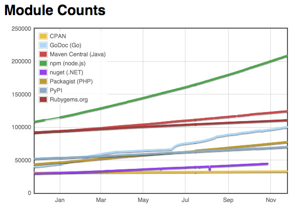
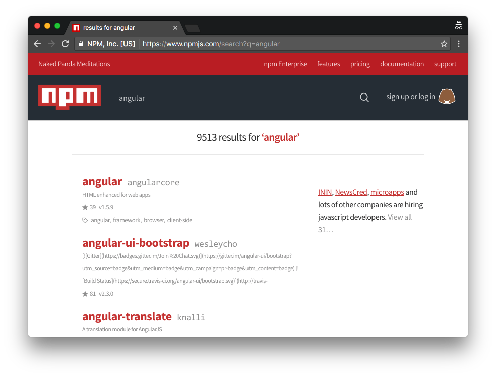
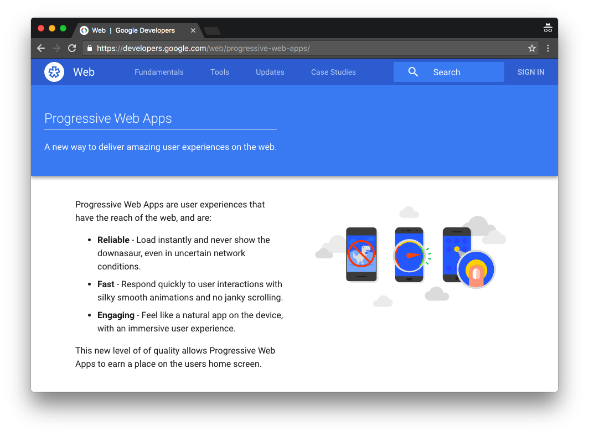
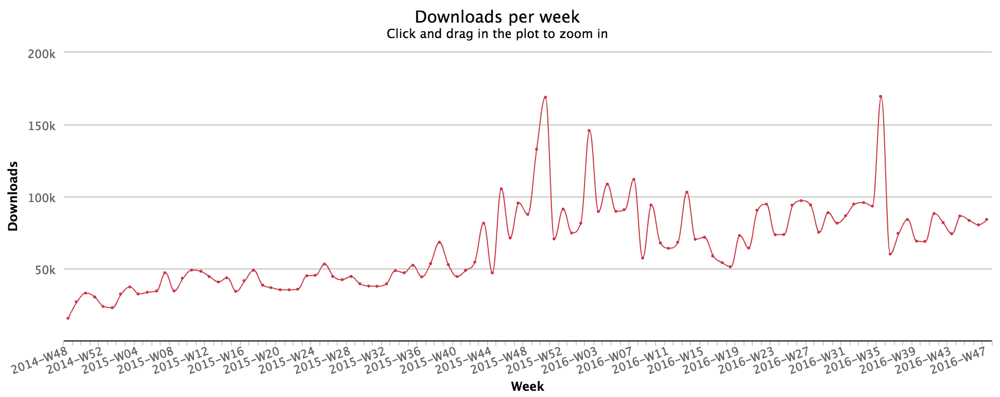
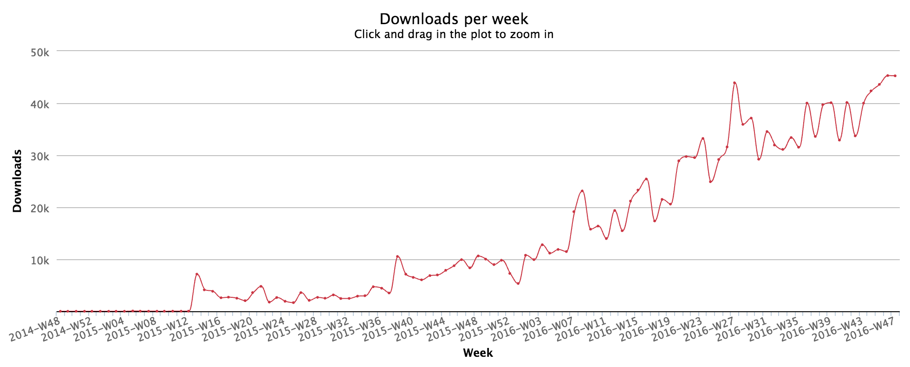
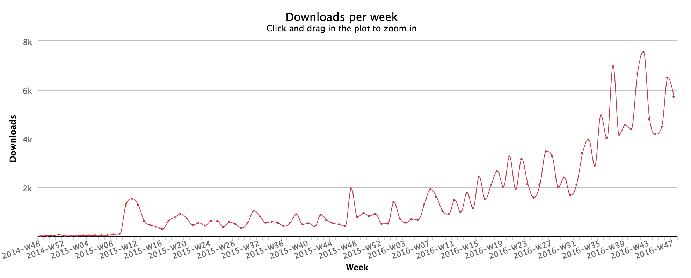
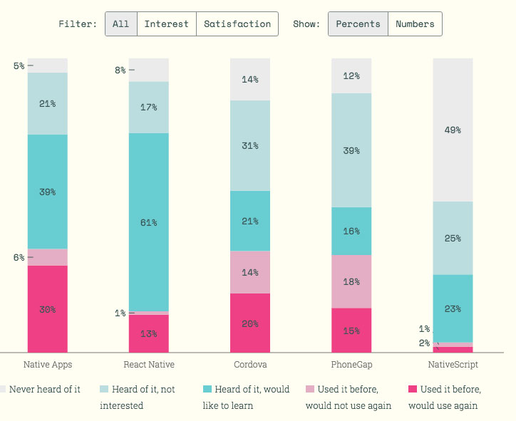
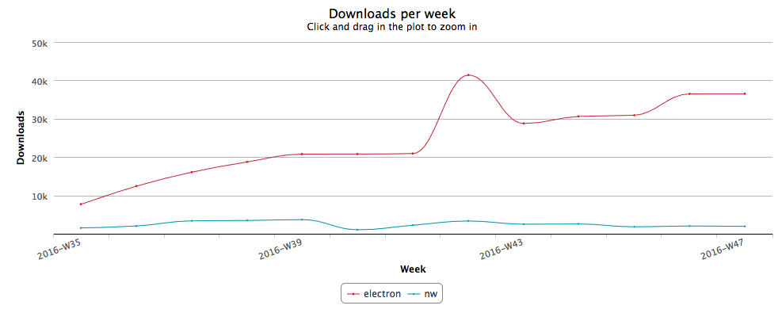

# JavaScript in 2017—Beyond the Browser

As the technology world has evolved, JavaScript has evolved with it. In previous years that meant JavaScript’s inclusion in software worlds it was never originally intended for, like server-side apps, mobile apps, and robots. And today, JavaScript’s growth has brought the language to chatbots, virtual reality, the internet of things, and a whole lot more.

In addition to reaching new frontiers, JavaScript’s role has become more established and stable in ecosystems it has long been a part of, such as server-side Node.js apps, as well as mobile and desktop application frameworks. In this article we’ll look back at some predictions we made a year ago for JavaScript in each of these software worlds, and then make some predictions about where JavaScript is heading outside of a browser in 2017. Let’s start by looking how JavaScript is doing in server-side app development.

## Node.js

[Node.js](https://nodejs.org/en/) is an open source runtime library for building both server-side apps, as well as small bits of JavaScript code you need to run outside of a browser environment. In the past few years Node has went from a niche technology popular in startups, to a mainstream development approach used by companies of all sizes.

Node’s package manager, npm, has transformed from hosting utility modules for server-side apps, to the canonical place to store distributable JavaScript code. Perhaps the best indication of Node’s rise is the sheer number of packages stored on npm. In last year’s predictions we included the following chart to show npm’s dominance over package managers in alternative languages.

*Module counts from [modulecounts.com](http://www.modulecounts.com/) as of December 2015*

Fast forward one year and npm’s growth shows no signs of slowing down. In fact, npm’s move from ~200,000 to ~350,000 packages has forced the Module Counts site to reconfigure their chart’s y axis.

*Module counts from [modulecounts.com](http://www.modulecounts.com/) as of December 2016*

There are a number of factors that have led to this increase, and one of them is a growing number of enterprise companies using Node in their infrastructure. In last year’s discussion we made the following prediction.

> “In 2016 expect to see further adoption of Node and its package manager npm. The continued adoption of Node from large companies — Microsoft, IBM, Intel, Progress, etc. — as well as enterprise-friendly features such as long-term support plans, may signal a growth in Node adoption in the enterprise, replacing typical enterprise solutions like .NET and Java.”

This wasn’t exactly a risky or unique predidction given Node’s growth, but it does seem to have been accurate. [Node’s own case study page](https://nodejs.org/en/foundation/case-studies/) has a small list of not-very-small companies that have now adopted Node, including the likes of Netflix, GoDaddy, and Capital One.

But perhaps the most telling sign of Node’s use in critical infrastructure comes from the first company listed on that page—NASA. You can read [Node’s case study on NASA for yourself](https://nodejs.org/static/documents/casestudies/Node_CaseStudy_Nasa_FNL.pdf), but I’ll drop in an excerpt here just to give you an idea.

> “When you’ve got the safety of astronauts on the line, little hiccups and service
interruptions turn into life-and-death situations. From EVA [extra vehicular activity] data to astronauts up in space,
Node.js helps ensure there’s a safe home for everything and everyone.”

But it’s not just the NASAs of the world driving Node’s growth. Node’s package manager, npm, has become the de facto choice to store JavaScript code across all environments—and that consolidation on a single package manager helps drive adoption of Node itself.

Literally every framework and technology we discuss in this article use npm to store and distribute their source code. A quick npm search for ["jquery"](https://www.npmjs.com/search?q=jquery), ["polymer"](https://www.npmjs.com/search?q=polymer), ["react"](https://www.npmjs.com/search?q=react), ["cordova"](https://www.npmjs.com/search?q=cordova), or ["nativescript"](https://www.npmjs.com/search?q=nativescript) can give you an idea of the sheer scale that npm operates at now. As JavaScript grows in popularity, npm grows in popularity. And as npm grows in popularity, so does Node.js. And there’s no reason to believe that this trend will end anytime soon.

*[Searching for “angular” on npmjs.com](https://www.npmjs.com/search?q=angular) returns nearly 10,000 results. Angular is one of many libraries that is distributed via npm.*

In 2017 we believe more companies will make the switch to Node from more traditional development approaches like Java and C#. We believe [TypeScript](https://www.typescriptlang.org/), a Microsoft-written superset of JavaScript will help drive Node’s growth, as its features make JavaScript a more approachable language for Java and C# developers. Node’s committment to [long-term support releases](https://github.com/nodejs/LTS) will also contribute to this growth, as it gives these companies a guarantee that the version they use will be supported in years to come.

Overall, large enterprises do not like maintaining multiple development systems and language, and Node allows these companies to consolidate on a single language for all of their development. And that consolidation applies to more than just server-side code. Let’s take an updated look at how JavaScript is affecting the mobile world as well.

## PhoneGap and Cordova

[PhoneGap](http://phonegap.com/) and [Cordova](https://cordova.apache.org/), the open source framework PhoneGap is built on top of, were JavaScript’s first foray into the world of native mobile development. Cordova’s basic approach is to wrap web code in a [WebView](http://developer.telerik.com/featured/what-is-a-webview/), and use that WebView to drive a native mobile application. This approach allows web developers to build mobile apps with skills that they already have—namely JavaScript—and because of that Cordova has remained a compelling option for building mobile apps for many years.

But that’s starting to change. Today, Cordova is being challenged by alternative development approaches, most of which leverage the same JavaScript-based skill set that Cordova development is known for. Perhaps Cordova’s biggest challenger is the Google-led concept of Progressive Web Apps, or PWAs.

*Google’s home page for [Progressive Web Apps](https://developers.google.com/web/progressive-web-apps/)*

PWAs bring many native-like features to the web world, such as push notifications, offline access, and home screen icons. Last year we predicted that Google would start pushing the PWA approach _a little_. That prediction has turned out to be, well, wrong—as Google has made it clear that they’re _heavily_ committed to the PWA approach through a number of events. The recent [Chrome Developer Summit](https://www.youtube.com/playlist?list=PLNYkxOF6rcIBTs2KPy1E6tIYaWoFcG3uj) featured a staggering number of talks on PWAs, as did this year’s [Google I/O conference](https://www.youtube.com/playlist?list=PLOU2XLYxmsILe6_eGvDN3GyiodoV3qNSC).

PWAs are relevant for our discussion because they eat into the primary use case of Cordova apps—web apps that need a bit of native functionality. If you have a web app that needs offline access or push notifications, building a PWA is a compelling alternative to building a Cordova-based native app. Although it’s hard to gauge how many people are choosing PWAs over hybrid apps, most data does show that Cordova usage has flatlined or is declining. For instance here are [Cordova’s weekly download numbers for the last two years](https://npm-stat.com/charts.html?package=cordova&from=2014-11-27&to=2016-11-27). As you can see, although Cordova’s numbers are still very healthy, the trend line is no longer heading upwards as it was this time last year.

*Weekly downloads of the “cordova” npm package from December 2014 until December 2016. Data from [npm-stat.com](https://npm-stat.com/).*

But there’s another factor playing into this decline. Although we believe PWA usage is eating into Cordova’s usage, we also believe a relatively new entry in the mobile world is taking market share from Cordova as well.

## Native mobile apps

Pioneered by Appcelerator, the concept of a JavaScript-driven native app was popularized by a few new entries in the space—namely, Facebook’s React Native and Progress’s NativeScript. JavaScript-driven native apps do not use a WebView, therefore, they don’t suffer the same web-based performance problems that can plague Cordova-based applications.

In last year’s discussion we predicted that 2016 would be a year where these frameworks matured and started to see widespread usage, and that prediction appears to have been accurate. For example, you can see a continuous increase in [React Native’s weekly download numbers over the last two years](https://npm-stat.com/charts.html?package=react-native&from=2014-11-27&to=2016-11-27).

*Weekly downloads of the “react-native” npm package from December 2014 until December 2016. Data from [npm-stat.com](https://npm-stat.com/).*

The [same trend line is also present for NativeScript](https://npm-stat.com/charts.html?package=nativescript&from=2014-11-27&to=2016-11-27).

*Weekly downloads of the “nativescript” npm package from December 2014 until December 2016. Data from [npm-stat.com](https://npm-stat.com/).*

And it’s not just download numbers that are up for these JavaScript-driven native frameworks. The recent [State of JavaScript 2016 survey](http://stateofjs.com/2016/mobile/) shows that JavaScript developers have a lot of interest in React Native, as well as burgeoning interest in NativeScript.

*Survey results from the State of JavaScript 2016 survey on interest in mobile development approaches*

The analysis of the State of JavaScript survey sums up these results quite well.

> “Cordova and PhoneGap (which are basically the same thing) have much lower interest ratings, and it makes you wonder if people are turned off by the performance issues you sometimes hear about. With Cordova and PhoneGap, you rely on the underlying phone browser and its JavaScript engine to do the heavy lifting, which is often slower than running native code like React Native.”

In 2017 we expect the growth of these JavaScript-driven native frameworks to accelerate, as more and more JavaScript developers look to build mobile apps. React Native stands to gain from the [continued enormous usage of the React framework](https://npm-stat.com/charts.html?package=react), and NativeScript—which [announced complete Angular 2 support in May](https://www.youtube.com/watch?v=R3nyG2xtzeQ&feature=youtu.be)—stands to gain from the growing number of developers upgrading from Angular 1 to Angular 2. We also expect JavaScript-driven native frameworks to attract native iOS and Android developers, as JavaScript-driven native frameworks allow you to build truly native apps from a single codebase—not two.

On mobile JavaScript is increasingly encroaching on territory that was once dominated by languages like Objective-C and Java. But that’s not the only new territory where JavaScript is gaining usage; let’s move our discussion to the topic of desktop applications.

## Desktop apps

Traditionally, if you wanted to build a Windows or Mac app you’d use platform-specific tools like WPF and Windows Forms, or cross-platform interfaces using something like Java or Adobe Air. But, like every other software ecosystem discussed in this article, JavaScript-based solutions are slowly working their way into this picture.

In last year’s discussion we talked about the two most popular JavaScript frameworks for building desktop apps—[NW.js](http://nwjs.io/) and [GitHub’s Electron](http://electron.atom.io/)—and theorized that each of their usage would increase dramatically in 2016. In reality that growth has occurred, but only for Electron, which has established itself as the de facto choice for JavaScript-based desktop application development.

For example, if you compare [npm downloads for the “electon” and “nw” JavaScript packages](https://npm-stat.com/charts.html?package=electron&package=nw&from=2016-09-01&to=2016-11-27), you’ll see that Electron (the red line) is now operating at a scale that competes with the likes of React Native, while NW.js downloads are relatively flat.

*Weekly downloads of the “electron” and “nw” npm packages from September 2016 to November 2016. Data from [npm-stat.com](https://npm-stat.com/).*

In December of 2015, Electron had 20,000 GitHub stars and NW.js had 25,000; today, [Elecron has nearly 40,000 stars](https://github.com/electron/electron) while [NW.js has just over 30,000](https://github.com/nwjs/nw.js).

Electron has also started to gain traction among mainstream desktop apps. The framework now powers the [Visual Studio Code](https://code.visualstudio.com/), the popular editor from Microsoft that [boasted over a half million users back in April](http://arstechnica.com/information-technology/2016/04/visual-studio-code-editor-hits-version-1-has-half-a-million-users/). Electron has also managed to perform the rare act of gaining popularity in both the React and Angular communities, and it’s easy to find tutorials for Electron usage with both frameworks on the web.

In 2017 we expect Electon’s dominance to continue. We expect to see further Electron tooling integration with the web’s most popular frameworks—mostly React and Angular—as well as increased attention from software vendors. And as JavaScript continues to break into worlds traditionally dominated by Java- and Microsoft-based technologies, we expect Electon to continue to be used as an alternative to approaches such as WPF, Java, and Adobe Air.

The appeal of using a single language for all your development needs is strong, and it’s even taking JavaScript to some of the hippest and newest development approaches out there. Let’s end our discussion with a look at JavaScript in a handful of brave new software worlds.

## JavaScript’s new frontiers

If you ask an analyist about what’s coming in the development world, they’ll bust out a bunch of buzzwords like virtual reality, chatbots, and the Internet of Things (IoT).

Of all of these new technologies JavaScript is biggest in the chatbot ecosystem, where people are using JavaScript to build everything from simple Slack bots, to [far more complex bots used for things like commerce transactions](https://chatbotsmagazine.com/11-examples-of-conversational-commerce-57bb8783d332#.zg1yce6wu). Most frameworks in the chatbot world include Node libraries in their SDKs, including [Botkit](https://github.com/howdyai/botkit), [Microsoft’s Bot Framework](https://dev.botframework.com/), and [Facebook’s wit.ai](https://wit.ai/). [Microsoft’s Bot Framework’s documentation](https://docs.botframework.com/en-us/node/builder/overview/) even includes the following quote on why to build bots with Node.

> “Bot Builder for Node.js is a powerful framework for constructing bots that can handle both freeform interactions and more guided ones where the possibilities are explicitly shown to the user. It is easy to use and models frameworks like Express & Restify to provide developers with a familiar way to write Bots.”

The same desire to reuse JavaScript skills has led many popular IoT libraries such as [Losant](https://www.losant.com/iot-platform/sdks) and [zetta](http://www.zettajs.org/) to offer Node APIs, as well devices such as the [Leap Motion](https://developer.leapmotion.com/documentation/v2/javascript/index.html). There’s also nascent interest in using JavaScript in virtual reality environments, led by the Google Chrome team as well as the [A-Frame framework](https://aframe.io/).

*The Google Chrome team maintains an impressive set of JavaScript-built virtual reality experiments that you can [try for yourself](https://vr.chromeexperiments.com/).*

That being said JavaScript is still a niche player in many of these fields, with more performant players such as C++, Python, and C# playing a dominant role. For example the popular [Oculus Rift device](https://www.oculus.com/) largely uses C++, and [Microsoft’s HoloLens](https://www.microsoft.com/microsoft-hololens/en-us/developers) requires you to write in C#.

We expect this trend to begin to change in 2017. As JavaScript gains in popularity, and as JavaScript’s speed continues to increase, the language will continue to find inroads into environments like VR and the Internet of Things. And as new software development ecosystems pop up we expect JavaScript to increasingly be included as a first-class citizen.

## JavaScript for all the things

Ten years ago using JavaScript on the server was unthinkable; today Node has [3.5 million users and an annual growth rate of 100%](https://nodejs.org/static/documents/2016-survey-report.pdf). Five years ago using JavaScript to drive a native iOS or Android app was a niche; today NativeScript and React Native are growing at staggering rates. Three years ago using JavaScript to build desktop apps was rare; today [Electon is downloaded over 100,00 times each month](https://npm-stat.com/charts.html?package=electron).

JavaScript will never be used for _all_ programming, as many other languages are better suited to solve certain problems and use cases. However, JavaScript’s widespread usage ensures that it will always be a factor, regardless of the development platform. Perhaps’s [Jeff Atwood’s famous quote on the topic](https://blog.codinghorror.com/the-principle-of-least-power/) is the best way to wrap up this discussion, as his statement has never seemed more prophetic.

> “[A]ny application that can be written in JavaScript, will eventually be written in JavaScript.”
