# Choosing Between Progressive Web Apps, React Native, and NativeScript in 2018

If you are a JavaScript developer, you have never had more options for building mobile apps. You can build for the web with a Progressive Web App, build a hybrid app using Cordova, build native iOS and Android apps using frameworks like [NativeScript](https://www.nativescript.org/) or [React Native](https://facebook.github.io/react-native/), or choose some combination of all of these things.

Here at Progress, the two biggest approaches we see as on the rise are Progressive Web Apps and JavaScript-driven native frameworks like NativeScript and React Native. We get a lot of requests to compare these two approaches to application development, so that will be the focus of this article.

We’ll start by discussing the Progressive Web App and the JavaScript-driven native approaches in detail, and move on to give some clear guidelines on when each approach makes sense. Let’s start the conversation by looking at Progressive Web Apps.

## Progressive Web Apps

[Progressive Web Apps (PWAs)](https://developers.google.com/web/progressive-web-apps/) represent a new way to approach mobile web development. Through [a series of new APIs and development guidelines](https://codelabs.developers.google.com/codelabs/your-first-pwapp/#0), PWAs attempt to make mobile web apps feel a lot more like natively installed applications.

The PWA initiative has received a lot of attention in the JavaScript community in the last year, as Google, Microsoft, and Mozilla have all been pushing the technology heavily through their respective channels. It’s hard to attend a JavaScript conference without accidentally attending a few talks on PWAs.

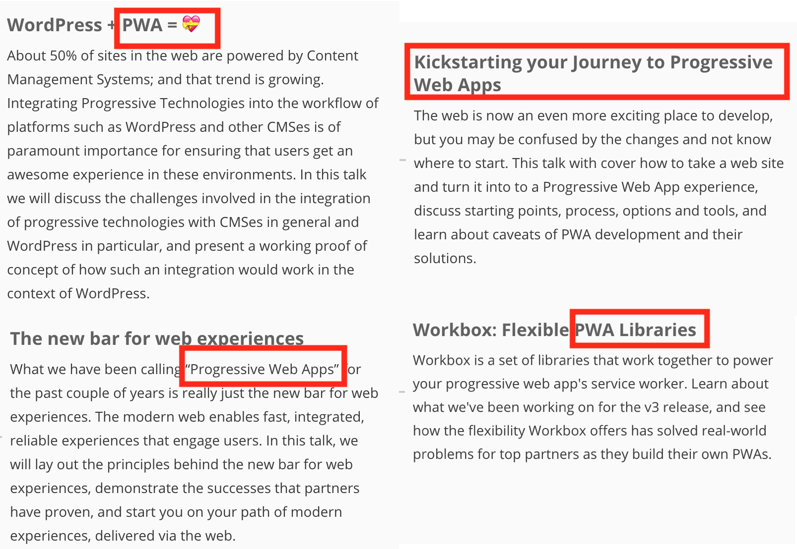
*Snippets from the [Chrome Developer Summit schedule](https://developer.chrome.com/devsummit/schedule). The conference had four PWA-related talks on day 1.*

Why all the hype? PWAs open the door to a lot of really useful functionality for web apps, including the following.

* **Home screen placement**—PWAs can appear on the user’s home screen, just like native mobile applications do.
* **Offline**—PWAs work offline by default, and can employ advanced caching strategies.
* **Push notifications**—PWAs give web apps the opportunity to send push notifications, even when the web app is not being actively viewed.

The site [pwastats.com](https://www.pwastats.com/) includes an impressive list of case studies from companies that have switched to Progressive Web Apps. As the stats show, many of these companies have not only improved performance metrics like load time, but also business-centric metrics like engagement and customer acquisition rates.

For example, Twitter found that users sent out 75% more tweets when they upgraded their web app to a PWA.

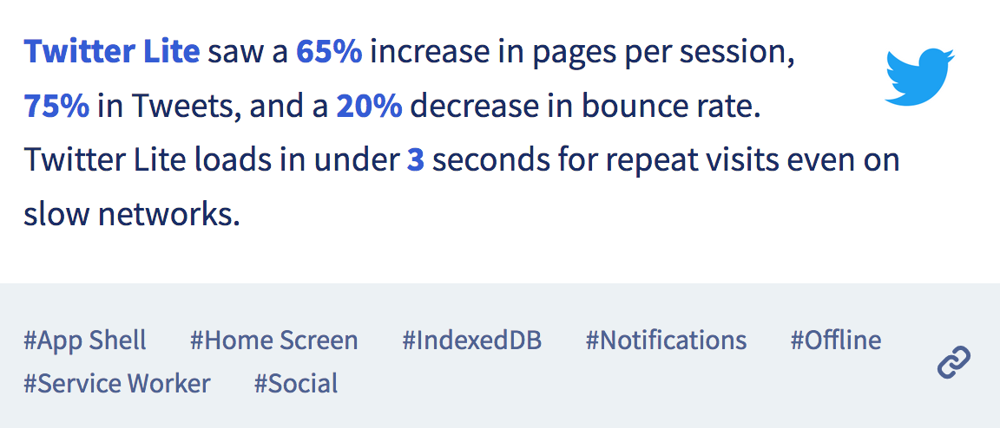
_The Twitter Lite case study from pwastats.com_

And the India-based e-commerce site Flipkart was able to increase its new customer acquisition by 50% using a PWA.

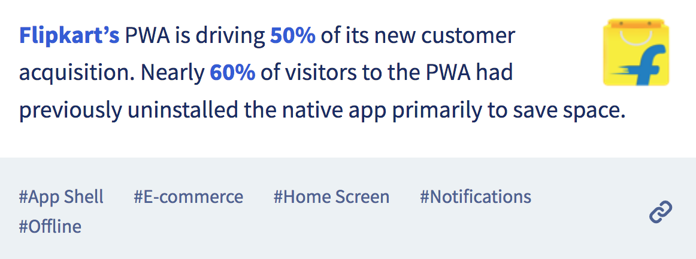
_The Flipkart case study from pwastats.com_

Why have PWAs been so successful when many other attempts to make the mobile web more like native apps have failed?

One reason is the design of the Progressive Web App APIs themselves, as the two primary technologies behind PWAs—service workers and web app manifest files—were designed with graceful degradation in mind. Meaning, you can start using service workers and manifest files for browsers that support the APIs today, and not worry about breaking your app in browsers that do not yet have support for these features.

This design has been key to the success of PWAs, as iOS—aka the second biggest mobile platform out there—still does not support the service worker and web app manifest specifications. There is some hope, as Apple recently announced that [service workers are under development](https://webkit.org/status/#specification-service-workers), but as the following data from [caniuse.com](https://caniuse.com) shows, iOS Safari has zero support for the PWA APIs today.

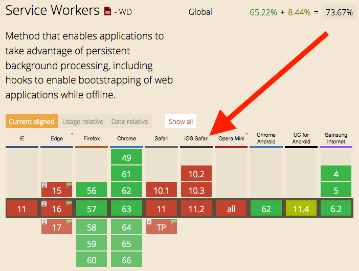
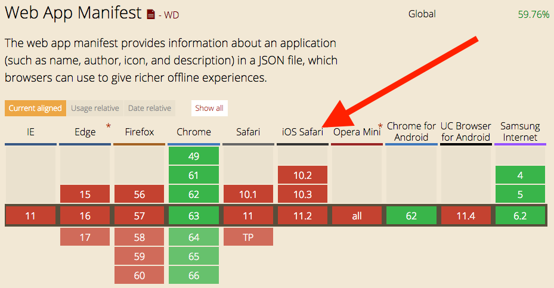
*Browser support data for service workers and web app manifests from [caniuse.com](https://caniuse.com/#search=service%20workers). The noticeable browser with zero support is iOS Safari.*

Despite this, because the PWA approach doesn’t degrade the experience on platforms that don’t support the necessary APIs, PWAs have been able to succeed where many similar technologies have failed.

In fact, [many companies have seen increased iOS conversion rates by rethinking their mobile experiences using a Progressive Web App](https://medium.com/dev-channel/why-progressive-web-apps-vs-native-is-the-wrong-question-to-ask-fb8555addcbb). For example the e-commerce site AliExpress saw a 82% increase in iOS conversion rates with their PWA.

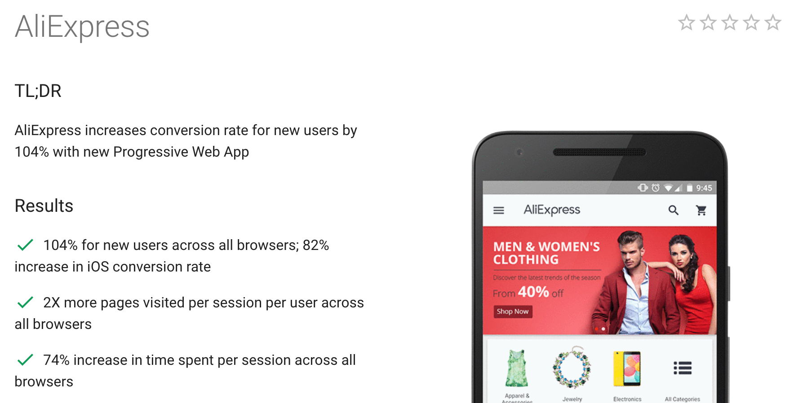
_A [Google case study](https://developers.google.com/web/showcase/2016/aliexpress) showing how the site AliExpress improved their conversation rates with a PWA—even on iOS._

But despite being a well designed technology, PWAs are not the solution for all mobile needs. At the end of the day PWAs are web apps, and as such, they are subject to the same limitations as any web app—such as having limited device API access, and having performance characteristics that are very reliant on the browser they’re running in.

Running on the web brings a ton of advantages as well, of course, and we’ll discuss all of this in more detail when we compare PWAs with JavaScript-driven native approaches momentarily. For now let’s first take a look at how JavaScript-driven native frameworks like NativeScript and React Native work.

## JavaScript-driven native

Years ago, JavaScript developers that wanted to build for iOS and Android were forced to learn completely new languages and development approaches. The first technology to change this was Cordova, which allowed web developers to package their web apps into a native binary, and to access device APIs through plugins.

Since Cordova was first released, developers have created a variety of alternative approaches to use JavaScript to drive native iOS and Android applications. In this article we’re going to cover the latest of these approaches, which we call [JavaScript-driven native](https://developer.telerik.com/featured/defining-a-new-breed-of-cross-platform-mobile-apps/).

What separates JS-driven native frameworks from Cordova-based approaches is that JS-driven native frameworks use native user interface components, and therefore abandon web concepts like HTML and the DOM. For example, the following gif shows off a sample NativeScript app in action.

_The [NativeScript examples app](https://www.nativescript.org/nativescript-example-application), which you can try for yourself by searching for “NativeScript Examples” in the [iOS App Store](https://itunes.apple.com/us/app/examples-nativescript/id1046772499) or [Google Play](https://play.google.com/store/apps/details?id=org.nativescript.examples)._

This approach was popularized in 2015 by the releases of Facebook’s React Native, and Progress’s NativeScript, which today are the [two most popular frameworks for building JavaScript-driven native apps](https://stateofjs.com/2017/mobile/results).

For JavaScript developers, using native user interface components to build your applications is kind of cool, but also potentially challenging. It’s cool because using native iOS and Android UI components means your applications automatically look right on the platforms you’re building for. You don’t have to worry about styling your app to make your navigation bar look like a `UINavigationBar` on iOS or a `Toolbar` on Android, because you’re using those elements already.

For example, here is how the NativeScript `<ActionBar>` UI component renders on iOS and Android.

_The NativeScript `<ActionBar>` component renders a `UINavigationBar` on iOS (left), and as a `Toolbar` on Android (right)._

Using native user interface components also means you can leverage some really powerful native constructs that aren’t present on the web. For example, suppose you want to build an endless scrolling list with tens of thousands of items. On the web you have to concern yourself with non-trivial concepts like virtual DOMs to avoid performance problems. But in native apps, iOS and Android both provide list controls that automatically handle the tasks of memory management for you. For example, here’s how a list in NativeScript performs if you casually throw 50,000 items in it (notice how little the scroll bar on the right moves).

_A NativeScript app that lists 50,000 items. You can [see the source code for this app and try it for yourself on the NativeScript Playground](https://play.nativescript.org/?template=play-js&id=ieaS3B)._

That’s not to say that using native iOS and Android user interface components is perfect. The downside of using native UI components, especially for JavaScript developers, is that you have a new set of components to learn. For instance, to build the example in the previous gif you would have to learn how a `<ListView>` works in NativeScript, or how a `<FlatList>` works in React Native. And if you want to customize your lists beyond what frameworks like NativeScript and React Native offer out of the box, you’ll have to deal with the not-especially-intuitive iOS and Android APIs that make these controls possible.

At the end of the day, JavaScript-driven native apps are native apps, and so they also suffer many of the same difficulties inherent to native iOS and Android development. To discuss some of these limitations in detail, let’s shift our discussion to comparing PWAs to JavaScript-driven native apps directly.

## Which to choose

Now that we’ve introduced both approaches to JavaScript app development, let’s tackle the hard question: what platform should you build your next app on?

For most situations your default platform should be the web, and therefore your default mobile app choice should be a PWA. When compared to native applications, the web is much easier to build for, the web is easier to deploy to, the web lets you reach more users, and the web makes it easier for users to access your apps.

That being said, despite the many advantages the web platform provides, the web is not the best choice for all app usage scenarios. Although there are several situations you could argue native apps are a better fit, there’s one big one—when you need to do something the web simply can’t do.

Whenever I make this argument to web advocates I’m inevitably sent to a site like [What Web Can Do Today](https://whatwebcando.today/), which lists an out the various APIs that the web platform now supports.

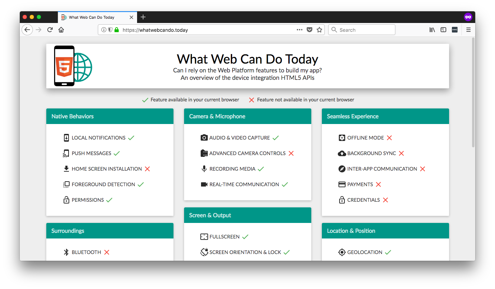
_The site What Web Can Do Today lists a large collection of mobile APIs, and marks the API your current browser supports._

Although the web can legitimately do a lot of things, the web can in no way keep up with what native platforms make possible. On the surface this means that if you want to work with the latest and greatest features that mobile devices offer, which nowadays are APIs like augmented reality, machine learning, and the internet of things, chances are you need to build native apps.

And while that is relevant to this discussion, your average developer isn’t busting out augmented reality to polish their next sales dashboard or checkout form. The more pragmatic discussion is considering just how much more native apps can do with more mundane features that you don’t think too much about. Let me give you a few examples to show my point.

Consider the camera. Both PWAs and JavaScript-driven native apps allow you to use a device’s camera to take a picture. But native applications let you go further and customize the camera to make a variety of additional use cases possible. This ranges from the crazy—think [Snapchat filters](https://support.snapchat.com/en-US/a/filters) or [face swap](https://www.imore.com/how-face-swap-snapchat)—to small pragmatic features that can really help your users. If you’ve ever used a banking app to deposit a check, you’ve probably found this little overlay super helpful.

_Mobile banking apps commonly use native APIs to add an overlay to the camera, making depositing checks a little bit easier for users._

TODO: Replace that image ^ with one we own 😄

Consider geolocation. Both PWAs and JavaScript-driven native apps allow you to use a device’s GPS chip to get a user’s location. But native apps can track a user’s location while your app is in the background, meaning apps like Google Maps can continue to give you directions while you take a phone call.

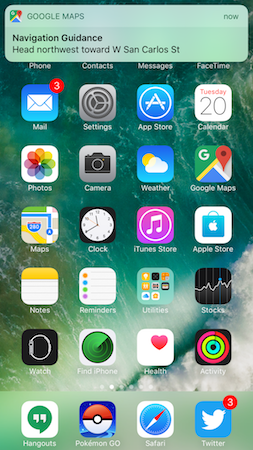
_Because Google Maps is a native app, it has the ability to track a user’s location in the background._

There are countless examples where does more than the web with the same APIs.

* The web now has [bluetooth support](https://developers.google.com/web/updates/2015/07/interact-with-ble-devices-on-the-web) in some browsers, but you’re limited to one device. Native apps don’t have this limit.
* The web now has a [payment API](https://developers.google.com/web/fundamentals/payments/) in some browsers, but native apps already have a wide variety of built-in ways to take a user’s money, including in-app purchase and subscription APIs. Consumers are expected to use those APIs to [spend $110 billion in 2018](https://techcrunch.com/2017/12/05/consumer-spending-across-app-stores-worldwide-to-top-110-billion-in-2018/?utm_campaign=Fuse+Weekly&utm_medium=email&utm_source=Fuse_Weekly_106).
* The web now has [credential management APIs](https://developers.google.com/web/updates/2016/04/credential-management-api) to help streamline authentication workflows, but native apps have the ability to use fingerprint sensors and technologies like Face ID for authentication.

That being said, it’s important not to get too carried away with what native can do. Much like the advantages of the web don’t mean you should always build a PWA, the advantages of native don’t mean you should always build a JavaScript-driven native app. 

What you should do is consider whether some of the features of native apps would help you build a better app for your users, and if so, take a serious look at what frameworks like NativeScript and React Native can do. And maybe even consider building for multiple platforms at the same time.

## Web or native—why not both?

Although PWA advocates like to say that all apps should be web apps, and iOS and Android advocates like to claim that all apps are best made with native code, the truth is each platform has a unique set of advantages that complement each other. Luke Wroblewski might have [said it best in a 2016 article](https://www.lukew.com/ff/entry.asp?1954).

> “The Web is for audience **reach** and native apps are for **rich** experiences. Both are strategic. Both are valuable. So when it comes to mobile, it's not Web vs. Native. It's both.”

No one is going to argue that the web doesn’t have a greater reach. Because the web isn’t restricted to app stores run by companies like Apple and Google, the web is certainly the place to go if you want to reach the most users.

But web advocates like myself often have a hard time swallowing just how much time users spend using native iOS and Android applications. [Data from Flurry Analytics](http://flurrymobile.tumblr.com/post/157921590345/us-consumers-time-spent-on-mobile-crosses-5), for instance, shows that mobile browser usage in the United States has fallen to a staggeringly low 8% of user’s time.

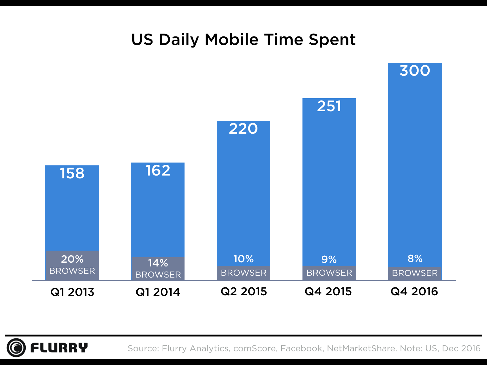
_The time an average mobile user spends on devices in a day, including how much of that time is spent in a web browser. Side note: holy crap, five hours a day is average 😮_

Yes, this is only United States data, and yes, most of the user’s time in native apps is spent in a small handful of apps like Facebook, but still—92% versus 8% is an absolutely _enormous_ gap in usage.

Historically, if you wanted to leverage the advantages of both the web and native platforms you would have to invest in separate teams with separate development workflows. JavaScript-driven native frameworks have changed this equation some, as you can now not only build for multiple platforms with the same language (JavaScript), but also the same frameworks as well (React in React Native, or Angular or Vue with NativeScript).

But one recent trend we’ve seen is developers increasingly trying to build PWAs and native apps using not only the same language, but also the same codebase. For example the React Native community has [React Native for Web](https://github.com/necolas/react-native-web), a project that allows React Native users to render their React Native projects as web applications.

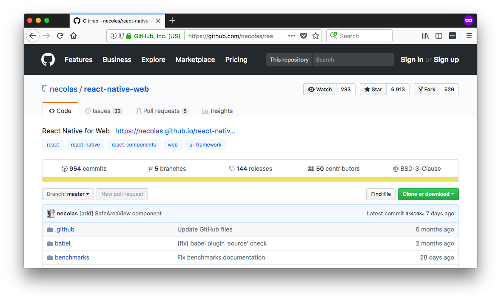
_The React Native for Web project allows users to render React Native projects on the web._

The NativeScript community has built a number of seed projects that allow NativeScript users to build web and native applications from one Angular codebase. For example [Team Maestro’s Angular NativeScript seed](https://github.com/TeamMaestro/angular-native-seed) provides a number of conventions and CLI scripts that simplify the process of building for multiple platforms.

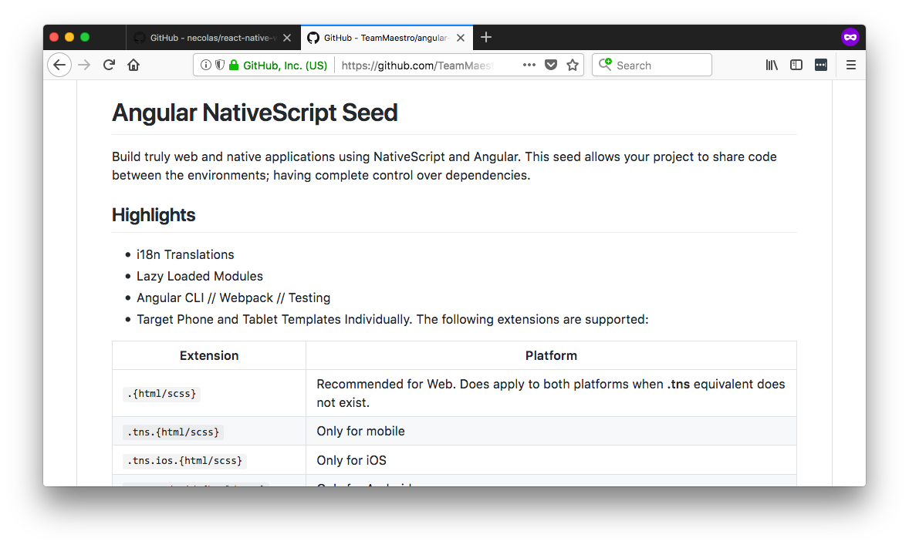
_The NativeScript Angular Seed allows NativeScript users to build web and native apps from one Angular codebase._

From a business perspective these approaches make a lot of sense, as the ability to consolidate your application development to one team and one language has the potential to save you a lot of time and hassle. And although this technique is relatively new, we’re already seeing evidence that it can work for companies building real apps. For example, uGroupMedia Inc’s Portable North Pole app, an app with roughly 1 million users per day during the holidays, was able to [save 60% of their code](https://medium.com/@wwwalkerrun/a-christmas-story-with-nx-angular-and-nativescript-part-1-57904eebe5e0) by using NativeScript and Angular to build for the web, iOS, and Android simultaneously.

That’s not to say these approaches are perfect by any means. Android, iOS, and the web are different platforms with different conventions, and trying to build for all three platforms from a single codebase can get complex if you end up needing a lot of platform-specific code. That being said, if you need to build a JavaScript-based app for multiple platforms, it’s certainly an approach worth considering, and it’s one we see a lot more development happening on in 2018 and beyond.

## Wrapping up

Two of the newest trends in the JavaScript world are Progressive Web Apps and JavaScript-driven native app frameworks like NativeScript and React Native. Progressive Web Apps bring a series of features that make web apps feel more like native apps, and JavaScript-driven native frameworks allow you to use JavaScript to build completely native iOS and Android apps using native user interface components and APIs.

Which approach you want to use depends on your own application needs. Starting with a Progressive Web App makes a lot of sense unless your apps needs APIs or features of native development platforms. Building for _both_ web and native is growing trend, as it enables you to leverage the best features of each platform.

The web versus native debate will likely never end, but it’s worth taking a step back to consider how far we’ve come. The fact that web apps are now installable on Android, and can do things like work offline and send push notifications, is pretty darn cool. The fact that you can build native iOS and Android apps that leverage the latest mobile APIs using JavaScript code is also pretty cool. So, even though we’ll endlessly argue about which platform is the best, there’s one thing we can agree on—you can do some pretty amazing things with JavaScript nowadays, and the future for JavaScript developers is looking brighter all the time.
