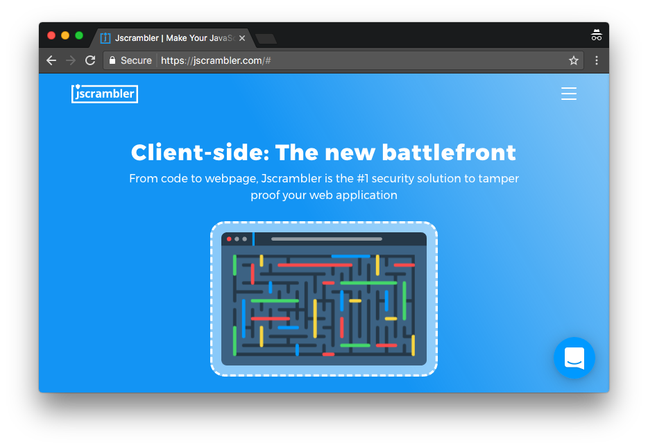
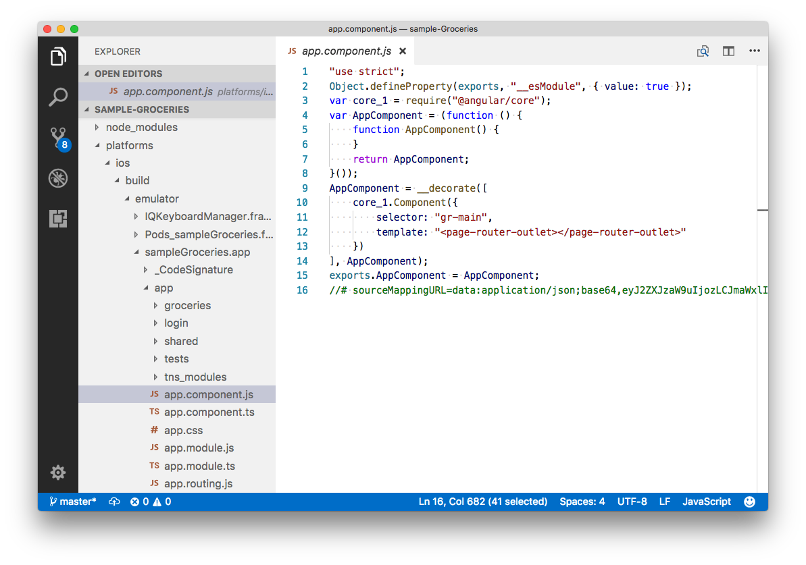
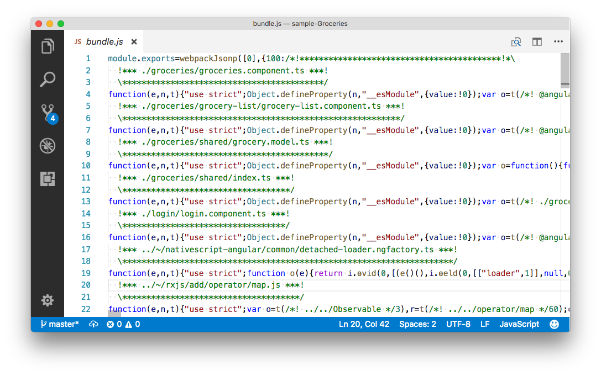
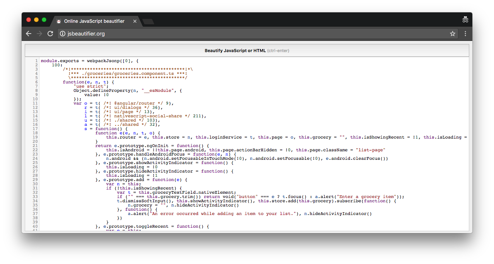
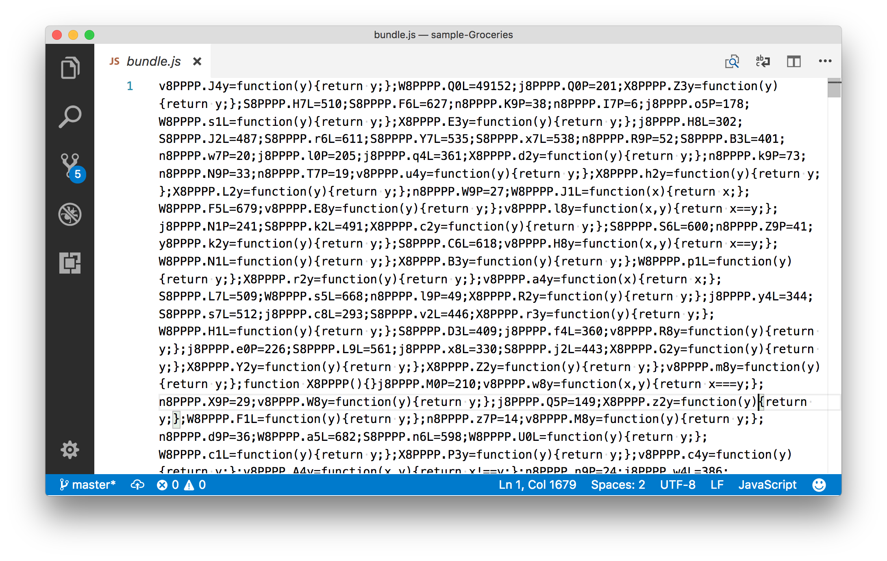
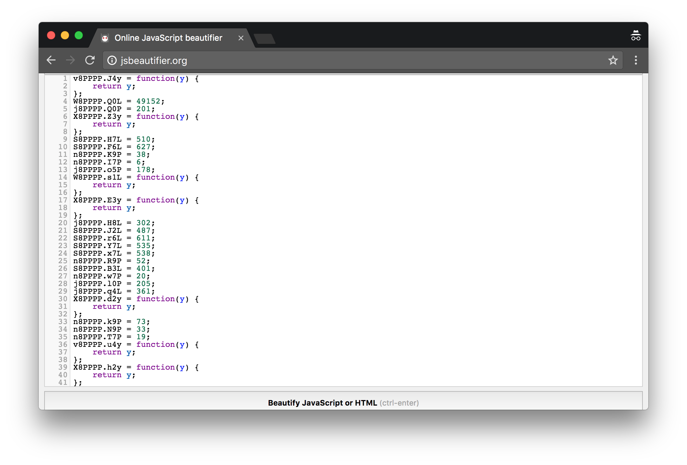
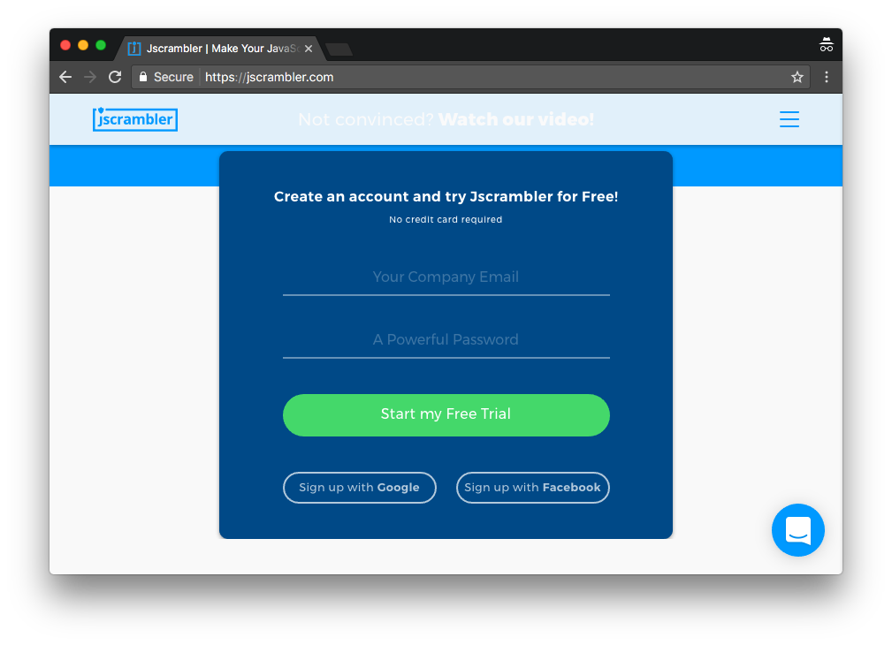
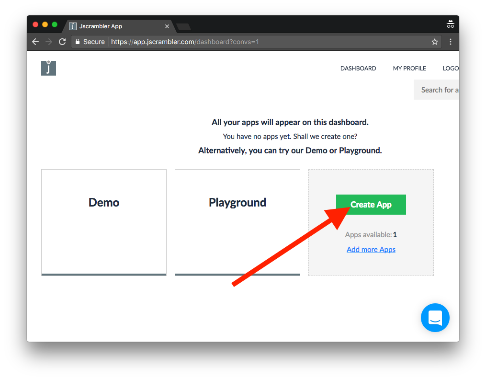
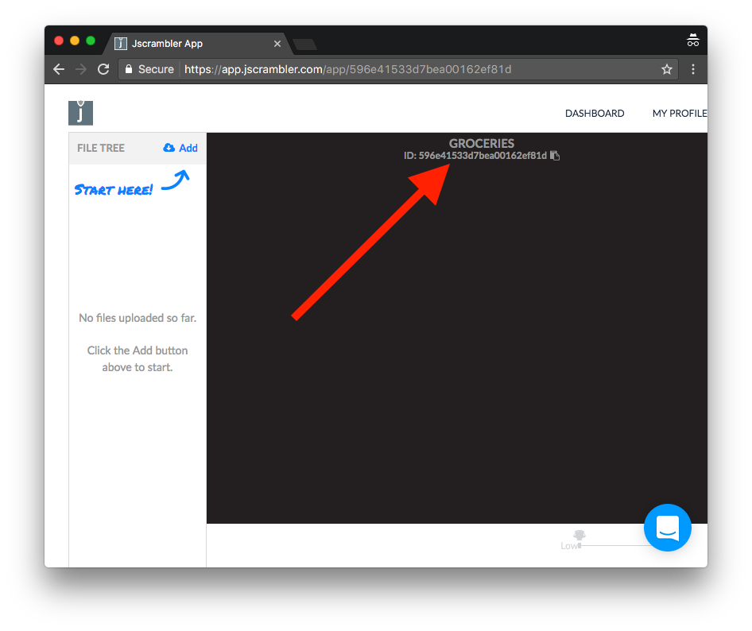
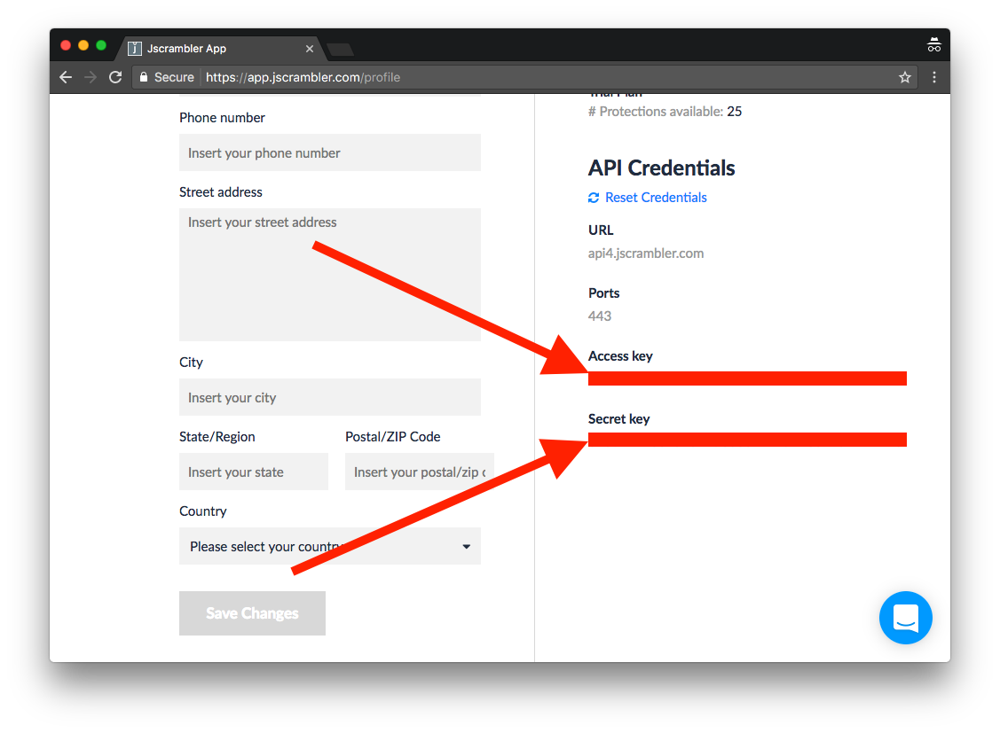

# Protecting Your Source Code with Jscrambler

Today we’re happy to announce support for [Jscrambler](https://jscrambler.com) in NativeScript apps. Jscrambler is premium tool that transforms the JavaScript in your application to make it extremely difficult to reverse engineer.



In this article we’ll look at why you might want to use Jscrambler, how it works, and how you can integrate the tool into your own NativeScript apps. Let’s start by looking at the why Jscrambler might be a good fit for your apps.

## Why Jscrambler?

In NativeScript you write your application logic in JavaScript. And because JavaScript is not a compiled language, your NativeScript application’s source code gets distributed in plain text as part of your Android and iOS application packages. If you dig into the `platforms` folder, you’ll find the plain text source code that shipts with your NativeScript apps—code that malicious users have the potential to find as well.


_An example of the plain text code that gets distributed with your NativeScript applications by default. This specific code is from a built version of the [NativeScript Groceries sample](https://github.com/nativescript/sample-Groceries)._

If you come from a web development background this plain text deployment is not a new concept—web apps absolutely must ship their source code in plain text for browsers to intepret. But if you come from a native development background, this is a new problem, as native apps typically only distribute compiled byte code.

If you’re concerned about protecting your NativeScript app’s source code you have a few options. NativeScript has [built-in support for UglifyJS](https://docs.nativescript.org/best-practices/bundling-with-webpack#uglifyjs), a tool that compresses JavaScript code. During the minification process, Uglify replaces variable names and removes whitespace, making your code far harder for your average developer to read. For example, here’s what the code for the Groceries sample looks like after it goes through UglifyJS.


_The source code of the NativeScript Groceries sample after going through UglifyJS._

However, UglifyJS’s sole purpose is to reduce the file size of your code, and not to obfuscate your code so that’s it’s difficult for malicious users to reverse engineer. For instance, if I take the same code from above and run it through a beautifier or formatting tool, suddenly that code becomes far more readable.


_The uglified source code of the NativeScript Groceries sample formatted using jsbeautifier.org._

The processing UglifyJS does might be sufficient if you just want to do some really basic code hiding as part of your NativeScript app deployments, but if you really want to protect your code you need a tool dedicated to obfuscation—and that’s where Jscrambler comes in.

## How Jscrambler works

 At a high-level, Jscrambler takes your JavaScript code, and mangles it beyond recognition while ensuring that the code continues to work as expected. Just to give you an idea, here’s what the same NativeScript Groceries sample code looks like after it goes through Jscrambler.


_The source code of the NativeScript Groceries sample after going through Jscrambler._

Good luck figuring out what’s going on there. And even if you run this code through a beautifier or formatting tool, you’ll still have a heck of a time deciphering anything. Here’s what that same file looks like after going through jsbeautifier.org.


_The Jscrambler-processed source code of the NativeScript Groceries sample formatted using jsbeautifier.org._

As the above screenshot above shows, Jscrambler goes above and beyond scrambling your code so that it’s unreadable even after going through formatting and beautifier tools. Good luck to anyone that wants to figure out what’s going on there.

Jscrambler offers a [number of configurable transformations](https://docs.jscrambler.com/code-integrity/documentation/transformations) so you can fine tune exactly how the tool transforms your code, but the Jscrambler team has provided us with a series of default settings for NativeScript developers. Let’s take a look at these settings and see how you can get Jscrambler working in your apps.

## Getting Jscrambler working

The first thing to note is Jscrambler is a [premium tool](https://jscrambler.com/compare-plans), however, they do offer free trials for anyone that wants to try the tool out. To follow the steps in this article you’ll need to sign up for one of those trials on the bottom of <https://jscrambler.com/> using this form.



After you create your trial account, head to your dashboard and click the big green “Create App” button.



Give the app a name and click the green “Create App” button again.


At this next screen you’ll want to note your application’s id (see red arrow in the image below), as you’ll need it in a moment.



Now that you have the necessary Jscrambler account work done, let’s shift over to your NativeScript app to see how to tie into the Jscrambler service.

## Installing the Jscrambler plugin

Jscrambler’s NativeScript integration is done through a webpack plugin. So if you haven’t already, go ahead and [install the NativeScript webpack plugin in your app](https://docs.nativescript.org/best-practices/bundling-with-webpack#installation-and-configuration). If all goes well, the installation should be as easy as running the following two commands.

```
npm install --save-dev nativescript-dev-webpack
```

And then:

```
npm install
```

> **NOTE** If you run into issues setting up webpack in your NativeScript app, the [NativeScript community forum](https://discourse.nativescript.org/) is a great place to ask for help.

Once you have webpack installed, you’ll next want to install the Jscrambler webpack plugin.

```
npm i --save-dev jscrambler-webpack-plugin
```

After that, create a new file in the root of your app named `jscrambler.json`, and paste in the following code.

```
{
  "keys": {
    "accessKey": "YOUR ACCESS KEY HERE",
    "secretKey": "YOUR SECRET KEY HERE"
  },
  "applicationId": "YOUR APPLICATION ID HERE",
  "params": [
    { "name": "whitespaceRemoval" },
    {
      "options": {
        "mode": "SAFEST"
      },
      "name": "identifiersRenaming"
    },
    { "name": "dotToBracketNotation" },
    { "name": "stringConcealing" },
    { "name": "duplicateLiteralsRemoval" },
    { "name": "functionReordering" },
    { "name": "functionOutlining" },
    { "name": "propertyKeysObfuscation" },
    { "name": "propertyKeysReordering" }
  ],
  "areSubscribersOrdered": true,
  "applicationTypes": {
    "webBrowserApp": false,
    "desktopApp": false,
    "serverApp": false,
    "hybridMobileApp": false,
    "javascriptNativeApp": false,
    "html5GameApp": false
  },
  "languageSpecifications": {
    "es5": true,
    "es6": false,
    "es7": false
  },
  "useRecommendedOrder": false,
  "sourceMaps": false
}
```

> **NOTE**: This file contains the recommended setting for using Jscrambler in NativeScript apps. Feel free to check out the Jscrambler docs for [more details on what each of these settings do](https://docs.jscrambler.com/code-integrity/documentation/transformations).

You’ll need to fill in the three placeholder values—`YOUR ACCESS KEY HERE`, `YOUR SECRET KEY HERE`, and `YOUR APPLICATION ID HERE`—with your own values. The APPLICATION ID is the value we noted earlier when you created an app in the Jscrambler interface.

Once you have your application id entered, head to the “My Account” section on the Jscrambler site, and scroll down to find both your Access Key and your Secret Key, which you’ll want to copy and paste into your `jscrambler.json` file.



With your configuration in place, your last step is to add Jscrambler’s webpack plugin in your webpack configuration. To do that, open your `webpack.config.js` file in the root of your app.

In this file, start by copying and pasting these two lines of code at the top, which imports the plugin itself and makes it available to use.

```
const JscramblerWebpack = require("jscrambler-webpack-plugin");
const jscramblerConfig = require("./jscrambler.json");
```

Next, scroll down in the same `webpack.config.js` file until you find the `getPlugins()` function. To activate the Jscrambler plugin you need to add the following entry to that function’s `plugins` array. (I’ve been adding mine just after the `new BundleAnalyzerPlugin({})` entry).

```
new JscramblerWebpack(Object.assign({}, jscramblerConfig, {
    chunks: ["bundle", "vendor"]
})),
```

And with that, you should be all set to test this Jscramber in your app.

## Scrambling your code

To run your app through Jscrambler, all you have to do is run [one of the npm scripts that build NativeScript apps with webpack enabled](https://docs.nativescript.org/best-practices/bundling-with-webpack#npm-scripts). The easiest to use are the `start-ios-bundle` and `start-android-bundle` script, which build your app with webpack and start them on either an iOS or Android device.

```
npm run start-ios-bundle
```

Or

```
npm run start-android-bundle
```

After the build process completes, you’ll have to look through the `platforms` folder to see the result of the obfuscation. If you built for iOS open your `platforms/ios/NAME_OF_YOUR_APP_/app` folder, and if you built for Android open your `platforms/android/src/main/assets/app` folder. If you open those folders’ `bundle.js` and `vendor.js` files, you should fine heavily scrambled files that look like something like this.


Malicious users will now have a extremely difficult time figuring out what this code does, and your app should continue to work exactly as expected. (Let us know if it doesn’t—we’ve tested about a dozen apps and haven’t hit a single problem.)

Furthermore, in our testing we haven’t detected any meaningful performance regressions from scrambling NativeScript application code. Your experiences may very, so it’s definitely worth testing your app heavily once you enable Jscrambler, but in our experimenting enabling Jscrambler is a fairly seamless process.

## Wrapping up

Jscrambler is a powerful tool for protecting your JavaScript code from malicious users. The Jscrambler webpack plugin fits nicely into NativeScript webpack workflow, making it a convenient option for NativeScript developers looking to protect their source code.

Head to Jscrambler’s site and [check out their plans](https://jscrambler.com/compare-plans) if you’d like to learn more. And if you’ve given Jscrambler a shot let us know how it went in the comments—we’d love to know what you think.
