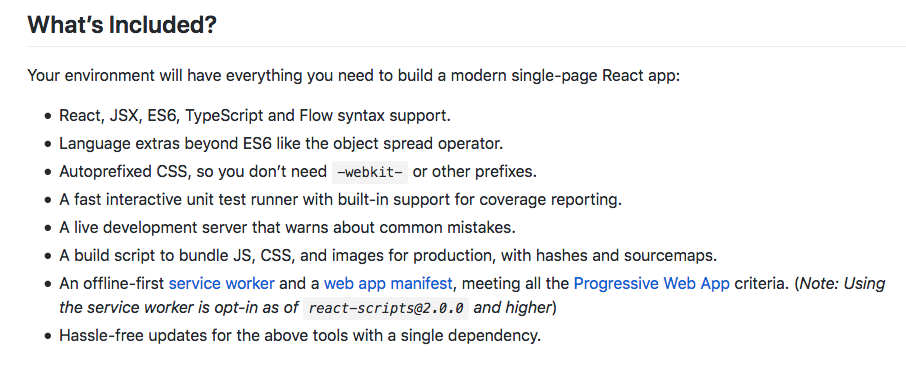
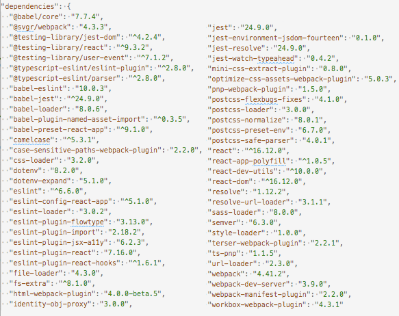
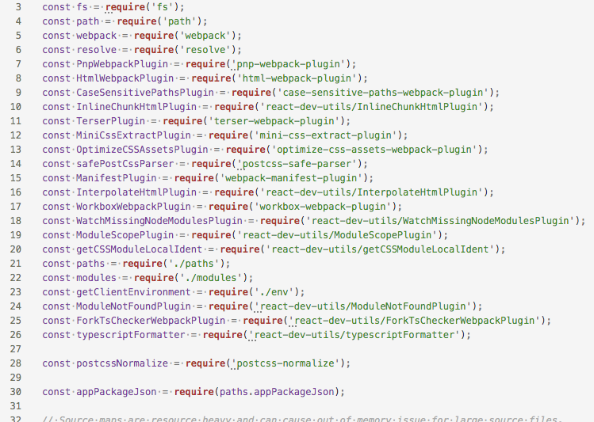
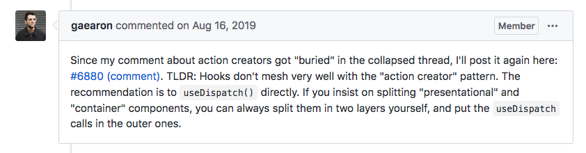

# 10 Things I Learned Building the Same App With Angular and React

Over the holidays I rewrote an Angular app with React.

I did this for two reasons: first, I’m learning React for my new role as a [KendoReact](https://www.telerik.com/kendo-react-ui/) developer advocate, and for me, working on a real app with a real userbase is a great way to force myself to learn a new technology.

Second, I genuinely wanted to compare React to Angular, as I’ve spent the last several years of my career working with Angular, and I wanted to see how the React approaches the same problems.

In this article I’m going to list ten things I learned going through the rewrite process, but first, I’ll give you a bit of background on the app itself so you have some context.

## Background

[GO Checklists](https://gochecklists.app/) is a web app that Pokémon GO players use to track the Pokémon they’ve caught in a number of different categories.


Before you laugh, you should know that GO Checklists has roughly 10,000 users, and that the game it supports, Pokémon GO, [made $1.4 billion dollars in 2019](https://digistatement.com/pokemon-go-made-1-4b-dollars-in-2019/). (For reference Fortnite made $1.8 billion dollars.)

So even though this app is relatively simple, it has a real userbase that I don’t want to lose; therefore, I had to make sure my rewrite left the app stable.

So how did it go?

## 1) React feels simpler

During the rewrite, the first I noticed is just how simple React’s default project structure is, at least when compared with Angular. In Angular, a simple hello world app with one component looks something like this.

```
src
├── app
│   ├── app-routing.module.ts
│   ├── app.component.css
│   ├── app.component.html
│   ├── app.component.ts
│   ├── app.module.ts
│   └── helloworld
│       ├── helloworld-routing.component.ts
│       ├── helloworld.component.css
│       ├── helloworld.component.html
│       ├── helloworld.component.ts
│       └── helloworld.module.ts
├── styles.css
└── main.ts
```

And the equivalent in React looks something like this.

```
src
├── components
│   └── HelloWorld.js
├── App.js
├── index.css
└── index.js
```

That is a _lot_ fewer files. And, I mean, each Angular does have its purpose, and part of me likes that Angular enforces a specific structure for your apps (more on that later), but wow is it refreshing to have a simpler project structure.

Having a smaller file tree made the app a little bit easier to navigate while coding, but the real benefit was to my app’s architecture. Because React components are far more lightweight to create and use, I found myself experimenting with modularizing my code far more than I did in Angular—where creating a component involves a lot of ceremony and metadata.

React’s simplicity doesn’t just apply to its file structure and component model either. One thing that’s always bothered me about Angular is the dizzying set of dependencies the framework installs when you start an app. Here’s the list of dependencies you get with the [Angular CLI](https://cli.angular.io/)’s `ng serve` command as of this writing.

``` JavaScript
"dependencies": {
  "@angular/animations": "~8.2.14",
  "@angular/common": "~8.2.14",
  "@angular/compiler": "~8.2.14",
  "@angular/core": "~8.2.14",
  "@angular/forms": "~8.2.14",
  "@angular/platform-browser": "~8.2.14",
  "@angular/platform-browser-dynamic": "~8.2.14",
  "@angular/router": "~8.2.14",
  "rxjs": "~6.4.0",
  "tslib": "^1.10.0",
  "zone.js": "~0.9.1"
},
"devDependencies": {
  "@angular-devkit/build-angular": "~0.803.21",
  "@angular/cli": "~8.3.21",
  "@angular/compiler-cli": "~8.2.14",
  "@angular/language-service": "~8.2.14",
  "@types/node": "~8.9.4",
  "@types/jasmine": "~3.3.8",
  "@types/jasminewd2": "~2.0.3",
  "codelyzer": "^5.0.0",
  "jasmine-core": "~3.4.0",
  "jasmine-spec-reporter": "~4.2.1",
  "karma": "~4.1.0",
  "karma-chrome-launcher": "~2.2.0",
  "karma-coverage-istanbul-reporter": "~2.0.1",
  "karma-jasmine": "~2.0.1",
  "karma-jasmine-html-reporter": "^1.4.0",
  "protractor": "~5.4.0",
  "ts-node": "~7.0.0",
  "tslint": "~5.15.0",
  "typescript": "~3.5.3"
}
```

I’ve worked with Angular for years and I couldn’t tell you what half of these dependencies do, or why they’re necessary in a hello world app. And like with file structure, having such a crazy dependency list has some real consequences during real development.

For example, in large Angular apps I’ve found that tracking my own dependencies and devDependencies becomes problematic, as they can get lost among all the Angular dependencies that clutter up your `package.json`.

With React the equivalent list of dependencies for a Create-React-App-built app looks like this.

``` JavaScript
"dependencies": {
  "@testing-library/jest-dom": "^4.2.4",
  "@testing-library/react": "^9.3.2",
  "@testing-library/user-event": "^7.1.2",
  "react": "^16.12.0",
  "react-dom": "^16.12.0",
  "react-scripts": "3.3.0"
}
```

It really does make your life easier as a developer when you have fewer things to mentally manage, and React’s simpler file tree, component model, and dependency list were a breath of fresh air.

But like all good things in life, when something seems too good to be true it usually is, and although React makes these processes seem simple, there’s a lot more going on under the hood.

## 2) Create React App does a concerning amount of magic

[Create React App](https://github.com/facebook/create-react-app), which is the default and recommended way to start React apps, does an amazing job simplifying the process of starting and managing a new app. But at some point I started to question how I had so much functionality with so few dependencies. Then I found [this section on Create React App’s README](https://github.com/facebook/create-react-app#whats-included).



Holy features Batman! To get a sense of just how heavy-handed this is, you can run [Create React App’s eject script](https://create-react-app.dev/docs/available-scripts/#npm-run-eject), which installs all of your app’s transitive dependencies and configuration files into your app directly.

I encourage every React developer to run the eject script at least once, just to get a sense of the sheer scale of what Create React App is doing for you. For example, a post-eject Create-React-App-built hello world app has 56 dependencies. Yes, 56.



That same app now has a dizzying set of scripts, as well as a 674-line webpack configuration file that starts with an impressive list of imports.



To be fair, most small and medium-size apps will never need to eject, and the defaults will work just fine. That being said, seeing the sheer scale of what Create React App does would give me pause if I were starting a large React app that I intended to maintain for years.

The software world changes fast, and I wouldn’t want to rely on a not-especially-clean eject process to meet my future needs. Luckily, you can build React apps without using Create React App, which is probably what I’d do if I were starting a large React app today. [Here’s the best guide I’ve found for setting that up.](https://www.sentinelstand.com/article/create-react-app-from-scratch-with-webpack-and-babel)

## 3) React hooks are confusing

React recently introduced a new concept called [React Hooks](https://www.telerik.com/kendo-react-ui/react-hooks-guide/), which is a new way of managing state and other React features without writing a class.

To me, React Hooks are a microcosm of how I feel about React in general: they’re powerful and concise, but also esoteric.

That being said the simplest hooks examples are actually quite elegant. Here’s the first example from the [React documentation on hooks](https://reactjs.org/docs/hooks-intro.html) for example.

``` JavaScript
import React, { useState } from 'react';

function Example() {
  const [count, setCount] = useState(0);

  return (
    <div>
      <p>You clicked {count} times</p>
      <button onClick={() => setCount(count + 1)}>
        Click me
      </button>
    </div>
  );
}
```

If you haven’t seen React hooks in action before this code might seem a bit weird, mostly because `useState` is an absolutely bizarre API. Let’s look at this line of code specifically, as it’s the one that uses a React hook.

``` JavaScript
const [count, setCount] = useState(0);
```

This code creates a new state variable named `count`, as well as a function to change that state named `setCount()`. You pass `useState` the initial value of your state variable, which in this case is `0`.

Although initially confusing, I’ve found `useState` to be quite elegant, and I got used to the API after I used it for a bit. My issues with hooks happen when you get beyond that basics.

For example, the next hook I needed was React’s effect hook, which, according to [React’s documentation](https://reactjs.org/docs/hooks-effect.html), “lets you perform side effects in function components”. This description alone is a bit confusing, but their initial example is fairly straightforward.

``` JavaScript
import React, { useState, useEffect } from 'react';

function Example() {
  const [count, setCount] = useState(0);

  useEffect(() => {
    document.title = `You clicked ${count} times`;
  });

  return (
    <div>
      <p>You clicked {count} times</p>
      <button onClick={() => setCount(count + 1)}>
        Click me
      </button>
    </div>
  );
}
```

In this example, `useEffect` updates the browser’s title every time the `count` state variable changes. Simple enough.

The first problem I ran into in my real app was figuring out how to run an effect exactly one time. Essentially I needed to get JSON data from a backend when my component loads—which is likely the most common use case ever. A quick Google search told me to pass `useEffect` an empty array to do this, which is weird, but it worked.

``` JavaScript
React.useEffect(() => {
  pokemonService
    .get(pageMode)
    .then(data => {
      // Code to do stuff with the data
    });
// Here’s the empty array. Weird, right?
}, []);
```

This code worked, but I got this error in my console.

```
./src/components/Dex.js
  Line 40:6:  React Hook React.useEffect has missing dependencies: 'pokemonService'. Either include it or remove the dependency array  react-hooks/exhaustive-deps
```

I still have no idea why React thinks `pokemonService` should be a dependency of my effect. If you google this problem, which I did, you find one of [the longest threads I’ve ever seen on GitHub](https://github.com/facebook/create-react-app/issues/6880), ending with this very confusing conclusion.



I’m new to React, but I have no clue what any of that means. And after reading through the whole GitHub thread, I decided to give up and just suppress the warning like a responsible developer. My code now looks like this.

``` JavaScript
React.useEffect(() => {
  pokemonService
    .get(pageMode)
    .then(data => {
      // Code to do stuff with the data
    });
// Go ahead, judge me. But don’t act like you haven’t done this.
// eslint-disable-next-line react-hooks/exhaustive-deps
}, []);
```

A lot of this is on me, as I’m new to React and still figuring out how these new APIs work. But I’ve been writing code long enough to know whether APIs are intuitive or not, and React’s hook API definitely fall into the unintuitive camp—which makes me hesitant to introduce them into a large codebase.

Since I’m speaking of things I don’t like, let’s switch over to Angular and talk about some things I don’t like there.

## 4) I don’t miss Angular’s modules, or services, or dependency injection

My least favorite part of working in Angular apps was creating and configuring modules. Angular modules are essentially metadata files that you have to manually provide to tell the Angular compiler and runtime how your app should work.

Here’s the first example the [Angular documentation](https://angular.io/guide/architecture-modules) provides.

``` TypeScript
import { NgModule }      from '@angular/core';
import { BrowserModule } from '@angular/platform-browser';
@NgModule({
  imports:      [ BrowserModule ],
  providers:    [ Logger ],
  declarations: [ AppComponent ],
  exports:      [ AppComponent ],
  bootstrap:    [ AppComponent ]
})
export class AppModule { }
```

If you’re having trouble sleeping tonight I recommend reading the documentation to try to understand the difference between `imports`, `providers`, `declarations`, and `exports`, and to also figure out why creating these metadata-only files is necessary at all.

Over the years these modules have cost me a ton of time, as not only are Angular modules tedious to create, they’re also error prone, as it’s easy to accidentally put a declaration in the `imports` array, or vice versa, and the error messages don’t always point you in the right direction.

Similarly, Angular also has a concept of services and dependency injection that I don’t miss either. If you’re unfamiliar with the concept you could again [read through the documentation](https://angular.io/guide/architecture-services), but the short version is you provide a bit of metadata on your services, for example.

``` TypeScript
@Injectable({
 providedIn: 'root',
})
export class MyService { ... }
```

Which you then must include in the `providers` array in an Angular module.

``` TypeScript
@NgModule({
  providers: [MyService],
 ...
})
```

And then you can _inject_ that service into your components by including it in an individual component’s constructor.

``` TypeScript
constructor(private myService: MyService) { }
```

There’s a [whole science behind dependency injection](https://angular.io/guide/dependency-injection) and why Angular provides this, but honestly dependency injection has always felt like an unnecessary abstraction to me throughout my career. Maybe it’s just me, but I’ve never once had that moment where I thought, “oh, thank goodness I used dependency injection here, that made \<literally anything\> so much easier”.

React has none of this stuff and it’s liberating. No modules. No services. No dependency injection. It’s the wild west and you can do whatever you want.

If I need a new feature in my app I create a new folder and add a new file—no need to create a module and register metadata. If I need a service I create a file that returns a function—again, no metadata configuration necessary. It’s amazing.

## 5) The React Router is easier to use than Angular’s router


## 6) I miss TypeScript

## 7) I prefer the way Angular handles CSS

## 8) React has a smaller footprint, but not a lot smaller

## 9) I’m concerned with how my React app will scale

## 10) It really doesn’t matter which framework you use