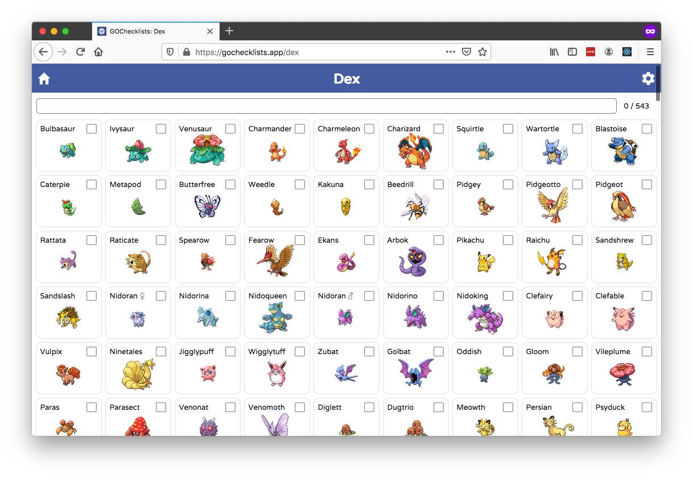
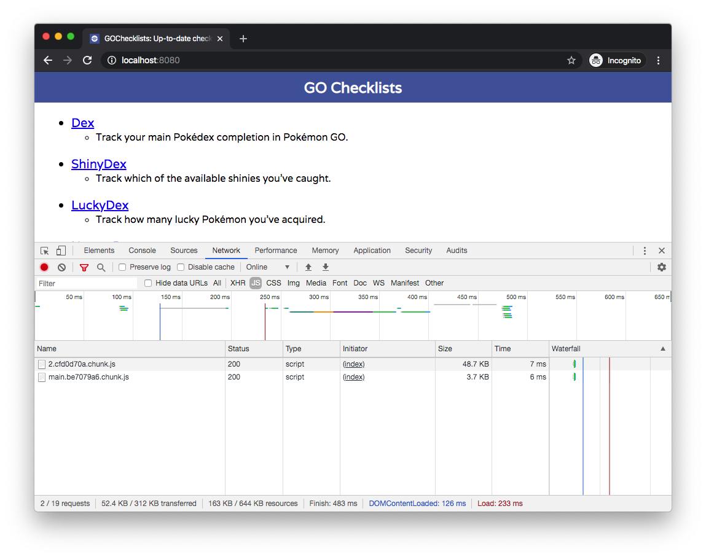

# 9 Things I Learned Building the Same App With Angular and React

I rewrote an Angular app with React.

I did this for two reasons: first, I’m learning React in my new role as a [KendoReact](https://www.telerik.com/kendo-react-ui/) developer advocate, and I find working on real apps is the best way to learn a new technology.

Second, I genuinely wanted to compare React to Angular, as I’ve spent the last several years of my career working with Angular, and I wanted to see how the React approaches the same web-development problems.

In this article I’m going to list nine things I learned going through the rewrite process, but first, I’ll give you a bit of background on the app itself so you have some context.

* [Background](#background)
* [1) React is simpler in many ways](#finding-1)
* [2) Create React App does a concerning amount of magic](#finding-2)
* [3) React hooks are confusing](#finding-3)
* [4) I don’t miss Angular’s modules, or services, or dependency injection](#finding-4)
* [5) I miss TypeScript](#finding-5)
* [6) I prefer the way Angular handles CSS](#finding-6)
* [7) React has a smaller footprint, but Angular is improving](#finding-7)
* [8) I’m concerned with how React apps will scale](#finding-8)
* [9) It really doesn’t matter which framework you use](#finding-9)

<h2 id="background">Background</h2>

[GO Checklists](https://gochecklists.app/) is a web app that Pokémon GO players use to track the Pokémon they’ve caught in a number of different categories.



Before you laugh, you should know that GO Checklists has roughly 10,000 users, and that the game it supports, Pokémon GO, [made $1.4 billion dollars in 2019](https://digistatement.com/pokemon-go-made-1-4b-dollars-in-2019/). (For reference Fortnite made $1.8 billion dollars.)

So even though this app is relatively simple, it has a real userbase that I didn’t want to lose. Therefore, I had to make sure the rewrite preserved all existing functionality, and also didn’t introduce any performance regressions.

With that context in mind, let’s look at what I found.

<h2 id="finding-1">1) React is simpler in many ways</h2>

When starting with React, the first thing I noticed was how simple React’s default project structure is, at least when compared with Angular. In Angular, a simple hello world app with one component looks something like this.

```
src
├── app
│   ├── app-routing.module.ts
│   ├── app.component.css
│   ├── app.component.html
│   ├── app.component.ts
│   ├── app.module.ts
│   └── helloworld
│       ├── helloworld-routing.component.ts
│       ├── helloworld.component.css
│       ├── helloworld.component.html
│       ├── helloworld.component.ts
│       └── helloworld.module.ts
├── styles.css
└── main.ts
```

And the equivalent in React looks something like this.

```
src
├── components
│   └── HelloWorld.js
├── App.js
├── index.css
└── index.js
```

Having a smaller file tree made the app easier to navigate while coding, which was great, but the real benefit was to my app’s architecture. Because React components are considerably more lightweight to create and use, I found myself experimenting with modularizing my React code more than I did with Angular.

For example, when recreating my app’s main page in React, I created `<Header>`, `<Loading>`, and `<Progressbar>` components that I hadn’t bothered to build with Angular, and I found the end result cleaner.

React’s simplicity doesn’t just apply to its file structure and component model either. One thing that’s always bothered me about Angular is the dizzying set of dependencies the framework installs when you start an app. Here’s the list of dependencies you get with the [Angular CLI](https://cli.angular.io/)’s `ng serve` command as of this writing.

``` JavaScript
"dependencies": {
  "@angular/animations": "~8.2.14",
  "@angular/common": "~8.2.14",
  "@angular/compiler": "~8.2.14",
  "@angular/core": "~8.2.14",
  "@angular/forms": "~8.2.14",
  "@angular/platform-browser": "~8.2.14",
  "@angular/platform-browser-dynamic": "~8.2.14",
  "@angular/router": "~8.2.14",
  "rxjs": "~6.4.0",
  "tslib": "^1.10.0",
  "zone.js": "~0.9.1"
},
"devDependencies": {
  "@angular-devkit/build-angular": "~0.803.21",
  "@angular/cli": "~8.3.21",
  "@angular/compiler-cli": "~8.2.14",
  "@angular/language-service": "~8.2.14",
  "@types/node": "~8.9.4",
  "@types/jasmine": "~3.3.8",
  "@types/jasminewd2": "~2.0.3",
  "codelyzer": "^5.0.0",
  "jasmine-core": "~3.4.0",
  "jasmine-spec-reporter": "~4.2.1",
  "karma": "~4.1.0",
  "karma-chrome-launcher": "~2.2.0",
  "karma-coverage-istanbul-reporter": "~2.0.1",
  "karma-jasmine": "~2.0.1",
  "karma-jasmine-html-reporter": "^1.4.0",
  "protractor": "~5.4.0",
  "ts-node": "~7.0.0",
  "tslint": "~5.15.0",
  "typescript": "~3.5.3"
}
```

I’ve worked with Angular for years and I couldn’t tell you what half of these dependencies do, or why they’re necessary in a hello world app. And like with file structure, having such a crazy dependency list has some real consequences during development.

For example, in large Angular apps I’ve found that tracking my own dependencies and devDependencies becomes problematic, as they can get lost among all the Angular dependencies that clutter up your `package.json`.

With React the equivalent list of dependencies for a new app looks like this.

``` JavaScript
"dependencies": {
  "@testing-library/jest-dom": "^4.2.4",
  "@testing-library/react": "^9.3.2",
  "@testing-library/user-event": "^7.1.2",
  "react": "^16.12.0",
  "react-dom": "^16.12.0",
  "react-scripts": "3.3.0"
}
```

It really does make your life easier as a developer when you have fewer things to mentally manage, and React’s simpler file tree, component model, and dependency list were all a breath of fresh air.

But like all good things in life, when something seems too good to be true it usually is, and although React makes these processes seem simple, there’s a lot more going on under the hood.

<h2 id="finding-2">2) Create React App does a concerning amount of magic</h2>

[Create React App](https://github.com/facebook/create-react-app), which is the default and recommended way to start React apps, does an amazing job simplifying the process of starting and managing new React apps. But at some point I started to question how my apps had so much functionality with so few dependencies. Then I found [this concerning section on Create React App’s README](https://github.com/facebook/create-react-app#whats-included).


Holy features Batman! To get a sense of just how heavy-handed Create React App can be, you can run [the tool’s eject script](https://create-react-app.dev/docs/available-scripts/#npm-run-eject), which installs all of your app’s transitive dependencies and configuration files directly into your app.

I encourage every React developer to run the eject script at least once, just to get a sense of the sheer scale of what Create React App is doing for you. For example, as of this writing a post-eject hello world app has 56 dependencies. Yes, 56.


That same app now has a dizzying set of scripts, as well as a 674-line webpack configuration file that starts with an impressive list of imports.


To be fair, most small and medium-size apps will never need to eject, and the defaults will work just fine. I have no intention of ejecting GOChecklists as I have no need to do anything out of the ordinary. That being said, seeing the sheer scale of what Create React App does would give me pause if I were starting a large React app that I intended to maintain for years.

The software world changes fast, and I wouldn’t want to rely on a not-especially-clean eject process to meet my future needs. Luckily, you can build React apps without using Create React App, which is probably what I’d do if I were starting a large React app today. [Here’s the best guide I’ve found for setting that up.](https://www.sentinelstand.com/article/create-react-app-from-scratch-with-webpack-and-babel)

<h2 id="finding-3">3) React hooks are confusing</h2>

React recently introduced a new concept called [React Hooks](https://www.telerik.com/kendo-react-ui/react-hooks-guide/), which is a new way of managing state and other React features without writing a class.

To me, React Hooks are a microcosm of how I feel about React in general: they’re powerful and concise, but also esoteric at times.

To discuss this let’s start with the first example from the [React documentation on hooks](https://reactjs.org/docs/hooks-intro.html).

``` JavaScript
import React, { useState } from 'react';

function Example() {
  const [count, setCount] = useState(0);

  return (
    <div>
      <p>You clicked {count} times</p>
      <button onClick={() => setCount(count + 1)}>
        Click me
      </button>
    </div>
  );
}
```

If you haven’t seen React hooks in action before this code might seem a bit weird, mostly because `useState` is a bizarre API. Let’s look at this line of code specifically, as it’s the one that uses a React hook.

``` JavaScript
const [count, setCount] = useState(0);
```

This code creates a new state variable named `count`, as well as a function to change that state named `setCount()`. You pass `useState` the initial value of your state variable, which in this case is `0`.

Although initially confusing, I’ve found `useState` to be quite elegant, and I got used to the API after I used it in a few files. My issues with hooks happen when you get beyond that basics.

For example, the next hook I needed was React’s effect hook, which, according to [React’s documentation](https://reactjs.org/docs/hooks-effect.html), “lets you perform side effects in function components”. This description alone is a bit confusing, but their initial example is fairly straightforward.

``` JavaScript
import React, { useState, useEffect } from 'react';

function Example() {
  const [count, setCount] = useState(0);

  useEffect(() => {
    document.title = `You clicked ${count} times`;
  });

  return (
    <div>
      <p>You clicked {count} times</p>
      <button onClick={() => setCount(count + 1)}>
        Click me
      </button>
    </div>
  );
}
```

In this example, `useEffect` updates the browser’s title every time the `count` state variable changes. Simple enough.

The first problem I ran into in my app was figuring out how to run an effect exactly one time. Essentially, I needed to get JSON data from a backend when my component loads, which seems like an extremely common use case. A quick Google search told me to pass `useEffect` an empty array to do this, which is weird, but it worked.

``` JavaScript
React.useEffect(() => {
  pokemonService
    .get(pageMode)
    .then(data => {
      // Code to do stuff with the data
    });
// Here’s the empty array. Weird, right?
}, []);
```

This code worked, but I got this error in my console.

```
./src/components/Dex.js
  Line 40:6:  React Hook React.useEffect has missing dependencies: 'pokemonService'. Either include it or remove the dependency array  react-hooks/exhaustive-deps
```

I still have no idea why React thinks `pokemonService` should be a dependency of my effect. If you google this problem, which I did, you find one of [the longest threads I’ve ever seen on GitHub](https://github.com/facebook/create-react-app/issues/6880), ending with this confusing conclusion.


I’m new to React, but I have no clue what any of that means. And after reading through the whole GitHub thread, I decided to give up and just suppress the warning like a responsible developer. My code now looks like this.

``` JavaScript
React.useEffect(() => {
  pokemonService
    .get(pageMode)
    .then(data => {
      // Code to do stuff with the data
    });
// Go ahead, judge me. But don’t act like you haven’t done this.
// eslint-disable-next-line react-hooks/exhaustive-deps
}, []);
```

A lot of this is on me, as I’m new to React and still figuring out how these new APIs work. But I tend to prefer using frameworks and APIs that feel intuitive, and all React hooks beyond `useState()` have confused me, which makes me hesitant to introduce them into a large codebase.

That being said, I plan to return to this topic after I’ve had some more time to learn and experiment. And also, even though I find hooks confusing, there are definitely some confusing Angular APIs that I was happy to remove.

<h2 id="finding-4">4) I don’t miss Angular’s modules, or services, or dependency injection</h2>

My least favorite part of working in Angular was creating and configuring modules. Angular modules are essentially metadata files that you have to manually provide to tell the Angular compiler and runtime how your app should work.

Here’s the first example the [Angular documentation](https://angular.io/guide/architecture-modules) provides.

``` TypeScript
import { NgModule }      from '@angular/core';
import { BrowserModule } from '@angular/platform-browser';
@NgModule({
  imports:      [ BrowserModule ],
  providers:    [ Logger ],
  declarations: [ AppComponent ],
  exports:      [ AppComponent ],
  bootstrap:    [ AppComponent ]
})
export class AppModule { }
```

I’ve spent a good chunk of my career working with Angular, and I still couldn’t give you a good explanation of why all this metadata is necessary. I’ve also spent a lot of career teaching Angular, and I can tell you that trying to understand the difference between `imports`, `providers`, `declarations` and `exports` in these files is a common source of confusion.

Because there are so many things to individually declare, Angular modules tend to be tedious to create, and also error prone, as it’s easy to accidentally put a declaration in the `imports` array, or vice versa, and the error messages don’t always point you in the right direction.

Similarly, Angular also has a concept of services and dependency injection that I’ve always had a hard time seeing the value of.

Creating a service in Angular takes a few steps, the first of which is creating a `.service.ts` file, and then including a bit of metadata before declaring the service class.

``` TypeScript
@Injectable({
 providedIn: 'root',
})
export class MyService { ... }
```

Next, you must include your new service in the `providers` array of every Angular module in which you intend to use the service.

``` TypeScript
@NgModule({
  providers: [MyService],
 ...
})
```

And then, finally, you _inject_ your service into your components by including it as argument in your component’s constructor.

``` TypeScript
constructor(private myService: MyService) { }
```

If this all sounds a bit confusing it’s because it kind of is.

There’s a [whole science behind dependency injection](https://angular.io/guide/dependency-injection) and why Angular takes this approach, but it’s always felt unnecessary to me. The only concrete benefit I’ve ever gotten out of dependency injection is during unit testing, as injected services are easy to mock out for the purposes of tests. But JavaScript mocking libraries are pretty powerful nowadays, and that benefit alone doesn’t make it worth all the hassle for me.

React has none of any of this structure, and frankly, it’s kind of liberating. If I need a new feature in my app I create a new folder and add a new file. If I need a service, I create a file that returns a function. Simple.

But although I might appreciate the simplicity of React for most things, there’s one tool I gave up that I didn’t realize how much I’d miss.

<h2 id="finding-5">5) I miss TypeScript</h2>

I might not miss Angular modules or services, but I definitely miss TypeScript—which is not something I ever thought I would’ve said a few years ago.

The process of giving up TypeScript reminded me of [an article the Slack team did when they adopted TypeScript](https://slack.engineering/typescript-at-slack-a81307fa288d). The two biggest discoveries they made were:

> “First, we were surprised by the number of small bugs we found when converting our code.”

> “Second, we underestimated how powerful the editor integration is. Thanks to TypeScript’s language service, editors with an autocomplete function can support the development with context-aware suggestions.”

I discovered these things too—just in a bad way.

First of all, I had gotten so used to writing TypeScript that I completely forgot to do _any_ type validation on my JavaScript function parameters. I just expected them to always be what I thought they would be, and—spoiler alert—they weren’t.

I ended up adding a bunch of type checks and `parseInt` calls to my codebase, and every time I look at that code I hate myself just a little.

As for editor integration, I was actually pleasantly surprised at how much better Visual Studio Code has gotten at intellisense in vanilla JavaScript files, but it still can’t match what TypeScript provides.

I specifically missed the helpful inline error messages you get with TypeScript. For example, suppose I try to do something silly like this.

``` JavaScript
parseInt("10", "10");
```

The second parameter here is invalid (it needs to be a number), but in a `.js` file, Code gives no indication that anything is wrong. It’s little things like this that made me regret giving up a framework that uses TypeScript by default.

One last note: I do know that Create React App now supports TypeScript usage, and it’s something I plan on checking out. That being said, the nice thing about Angular is 100% of the code samples, documentation articles, Stack Overflow questions and so on all use TypeScript—whereas the TypeScript faction of the React community seems to be a minority. At least for now 🙂

<h2 id="finding-6">6) I prefer the way Angular handles CSS</h2>

In Angular, CSS works one way and it works really well. When you define a component you can provide a `styleUrls` metadata property, and pass that property an array of stylesheet URLs. Usually that looks something like this.

``` TypeScript
// my.component.ts
import { Component } from "@angular/core";

@Component({
  selector: "mycomponent",
  moduleId: module.id,
  styleUrls: ["./my.component.css"],
  templateUrl: "./my.component.html"
})
export class MyComponent { ... }
```

Angular ensures that the CSS you write in those files are scoped to that component. Meaning, if you write a rule like `h4 { color: blue; }`, Angular will ensure that the `color: blue` rule only gets applied to `<h4>` elements rendered by `MyComponent`, and not all `<h4>` elements throughout your app.

I always found this to be an elegant way of handling CSS. I put all my app-wide rules and sharable class names in an app-level `.css` file, and then I put my component-specific styling in component-specific scoped files. Easy.

In React CSS is the wild west. You can almost achieve the equivalent of Angular’s CSS approach using something called [CSS modules](https://github.com/css-modules/css-modules), which allows you do write a series of class names that are scoped to a component by default. For a React component that looks something like this.

``` CSS
/* mycomponent.module.css */
.heading { color: blue; }
```

``` JavaScript
/* mycomponent.js */
import React from "react";
import styles from "./myComponent.module.css";

export default function MyComponent() {
  return <h1 className={styles.heading}>Hi</h1>;
}
```

This works, but you’re limited to using only class names in your CSS files, and you must manually apply those class names using JSX, which can get get clunky when you need to apply multiple class names simultaneously.

The other popular option for component-level styling in React is to use CSS-in-JS, a technique that, as its name implies, lets you apply CSS rules in JavaScript directly. I’ve been experimenting with this approach, and so far I’ve found it to be surprisingly elegant. For example, here’s what one of my components looks like using [styled components](https://styled-components.com/), one of the most popular libraries for doing CSS-in-JS in React.

``` JavaScript
import React from "react";
import styled from "styled-components";

const LoadingImage = styled.img`
  position: fixed;
  top: 50%;
  left: 50%;
  margin-top: -60px;
  margin-left: -60px;
`;

export default function Loading() {
  return (
    <LoadingImage
      src="/images/loading.gif"
      alt="Loading" >
    </LoadingImage>
  );
}
```

Although I think the syntax here is elegant, I do have some performance concerns, as styled components applies CSS at runtime rather than build time, and I’m concerned about the cost of doing that at scale.

I know that there are CSS-in-JS options that apply styling at build time, and this is a topic I intend to research over the next few weeks.

Regardless though, the reason I prefer Angular’s approach is all of this research was unnecessary for doing CSS in Angular. Angular has one sane and performant way of handling CSS, and it works. I miss that.

<h2 id="finding-7">7) React has a smaller footprint, but Angular is improving</h2>

Angular is a bigger framework than React, and as such, I expected my app to be smaller when I made the switch from Angular to React.

To get accurate benchmarks that I could use for a comparison I did the following.

1) I built each app for production usage, which meant running `ng build --prod` for Angular, and `npm run build` for React.
2) I generated compressed `.gzip` versions of each generated JavaScript file by running `gzip <file-name>.js --keep`.
3) I ran `http-server --gzip` in each app’s respective generated build folders, so that I’d have a local HTTP server I could use to test out each app on.
4) I opened each app’s index page in a new, incognito Chrome window.

My Angular app was running version 8.1.2, and its only external dependency was [RxJS](https://rxjs-dev.firebaseapp.com/).

My Angular build ended up being three JavaScript files that were a combined **93.0KB** after gzip compression.


My React app was running version 16.12.0, and its only external dependency was [React Router](https://reacttraining.com/react-router/).

My React build ended up being two JavaScript files that were a combined **52.4KB** after gzip compression.



In total, moving from React to Angular reduced my JavaScript payload from 93KB to 52KB, which was pretty nice.

That being said, I’m pretty impressed by how much the Angular team has done to reduce their bundle sizes over the years. As someone that remembers when Angular bundles _started_ at 300KB, seeing a number under 100KB is a great sign that features like [Angular’s differential loading](https://angular.io/guide/browser-support) are making a real difference. And the [upcoming Angular 9 releases](https://www.telerik.com/blogs/top-new-features-of-angular-9) includes a new default renderer that promises to reduce Angular bundle sizes even more.

For now, React still gets the edge for allowing you to build smaller apps, but it’ll interesting to watch how much of a gap React will maintain moving forward.

<h2 id="finding-8">8) I’m concerned with how React apps will scale</h2>

To explain this finding I’ve got to give you a bit of background. Over the last few years I’ve worked as a developer advocate on the [NativeScript](https://www.nativescript.org/) project, which is a project that allows you to build iOS and Android apps using frameworks like Angular. As part of my role as a developer advocate I had to run lots of apps, whether those apps were personal apps, demo apps, or customer applications.

And as I spent more time in the role, I started to appreciate how Angular’s [extremely comprehensive set of development guidelines](https://angular.io/guide/styleguide) made it easy for me to jump into new apps and quickly find my way around.

In contrast, when I jump into a random React app I immediately have to ask myself a number of questions. Did this app’s developers use Create React App? What are they doing for CSS? Did they use Redux? How about hooks? What do these naming conventions mean?

To be fair, it’s not necessarily a bad thing that React gives you more choices and freedom. Heck, I’ve complimented React on that flexibility repeatedly in this article. I do, however, think developers starting new React apps, especially large React apps, should strive to follow established community conventions as much as possible, such as [Airbnb’s React/JSX style guide](https://github.com/airbnb/javascript/tree/master/react).

It’s also worth establishing conventions within your own organization so your React apps stay as consistent as possible. The time you save getting people up to speed really does matter as developers move on and off your team, and as you cycle between developing multiple applications.

<h2 id="finding-9">9) It really doesn’t matter which framework you use</h2>

If you came to this article looking for me to strongly recommend one framework over another, well then I have some bad news for you. Despite the differences between Angular and React, my single biggest finding is that, at the end of the day, the two frameworks are remarkably similar.

React and Angular both do data binding; they both have a rich templating syntax; they both handle events; they both have routers; and they both let you use modern JavaScript features.

And while the two frameworks take different approaches at times, overall I found the codebases to be surprisingly alike. To give you an example, here’s a chunk of code to build a list item with Angular (top) and React (bottom).


Pretty similar, huh?

Despite the similarities, I do think there are some differences between the two that do matter. In general, I find that React gives you more flexibility in how you choose to build your apps, and Angular gives you more structure. Neither approach is wrong, and which framework you should choose comes down to personal preference, as well as the needs of your team or organization. When in doubt, build a small app with both to see which framework best meets your needs. That’s what I did 🙂

> **TIP**: React and Angular developers both need UI components, and we make them for both frameworks! If you’re a React developer you should check out [KendoReact](https://www.telerik.com/kendo-react-ui/), and if you’re an Angular developer you should try [Kendo UI for Angular](https://www.telerik.com/kendo-angular-ui) 📊📈📆