# Let’s Build a Financial Dashboard With React

Financial apps are hard. They typically they deal with a ton of data, and displaying that data in a meaningful way is critical to making your users happy and productive.

In this article you’ll build a sample financial dashboard in three steps. First, you’ll create a dashboard layout, and learn a bit about CSS grid syntax in the process. Next, you’ll add UI components from [KendoReact](https://www.telerik.com/kendo-react-ui/), our UI library that makes it easy to display data in charts, grids, and more. And finally, you’ll learn how to customize your dashboard, including how to handle theming, and how to tweak the KendoReact components to meet your requirements.

When you’re done you’ll have a dashboard that looks like this.

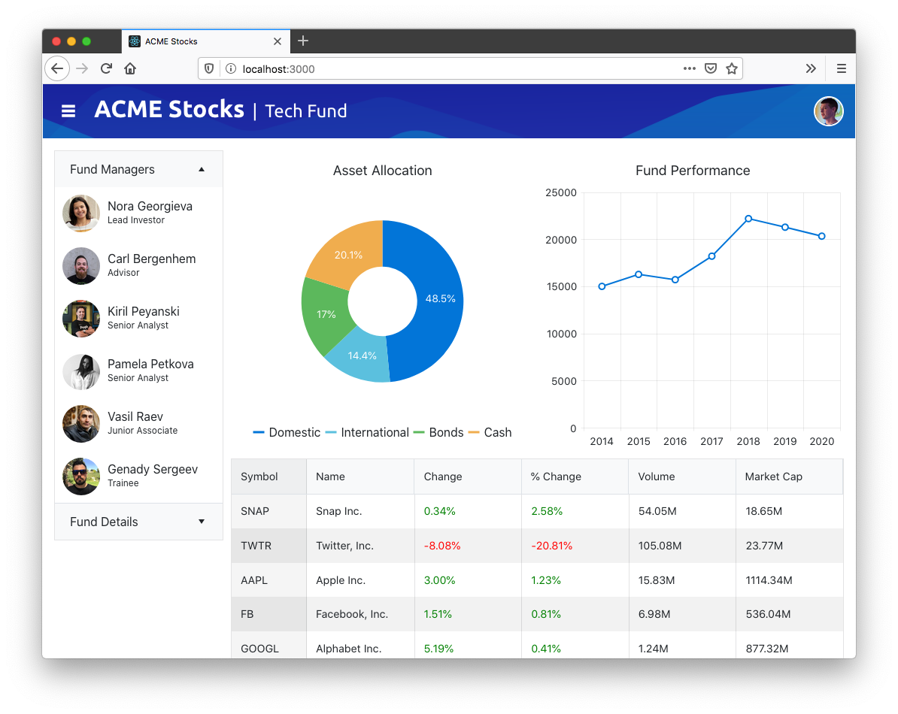

Let’s get started!

> **OPTIONAL:** If you want to code along with this article, you’ll need to clone [this article’s GitHub repository](https://github.com/tjvantoll/financial-dashboard) and switch to its `start` branch. You can do that by running the following set of commands in your terminal or command prompt.
> ```
> git clone https://github.com/tjvantoll/financial-dashboard.git
> cd financial-dashboard
> git checkout start
> ```

## Step 1: Building out your initial layout

Like most large software development projects, doing a bit of planning before jumping straight into coding your dashboard is a good idea. In this section, we’ll start by looking at a quick wireframe of our dashboard’s layout, and then look at how to scaffold out that layout with CSS.

### Building a wireframe

A wireframe is a visual representation of what your final app will look like. It’s important to have some representation of your app before you start coding, but the wireframe doesn’t to show every last feature, and it doesn’t need to be professionally designed.

As an example, here’s a sketch I created in [Balsamiq](https://balsamiq.com/) for this article’s dashboard.

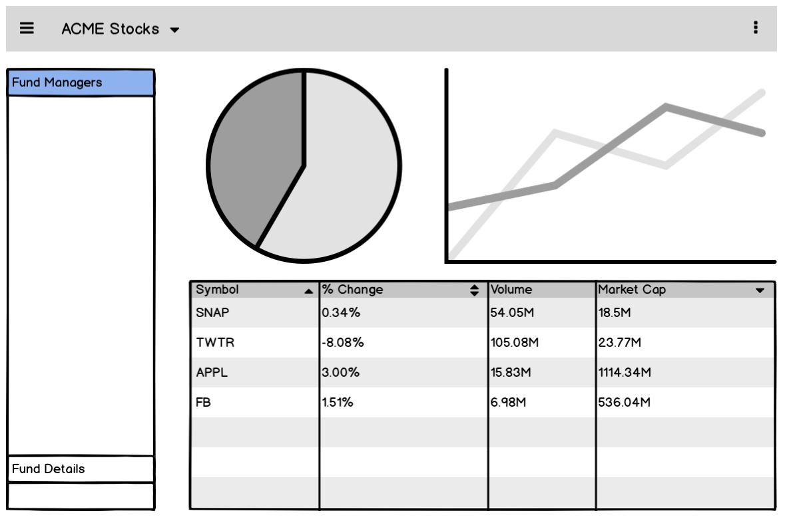

From this wireframe you can see our sample has a header and four distinct panels, which I’ve labeled in the image below.

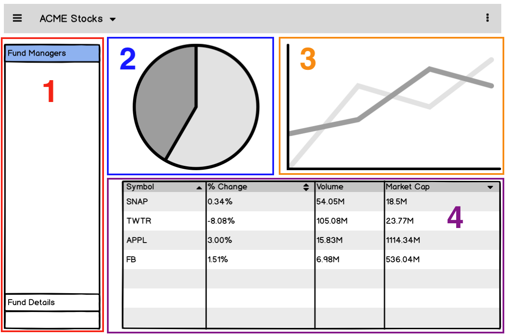

The main purpose of a wireframe is to give you a rough idea of how to lay out elements in your app before you start coding. For example, because I know my app will have four panels, I created four boilerplate components in the sample app’s starting code. You can view them in your app’s `src/panels` folder.

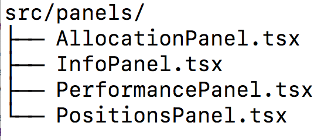

Later in this article we’ll start implementing those panels with UI code, but before that, let’s scaffold out this app’s layout with CSS.

### Implementing your layout with CSS

There are a variety of ways you can layout an app with CSS nowadays. One of the most common approaches is to use a framework like [Bootstrap](https://getbootstrap.com/), which provides a variety of class names to help divide your UI into a series of rows and columns.

For example, you could create a Bootstrap layout with three columns using the following markup.

``` HTML
<div class="container">
  <div class="row">
    <div class="col-sm">
      One of three columns
    </div>
    <div class="col-sm">
      One of three columns
    </div>
    <div class="col-sm">
      One of three columns
    </div>
  </div>
</div>
```

Although this works, personally I’m not a huge fan of this approach in large apps like dashboards. Real-world apps tend to get complicated really fast, and before you know it, your markup goes from being concise, to a complicated mess of class names that are difficult to decipher.

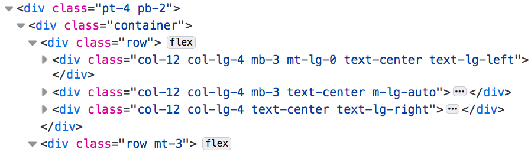

Because of this I tend to prefer to lay out my dashboards using CSS alone. To see what this looks like, take a look at your sample’s `src/Dashboard.tsx` file, which contains the markup of your sample’s four panels.

``` HTML
<div className="panels">
  <div className="panel-info">
    <InfoPanel />
  </div>
  <div className="panel-allocation">
    <AllocationPanel />
  </div>
  <div className="panel-balance">
    <PerformancePanel />
  </div>
  <div className="panel-positions">
    <PositionsPanel />
  </div>
</div>
```

Our task is to take this markup, and to make it look like our wireframe, which as a reminder looks like this.


To do that, open your `src/styles/_layout.scss` file, and replace its contents with the following code.

``` SCSS
.panels > div {
  // Add a black border around each panel for debugging
  border: 1px solid black;
}

.panels {
  display: grid;
  grid-gap: 10px;
  grid-template-columns: 225px auto auto;
  grid-template-rows: auto auto;
}
.panel-info {
  grid-row: span 2;
}
.panel-positions {
  grid-column: span 2;
}
```

After adding this code you’ll want to head to your terminal or command prompt and run `npm run start`, which will start up your React app in your browser. When it’s done, you should see a UI that looks like this.

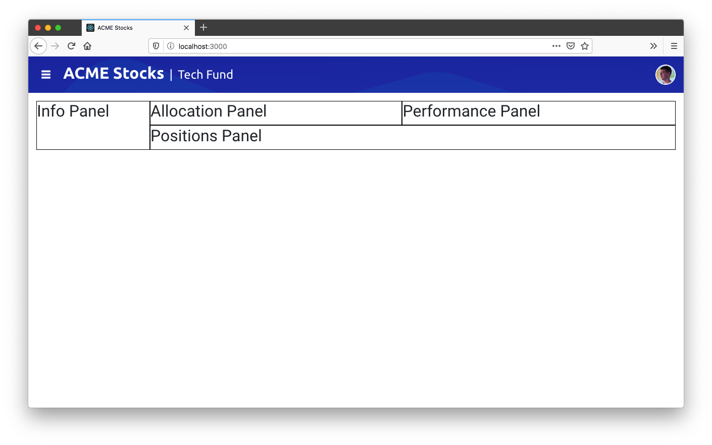

The syntax we’re using here is called [CSS grid layout](https://developer.mozilla.org/en-US/docs/Web/CSS/CSS_Grid_Layout), and it’s [shockingly well supported by web browsers](https://caniuse.com/#feat=css-grid) today.

> **TIP**: If you’re new to CSS grid, check out [this video intro on YouTube](https://www.youtube.com/watch?v=0-DY8J_skZ0). And when you’ve got the basics down, bookmark CSS Tricks’ [_A Complete Guide to Grid_](https://css-tricks.com/snippets/css/complete-guide-grid/), as it’s an excellent reference when you need to look up the various grid CSS properties.

What makes CSS grid appealing is its brevity. Instead of cluttering up your markup with a myriad of class names, you get a powerful way of dividing your UI into rows and columns.

CSS grid also makes it easy to make your dashboards responsive. To see this in action, add the following bit of CSS to your `src/styles/_layout.scss` file.

``` CSS
@media (max-width: 750px) {
  .panels {
    grid-template-columns: 225px auto;
    grid-template-rows: auto auto auto;
  }
  .panel-positions {
    grid-column: span 2;
  }
}

@media (max-width: 500px) {
  .panels {
    grid-template-columns: auto;
  }
  .panel-positions {
    grid-column: span 1;
  }
}
```

This code reorients your grid as the user’s screen gets smaller. For example, at 750px it changes the `.panels` container from using three columns (`grid-template-columns: 225px auto auto`), to two (`grid-template-columns: 225px auto`). And then at 500px it reduces that same container to using a single column (`grid-template-columns: auto`), so that all of app’s panels stack on top of each other.

You can see what this looks like in the gif below.

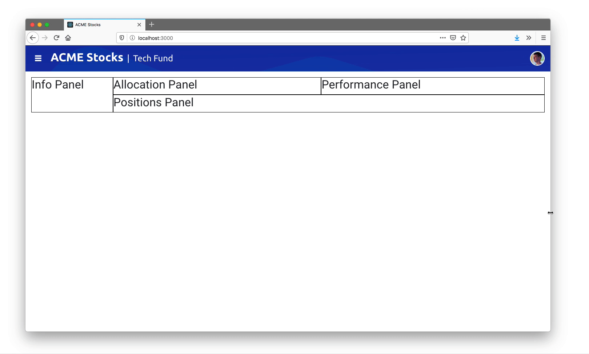

And with that—you’re done! CSS grid really does make it that easy to configure a dashboard layout, all without cluttering up your markup. Now that you have the layout in place, let’s look at adding in some UI components.

## Step 2: Adding UI components

Oftentimes, the most challenging part of building a dashboard is finding high-quality UI components. The React world is big, so luckily there are tons of components out there, but dashboards often require a wide variety of controls, and trying to build a UI from a disparate set of components from around the web can be a big challenge.

That’s where KendoReact comes in. KendoReact offers [80+ UI components](https://www.telerik.com/kendo-react-ui/components/) that work together seamlessly, so that you know your charts will look like your DatePicker, and that your DropDownList will look like your Calendar—without any extra work. Plus, the components are modular, so you can use just the components you need without bloating up your apps.

Your dashboard application has four panels, and each has its implementation in a file in your app’s `src/panels` folder. In this section we’ll implement a KendoReact component in each file so you can get an idea of how the library works.

### Working with the PanelBar

A PanelBar is a UI component that displays hierarchical data in a series of, well, panels. Your typical PanelBar looks something like this.

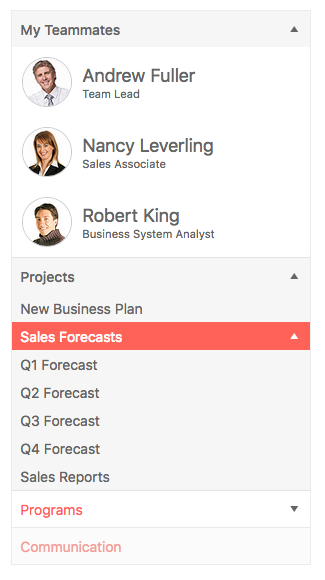

Let’s look at how easy KendoReact makes it to use a PanelBar. First, you’ll need to install the component’s package from npm. For the PanelBar that means running the following command in your terminal or command prompt.

```
npm install kendo-react-layout
```

Next, you’ll need to import the component in your code. To do that in the sample, open your `src/panels/InfoPanel.tsx` file, and note the imports already included in the top of the file.

```TypeScript
import { PanelBar, PanelBarItem } from "@progress/kendo-react-layout";
```

Next, note that your `InfoPanel.tsx` has some pre-populated code to retrieve data, and that it stores that data in a constant named `fundInfo`. To make use of that data, replace the component’s existing `<h2>Info Panel</h2>` markup with the code below.

``` HTML
<PanelBar>
  <PanelBarItem expanded={true} title="Fund Managers">
    <div>
      {fundInfo && fundInfo.managers.map((item, idx) => (
        <div className="manager" key={idx}>
          
          <span className="manager-info">
            <h2>{item.firstName + ' ' + item.lastName}</h2>
            <p>{item.position}</p>
          </span>
        </div>
      ))}
    </div>
  </PanelBarItem>
</PanelBar>
```

After you save this change, you’ll need to start your app back up again by executing `npm run start` in your terminal or command prompt. When it comes back up you should see a collapsible panel.

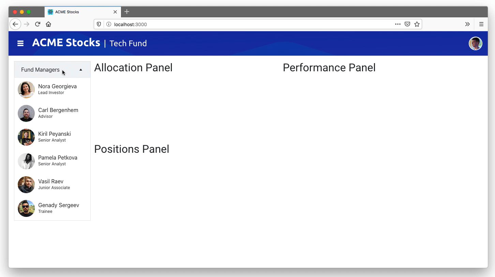

Take note how of easy it was to implement the PanelBar. All you needed to do was install an npm package, import a component, and use its documented APIs.

The KendoReact site has numerous example for each component, [including a number different customization options for the PanelBar](https://www.telerik.com/kendo-react-ui/components/layout/panelbar/), so it’s easy to adapt every component to meet your needs.

But the real power of KendoReact is in the consistency the library provides when you need to use a wide variety of components in a single application. To see that in action, let’s add in some more components.

### Working with the Chart

Charts and graphs are perhaps the most common UI components in any dashboard, particularly financial ones. To meet this need, KendoReact provides an incredibly comprehensive charting library, with support for everything from basic line, bar, and pie charts, to more specialized charts like box plots, scatter plots, funnels, and more.

In this section we’ll implement two different charts so you can see how easy the process is, and so you can see how well the KendoReact components work together.

If you’ll recall from the previous section, your first step to use any KendoReact component is to install it from npm. With that in mind, go ahead and execute the command below to install the KendoReact Chart package in your app.

```
npm install kendo-react-charts
```

Next, you’ll need to import the Chart component in your code. If you open your `src/panels/AllocationPanel.tsx` file, you’ll see the following set of imports at the top.

```
import {
  Chart,
  ChartLegend,
  ChartSeries,
  ChartSeriesItem,
  ChartSeriesLabels,
  ChartTitle,
  ChartTooltip
} from "@progress/kendo-react-charts";
```

Notice that the chart package actually contains a series of modular components. Also note that your `AllocationPanel.tsx` file contains code to retrieve data, and store it in a `data` constant.

To use that data in a chart, replace the `AllocationPanel.tsx` file’s `<h2>Allocation Panel</h2>` markup with the code below, which renders the file’s `data` in a KendoReact Chart component.

``` HTML
<Chart>
  <ChartTitle text={"Asset Allocation"}></ChartTitle>
  <ChartSeries>
    <ChartSeriesItem type="donut" data={data}>
    <ChartSeriesLabels
      content={e => `${e.value}%`}
      background="none"
      color="#fff" />
    </ChartSeriesItem>
  </ChartSeries>
  <ChartLegend position={"bottom"} visible={true} />
  <ChartTooltip render={(e: any) => (
    <div>{e.point ? e.point.category : ""}</div>
  )} />
</Chart>
```

After you save your file with that code, you should see a new donut chart in your app.

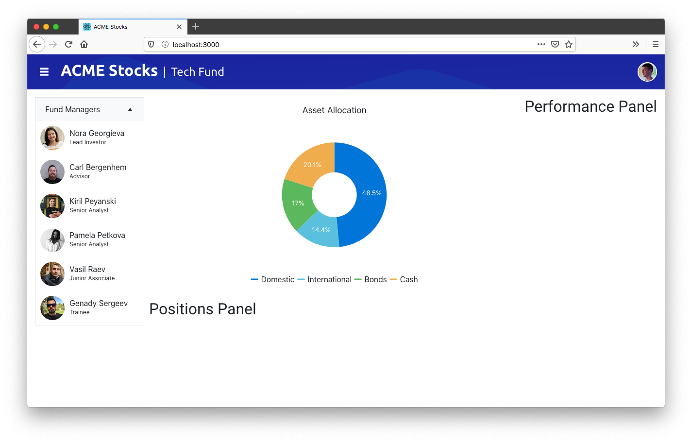

Again, note just how easy it was to add this component—all you needed to was install an npm package, import a component, and use some React-friendly APIs. And as a bonus, your chart automatically has styling that matches the other components on your page.

To see this further, let’s add a second chart to this sample app. To do that, open your `src/panels/PerformancePanel.tsx` file, and replace the `<h2>Performance Panel</h2>` markup with the code below.

``` HTML
<Chart>
  <ChartTitle text="Fund Performance" />
  <ChartCategoryAxis>
    <ChartCategoryAxisItem categories={["2014", "2015", "2016", "2017", "2018", "2019", "2020"]} />
  </ChartCategoryAxis>
  <ChartSeries>
    <ChartSeriesItem type="line" data={data} />
  </ChartSeries>
  <ChartTooltip render={renderTooltip} />
</Chart>
```

When your app refreshes you should see a new line chart in your app’s third panel.

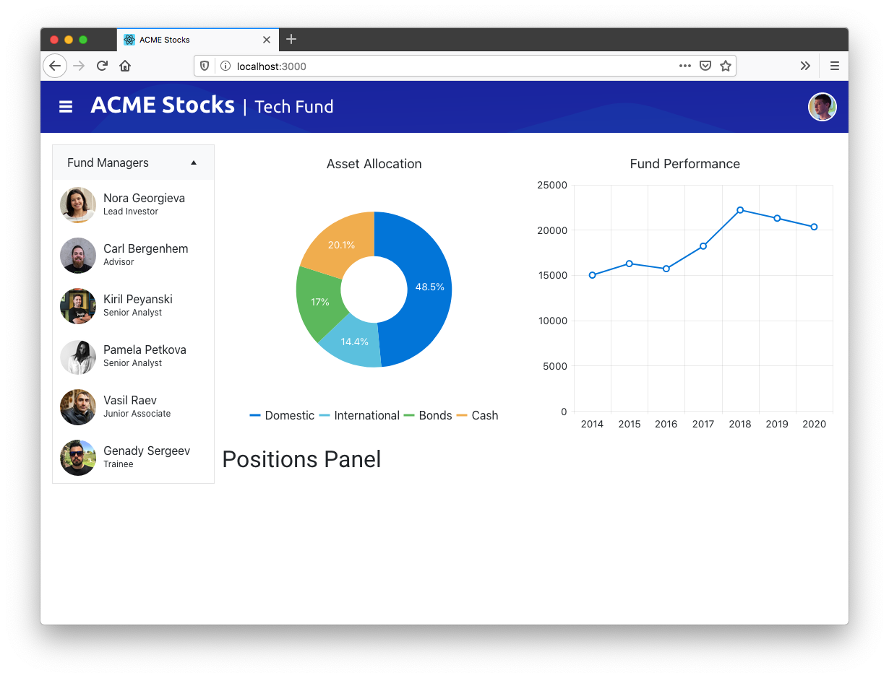

Once again, the power here is just how easy KendoReact makes it to add powerful charts.

And like with the PanelBar, you can easily customize KendoReact charts to meet the needs of your business, whether that’s [adding the ability to export to PDF or SVG](https://www.telerik.com/kendo-react-ui/components/charts/chart/export-options/), [allowing users to pan and zoom](https://www.telerik.com/kendo-react-ui/components/charts/chart/pan-zoom/), [adding internationalization support](https://www.telerik.com/kendo-react-ui/components/charts/globalization/), and a whole lot more.

And this level of customization applies to all KendoReact components, including our single most popular component—the grid.

### Working with the Grid

The [KendoReact grid](https://www.telerik.com/kendo-react-ui/components/grid/) provides a crazy-comprehensive set of ways to work with data. In its most basic form, the grid provides an elegant way to displaying data in a table, with support for features like [paging](https://www.telerik.com/kendo-react-ui/components/grid/paging/), [sorting](https://www.telerik.com/kendo-react-ui/components/grid/sorting/), [filtering](https://www.telerik.com/kendo-react-ui/components/grid/sorting/), [editing](https://www.telerik.com/kendo-react-ui/components/grid/editing/), [grouping](https://www.telerik.com/kendo-react-ui/components/grid/editing/), and more.

From there you can add more advanced features, like [PDF export](https://www.telerik.com/kendo-react-ui/components/grid/pdf-export/), [Excel exporting](https://www.telerik.com/kendo-react-ui/components/grid/pdf-export/), [locked columns](https://www.telerik.com/kendo-react-ui/components/grid/columns/locked/), [resizable columns](https://www.telerik.com/kendo-react-ui/components/grid/columns/locked/), and [virtualized scrolling](https://www.telerik.com/kendo-react-ui/components/grid/scroll-modes/virtual/) if you’d like, or, you can stick with the basics if that’s all you need.

In this section we’ll stick with the basics so you can see just how easily you can add a grid to your own apps, and how well the Grid works with other KendoReact components.

You’ll want to start by installing the grid from npm, as well as its dependencies, which you can do by running the command below in your terminal or command prompt.

```
npm install --save @progress/kendo-react-grid @progress/kendo-data-query @progress/kendo-react-data-tools @progress/kendo-react-inputs @progress/kendo-react-intl @progress/kendo-react-dropdowns @progress/kendo-react-dateinputs @progress/kendo-drawing
```

Next, open your `src/panels/PositionsPanel.tsx` file, and note that the grid imports already appear on top.

``` TypeScript
import { Grid, GridCellProps, GridColumn } from "@progress/kendo-react-grid";
```

The file also contains some data in a `positions` constant. To use it, replace the file’s `<h2>Positions Panel</h2>` markup with the following code.

``` TypeScript
<Grid
  data={positions}
  style={{ height: 700 }}
>
  <GridColumn title="Symbol" field="symbol" locked={true} width={100} />
  <GridColumn title="Name" field="name" />
  <GridColumn title="Change" field="day_change" />
  <GridColumn title="% Change" field="change_pct" />
  <GridColumn title="Volume" field="volume" />
  <GridColumn title="Market Cap" field="market_cap" />
</Grid>
```

When your app refreshes you should see the grid in the bottom panel of your app.

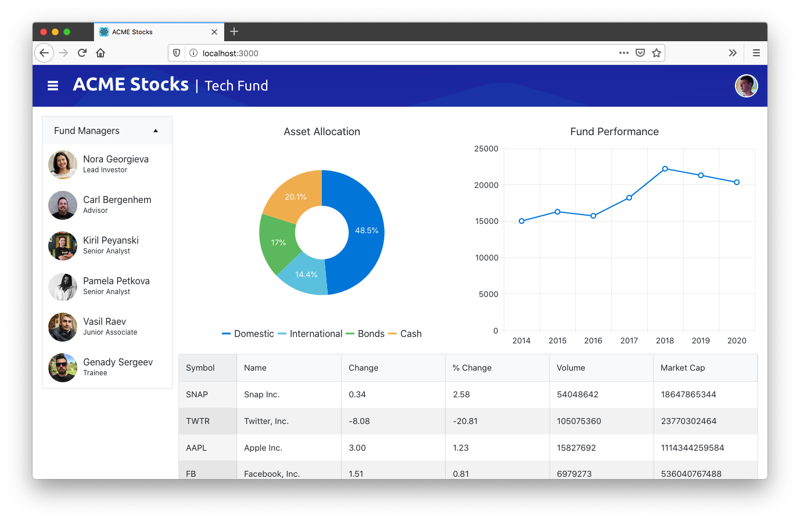

In this section we’ve added three different UI components—the PanelBar, the Chart, and the Grid—but the same pattern applies to the entire 80+ component suite that KendoReact offers.

And that really is the single biggest advantage of using KendoReact, especially in complex apps like financial dashboards. You have a single place to go for your UI component needs, and you can rest assured that your components look like they belong together.

But real-world apps often present challenges that go above and beyond what any third-party UI library can offer out of the box. With that in mind, let’s look at a few other things you can do to customize your apps.

## Step 3: Customizing your UI

Dashboards are complex, and real-world financial apps have to handle a dizzying set of requirements that change constantly. Therefore, it’s important that any tools you use can be customized to meet your changing needs.

In this article’s first step we used CSS grid layout, as it provides a flexible way to arrange your dashboard’s panels without messing with HTML. In this section we’ll look at a few ways to customize the KendoReact UI components themselves, giving you the ability to meet your business requirements without writing messy code.

### Extension points

KendoReact provides a number of extensibility APIs to let you customize the way your components render. This is most helpful on complex components, as oftentimes you want to tweak part of a component without having to rewrite the whole thing.

This is easier to see with an example. Note the current state of the grid in our example.


Suppose you get a new business requirement: you need to update the Change and % Change columns, so that positive numbers render with green text, and negative columns render with red text.

Before we talk about how to implement this, let’s take a look at the code that renders the grid again.

``` TypeScript
<Grid
  data={positions}
  style={{ height: 700 }}
>
  <GridColumn title="Symbol" field="symbol" locked={true} width={100} />
  <GridColumn title="Name" field="name" />
  <GridColumn title="Change" field="day_change" />
  <GridColumn title="% Change" field="change_pct" />
  <GridColumn title="Volume" field="volume" />
  <GridColumn title="Market Cap" field="market_cap" />
</Grid>
```

Third-party UI components tend to abstract away the underlying DOM. This is usually desirable—after all, writing `<Grid>` and `<GridColumn>` is way easier than writing a `<table><tbody><tr><td>` mess. But sometimes you do need control over what is rendered to meet your requirements. 

This is where extensibility points come in, and KendoReact provides many of them to help you solve real-world problems like this. For this specific scenario, the KendoReact GridColumn provides a `grid` property. To use it, start by finding these two GridColumns in your `src/panels/PositionsPanel.tsx` file.

``` HTML
<GridColumn title="Change" field="day_change" />
<GridColumn title="% Change" field="change_pct" />
```

And change them to use the following markup.

``` HTML
<GridColumn title="Change" field="day_change" cell={ChangeCell} />
<GridColumn title="% Change" field="change_pct" cell={ChangeCell} />
```

Next, add the following constant to the top of the same file (just below the `import` statements).

``` TypeScript
const ChangeCell = (props: GridCellProps) => {
  const value = props.dataItem[props.field || ""];
  return (
    <td style={{ color: value > 0 ? "green" : "red" }}>
      {value}%
    </td>
  )
}
```

Through the `cell` property, KendoReact gives you the ability to configure how an individual cell renders. In this case you use this API by defining a small `ChangeCell` component, which renders a table cell with green or red text depending on the value of the data item.

After you save this change, you should see the newly highlighted text in your browser.

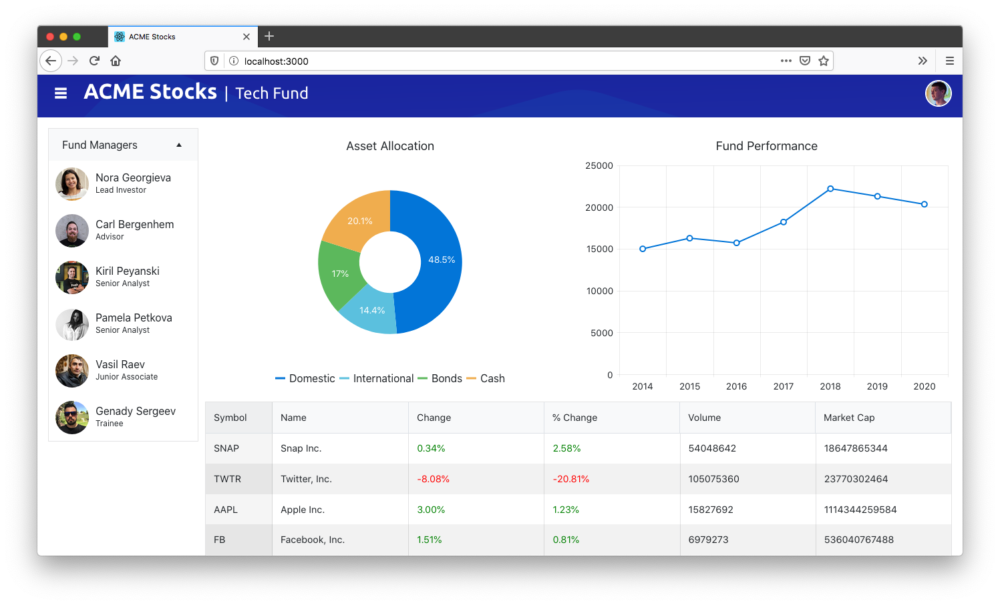

The great thing about this code is you were able to customize a small part of the UI—in this case the rendering of an individual grid cell—without having to fight against the component to do so.

And because this approach is so powerful and developer friendly, it’s a pattern we provide throughout KendoReact. If you’d like to see more examples, check this [documentation for the TreeList](https://www.telerik.com/kendo-react-ui/components/treelist/cells/), or [this documentation for the Scheduler](https://www.telerik.com/kendo-react-ui/components/scheduler/customization/items/), as they provide some of the better examples of just how easy KendoReact makes it to customize advanced UI components.

Before we wrap up let’s tackle one more common challenge when working on large apps like dashboards: theming.

### Theming

Few developers write dashboards without any design guidelines. More commonly, you’ll start a dashboard project with a design specification you have to meet, or an internal design system you must comply with.

To help meet those needs, KendoReact provides a [ThemeBuilder](https://themebuilder.telerik.com/kendo-react-ui) that gives you a single place to configure the visual appearance of all of your UI components.

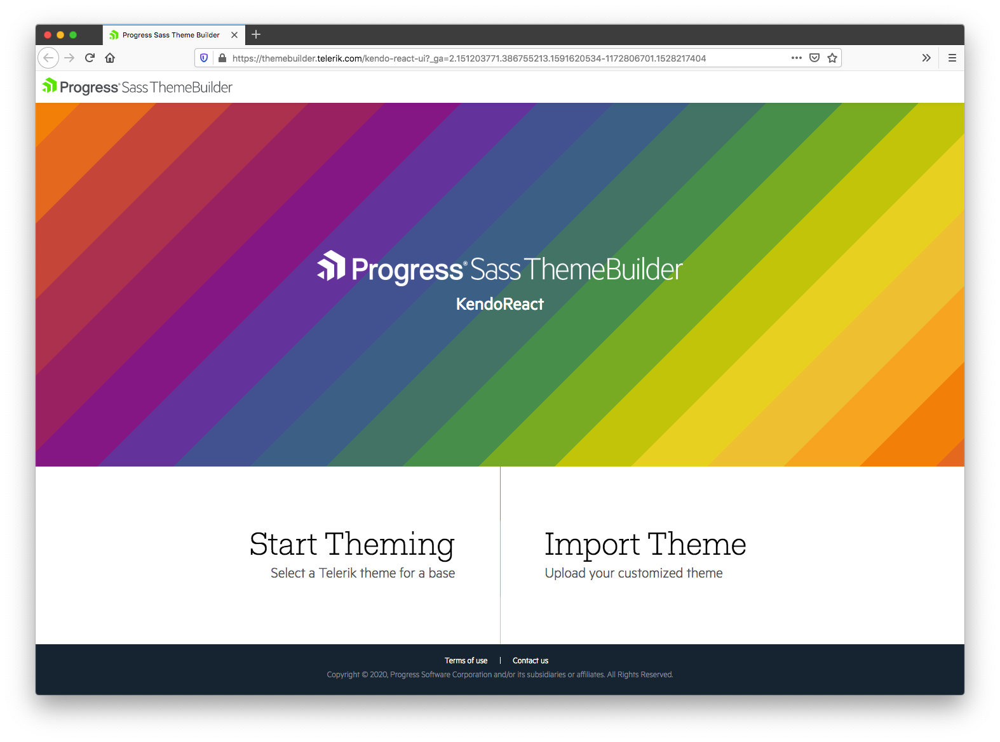

To start, you must first pick from one of KendoReact’s three base themes to use as a starting point.

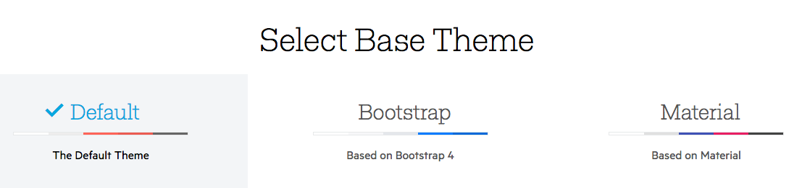

Next, you need to configure the various colors in ThemeBuilder to match your own design requirements, or, choose from one of the preconfigured color swatches using the drawer on the left-hand side of the screen.

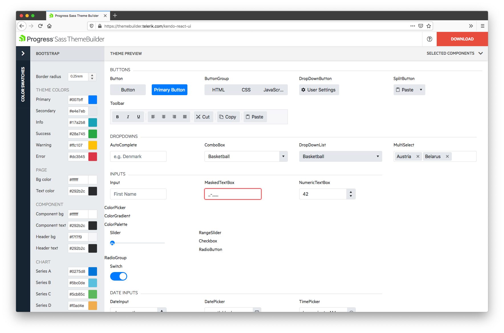

When you’re all set, follow the instructions on the KendoReact documentation on [importing your custom theme into your project](https://www.telerik.com/kendo-react-ui/components/styling/theme-builder/#toc-using-the-themes-in-your-project).

For example, here’s what your dashboard will look like if you go through those steps, and add the default **Dark** color swatch without any additional customization.

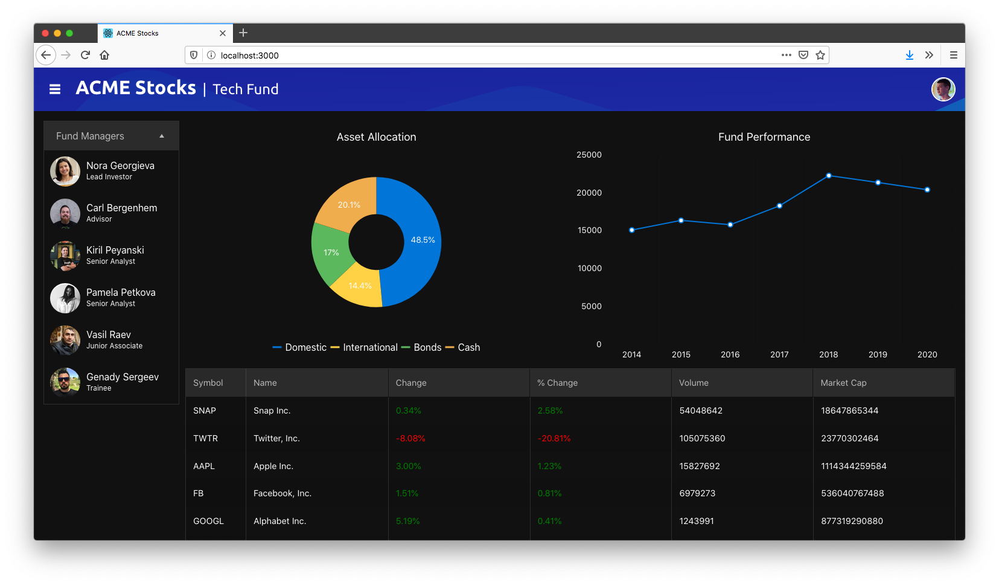

Overall, KendoReact gives you a ton of ability to customize the visual appearance of your widgets to meet your needs. And you can do more than just configure colors—for more advanced customization options, check out our article [_How to Add Custom Styles to KendoReact Components with SASS_](https://www.telerik.com/blogs/how-to-add-custom-styles-to-kendoreact-components-with-sass).

## Wrapping up

Dashboards are hard, especially financial dashboards, but in this article you learned a series of techniques to make building them easier.

First, you learned about CSS grid layout, a new CSS syntax that makes it easier to build and maintain the complex layouts that are typical in grids.

Next, you learned about KendoReact, a powerful suite of UI components that make it easy to solve UI challenges common in dashboards, such as working with charts and grids.

And finally you learned how to customize the KendoReact controls as well as your dashboard’s theme to meet the needs of your app.

If you’re interested in bringing this same power to your own app development, [sign up for a free trial of KendoReact](https://www.telerik.com/kendo-react-ui/) today!

> **NOTE**: You can find the [final source code for this article on GitHub](https://github.com/tjvantoll/financial-dashboard).