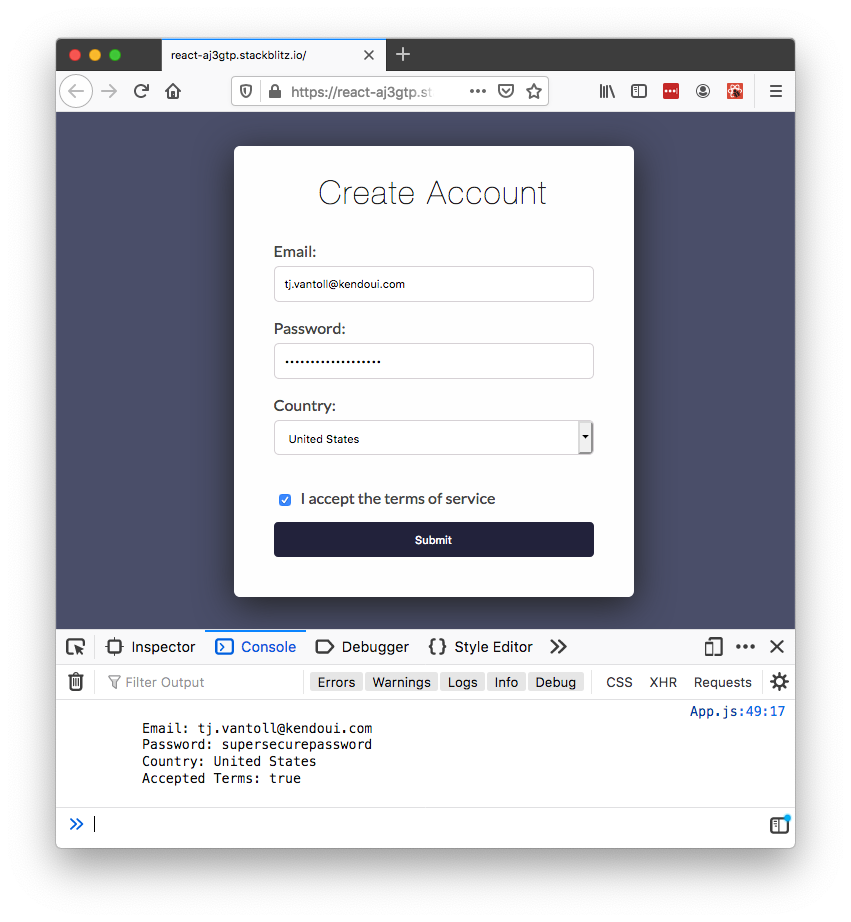

# How to Build Forms in React the Easy Way

Forms are hard, regardless of the framework or libraries you use to create them. But in React forms are especially tricky, as the [official React form documentation](https://reactjs.org/docs/forms.html) is brief, and doesn’t discuss topics that real-world forms always need, such as form validation.

In this article you’ll learn how to build React forms the easy way using the newly released [KendoReact Form component](https://www.telerik.com/kendo-react-ui/components/form/). You’ll learn how to simplify your form’s state management, how to integrate with custom components like date pickers and drop-down lists, and how to implement robust form validation.

Let’s get started.

## Our demo form

For this article’s demo we’ll look at a few different ways to implement the sign-up form below. 


Let’s start by looking at an implementation of this form with no libraries, as it’ll show some of the challenges inherent to building forms with React today. The code to implement the form is below. Don’t worry about understanding every detail, as we’ll discuss the important parts momentarily.

``` JSX
import React from "react";
import countries from "./countries";

export default function App() {
  const [email, setEmail] = React.useState("");
  const [password, setPassword] = React.useState("");
  const [country, setCountry] = React.useState("");
  const [acceptedTerms, setAcceptedTerms] = React.useState(false);

  const handleSubmit = (event) => {
    console.log(`
      Email: ${email}
      Password: ${password}
      Country: ${country}
      Accepted Terms: ${acceptedTerms}
    `);
    
    event.preventDefault();
  }

  return (
    <form onSubmit={handleSubmit}>
      <h1>Create Account</h1>

      <label>
        Email:
        <input
          name="email"
          type="email"
          value={email}
          onChange={e => setEmail(e.target.value)}
          required />
      </label>
      
      <label>
        Password:
        <input
          name="password"
          type="password"
          value={password}
          onChange={e => setPassword(e.target.value)}
          required />
      </label>

      <label>
        Country:
        <select
          name="country"
          value={country}
          onChange={e => setCountry(e.target.value)}
          required>
          <option key=""></option>
          {countries.map(country => (
            <option key={country}>{country}</option>
          ))}
        </select>
      </label>

      <label>
        <input
          name="acceptedTerms"
          type="checkbox"
          onChange={e => setAcceptedTerms(e.target.value)}
          required />
        I accept the terms of service
      </label>

      <button>Submit</button>
    </form>
  );
}
```

> **TIP**: You can play with a [live version of this form on StackBlitz](https://stackblitz.com/edit/react-lknyzq?embed=1&file=App.js).

For this example, the first thing to note is how much code it takes to track the state of the form fields. For instance, to track the state of the email address this example uses a hook.

``` JavaScript
const [email, setEmail] = React.useState("");
```

Next, to ensure the email remains up-to-date as the user interacts with the form, you must add `value` and `onChange` attributes to the email address `<input>`.

```
<input
  name="email"
  type="email"
  value={email}
  onChange={e => setEmail(e.target.value)}
  required />
```

Every field requires the same chunks of code, which can easily get verbose as your forms get more complex. And this verbosity has consequences, as verbose code is harder to maintain, and is also harder to refactor as your business requirements change.

Also, consider that this example’s sign-up form is purposefully simple to make this article easier to follow. Most real-world forms have far more fields and far more business logic, and as complexity rises, so does the importance of reducing the amount of code you need to write and maintain.

In order to clean up our example form’s logic, and in order to add powerful features like form validation and custom components, let’s look at how to refactor this form to use the KendoReact Form component.

## Using the KendoReact Form

The [KendoReact Form](https://www.telerik.com/kendo-react-ui/components/form/) is a small (5KB minified and gzipped) and fast package for state management with zero dependencies.

You can install the package into your own app from npm.

```
npm install --save @progress/kendo-react-form
```

The package contains two components, Form and Field. The basic idea is you wrap your HTML `<form>` with the Form component, and then use one Field component for each field in your form. The structure looks like this.

``` HTML
<Form ...>
  <form>
    <Field name="email" />
    <Field name="password" />
    ...

    <button>Submit</button>
  </form>
</Form>
```

With that basic structure in mind, next, take a look at the code below, which shows our sign-up form example adapted to use the KendoReact Form and Field components. Again, don’t worry about understanding all the details here yet, as we’ll discuss the important parts momentarily.

``` JSX
import React from "react";
import { Form, Field } from "@progress/kendo-react-form";
import countries from "./countries";

export default function App() {
  const handleSubmit = (data, event) => {
    console.log(`
      Email: ${data.email}
      Password: ${data.password}
      Country: ${data.country}
      Accepted Terms: ${data.acceptedTerms}
    `);
    
    event.preventDefault();
  }

  return (
    <Form
      onSubmit={handleSubmit}
      initialValues={{}}
      render={(formRenderProps) => (
        <form onSubmit={formRenderProps.onSubmit}>
          <h1>Create Account</h1>

          <Field
            label="Email:"
            name="email"
            fieldType="email"
            component={Input} />
          
          <Field
            label="Password:"
            name="password"
            fieldType="password"
            component={Input} />

          <Field 
            label="Country:"
            name="country"
            component={DropDown}
            options={countries} />

          <Field
            label="I accept the terms of service"
            name="acceptedTerms"
            component={Checkbox} />

          <button>Submit</button>
        </form>
      )}>
    </Form>
  );
}
```

The first thing to note about this code is the lack of verbose state-management code. In fact, to get your form’s data, all you need to do is provide on `onSubmit` prop on the Form component.

```
<Form
  onSubmit={handleSubmit}
```

And then, make sure each Field you use has a `name` attribute.

``` HTML
<Field name="email" ... />
<Field name="password" ... />
```

If you do, the Form component will pass the `onSubmit` handler an object that contains all the form’s data when the user submits the form. Here’s what that looks like in a live version of the form.



The other thing the Form component provides is the ability to render your fields using custom components, which our example does through the `component` prop.

``` HTML
<Field
  ...
  component={Input} />
<Field
  ...
  component={Input} />
<Field 
  ...
  component={DropDown} />
<Field 
  ...
  component={Checkbox} />
```

The Form passes these custom components a variety of props, and these props allow you to render your fields according to your design and business requirements. For example, here’s how our example renders the custom `Input` component.

``` JavaScript
const Input = (fieldProps) => {
  const { fieldType, label, onChange, value } = fieldProps;

  return (
    <div>
      <label>
        { label }
        <input
          type={fieldType}
          value={value}
          onChange={onChange} />
      </label>
    </div>
  );
};
```

> **NOTE**: Although you have full control over how you render your fields, all KendoReact Fields require you to use controlled components. You can read more about controlled components on the [React documentation](https://reactjs.org/docs/forms.html).

This ability to render custom components gives you the ability to consolidate how you display form controls throughout your application. It also gives you a logical place to implement more advanced form functionality, such as form validation. Let’s look at how to do that next.

> **TIP**: You can view the [full source code for this example on StackBlitz](https://stackblitz.com/edit/react-aj3gtp?file=App.js).

## Form validation

The KendoReact Form provides a series of APIs that make it easy to add custom form validation logic. To see what this looks like, let’s return to our email input, which currently looks like this.

``` HTML
<Field
  label="Email:"
  name="email"
  fieldType="email"
  component={Input} />
```

To add validation, let’s start by adding a `validator` prop to the field, which we’ll point at a function that determines whether the field’s contents are valid. For example, here is how you could ensure that email is a required field.

``` JavaScript
// Returning an empty string indicates that the field is valid.
// Returning a non-empty string indicates that the field is NOT valid,
// and the returned string serves as a validation message.
const requiredValidator = (value) => {
  return value ? "" : "This field is required";
}
```

``` HTML
<Field
  label="Email:"
  name="email"
  fieldType="email"
  component={Input}
  validator={requiredValidator} />
```

In our example we want to enforce that the user provided an email address, and also that the user provided a _valid_ email address. To do that we’ll tweak our validator a bit using the code below.

``` JavaScript
const emailValidator = (value) => (
  new RegExp(/\S+@\S+\.\S+/).test(value) ? "" : "Please enter a valid email."
);
```

``` HTML
<Field
  label="Email:"
  name="email"
  fieldType="email"
  component={Input}
  validator={emailValidator} />
```

Now that you have a way of determining whether fields are valid, your last step is visually displaying that information to your users. Let’s do that by returning to your custom Input component, which currently looks like this.

``` JavaScript
const Input = (fieldProps) => {
  const { fieldType, label, onChange, value } = fieldProps;

  return (
    <div>
      <label>
        { label }
        <input
          type={fieldType}
          value={value}
          onChange={onChange} />
      </label>
    </div>
  );
};
```

To add a validation message you’ll need to use three additional provided props: `valid`, `visited`, and `validationMessage`. The code below takes these new props, and uses them to display a validation message to the user when the field is erred.

``` JavaScript
const Input = (fieldProps) => {
  const {
    fieldType, label, onChange, value,
    valid, visited, validationMessage
  } = fieldProps;
  const invalid = !valid && visited;

  return (
    <div>
      <label>
        { label }
        <input
          type={fieldType}
          className={invalid ? "invalid" : ""}
          value={value}
          onChange={onChange} />
      </label>
      { invalid && 
        (<div className="required">{validationMessage}</div>) }
    </div>
  );
};
```

The KendoReact form also provides a helpful `allowSubmit` prop, making it easy for you to disable form submission until the user fixes all problems.

``` HTML
<Form
  render={(renderProps) => (
    ...

    <button disabled={!renderProps.allowSubmit}>
      Submit
    </button>
  )}>
</Form>
```

Here’s what all of this looks like in action.


The beauty of the KendoReact Form is just how easy it is to customize everything you see to meet your real-world requirements.

Don’t want to disable your app’s submit button? Then don’t include the `allowSubmit` logic. Want to show your validation messages in a different place, or use different class names? Then adjust the logic in your custom components.

By using the KendoReact Form you get all this, and you also benefit from the easy state management that the Form provides. Before we wrap up, let’s look at one additional KendoReact Form benefit: how easily the Form integrates with the rest of KendoReact.

## Using rich components

The KendoReact Form is a lightweight and stand-alone package, but it includes the ability to integrate with the rest of KendoReact.

And for good reason, as KendoReact provides a [rich suite of form controls](https://www.telerik.com/kendo-react-ui/components/), allowing you to do so much more than what’s possible with built-in browser elements.


In the case of our example, using the KendoReact form controls will help you simplify our form’s logic, as well as allow us to add on some rich functionality.

For instance, recall that our previous custom Input implementation looked like this.

``` JavaScript
const Input = (fieldProps) => {
  const {
    fieldType, label, onChange, value,
    valid, visited, validationMessage
  } = fieldProps;
  const invalid = !valid && visited;

  return (
    <div>
      <label>
        { label }
        <input
          type={fieldType}
          className={invalid ? "invalid" : ""}
          value={value}
          onChange={onChange} />
      </label>
      { invalid && 
        (<div className="required">{validationMessage}</div>) }
    </div>
  );
};
```

To enhance this Input let’s use the [KendoReact Input](https://www.telerik.com/kendo-react-ui/components/inputs/input/), which you can add to your project by installing its package from npm.

```
npm install @progress/kendo-react-inputs
```

With the package installed, your only other step is importing the Input component into your application.

``` JavaScript
import { Input } from "@progress/kendo-react-inputs";
```

With that setup out of the way, rewriting the custom input is as simple as swapping `<input>` for `<Input>`, and removing some of the boilerplate props that KendoReact now handles for you. Here’s what that looks like.

``` JavaScript
const CustomInput = (fieldProps) => {
  const {
    fieldType, valid, visited, validationMessage, ...others
  } = fieldProps;
  const invalid = !valid && visited;

  return (
    <div>
      <Input
        type={fieldType}
        {...others} />
      { invalid && 
        (<div className="required">{validationMessage}</div>) }
    </div>
  );
};
```

> **TIP**: You can view the [full source code for this example on StackBlitz](https://stackblitz.com/edit/react-v6wmgw?file=App.js).

Just by doing this you get some new behavior for free, such as Material-Design-inspired floating labels.


If you take the next step and switch to using the [KendoReact DropDownList](https://www.telerik.com/kendo-react-ui/components/dropdowns/dropdownlist/) and [Checkbox](https://www.telerik.com/kendo-react-ui/components/inputs/checkbox/), you also gain the ability to easily style your form controls.


And we’re just getting started. For your more advanced needs you might want to bring in a [ColorPicker](https://www.telerik.com/kendo-react-ui/components/inputs/colorpicker/), [MaskedTextBox](https://www.telerik.com/kendo-react-ui/components/inputs/maskedtextbox/), [Slider](https://www.telerik.com/kendo-react-ui/components/inputs/slider/), [Switch](https://www.telerik.com/kendo-react-ui/components/inputs/switch/), [DatePicker](https://www.telerik.com/kendo-react-ui/components/dateinputs/datepicker/), [TimePicker](https://www.telerik.com/kendo-react-ui/components/dateinputs/timepicker/), [DateRangePicker](https://www.telerik.com/kendo-react-ui/components/dateinputs/daterangepicker/), [AutoComplete](https://www.telerik.com/kendo-react-ui/components/dropdowns/autocomplete/), [ComboBox](https://www.telerik.com/kendo-react-ui/components/dropdowns/combobox/), [DropDownList](https://www.telerik.com/kendo-react-ui/components/dropdowns/dropdownlist/), [MultiSelect](https://www.telerik.com/kendo-react-ui/components/dropdowns/multiselect/) or [Editor](https://www.telerik.com/kendo-react-ui/components/editor/).

All the KendoReact controls work with the KendoReact Form, and all adhere to [KendoReact’s strict accessibility standards](https://www.telerik.com/kendo-react-ui/components/accessibility/). It’s everything you need to build the rich forms your applications need.

## Wrapping up

Building forms with React can seem hard, but it doesn’t have to be. By using the KendoReact Form you can simplify your state management, implement form validation, and easily bring in custom components, such as additional KendoReact form controls.

When you’re ready to get started, go ahead and [start a free trial of KendoReact](https://www.telerik.com/download-login-v2-kendo-react-ui) today. Feel free to refer back to the [final version of our example](https://stackblitz.com/edit/react-v6wmgw?file=App.js) at any time, and if you have any questions let us know in the comments.