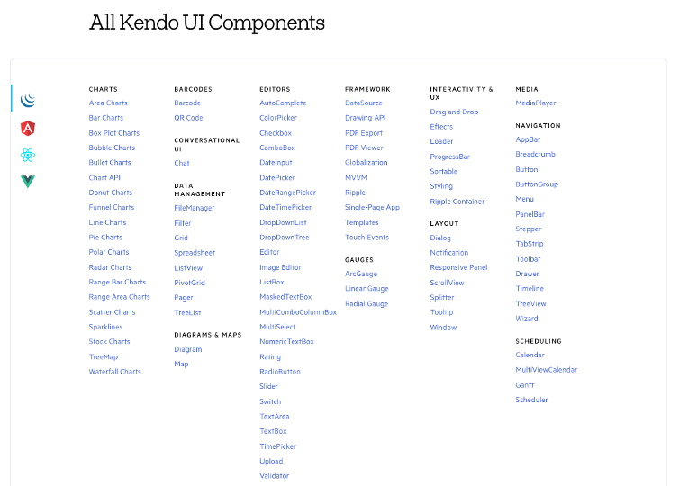

# How We Use Gatsby At Scale

Here on the [Kendo UI](https://www.telerik.com/kendo-ui) team we have a lot of content.

Kendo UI is made up of four different suites of UI components—jQuery, Angular, React, and Vue.js—and each of those suites has a comprehensive set of articles, demos and examples. For example, [KendoReact](https://www.telerik.com/kendo-react-ui/), our component suite for React, has over 3,000 documentation pages and 1,500 demos alone.

_So. Many. Components._

To manage all this complexity we use [Gatsby](https://www.gatsbyjs.com/), a React-based open source framework for creating static sites. In this article we’ll discuss how we use Gatsby at scale, and share some tips & tricks you might find useful for your own Gatsby development.

## Using Gatsby themes as a feature

One feature we utilize fairly heavily is Gatsby themes. From the Gatsby docs:

> “Gatsby themes are plugins that include a gatsby-config.js file and add pre-configured functionality, data sourcing, and/or UI code to Gatsby sites. You can think of Gatsby themes as separate Gatsby sites that can be put together and allow you to split up a larger Gatsby project!”

Themes are what allow us to 

    * How we utilize gatsby themes as a feature
        * We have themes for blogs, docs, demos, changelog, and a core theme
        * Series of plugins and components

## Making Gatsby fast

    * Performance optimizations
        * It’s important for our site to be fast. (Show Google performance stats?)
        * Gatsby gives you a lot out of the box.

---

* Gatsby

    * What we’re building is big
        * React site is ~3000 documentation pages and 1500 demo pages.
        * Strip down markdown processor
            * MarkdownX gives you a lot of features but is slow. Takes us around 5 minutes for this step alone.
        * Use snowpack
            * Makes sure, for example, that each Grid demo doesn’t include its own instance of the grid.

    * Documentation sites are statically generated
    * Previous infrastructure was Jekyll + Liquid + Ruby
        * Struggled with outdated gems
        * Tough to extend, especially for JS developers
    * Started with proof of concept with KendoReact site.
        * It was a site we were updating constantly.
    * Internal project is called katana.
    * Worked for a single site but was harder to scale.
        * Wanted to share configuration
        * Wanted people to be able to work across sites.
        * Wanted to use the same repository.
        * gatsby-themes
            * https://www.gatsbyjs.com/docs/themes/what-are-gatsby-themes/
            * packages/themes/gatsby-theme-k3
            * Contains a lot of the shared logic and configuration
    * Gatsby examples tend to only show blog posts
    * Don’t get into TOC, navigation, etc.
    * 
    