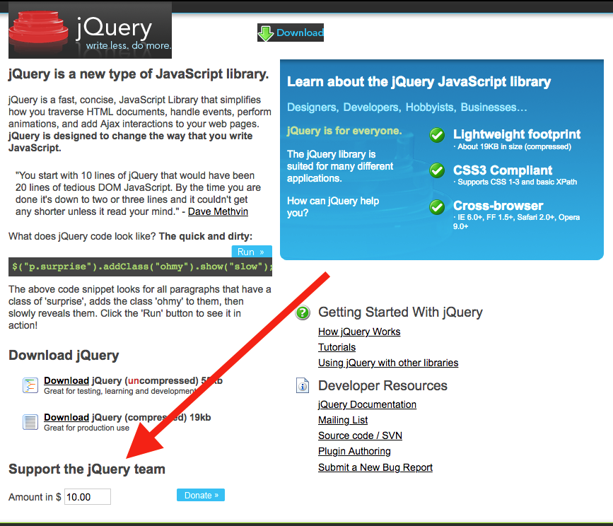

# Can We Make Open Source More Sustainable?

If you’re a software developer, you might not realize that the economics behind open source make zero sense to most people.

For example, consider this conversation I had with a normal person a few days ago.

> Me: “Sorry I’m a bit late. Crazy day at work”.

> Friend: “Ah, no worries, what’s up though?”

> Me: “We’re just trying to decide between three different JavaScript frameworks for that project, and the deadline is next week so we have to pick soon.

> Friend: “Ah, gotcha. Well which framework is the cheapest?”

> Me: “Oh they’re all free.”

> Friend: 🤯

In most industries you pay for tools that help you do your job, yet in the software world—a world where there’s a ton of money involved—most of us build apps using a variety of free tools.

The most popular text editor? Visual Studio Code—free. The most popular source-control provider? git—free. The most popular JavaScript libraries? React, Angular, Vue, and their competitors—all free. Although paid software very much exists, it’s amazing how much of our critical infrastructure has moved to free and open-source software over the last handful of years.

And although this switch to free-and-open-source tools has been enormously beneficial for developers, and for software in general, this same shift has also had consequences. In this article I’ll discuss one of those consequences: a problematic economic model, and I’ll discuss what I think we can do about it.

Let’s start this discussion by taking a brief look at how we ended up with the open-source model we have today.

## How did this happen?

To give you a sense of how much times have changed, here are a few [quotes from Microsoft executives](https://www.cnet.com/news/microsoft-raps-open-source-approach/) from the early 2000s that haven’t aged well.

> “Open source is an intellectual-property destroyer. I can't imagine something that could be worse than this for the software business and the intellectual-property business.”
> - Jim Allchin (Former Windows Chief)

> “As history has shown, while this type of model [open source] may have a place, it isn't successful in building a mass market and making powerful, easy-to-use software broadly accessible to consumers”
> - Craig Mundie (Former Microsoft Senior Vice President)

Although it’s easy to laugh at these quotes today, they weren’t very radical opinions at the time. Even though open source was already an established and growing concept by the year 2000, most companies primarily used paid solutions to build applications.

I started my career in software in the early 2000s, and my first job involved an IBM-based IDE for writing Java code, a proprietary source-control solution that I’d prefer not to remember, and an IBM mainframe to host our production apps.


_IBM’s Rational Application Developer. I used it in the early 2000s, and it’s still around today._

All of these tools cost money—a lot of money—but they were deemed an acceptable expense because the tools provided enough value to warrant their cost.

The switch to open source happened slowly throughout the following decade. Companies increasingly realized that open-source tools like MySQL and Apache were not only viable, but oftentimes better than the commercial products they were paying big money for.

My personal experience for this transformation was on the web, which in the mid 2000s was the wild west compared to the web we have today. Web developers were tasked with supporting a dizzying set of browsers, ranging from the newly released Internet Explorer 7, to the venerable IE6, as well as Firefox, an open-source browser that was starting to challenge Microsoft’s stranglehold on the browser market.

The tools developers built to manage the complexity of cross-browser development included the likes of Dojo, MooTools, jQuery, and many others.


_The jQuery homepage in June of 2007_

And while these frameworks took different approaches and used different APIs, they had one important thing in common: they were all free and open source.

Whereas more established development ecosystems—Java, .NET, etc—were still conflicted about the benefits of open source, the web was built on free-and-open-source software from its onset.

This was a boon to new web developers like me, as it meant I could instantly start tinkering with Dojo and jQuery at home, and even start using them at my corporate day job—a place where I was used to paying for the software tools I needed.

And it wasn’t just me that jumped on the chance to use these new libraries. jQuery usage exploded in the late 2000s, and created an enormous ecosystem of jQuery plugins that built upon what jQuery had started. The overwhelming majority of these plugins were free and open source, as that had become the expectation for any web framework or plugin by this point.

This new generation of web software inspired a lot of developers—myself included—and helped build the web into the dominant platform it is today. But this expectation that all software must be free and open-source helped to create one problem we have with open source today: a problematic economic and funding structure.

## Open source and economics

Open source projects often start as a passion project for an individual or a small group, which they then share with the world for free. The fact that this is commonplace in the software world is actually kind of awesome.

But that doesn’t mean that the work these developers do is 100% altruistic. The primary incentive to working on an open-source project today is career advancement. For example, many former members of the jQuery team now have prominent roles at major tech companies. Several [MooTools contributors now work on React at Facebook](https://www.freecodecamp.org/news/between-the-wires-an-interview-with-mootools-contributors-33d764957575/). Personally, I worked on jQuery UI for two years, and that involvement helped me get the job I have today at Progress.

There’s nothing inherently wrong with career advancement as the primary incentive to work on open source, but it can become problematic when the project author(s) achieve some success. Because, as it turns out, once you’ve achieved whatever notoriety you had in mind, suddenly dealing with random GitHub issues no longer feels like the best way to spend your Saturday nights.

In this situation, many developers try to gather donations to cover their time and effort. For example, if you look back at jQuery’s site from 2007, notice how there was already a donation button on the bottom-left corner of the screen.



The Dojo project had a similar donation on their site dating back to the same time frame.


Today, these calls for donations more typically happen through Patreon, or through some form of sponsorship, which projects like ESLint and Vue.js use. Perhaps the most notorious example occurs in the popular [core-js library](https://github.com/zloirock/core-js), which includes an overt donation request every time you install the library, and which has generated [some controversy](https://github.com/zloirock/core-js/issues/548).

```
Thank you for using core-js ( https://github.com/zloirock/core-js ) for polyfilling JavaScript standard library!

The project needs your help! Please consider supporting of core-js on Open Collective or Patreon: 
> https://opencollective.com/core-js 
> https://www.patreon.com/zloirock 

Also, the author of core-js ( https://github.com/zloirock ) is looking for a good job -)
```

In an even more controversial move, last year the [Standard JavaScript project](https://github.com/standard/standard) [started showing ads every time you installed its package](https://www.zdnet.com/article/popular-javascript-library-starts-showing-ads-in-its-terminal/).

<blockquote class="twitter-tweet"><p lang="en" dir="ltr">I guess we now live in the post-&quot;ads in the npm install log&quot; era <a href="https://t.co/pSnBnMDNSg">pic.twitter.com/pSnBnMDNSg</a></p>&mdash; Quine atom (@qntm) <a href="https://twitter.com/qntm/status/1165344132728066048?ref_src=twsrc%5Etfw">August 24, 2019</a></blockquote> <script async src="https://platform.twitter.com/widgets.js" charset="utf-8"></script> 

As you might expect [developers weren’t too happy about the ad](https://github.com/standard/standard/issues/1381), and [npm quickly took action](https://www.zdnet.com/article/npm-bans-terminal-ads/)—banning any package that “display ads at runtime, on installation, or at other stages of the software development lifecycle, such as via npm scripts.”

Regardless of what you think about ads in your npm logs, there’s one thing we can probably all agree on: from an economics perspective, the idea that authors want money for their work shouldn’t be surprising at all. 

In today’s open-source world there’s a massive disconnect between the amount of value projects like core-js and Standard provide, and the financial proceeds maintainers earn in return for their effort.

With that background in mind, let’s look at what I believe are three different ways we could attempt to solve this funding gap.

## Solution #1: Foundations

The oldest solution to open-source funding comes in the form of foundations. The most well-known foundation is the [Linux Foundation](https://www.linuxfoundation.org), which was founded in the year 2000, and which today has [a crazy number of corporate members](https://www.linuxfoundation.org/membership/members/). The foundation supports some of the biggest open-source projects out there, from Linux itself, to Node.js, to jQuery, and just about everything in between.


_The Linux Foundation supports development on a [ton of projects](https://www.linuxfoundation.org/projects/)._

Although the Linux Foundation is the largest software foundation, there are a variety of others for more specialized software technologies or fields. For example, the [.NET Foundation](https://dotnetfoundation.org/) helps support .NET projects, and [FINOS](https://www.finos.org/), the Fintech Open Source Foundation, supports open-source projects in the financial space.

Although these foundations have done unquestionable good, and are the reason that big open-source projects like Linux stay maintained, they’re not a silver-bullet solution to solving open-source funding.

Perhaps the biggest issue with foundations is the sheer breadth of projects they support. If you’re a company and you pay money to join a foundation—and it’s usually a whole lot of money—you’re relying on the foundation to allocate those funds into the individual open-source projects appropriately. And when there are a crazy number of projects these foundations support, there’s no guarantee that your money will go to projects your company uses or cares about. There’s also some chance that your money will go into a competitor’s open source project or initiative.

Because of this, I see foundations as an excellent solution for large established projects, such as Linux, Node.js and jQuery, but less useful for less-established open-source projects. But the good news is, there’s another model aimed at these smaller projects that’s gotten a lot of attention lately: subscriptions.

## Solution #2: Subscriptions

Subscriptions have long been a popular way for open-source project authors to raise money to support their work.

In the early 2000s, services like PayPal were popular for one-time donations and recurring payments. More recently, Patreon popularized a subscription model for funding open-source projects, and a number of different subscription platforms now compete to provide a similar service.

For example, the [Open Collective platform](https://opencollective.com/) launched in 2016, offering a funding model that revolves around public donations.


Today, an impressive set of projects use Open Collective, including projects like [Bootstrap](https://opencollective.com/bootstrap) and [core-js](https://opencollective.com/core-js). Because the donations on Open Collective are public, they provide a rare view into how much money some of these projects actually take in. For example, here are the top financial contributors to Bootstrap on Open Collective.


What I like about this model is it offers an incentive for organizations to sponsor projects—and that incentive is appearing on the list of top financial contributors. For example, I had no idea what Segment was, but I looked up the service after seeing they were the #2 funder of Bootstrap.

Open Collective is not the only player in this space, as last year GitHub debuted [GitHub Sponsors](https://github.com/sponsors), an open-source sponsorship program built into GitHub itself. GitHub has a pretty big competitive advantage for making GitHub Sponsors succeed, as GitHub itself has been the canonical place to host open-source projects over the last decade.

To GitHub’s credit though, they do take steps to ensure their program gets positioned alongside competing donation services. For example, any project on GitHub can now create a `.github/FUNDING.yml` file, and in that file you can [list all the sponsorship options your repository offers](https://help.github.com/en/github/administering-a-repository/displaying-a-sponsor-button-in-your-repository)—whether those options are GitHub Sponsors or not.

If you do, GitHub will display a “Sponsor” button on your repository, which lists all those sponsorship options for your users. For example, here’s what that process looks like for the [core-js GitHub repository](https://github.com/zloirock/core-js).


The last service I want to discuss appears last in the screenshot above, [Tidelift]([Tidelift](https://tidelift.com/)), which has a rather unique offering. Tidelift is a ~$1,500 monthly subscription product that provides something they call “managed open source”, which Tidelift’s website describes in three parts:

* **Tools**. We provide tools to keep track of all the dependencies you use, flag issues, and enforce policies.
* **Management**. We manage core, mission-critical packages on your behalf, including researching and resolving issues so you don't have to anymore.
* **Maintainers**. We recruit maintainers for many important projects and pay them to proactively prevent problems and address the root causes of issues.

I’m a bit skeptical of this approach, both because it feels like a very indirect way of supporting open-source maintainers, and because I don’t see much incentive for companies to subscribe. Nevertheless, I do like that there are companies out there trying innovative new ways to create a different open-source funding model. And I should also note that [Tidelift has raised a shocking $40 million dollars in funding](https://news.crunchbase.com/news/tidelift-raises-25m-series-b-just-seven-months-after-last-funding/), so there are investors out there that think Tidelift’s model has some real potential.

Overall, perhaps the biggest reason to be optimistic about the future of subscription services is the current number of competitors. More competitors means more ideas, and if economics works like it should, the best ideas will find their way to more and more projects. And the fact that GitHub is now involved, and providing **Sponsor** buttons on repositories, will help ensure that these sponsorship services remain visible.

The reason to be pessimistic about subscription services is they rely heavily on goodwill. Convincing companies to donate money is not easy, and even though these subscription services offer incentives, such as appearing on a list of top donors, I believe they’ll need to offer companies more in return for their cash.

Before wrapping up our tour of open-source funding solutions, I want to discuss one final option you might not have thought about.

## Solution #3: Paying for software

In researching this article I read a lot of opinions on how to fix open-source economics, and none of them included the simplest economic solution: having companies pay for the software they use directly.

I have a lot of personal experience with both free and paid software, as I’ve spent my career with both, and over time I’ve gone from a die-hard open-source fan, to being far more pragmatic about when paying for software makes sense—largely because I’ve seen the difficulty of funding open-source projects first-hand.

I was a member of the free-and-open-source [jQuery UI](https://jqueryui.com/) project for two years, and am proud that our components helped web developers around the world build better apps. But at the same time, I also saw that when maintainers’ interest goes away, and when sponsorship money can no longer cover the bills, a project can quickly die off. Today, jQuery UI is technically part of the Linux Foundation, but the project’s last release happened in 2016.

I then worked as part of the free-and-open-source [NativeScript](https://www.nativescript.org/) project for five years, and our framework has helped tons of JavaScript developers build iOS and Android apps. But while working on NativeScript I learned how hard it is to finance a framework when you make no money directly—especially when you compete with the likes of Facebook’s React Native and Google’s Flutter, companies that have a seemingly endless budget and zero revenue goals.

As a contrast to my work on jQuery UI and NativeScript, for the last several months I’ve switched over to work on the [KendoReact team](https://www.telerik.com/kendo-react-ui/), where we sell premium UI components to React developers. Whereas with jQuery UI and NativeScript I had trouble explaining the finances around everything I did, with KendoReact it’s quite simple: developers pay us money, and in return, we give them a suite of awesome user interface components.


_A sample app showing off several KendoReact UI components. You can try it for yourself [here](https://telerik.github.io/kendo-react-finance-portfolio/#/stocks)._

Paid software has a number of benefits. By paying, you get a number of assurances you don’t from a random project you find on GitHub—for example guaranteed updates, more consistent APIs, and a company you can get contact when things inevitably go wrong.

That doesn’t mean that paid software is perfect. Charging money for software makes it harder to build a community, as you’ll never have as many paying customers as you will have free users. Receiving payments also requires you to have some corporate infrastructure, which can be onerous for small projects.

For these reasons I’m not suggesting that all, or even most software charge money. Open source software has done a lot of good for the world, and should continue to be the way we develop most of our software. But I do believe that paid software has a place, and shouldn’t be something that developers immediately reject out of principle.

Along with foundations and donations, charging money for software should be seen as a viable way to fund software projects.

## Wrapping up

In today’s software world there’s a huge disconnect between the value open-source projects provide, and the financial compensation they receive in return.

This disconnect has spurred the creation of a number of services to attempt to make open-source economics more sane. Foundations help ensure large open-source projects continue to run, and subscription services can help smaller open-source project maintainers pay their bills.

My hope is that, in general, we can encourage companies to increasingly pay for the software they use. These payments can come in the form of foundation memberships, subscriptions to open-source projects, or through payments to the software they use directly. Hopefully, the ongoing innovation in this space will help make these payments easier, and encourage more corporations to give back to an industry they benefit from enormously. If they do, it’ll help us explain how open source works to our friends and families a lot easier.
