# Announcing the Kendo UI Template Wizard for Visual Studio Code

One of our goals on the Kendo UI team is to help you build great apps fast. With that in mind, today we’re happy to announce a new [Kendo UI Template Wizard](https://marketplace.visualstudio.com/items?itemName=KendoUI.kendotemplatewizard) for Visual Studio Code 🎉

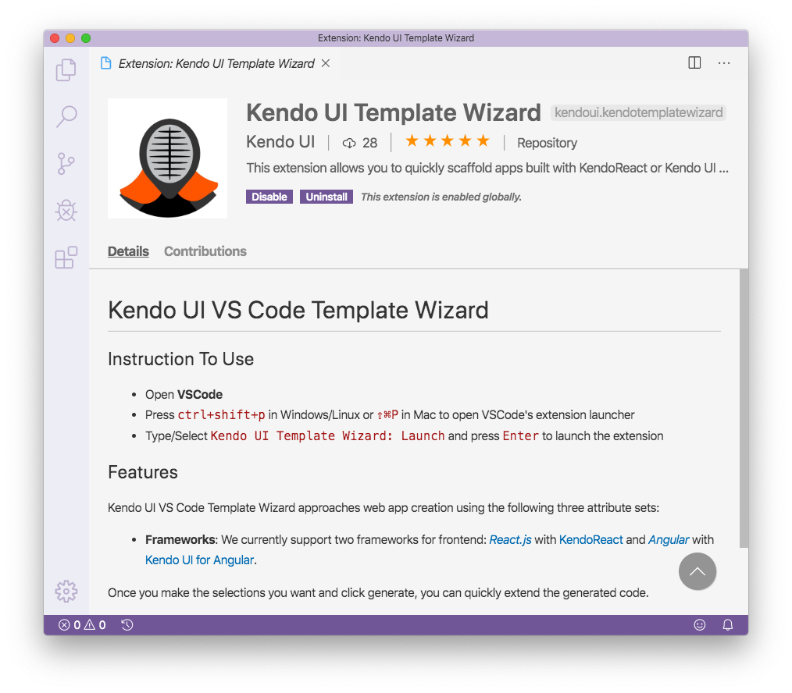

The template wizard allows you to quickly scaffold React and Angular applications using an easy-to-use tool built directly into Visual Studio Code.

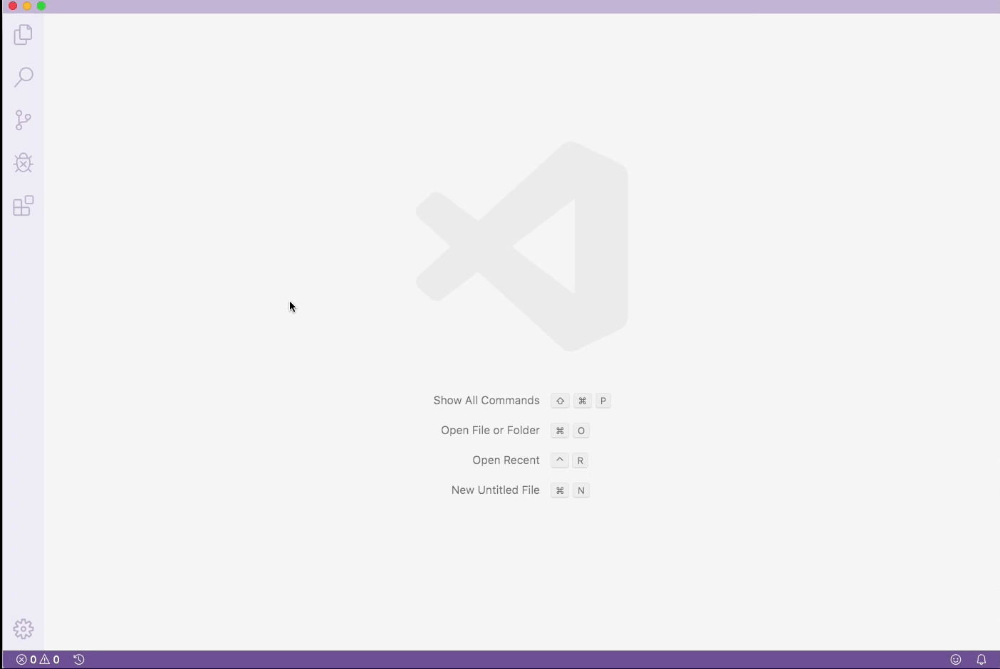

In this article you’ll learn how to install the extension, and how to use it to create powerful Angular and React applications.

## Installation

The Kendo UI Template Wizard is a Visual Studio Code extension, and as such you’ll need to have [Visual Studio Code installed](https://code.visualstudio.com/) to use it.

Once you have Visual Studio Code installed, go ahead and open it, head to the extensions tab (#1 in the image below), and use the search bar (#2 in the image below) to search for **Kendo UI Template Wizard**.

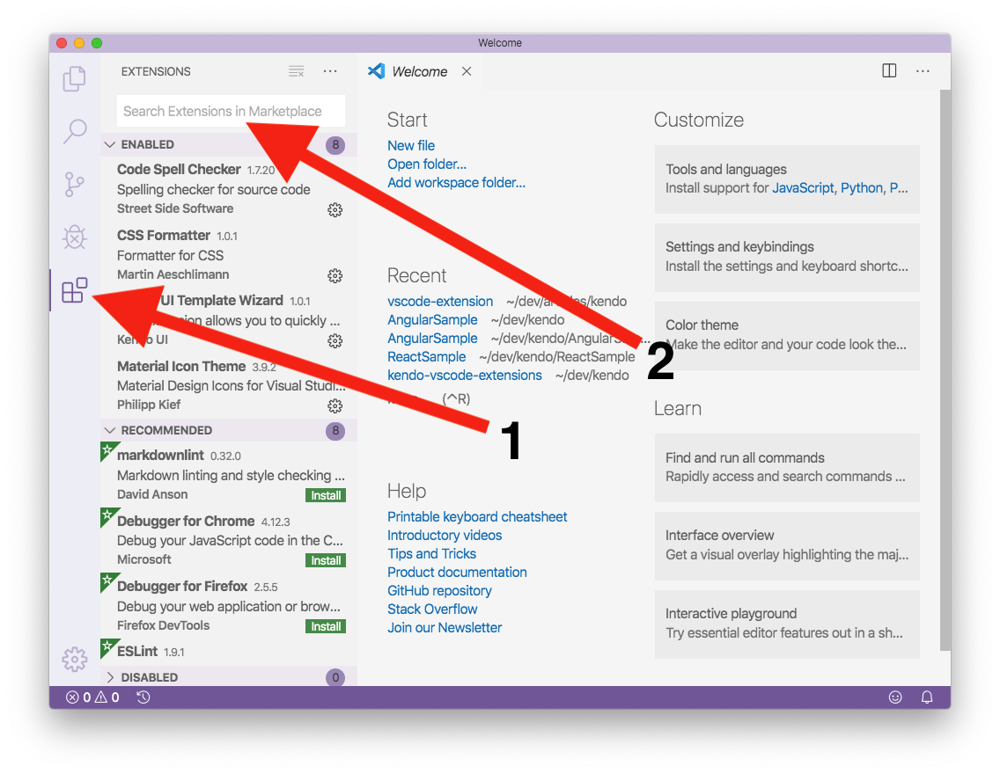

Select the Kendo UI Template Wizard and then click the green **Install** button to add the extension to Visual Studio Code.

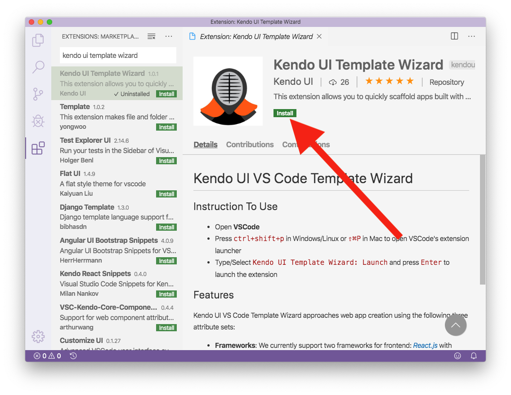

And... that’s it! You now have the extension installed and ready to go, so let’s see what it can do.

## Using the extension

To launch the Kendo UI Template Wizard you’ll need to use the Visual Studio Code command pallette, which you can open with `Ctrl + Shift + P` (`Cmd + Shift + P` on macOS). With the pallette open, search for the **Kendo UI Template Wizard Launch** option, and select it to launch the wizard.

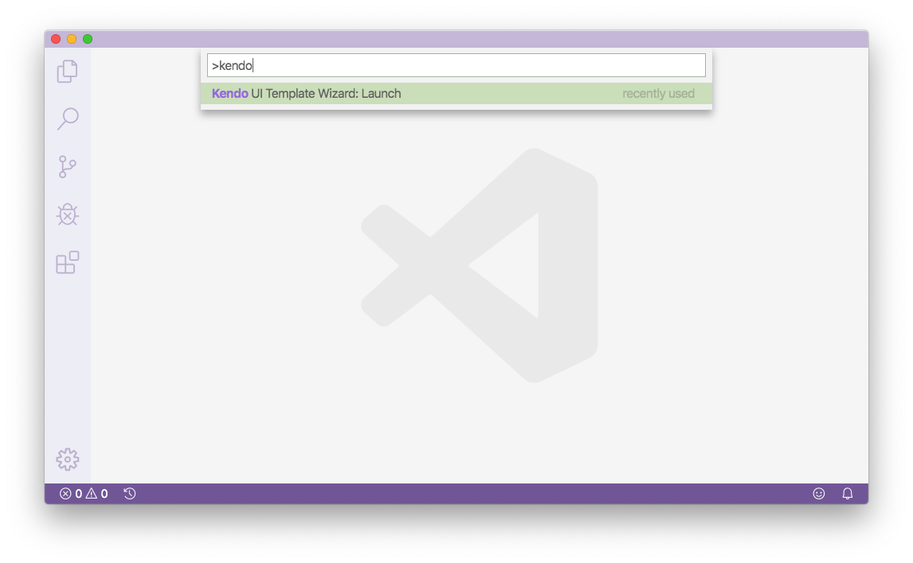

From here, the process of building an app is pretty simple. First give your project a name and path.

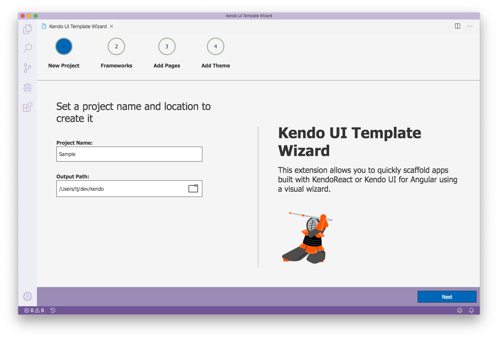

Next, select whether you’d like to use React or Angular.

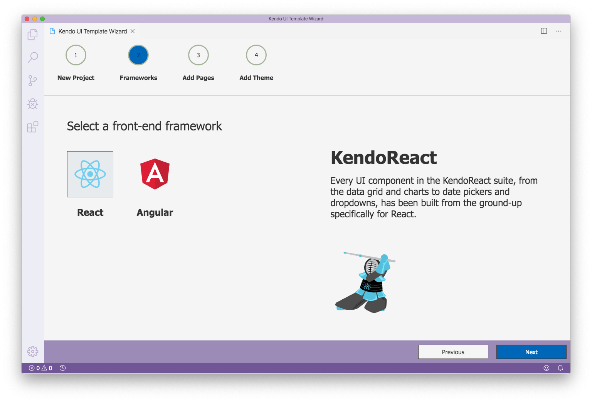

For the third step, you need to create any pages you want to appear in your application. The wizard allows you to start pages from four pre-configured templates: Blank, Form, Grid, and Chart.

If you’re trying the wizard for the first time, go ahead and create a page using each type so you can see how everything works.

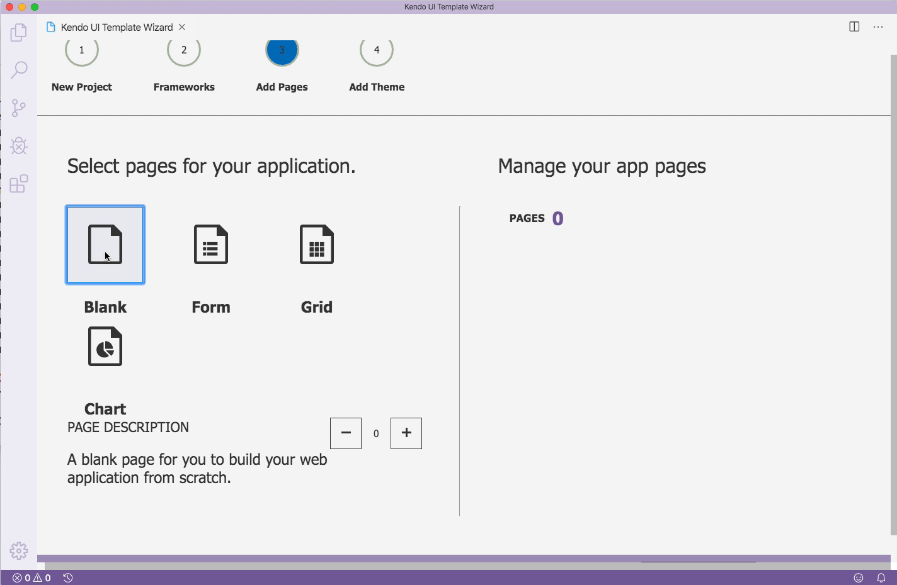

After you create your pages, hit the Next button one last time. This will take you to the final step of the process, where you’ll have to choose which of the preconfigured Kendo UI themes you’d like to start your app with. (And you’ll be able to configure your themes later on.)

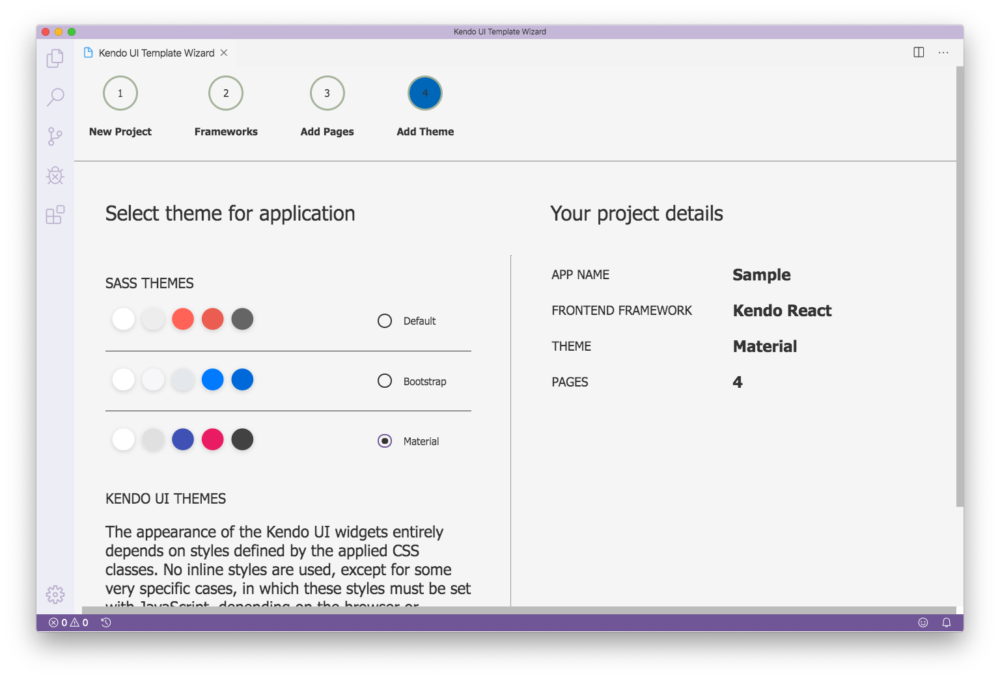

Next, click the create button, and the wizard will generate your new application, as well as a link to open that app up in Visual Studio Code.

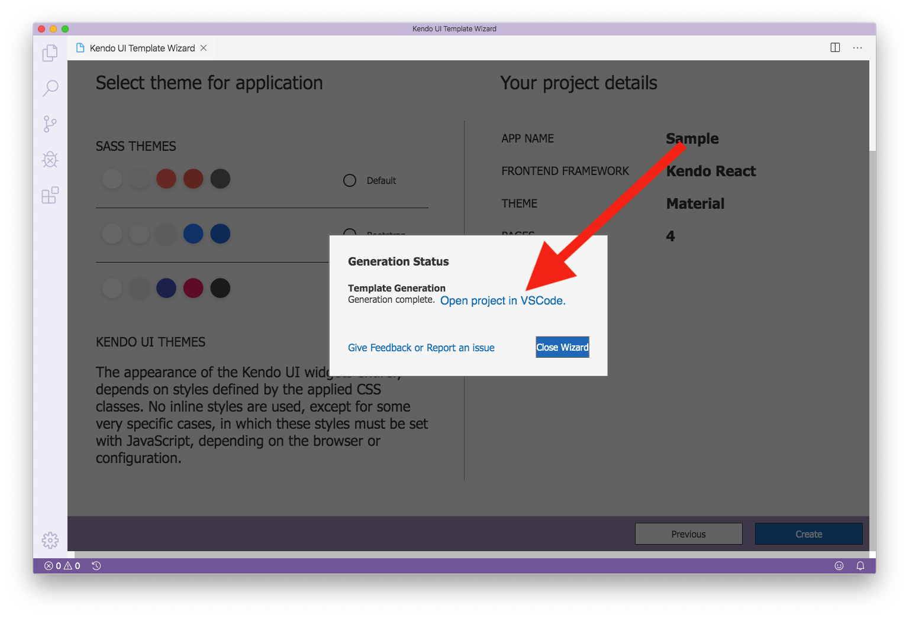

With your app now created and ready to go, let’s look at what you can do with it.

## Running your app

To run your app you’ll first need to install its npm dependencies by running `npm install` from your terminal or command prompt.

> **TIP**: You can open your terminal or command prompt directly in Visual Studio Code using <code>Ctrl+\`</code>.

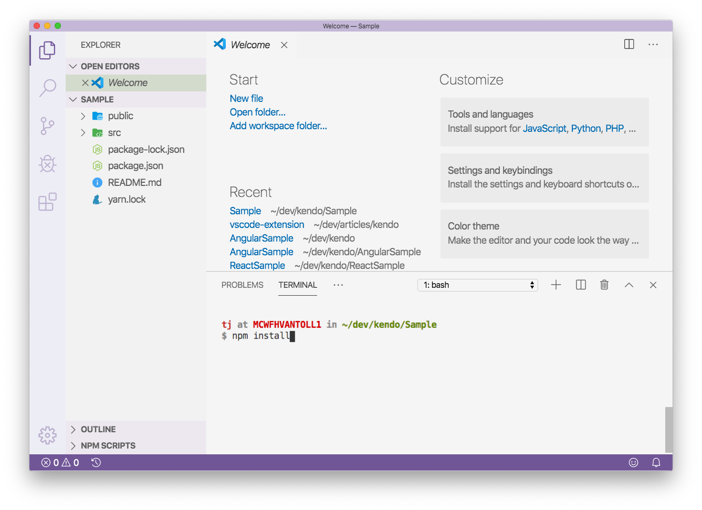

Next, run your app using `ng serve` for Angular or `npm run start` for React.

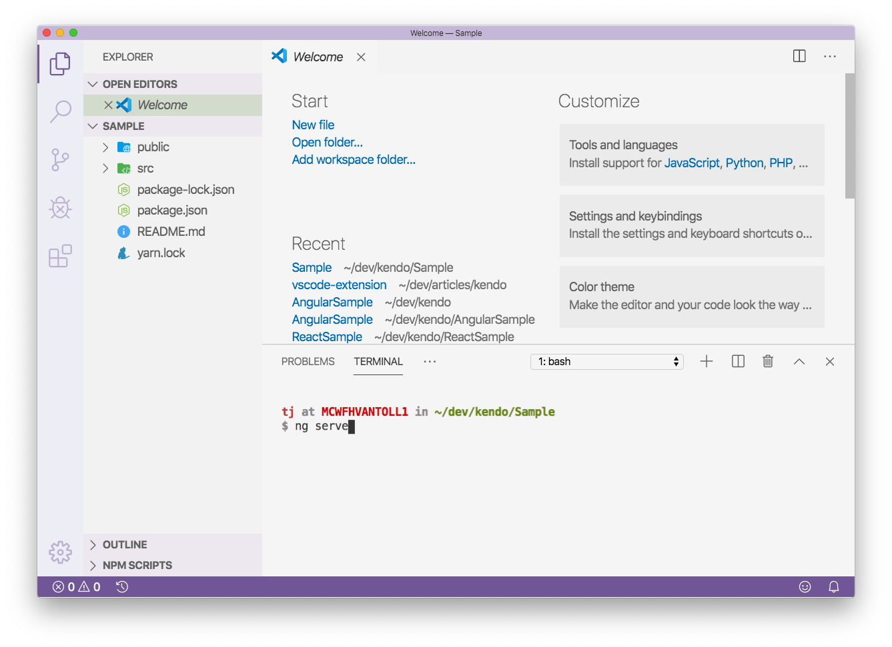
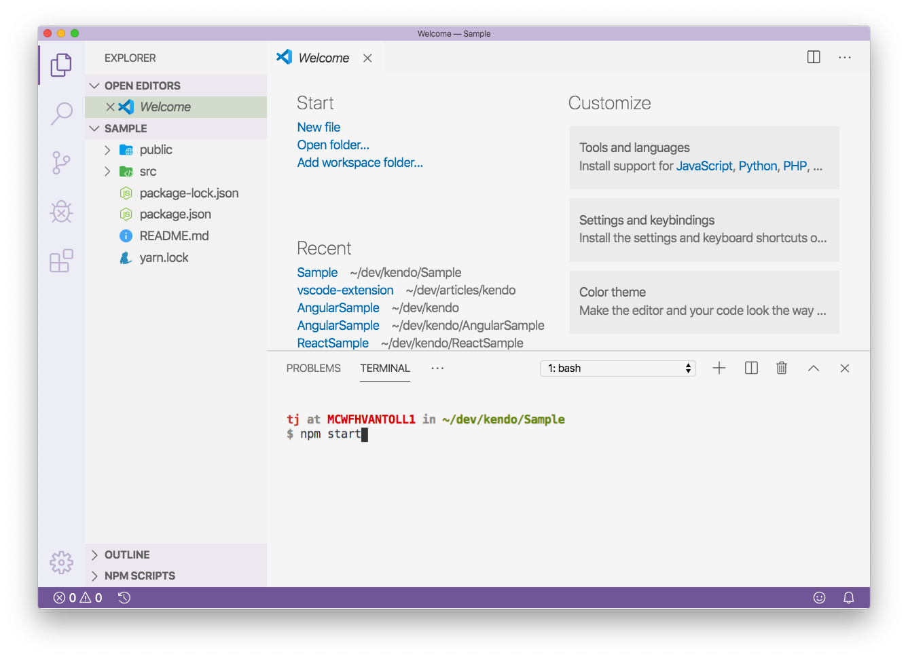

And just like that, you now have a multi-page application set up and ready to go!

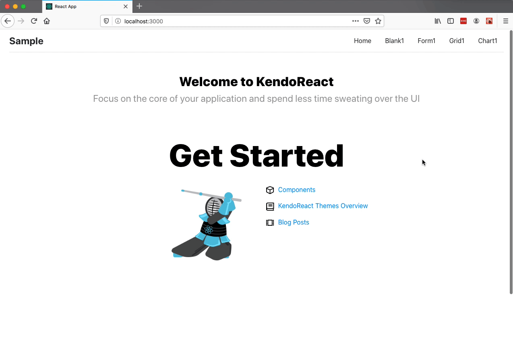

One final tip: now that you have your app, you can use the [Kendo UI ThemeBuilder](https://themebuilder.telerik.com) to customize the visual appearance of your theme directly in the browser.

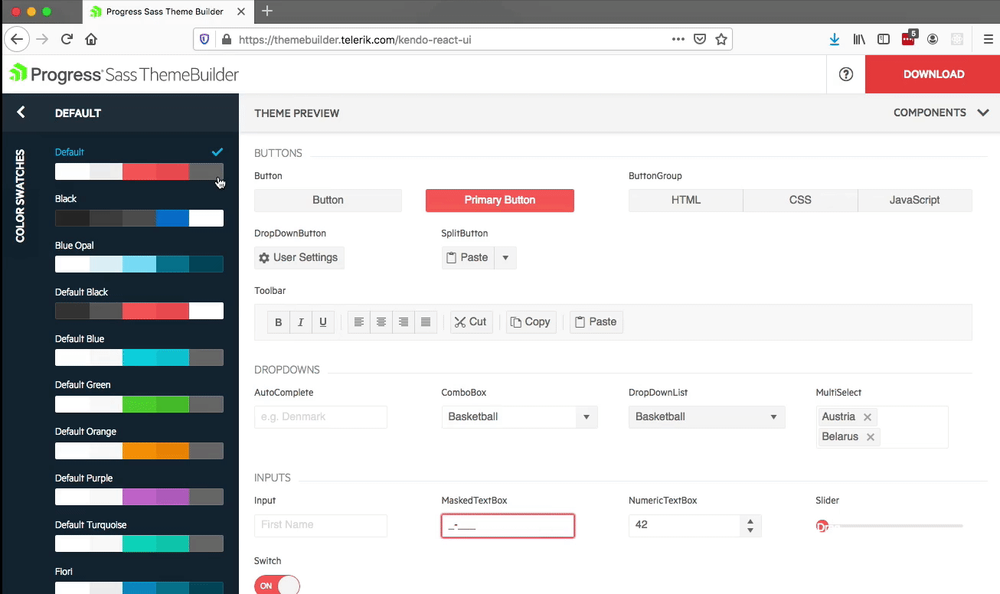

If you’re interested, check out the following documentation articles for detailed steps on using ThemeBuilder to customize your app’s theme.

* [ThemeBuilder overview for KendoReact](https://www.telerik.com/kendo-react-ui/components/styling/theme-builder/)
* [ThemeBuilder overview for Kendo UI for Angular](https://www.telerik.com/kendo-angular-ui/components/styling/theme-builder/)

## Next steps

The Kendo UI Template Wizard makes it trivial to quickly scaffold new apps for React or Angular, so give it a shot. And when you do—let us know what you think. The extension is [available on GitHub](https://github.com/telerik/kendo-vscode-extensions), so [create an issue](https://github.com/telerik/kendo-vscode-extensions/issues/new) if you run into issues or have any feature requests.
