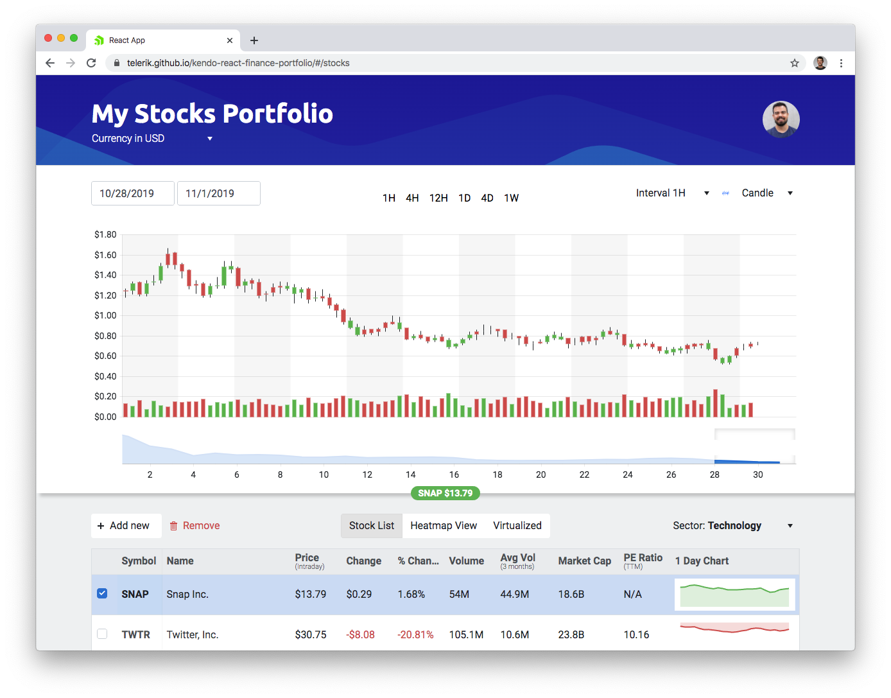

# Webinar: Let’s Build a Financial Dashboard with React

The great thing about building financial apps is that there’s very little data, and therefore very little complexity.

...

Ok fine, financial apps are hard. They typically they deal with a ton of data, and displaying that data in a meaningful way is critical to making your users happy and productive.

Enter the dashboard, the app that your boss’s boss is pretty sure you can throw together in a week or two, but that you know involves a lot of complexity.

Have you been tasked with building a dashboard? Do you want to learn about your CSS options for laying out dashboards? Do you want to learn how to incorporate powerful UI components from [KendoReact](https://www.telerik.com/kendo-react-ui/)? Do you want to learn how to build dashboards that look like this?

If you answered yes to at least like two of those questions, then do we have a webinar for you!

## 🚨 Webinar Alert! 🚨

Join us on Thursday, April 23rd, for a 45-minute live webinar, where we’ll cover:

* Planning out a dashboard, including starting up a new application, and crafting the layout.
* Adding powerful UI components, such as a data grid and charts, to help build an interface your users will love.
* Tying it all together by bringing in production data, and adding polish, such as crafting a final design and configuring advanced components to meet your needs.

So what are you waiting for? Sign up today and join us on the 23rd!

<a class="Btn" href="https://www.telerik.com/webinars/kendo-ui/financial-dashboard-with-react">Register for the Webinar</a>