# Building an Awesome Login Screen with NativeScript

Login and registration screens are a necessary evil for many mobile applications. In this article you’ll learn how to get a basic login screen running in your NativeScript app quickly, as well as how to add some more advanced functionality.

Here’s what the final version of the form we’ll be building looks like.

<div style="display: flex; width: 100%; height: 400px; margin-bottom: 20px;">
  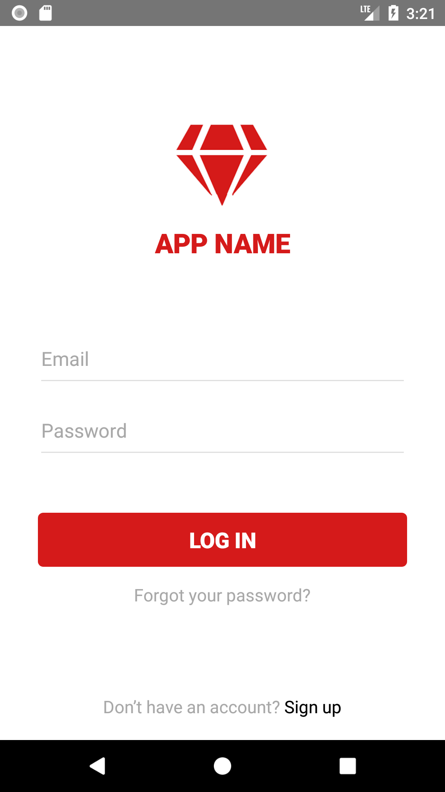
  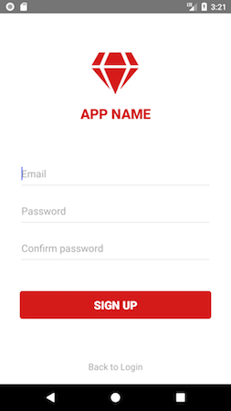
</div>

<div style="display: flex; width: 100%; height: 400px;">
  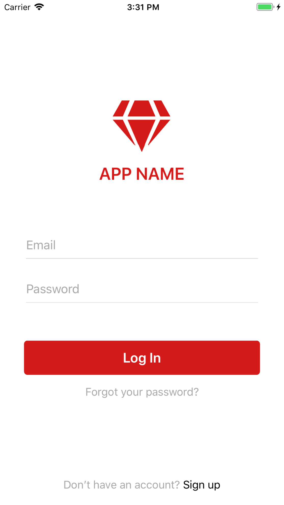
  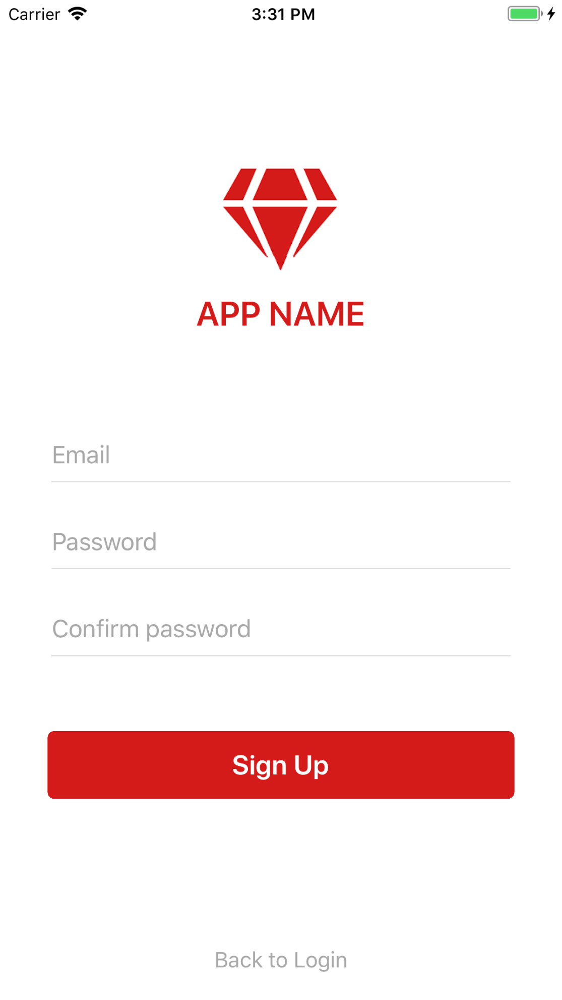
</div>

> **NOTE**: The full code of this sample is [available in NativeScript Playground](https://play.nativescript.org/?template=play-ng&id=Hqp5UQ&v=20). It’s worth taking a minute to download the “NativeScript Playground” app from the iOS App Store or Google Play so you can see this form on your device as you go through the article.

Let’s start diving into how this works by looking at the user interface components that make up this page.

## Building the UI

The main part of the login form uses the [NativeScript core theme’s class names](https://docs.nativescript.org/ui/theme#forms) to render the page’s inputs and buttons. For example here is the markup that creates the two textfields and submit buttons—note the use of core class names like `form`, `input-field`, `input`, `btn`, and `btn-primary`.

``` XML
<StackLayout class="form">
  <StackLayout class="input-field">
    <TextField class="input"></TextField>
  </StackLayout>

  <StackLayout class="input-field">
    <TextField class="input"></TextField>
  </StackLayout>

  <Button text="Log In" class="btn btn-primary"></Button>
</StackLayout>
```

You can use copy this same markup for you own login forms, or experiment with one of the [other input display options in the NativeScript core theme](https://docs.nativescript.org/ui/theme#forms).

Once you have the form’s markup complete, you next have to position that form on the screen. Before we discuss the solution, take a moment to look over the layout of this login page—specifically note how the form is vertically centered and the “Don’t have an account?” label is docked to the bottom of the screen.


You could solve this layout problem using [NativeScript’s `<DockLayout>` control](https://docs.nativescript.org/ui/layout-containers#docklayout) to dock the bottom `<Label>`. However, I’m personally a big fan of using flexbox to solve my layout needs, as I’m familiar with its APIs from my web development days. Here’s the markup this example uses to vertical center the form and dock the bottom label.

``` XML
<FlexboxLayout class="page">
  <StackLayout class="form">
    ...
  </StackLayout>

  <Label text="Don’t have an account?"></Label>
</FlexboxLayout>
```

Next you need a bit of CSS to configure flexbox to align these components.

``` CSS
.page {
  align-items: center;
  flex-direction: column;
}
.form {
  margin-left: 30;
  margin-right: 30;
  flex-grow: 2;
  vertical-align: middle;
}
```

This CSS stacks the `<StackLayout>` and `<Label>` components vertically (`flex-direction: column`), and align them in the center of the screen (`align-items: center`). Finally, adding `flex-grow: 2` to the `<StackLayout>` tells NativeScript to give all available vertical space to the form, ensuring the `<Label>` take up only the space it needs at the bottom of the screen.

> **TIP**: CSS Tricks has an [excellent reference for all the flebox properties](https://css-tricks.com/snippets/css/a-guide-to-flexbox/). It’s a good one to bookmark, as it’s very easy to forget exactly what properties like `align-items` or `flex-grow` do—especially when you get into non-trivial examples.

Now that we have the login components positioned appropriately, the rest of the visual appearance is done by configuring margins, colors, and dimensions in CSS. You can refer to the `login/login.component.css` file in [NativeScript Playground](https://play.nativescript.org/?template=play-ng&id=Hqp5UQ&v=20) if you’re curious about the specific values this example uses.

Before we move on to making this login screen actually work, there’s one other thing we have to discuss about building login form UIs in NativeScript—configuring TextFields.

## Configuring TextFields

By default if you use a `<TextField>` in a NativeScript app the user will see the following UI when they give focus the control.

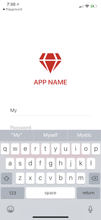

Note how the keyboard is not optimized for entering email addresses, and also how iOS is trying to suggest less-than-helpful autocomplete phrases.

This example uses a number of attributes to improve the user’s experience when using this textfield.

``` XML
<TextField class="input" hint="Email" keyboardType="email" autocorrect="false" autocapitalizationType="none"></TextField>
```

The `keyboardType` attribute tells iOS and Android to provide a keyboard optimized for email entry, and the `autocorrect` and `autocapitalizationType` attributes tell the native platforms to _not_ autocorrect and _not_ autocapitalize user input. The result is a text field that’s a lot easier to entry an email address into.

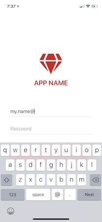

> **TIP**: NativeScript supports [five different keyboard types](https://docs.nativescript.org/ui/keyboard).

Now that you have the login screen’s user interface built, let’s move on and look at how to make form actually do something.

## Adding user interaction

Login and sign up screens in an application are usually relatively similar. Both typically ask the user for an email address and password, and both typically have some sort of submit button.

For a developer this means you can choose to implement login and sign up as two completely separate pages, or you can add some UI logic to show and hide elements appropriately, and use a single page for both workflows. This article’s form takes the latter strategy, and includes some logic to alter the UI as the user interacts with the page.

Let’s look at how to implement this.

> **NOTE**: This article’s example uses Angular, but you can absolutely implement this exact same application using NativeScript Core or NativeScript with Vue. In fact, dear reader, if you’re the first to recreate this example with those architectures and drop a Playground link in the comments, you might find some NativeScript swag in your future 😄

This page’s backing component uses a boolean `isLoggingIn` attribute to keep track of whether the user is viewing the login screen of the sign up screen.

``` TypeScript
import { Component } from "@angular/core";

@Component({ ...})
export class LoginComponent {
  isLoggingIn = true;

  toggleForm() {
    this.isLoggingIn = !this.isLoggingIn;
  }

  submit() {
    if (this.isLoggingIn) {
        // Perform the login
    } else {
        // Perform the registration
    }
  }
}
```

That boolean attribute gets used in the UI to toggle the display of various UI controls.

``` XML
<FlexboxLayout class="page">
  <StackLayout class="form">
    <StackLayout class="input-field">
      <TextField hint="Email" ...></TextField>
    </StackLayout>

    <StackLayout class="input-field">
      <TextField hint="Password" ...></TextField>
    </StackLayout>

    <StackLayout *ngIf="!isLoggingIn" class="input-field">
      <TextField hint="Confirm password" ...></TextField>
    </StackLayout>

    <Button [text]="isLoggingIn ? 'Log In' : 'Sign Up'" (tap)="submit()"></Button>
    <Label *ngIf="isLoggingIn" text="Forgot your password?"></Label>
  </StackLayout>

  <Label (tap)="toggleForm()">
    <FormattedString>
      <Span [text]="isLoggingIn ? 'Don’t have an account? ' : 'Back to Login'"></Span>
      <Span [text]="isLoggingIn ? 'Sign up' : ''" class="bold"></Span>
    </FormattedString>
  </Label>
</FlexboxLayout>
```

The boolean attribute gets used in two different ways. The first is showing and hiding elements with Angular’s `*ngIf` directive. For example, the confirm password field should only display on the sign up screen, and the use of `*ngIf="!isLoggingIn` in the code below ensures that the confirm password’s parent container is only present when that is the case.

``` XML
<StackLayout *ngIf="!isLoggingIn" class="input-field">
  <TextField hint="Confirm password" ...></TextField>
</StackLayout>
```

The `isLoggingIn` attribute is also used to control a some text on the screen. For example, the code below changes the text of the submit button based on whether the user is currently logging in or signing up.

``` XML
<Button [text]="isLoggingIn ? 'Log In' : 'Sign Up'" (tap)="submit()"></Button>
```

The result of this UI logic looks like this in action.

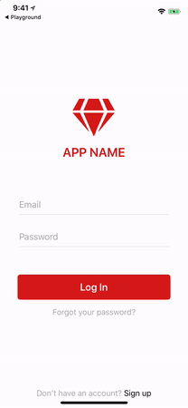

The last bit of the UI is the forgot password functionality. Although there are many ways you could potentially implement this sort of interface, this example uses a prompt dialog for simplicity.

The markup for the forgot password UI is a single `<Label>` that binds to a `forgotPassword()` method on tap.

``` XML
<Label *ngIf="loggingIn" text="Forgot your password?" (tap)="forgotPassword()"></Label>
```

And here’s the implementation of that `tap` handler.

``` TypeScript
import { alert, prompt } from "tns-core-modules/ui/dialogs";

forgotPassword() {
  prompt({
    title: "Forgot Password",
    message: "Enter the email address you used to register for APP NAME to reset your password.",
    defaultText: "",
    okButtonText: "Ok",
    cancelButtonText: "Cancel"
  }).then((data) => {
    if (data.result) {
      // Call the backend to reset the password
      alert({
        title: "APP NAME",
        message: "Your password was successfully reset. Please check your email for instructions on choosing a new password.",
        okButtonText: "Ok"
      })
    }
  });
}
```

The prompt is one of the [many dialogs NativeScript provides](https://docs.nativescript.org/ui/dialogs), and makes it easy for you to gather a single piece of input from the user. Here’s what the functionality looks like in action.

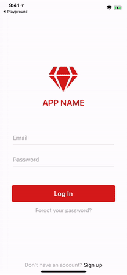

When the UI now completely in place, let’s move on to adding a bit of form validation and making the login functional.

## Handling validation

Almost forms need to validate user input, but how and where you validate data can vary significantly. This example does minimal front-end validation, leaning on a backend to validate some of the more complex things.

There is a bit of validation code, however. For example, the `submit()` method has a bit of logic to make sure the user entered some value for both their email address and password.

``` TypeScript
if (this.user.password != this.user.confirmPassword) {
    alert({ message: "Your passwords do not match.", ... );
    return;
}
```

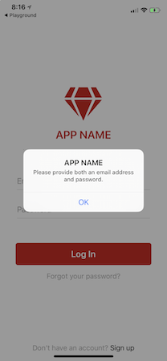

And the `register()` method has a check to ensure the user’s two entered passwords match.

``` TypeScript
if (this.user.password != this.user.confirmPassword) {
  this.alert("Your passwords do not match.");
  return;
}
```

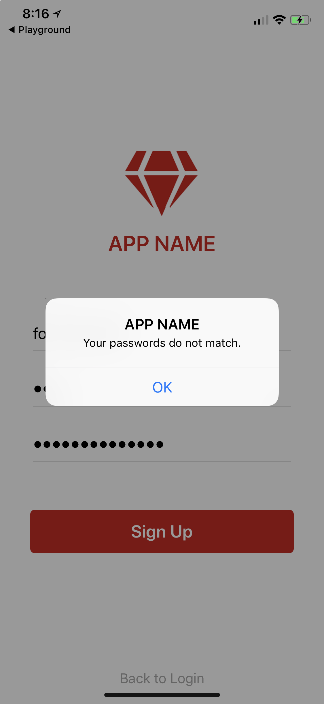

You might choose to add more of these types of checks depending on the requirements of your app. For example you could use an [npm module such as “email-validator”](https://www.npmjs.com/package/email-validator) to check for a valid email address and prompt the user if they type an incorrect one.

If you’re looking for something more thorough the [NativeScript UI DataForm plugin](https://www.nativescript.org/blog/a-deep-dive-into-telerik-ui-for-nativescripts-dataform) has a complete validation framework, which includes the ability to automatically show validation messages directly in the user interface.


> **TIP**: As another option, Nic Raboy has an excellent write up on how you can [leverage Angular’s built-in form validators](https://developer.telerik.com/products/nativescript/form-validation-nativescript-angular-mobile-application/) in your NativeScript apps.

Now that you have a UI, and all the necessary view logic in place, let’s talk about the final piece of the login experience—the backend.

## Making the login work

NativeScript is a platform that supports basically any backend you want to use, and there are NativeScript SDKs for many popular backend services such as [Firebase](https://github.com/EddyVerbruggen/nativescript-plugin-firebase), [Couchbase](https://github.com/couchbaselabs/nativescript-couchbase), [Azure](https://github.com/PeterStaev/nativescript-azure-mobile-apps), and [more](https://market.nativescript.org/).

Because there are a ton of services that you might want to use, this example has a generic interface for handling login tasks that you could implement however you’d like. Here’s what the example’s `user.service.ts` file looks like at a high level.

``` TypeScript
import { Injectable } from "@angular/core";
import { User } from "./user.model";

@Injectable()
export class UserService {
    register(user: User) {}

    login(user: User) {}

    resetPassword(email) {}
}
```

This example uses [Kinvey](https://www.kinvey.com/) to implement this user management, both because Kinvey provides an [excellent NativeScript SDK](https://github.com/Kinvey/nativescript-sdk), and Kinvey is supported in NativeScript Playground directly. The implementation looks like this.

``` TypeScript
import { Injectable } from "@angular/core";
import { Kinvey } from "kinvey-nativescript-sdk";
import { User } from "./user.model";

@Injectable()
export class UserService {
  register(user: User) {
    return new Promise((resolve, reject) => {
      Kinvey.User.logout()
        .then(() => {
          Kinvey.User.signup({ username: user.email, password: user.password })
            .then(resolve)
            .catch((error) => { this.handleErrors(error); reject(); })
        })
        .catch((error) => { this.handleErrors(error); reject(); })
    });
  }

  login(user: User) {
    return new Promise((resolve, reject) => {
      Kinvey.User.logout()
        .then(() => {
          Kinvey.User.login(user.email, user.password)
            .then(resolve)
            .catch((error) => { this.handleErrors(error); reject(); })
        })
        .catch((error) => { this.handleErrors(error); reject(); })
      });
  }

  resetPassword(email) {
    return Kinvey.User.resetPassword(email)
      .catch(this.handleErrors);
  }

  handleErrors(error: Kinvey.BaseError) {
    console.error(error.message);
    return error.message;
  }
}
```

> **TIP**: If you’re looking for an implementation of this user service that uses RESTful APIs rather than the Kinvey SDK, check out [this Playground example](https://play.nativescript.org/?template=play-ng&id=Hqp5UQ&v=12).

With Kinvey, user management is as easy as making a few calls to methods like `login()`, `logout()`, `register()`, and `resetPassword()`. Kinvey even provides ways to [log users in via Facebook or Google accounts](https://devcenter.kinvey.com/nativescript/guides/users#usingsocialidentities), as well as the ability to connect to identity services you might already be using, such as Active Directory. If you’d like to learn more about using Kinvey in NativeScript, check out [Kinvey’s NativeScript developer center](https://devcenter.kinvey.com/nativescript/guides#).

Now that you have the backend of your app covered, let’s wrap up this form conversation with a few last tips.

## Final recommendations

Different mobile apps have different login requirements. If your login form has requirements that this article’s discussion doesn’t cover, here are a few NativeScript plugins you may want to consider using.

> **WARNING**: The following plugins do not work in NativeScript Playground. To add these plugins to your own apps you need to [set up a local NativeScript development environment](https://docs.nativescript.org/start/quick-setup) or use [NativeScript Sidekick](https://www.nativescript.org/nativescript-sidekick).

* [nativescript-IQKeyboardManager](https://github.com/tjvantoll/nativescript-IQKeyboardManager)—IQKeyboardManager is a popular iOS framework for providing good keyboard UX out of the box, including a solution for preventing the iOS keyboard from covering `<TextField>` controls.
* [nativescript-fingerprint-auth](https://github.com/EddyVerbruggen/nativescript-fingerprint-auth)—The `nativescript-fingerprint-auth` plugin makes adding fingerprint authentication to your app as easy as installing a plugin and implementing an [easy-to-use API](https://github.com/EddyVerbruggen/nativescript-fingerprint-auth#api). The plugin also supports Face ID for iPhone Xs.
* [nativescript-facebook](https://github.com/NativeScript/nativescript-facebook)—The NativeScript Facebook plugin makes it easy to allow your users to authenticate using their Facebook accounts.
* [nativescript-loading-indicator](https://github.com/NathanWalker/nativescript-loading-indicator)—The `nativescript-loading-indicator` shows an animated modal and blocks the user from interacting with the screen. The plugin is perfect for showing the user an activity indicator while you are performing calls to your backend during the login process.

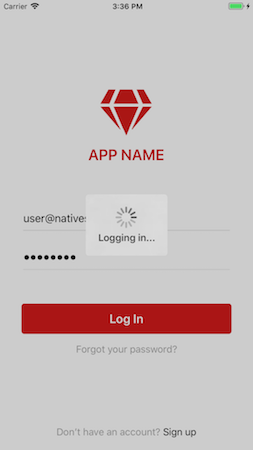

* [nativescript-feedback](https://github.com/EddyVerbruggen/nativescript-feedback)—The `nativescript-feedback` plugin provides a simple of showing non-blocking messages in your apps that look great. You may want to use it to show validation messages that look nicer than an alert.

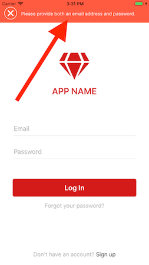

Hopefully with these tips you have everything you need to build an awesome login screen for your users. Once again this article’s final code is [available in NativeScript Playground](https://play.nativescript.org/?template=play-ng&id=Hqp5UQ&v=20); feel free to use the code to start up your own NativeScript apps.

And if you have any of your own login-screen-building tips feel free to share them in the comments!
