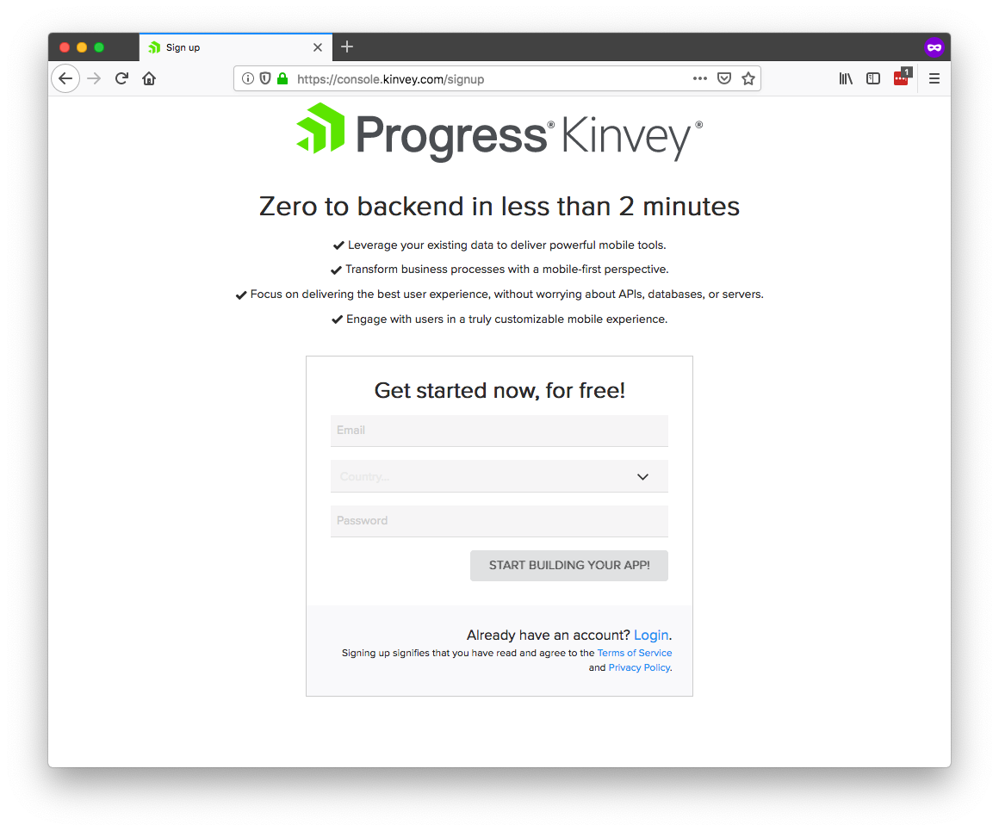
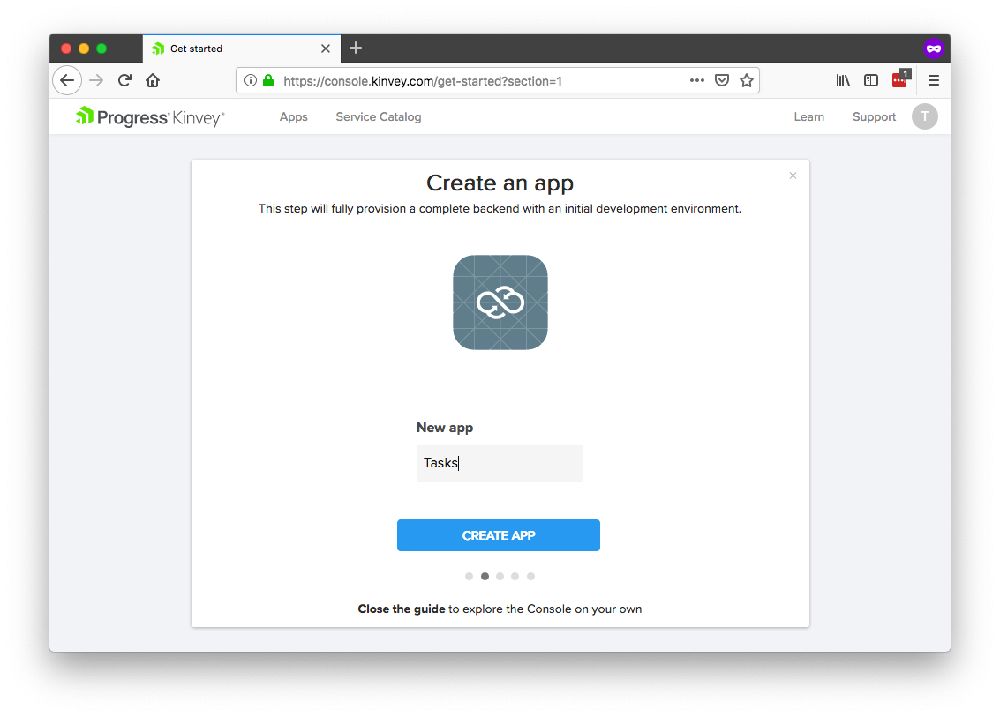
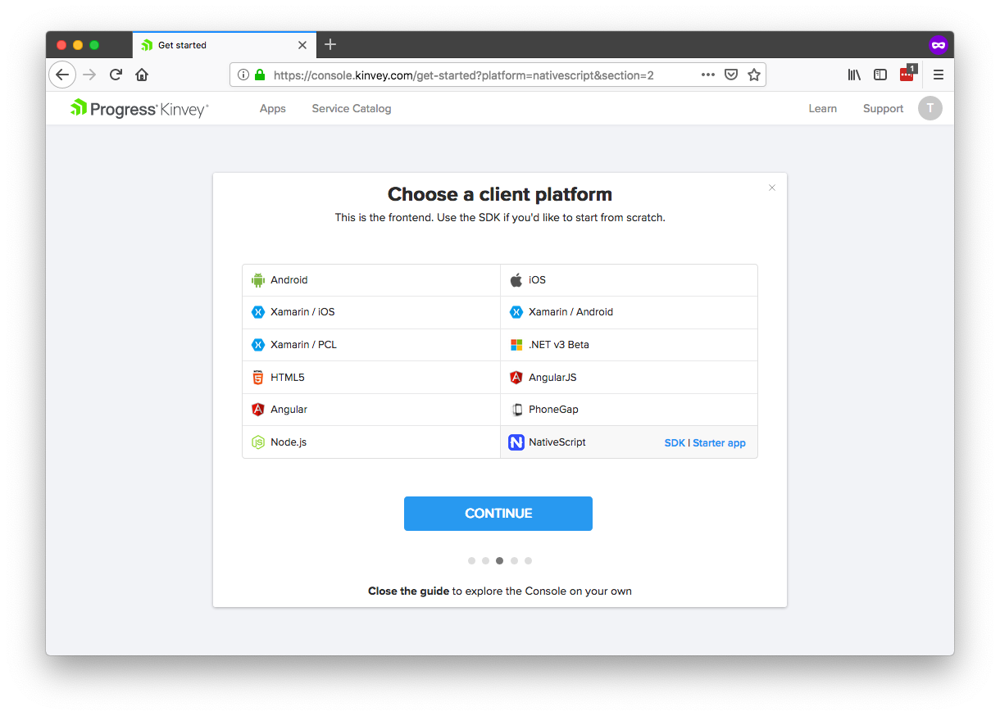
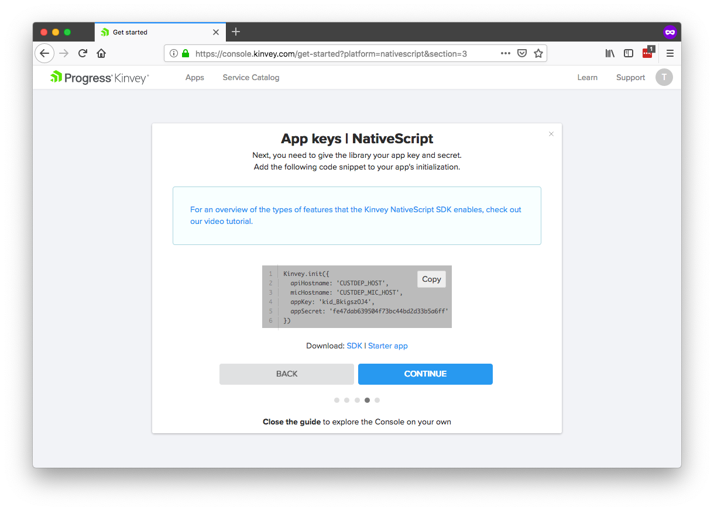
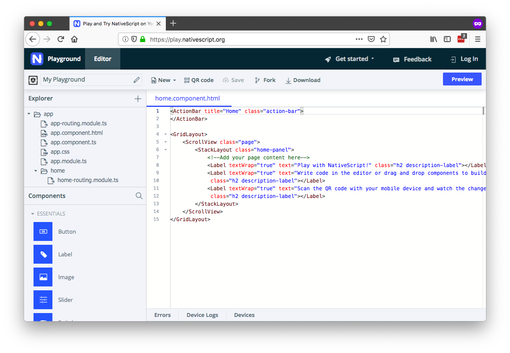
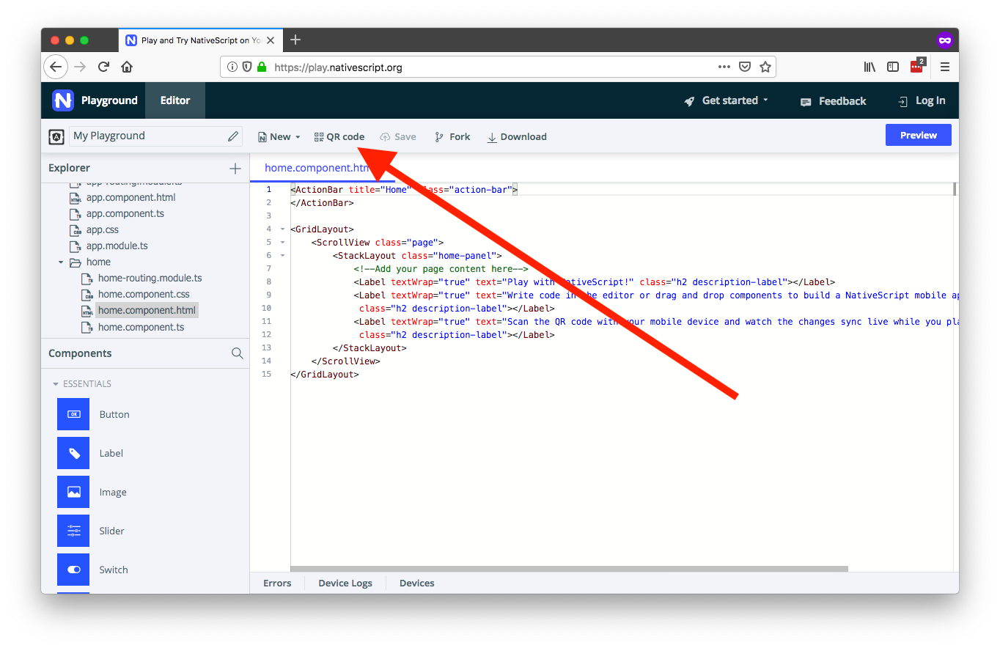
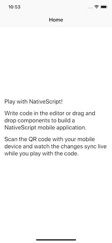

# How to Get Started With Kinvey and NativeScript—Fast

[NativeScript](https://www.nativescript.org/) allows you to build great iOS and Android apps from a single codebase, and [Progress Kinvey](https://www.progress.com/kinvey) lets you add on all the backend plumbing to make your app actually work. Together the two technologies let you build modern mobile apps fast.

In this article we’ll take an opinionated look at how to get up and running with NativeScript and Kinvey as fast as possible. If you follow along you’ll set up a new Kinvey account, configure a NativeScript development environment, and start to take advantage of some of the powerful backend features Kinvey offers.

Let’s get started.

* [Step 1: Set up your Kinvey account](#step-1)
* [Step 2: Set up your NativeScript environment](#step-2)
* [Step 3: Connect your NativeScript app to your Kinvey account](#step-3)
* [Step 4: Configure your auth](#step-4)
* [Step 5: Connect to your data](#step-5)
* [Step 6: Do cool stuff](#step-6)

<h2 id="step-1">Step 1: Set up your Kinvey account</h2>

First things first, to use Kinvey you need to first create a free Kinvey account. To do so, head to [console.kinvey.com/signup](https://console.kinvey.com/signup) and provide your email and a password to register.



After you have an account, Kinvey will prompt you to create a new app. You can name your app whatever you’d like, but if you’d like to follow along with this article create a new app named **Tasks**. (You can create additional apps at any time.)



After you create your app, Kinvey will next ask what client platform you’d like to use.

One awesome feature of Kinvey is that you can use it on many different platforms (and switch between those platforms at any time), but for this article we’ll stick with NativeScript, so go ahead and select the **NativeScript** platform and click **Continue**.



Finally, on the next screen, copy your app key and app secret and paste them somewhere convenient, as you’ll need those values momentarily. (If you lose these values you can find them in the **Environment Settings** section of the Kinvey console.)



And with that, you now have your Kinvey account set up and a new app ready to go. We’ll return to Kinvey later to start to leverage its features, but for now, let’s shift over to getting your NativeScript environment ready.

<h2 id="step-2">Step 2: Set up your NativeScript environment</h2>

NativeScript is a framework for building iOS and Android apps using JavaScript, and as such, to start using NativeScript you must set up an environment to write your code and get that code running in real apps.

There are a few different ways to do this, but the easiest—and the one we’ll use for this article—is NativeScript Playground. [NativeScript Playground](https://play.nativescript.org/) is a browser-based environment for developing NativeScript apps without installing any local dependencies. All you need is an iOS or Android device.



> **NOTE**: If you plan to submit apps to the iOS App Store or Google Play, you’ll eventually need to set up a local NativeScript environment using either the [NativeScript CLI](https://docs.nativescript.org/angular/start/quick-setup) or [NativeScript Sidekick](https://www.nativescript.org/nativescript-sidekick). But Playground has everything you need to get started, and we highly recommend using it when you’re first learning NativeScript and Kinvey.

To start developing in Playground, you need to download and install two apps on an iOS or Android device—NativeScript Playground and NativeScript Preview.

You can find the apps by searching for “**NativeScript Playground**” and “**NativeScript Preview**” in the iOS App Store or Google Play, or you can use the links below.

* NativeScript Playground
    * [iOS](https://itunes.apple.com/us/app/nativescript-playground/id1263543946?mt=8&ls=1)
    * [Android](https://play.google.com/store/apps/details?id=org.nativescript.play)
* NativeScript Preview
    * [iOS](https://itunes.apple.com/us/app/nativescript-preview/id1264484702?mt=8)
    * [Android](https://play.google.com/store/apps/details?id=org.nativescript.preview)

Once you have those two apps ready to go, open the NativeScript Playground app on your device and tap the **Scan QR code** button.


Next, in your browser, find and click the **QR code** button (shown in the screenshot below). This brings up a QR code that you can scan using the Playground app on your device.



After you scan the QR code, you should see the following UI on your iOS or Android device.

<div style="display: flex;">
  
  
</div>

And with that, you’re ready to start developing NativeScript apps!

If you’d like, you can experiment by changing code in the Playground environment. As soon as you save changes, your device will refresh and you’ll be able to see your updates in action right away—no compilation necessary.

Now that you have a Kinvey account set up and a NativeScript environment ready, let’s look at how to connect the two.

<h2 id="step-3">Step 3: Connect your NativeScript app to your Kinvey account</h2>

The easiest way to connect NativeScript apps to Kinvey functionality is through the [Kinvey SDK for NativeScript](https://github.com/Kinvey/nativescript-sdk), which is a collection of JavaScript APIs to make it trivial to connect to Kinvey’s powerful backend functionality. NativeScript Playground includes the Kinvey SDK in every app you build, so you can immediately start using the SDK APIs with no additional setup necessary.

The first API you need to use is `Kinvey.init()`, which is the API that makes the connection from your NativeScript front end to your Kinvey backend. Remember the code snippet you copied during the Kinvey sign-up process earlier? That code is a call to `Kinvey.init()` with the values you need to make the connection.

```
Kinvey.init({
  ...
});
```

As a next step, you could take this code and paste it into your current Playground app and be on your way. After all, all Playground apps support the Kinvey SDK out of the box.

That being said, personally I like starting from a more complete app template that has some of the scaffolding I’ll need to set up anyways. My personal favorite starting point for NativeScript and Kinvey apps is the “Good-Looking Login Form” example from the [NativeScript Marketplace’s code sample listing](https://market.nativescript.org/?tab=samples&framework=all_frameworks&category=all_samples).


It’s a simple app, but it has a pre-built Kinvey-based login form, as well as some of the basic setup necessary to build multi-page NativeScript apps.

Therefore, to follow along with this article, go ahead [open the login form sample](https://play.nativescript.org/?template=play-ng&id=Hqp5UQ&v=2811), and scan its QR code so you can view the app on your device.

> **NOTE**: The version of the sample we’ll be using is Angular-based, but if you’re a Vue.js fan, you can use [this Vue.js-based version of the same login sample](https://play.nativescript.org/?template=play-vue&id=HdDm9M&v=786).

Next, open the sample’s `shared/backend.service.ts` file, find the `kinveyAppKey` and `kinveyAppSecret` properties, and replace those properties’ values with the values you copied from your Kinvey backend earlier. (As a reminder, you can find those values in the **Environment Settings** section of your app in [the Kinvey console](https://console.kinvey.com).)

With those values in place, you now have made the connection between your NativeScript front end and your Kinvey backend. Now that you’re done with the setup, let’s look at how to start using Kinvey to do some awesome stuff.

> **TIP**: If you have the NativeScript CLI or NativeScript Sidekick set up, there are additional Kinvey-based templates you can start new apps from. To see them, head to the [NativeScript Marketplace’s template listing](https://market.nativescript.org/?tab=templates&category=all_templates) and search for “Kinvey”.

<h2 id="step-4-">Step 4: Configure your auth</h2>

One of the main features most apps need is user management.

<h2 id="step-5">Step 5: Connect to your data</h2>

<h2 id="step-6">Step 6: Do cool stuff</h2>

