# Chapter 1: Getting up and running

In this chapter you’ll learn how to download and install Kinvey Studio, how to start your first app, how to run that app on multiple platforms, and how to establish a development workflow.

Let’s get started.

## Table of contents

* [1.1: Download and install Kinvey Studio](#1.1)
* [1.2: Register for a Kinvey account and login](#1.2)
* [1.3: Create an app](#1.3)
* [1.4: Run your app on the web](#1.4)
* [1.5: Run your app on mobile](#1.5)

<h2 id="1.1">1.1: Download and install Kinvey Studio</h2>

Kinvey Studio is a desktop development tool and is available for Windows and macOS. Follow the link below to download Kinvey Studio and install it on your development machine.

* [Install Kinvey Studio](https://studio.kinvey.com)

> **NOTE**: The above link isn’t live quite yet. Not sure how we’re going to distribute internally.

After you complete the installation, open up the tool and you should see a screen like this.

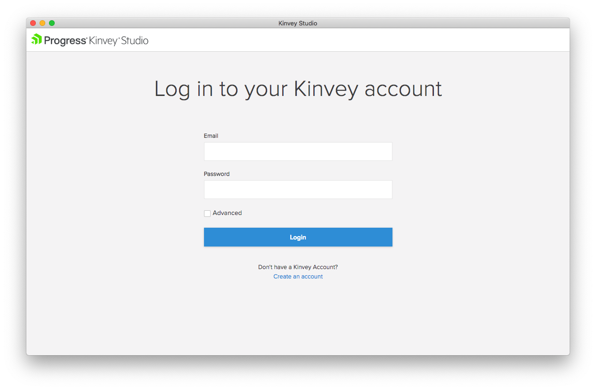

Now that you have Kinvey Studio installed and ready to go, let’s create a Kinvey account.

<h2 id="1.2">1.2: Register for a Kinvey account and login</h2>

To use Kinvey Studio you must have a Kinvey account. If you don’t have already have a Kinvey account, go ahead and create one using the link below.

* [Create a Kinvey account](https://console.kinvey.com/signup)

One you’ve successfully created an account, head back to Kinvey Studio and complete the login process with your new credentials.

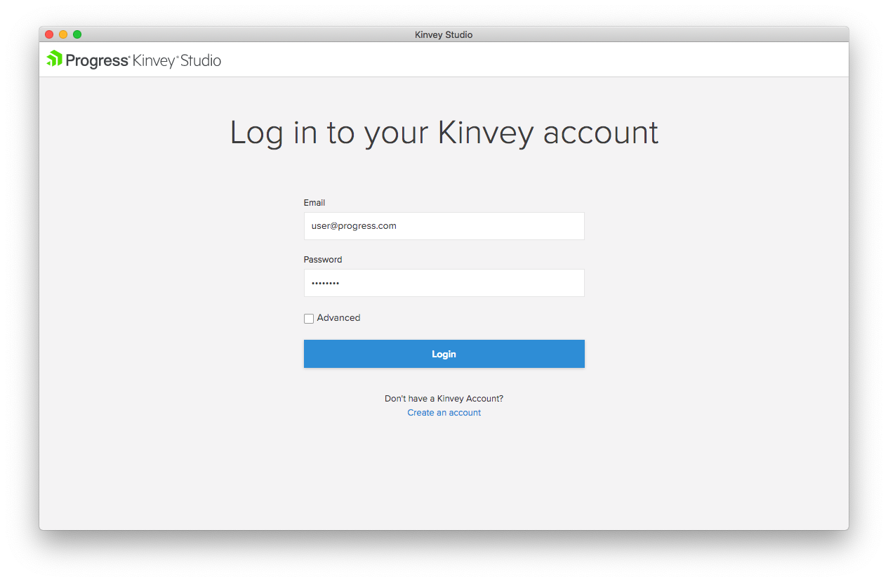

Once you do that you should see the dashboard below, where you can either start a new app or import an existing app.

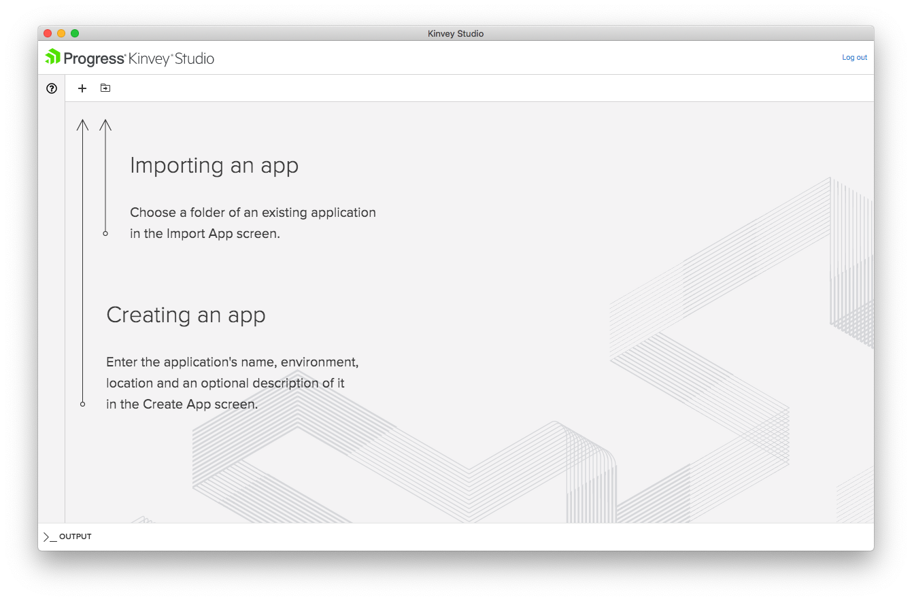

If you have existing Kinvey Studio projects at your company or organization you can import them here, but for the purposes of our tutorial you’ll want to start a new app.

Let’s look at how to do that.

<h2 id="1.3">1.3: Create an app</h2>

In Kinvey Studio applications are projects that can run both as web and mobile apps. To start one, click the plus button on Kinvey Studio’s main dashboard screen.

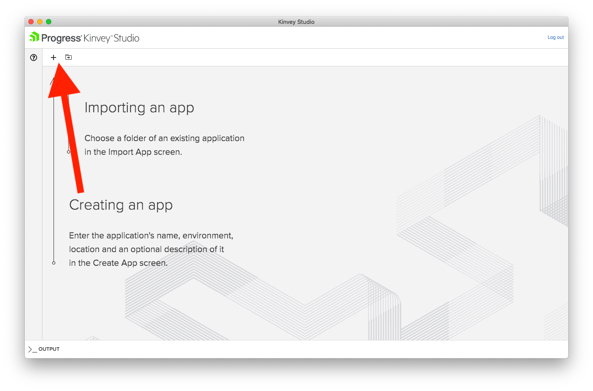

On the next screen you’ll have to provide a few pieces of information to create your new app.

* **App Name**: The name of your app. For this tutorial use **ACME**.
* **Location**: A location on your machine where you’d like to store your project. Choose whatever works best for you.
* **Description**: An optional description of your app. Feel free to leave this blank for now.
* **Kinvey Backend**: All Kinvey Studio apps are tied to a Kinvey Backend, which is a concept you’ll learn about later in this tutorial. For now, select **Create a Sample Kinvey Backend App**, which will create a backend app with some sample data to help you experiment with Studio quickly.

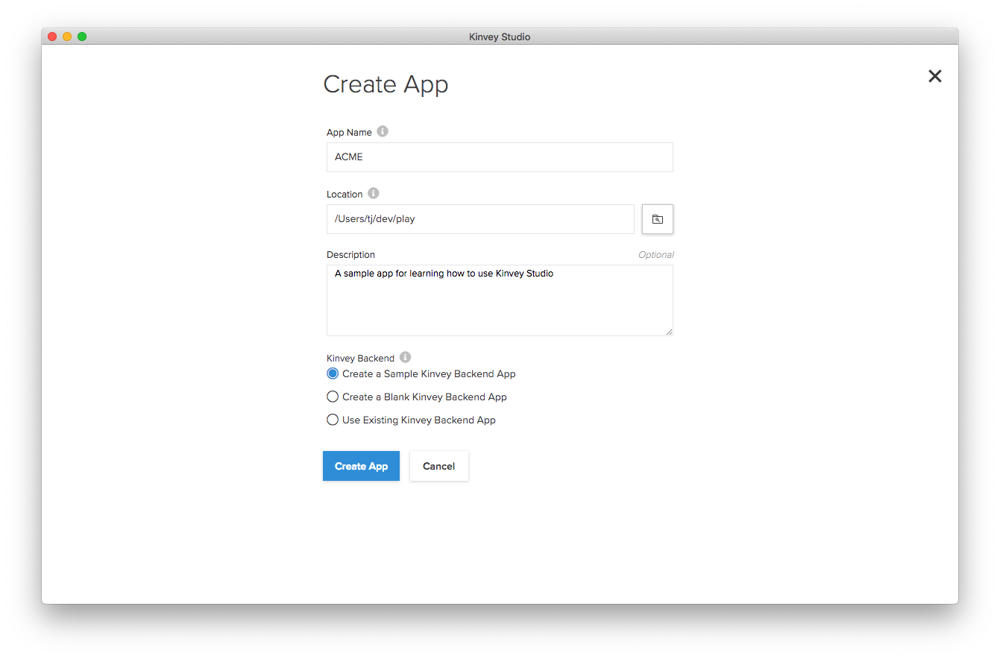

Once you have everything in place, go ahead and hit the **Create App** button to create your new app.

On the next screen you’ll see your application’s dashboard in Kinvey Studio, which allows you to do a number of things.

* **1) Edit App**: This screen allows you to view and edit your application’s modules. In Kinvey Studio, modules are logical groupings of your application’s functionality. You’ll work with modules in the next chapter.
* **2) Edit Providers**: This screen allows to manage your application’s data sources. Because you started your app with sample data, there are some data sources already configured on this screen that you’ll use in the next chapter.
* **3) Authentication**: This screen allows you to configure how your app handles authentication. You’ll work with authentication in chapter 3.
* **4) Themes**: This screen allows you to make styling changes to your application. You’ll work with themes and styling in chapter 5.
* **5) Settings**: This screen allows you to change metadata about your app, such as its description.

In the next chapter you’ll start working with this functionality to start building you app. Before we get into that though, let’s look at how you can run your app, so that you can see what you’re building.

<h2 id="1.4">1.4: Run your app on the web</h2>

Kinvey Studio applications run on both the web and natively on mobile devices. In this section let’s look at how to get your app up and running on the web.

Start by clicking the **Generate** button, which performs the necessary build steps, to get your app ready to go.

> **NOTE**: The first time you generate your app will take 1–2 minutes, as Kinvey Studio needs to download the necessary dependencies to build your app; subsequent builds will be much faster.

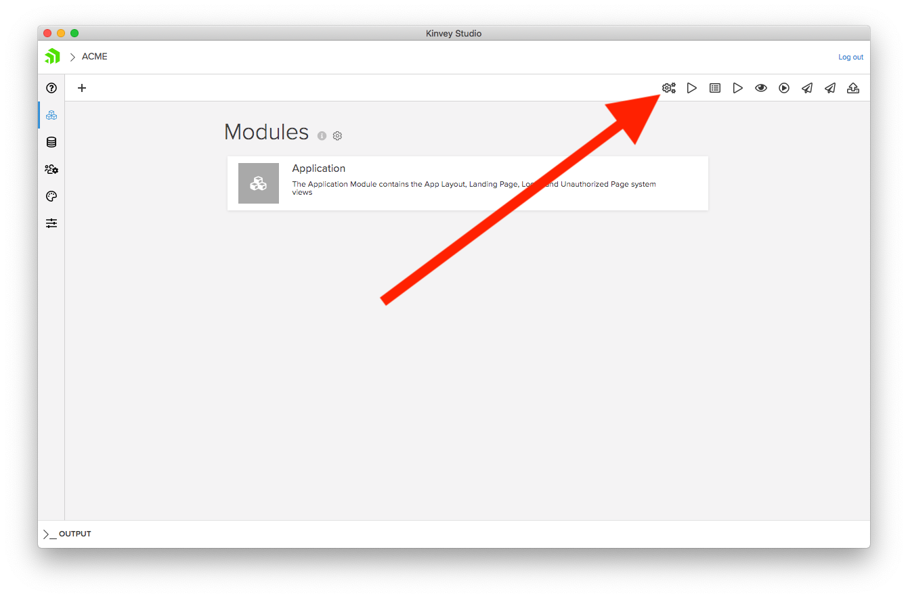

Next, click the **Start** button, which starts a web server your app will run on during development.

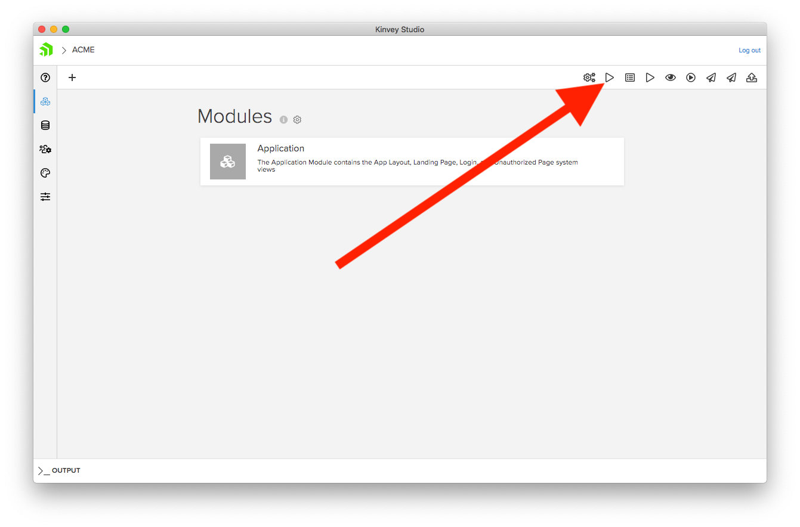

With your web server running, all you need to do is open up your app. To do that you can either visit `localhost:4200` in your web browser of choice, or, click the **Open in browser** button, which will open up your new app in your default browser.

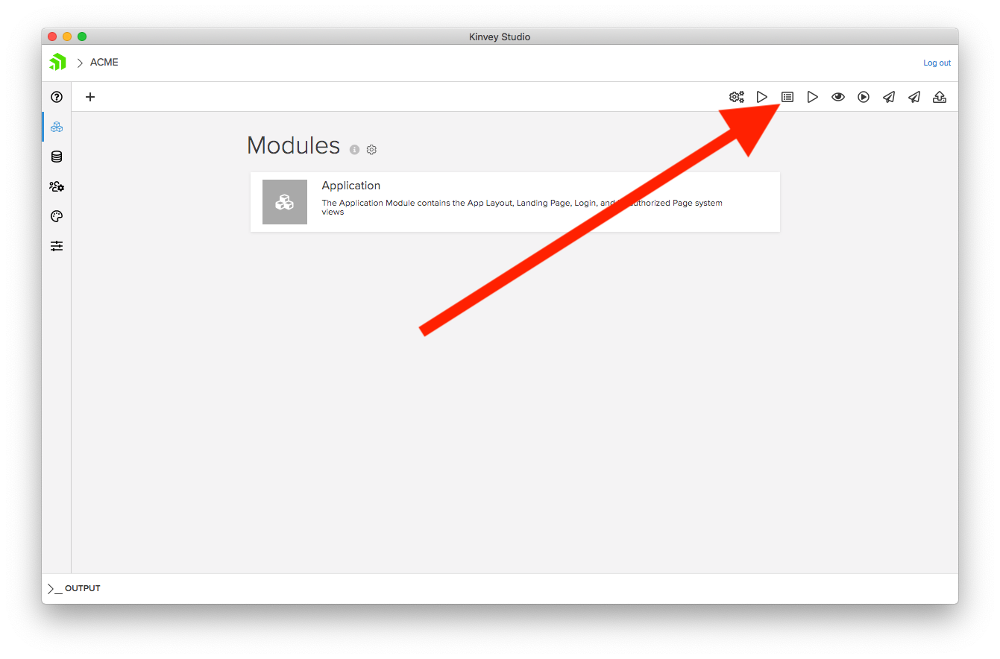

You should see an app that looks like this.

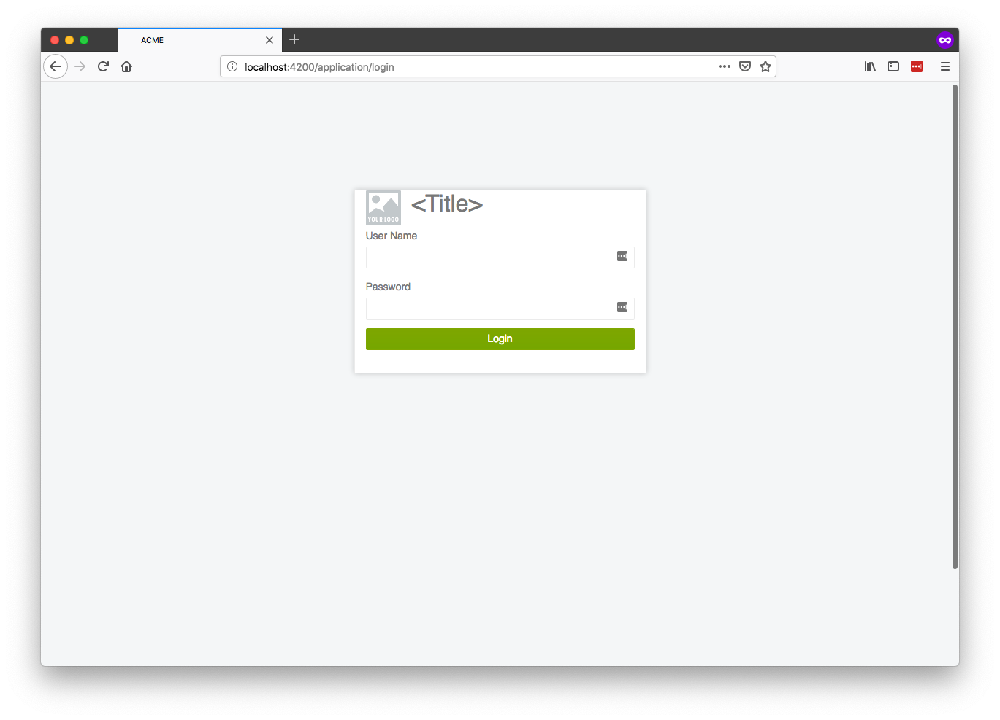

If you want to see changes you make to your app in the browser, all you need to do is save your changes and click the **Generate** button again. This will regenerate the necessary files and refresh the app in your browser automatically.

For now, leave your app open in the browser as we’ll refer back to it in the next few chapters. Let’s move on to look at how you can see your app on your mobile device.

<h2 id="1.5">1.5: Run your app on mobile</h2>

Kinvey Studio builds mobile applications that run natively on iOS and Android using NativeScript. Because NativeScript builds truly native apps with native user interface components, your apps will have the performance and UX experience you’d expect from a natively build mobile app.

Because NativeScript apps are native apps though, you will not be able to test your apps out in a browser. Therefore, to test your Kinvey Studio apps on mobile you’ll need to download a few apps to your iOS or Android device. (You can test on multiple devices simultaneously if you’d like.)

First, download and install the **NativeScript Playground** app on your device by searching the App Store or Google Play, or by using the links below.

Next, download and install the **NativeScript Preview** app on your device by searching the App Store or Google Play, or by using the links below.

Now that you have these apps ready to go, return to Kinvey Studio and click the **Preview on mobile device** button.

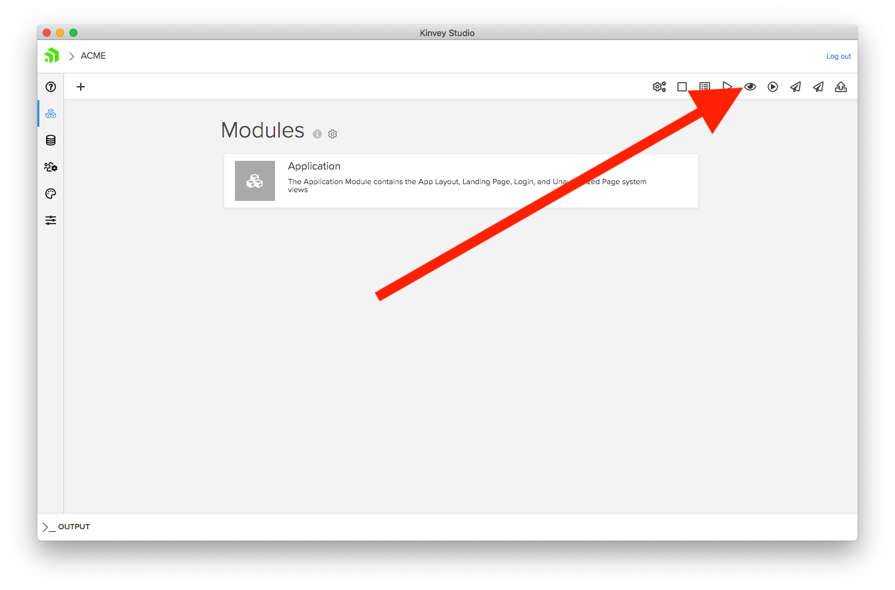

This brings up a second Kinvey Studio window dedicated to working with mobile-specific functionality.

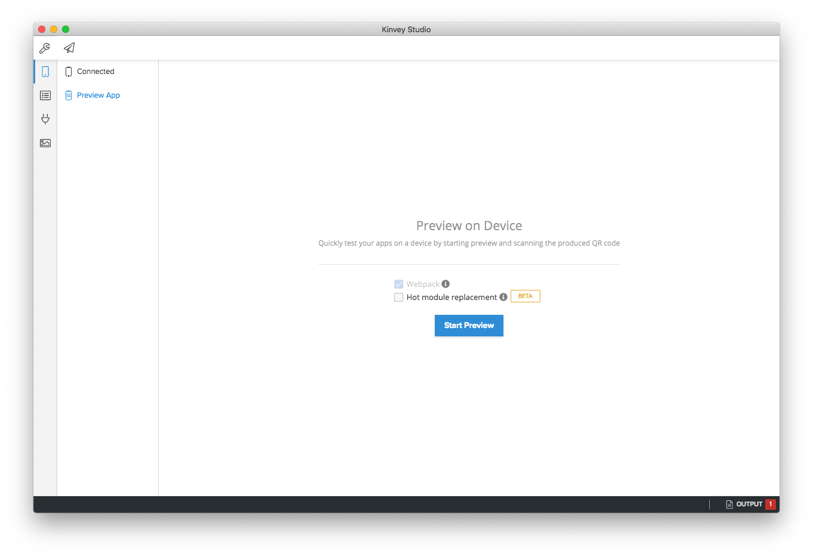

We’ll go through the functionality in this window throughout this tutorial, but for now, click the **Start Preview** button, which brings up a QR code that looks like this.

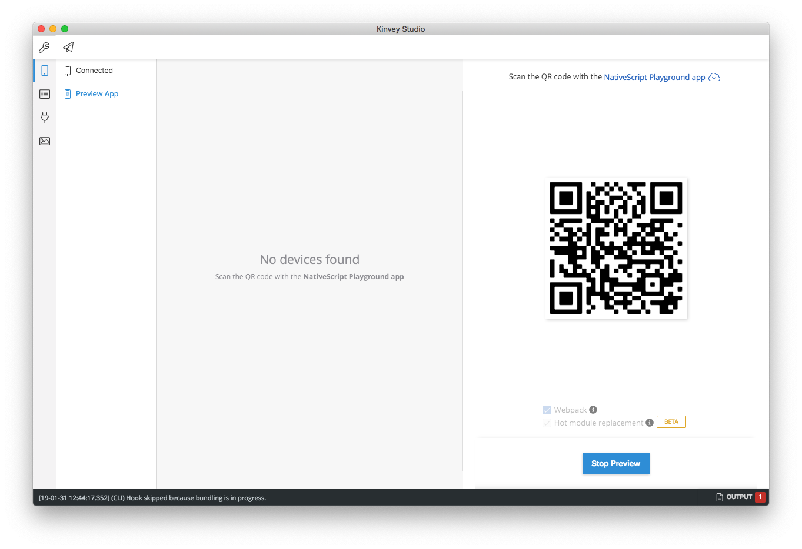

Return to your device and open the **NativeScript Playground** app. Next, tap the **Scan QR Code** button, and then scan the QR code that appears in Kinvey Studio.

NativeScript Playground will take a few seconds to download the necessary code, and then you should see the following app on your mobile device.

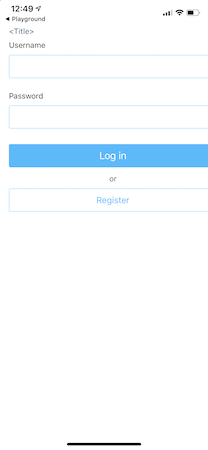
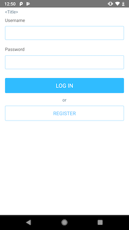

The cool thing about working with Kinvey Studio is that you’re developing a web app, a truly native iOS app, and a truly native Android app—simultaneously. As mentioned earlier, you can even connect multiple devices by scanning the QR code multiple times. It’s a fun way to see what your app looks like on iPhones, Android devices, and even devices like iPads.

Much like your web app, if you want to see changes you make to your app on your device all you need to do is save your changes and click the **Generate** button again. This will regenerate the necessary files and refresh your mobile app automatically.

Now that you have your app running on multiple platforms, let’s start building.

## Next steps

* [Continue to chapter 2—Working with UI and data](#2.md)
