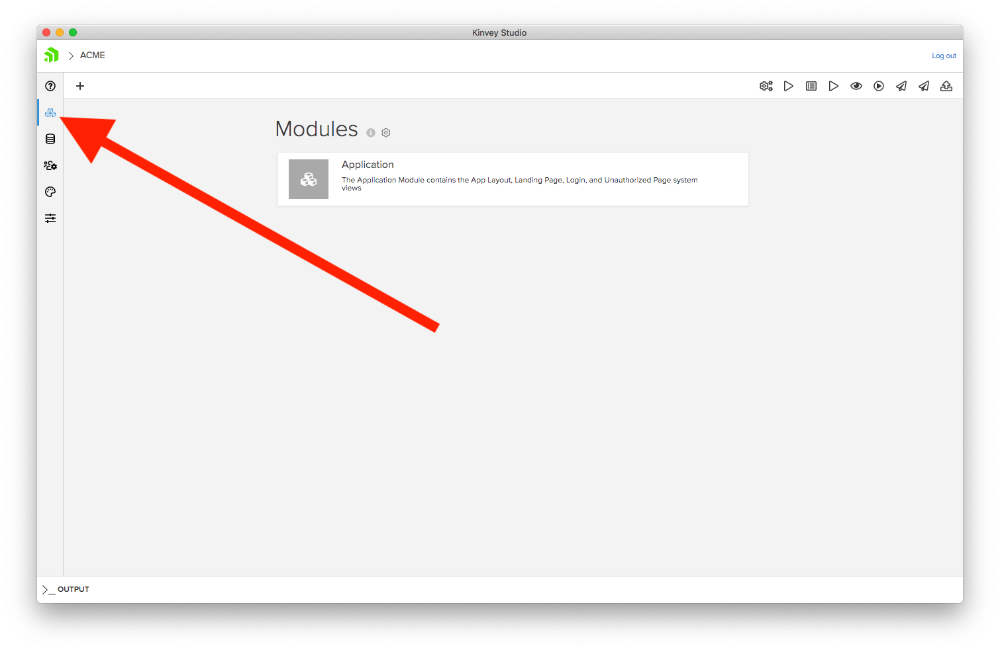
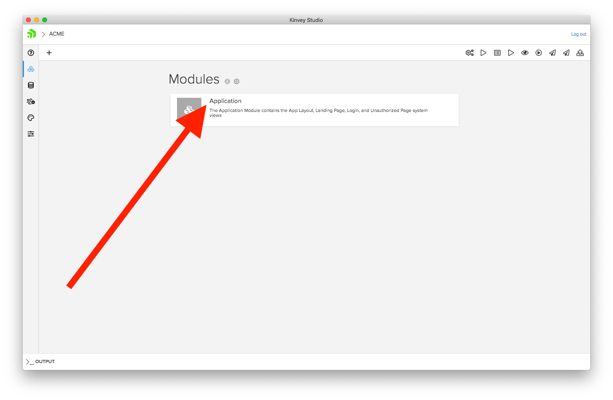
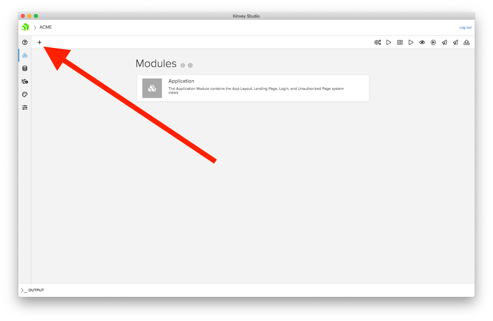
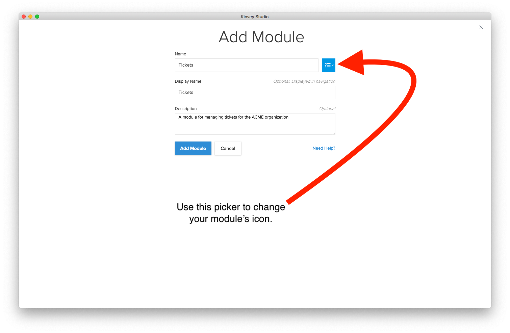
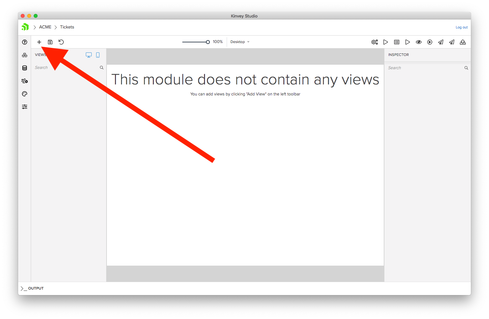
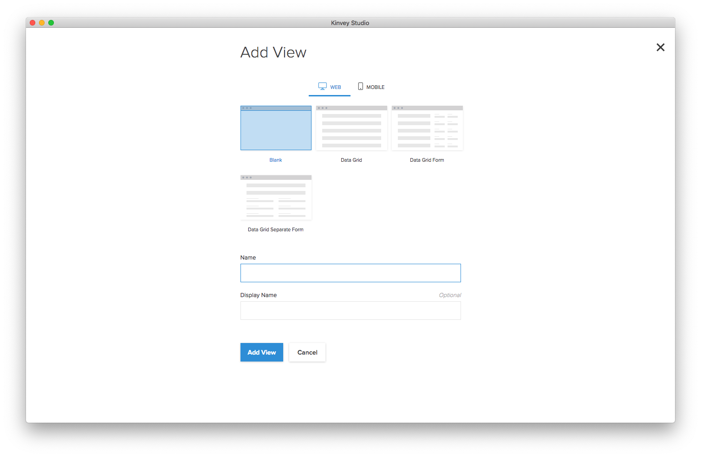
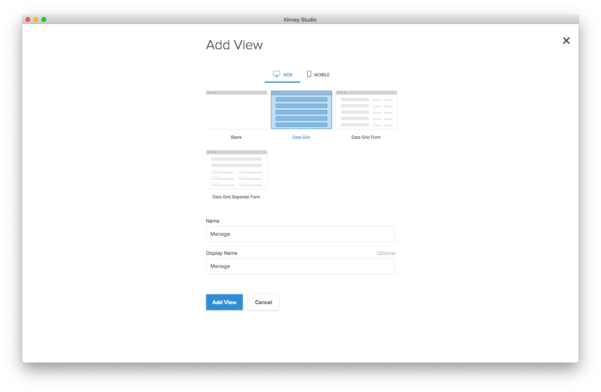

# Chapter 2: Working with UI and data

Kinvey Studio makes it easy to quick scaffold views for your applications and connect those views to data. In this chapter you’ll build a view for managing a list of data, and use the list in both your web and mobile apps.

Let’s start by taking a look at the data you’ll be working with.

## Table of contents

* [2.1: Working with data](#2.1)
* [2.2: Building with modules and views](#2.2)
* [2.3: Creating a web UI](#2.3)
* [2.4: Creating a mobile UI](#2.4)

<h2 id="2.1">2.1: Working with data</h2>

Kinvey Studio makes it easy to connect to your data and to use it in your application. To view the data you’ll use in this tutorial, click the **Edit providers** button on the left-hand side of Kinvey Studio.

(Finish basic explanation of data with a focus on the data they’ll be using to finish the tutorial.)

<h2 id="2.2">2.2: Building with modules and views</h2>

Kinvey Studio applications are made up of a set of modules, which are logical ways to organize your application’s functionality—kind of like a folder. On the main dashboard of your app, you can see that you currently have one module named **Application**.

The Application module is a special module, as it contains several application-wide pages, such as your application’s login page. You’ll return to this module in the next chapter when we discuss authentication.

For now, go ahead and hit the plus button in the top-left corner of Studio to create a new module for your app.

On the next page you can provide details about your module. Give your module a Name of **Tickets**, and a Display Name of **Tickets** also. You can also configure an icon for your module using the picker to the right of the Name textfield; you’ll see where this icon gets used momentarily.

> **NOTE**: You can change a module’s icon at any time, so feel free to pick any icon and color you’d like, as you can easily change this later.

Once you have everything ready, click the **Add Module** button to finish creating your module.

Now that you have a new module, you’re ready to create your first view, which are the screens that users actually see in your app. To create a view, go ahead and hit the plus button in the top-left corner of your module’s dashboard.

You should see a screen that looks like this.

Kinvey Studio provides a number of pre-configured views to make building your apps fast and easy.

In Kinvey Studio there are separate views for web and mobile, and you can toggle between them using the selector at the top of the screen. For most scenarios you’ll want to create two views for each unit of functionality in your apps—one for web, and one for mobile. Doing so allows you to build a user interface that’s optimized for each device’s form factor.

To see this in action, let’s start by building a web UI for your first view.

<h2 id="2.3">2.3: Creating a web UI</h2>

In this section you’ll build a new view for 

There are two types of views in Kinvey Studio—blank views and data-bound views. Blank views, as their name implies, are empty screens that allow you to build 

<h2 id="2.4">2.4: Creating a mobile UI</h2>

three

<!--
for you to create data and start using it in your apps. You can even connect to your existing data providers, such as Salesforce, SAP, SQL Server, or if you have existing RESTful APIs.

- Working with collections
- Discuss things like RapidData
- Binding UI to data (ListView?)
- Setting up navigation (TabView, drawer)

(Avoid Kinvey Console for now.)

-->
