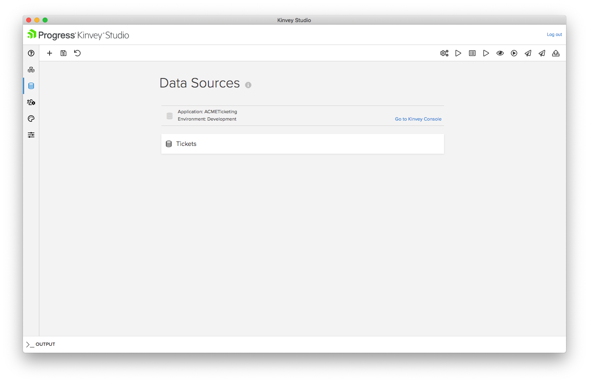
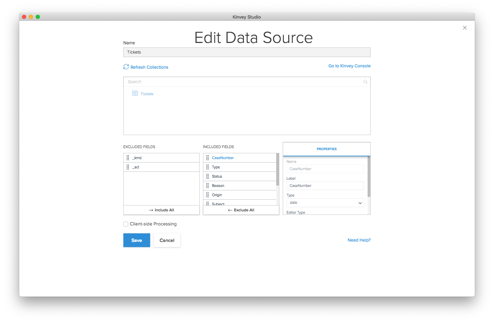
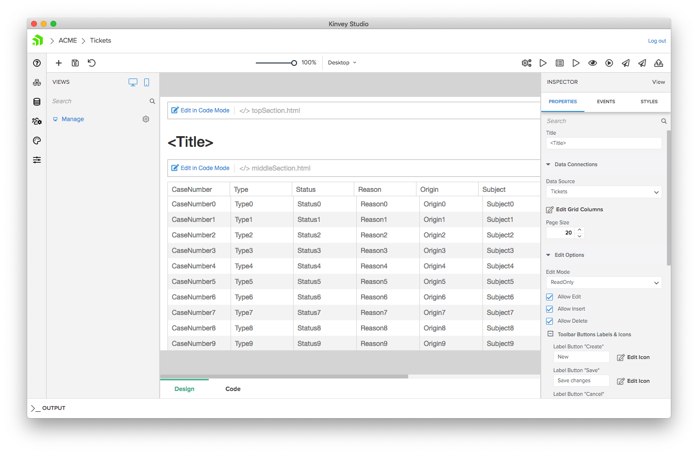
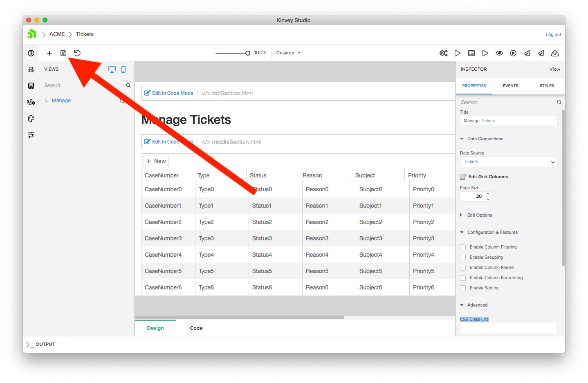
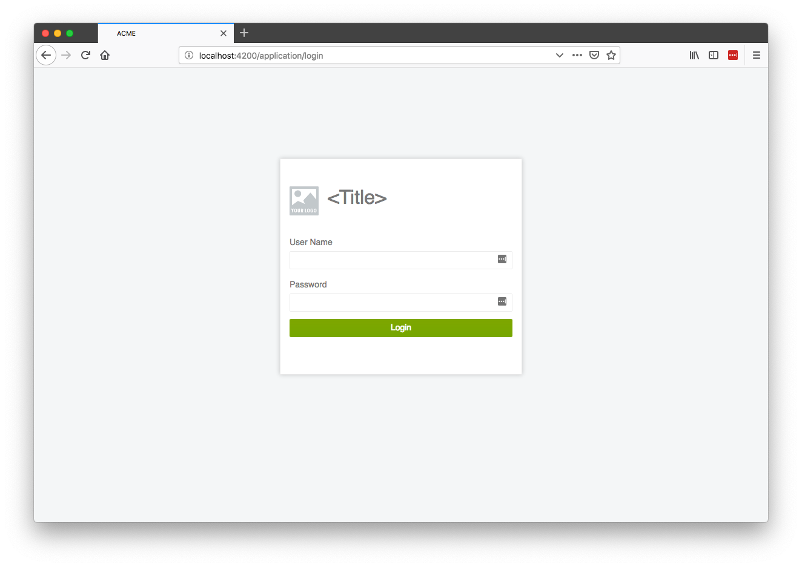
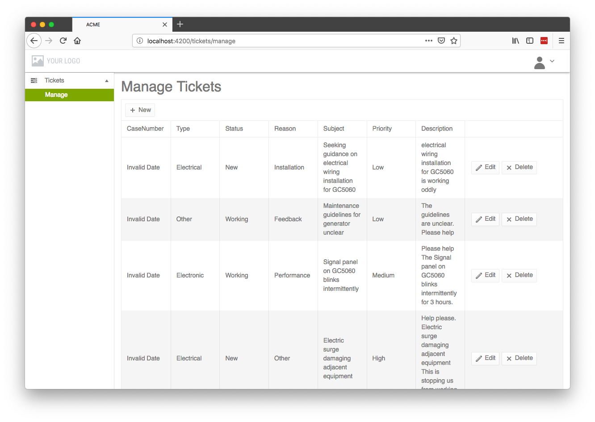
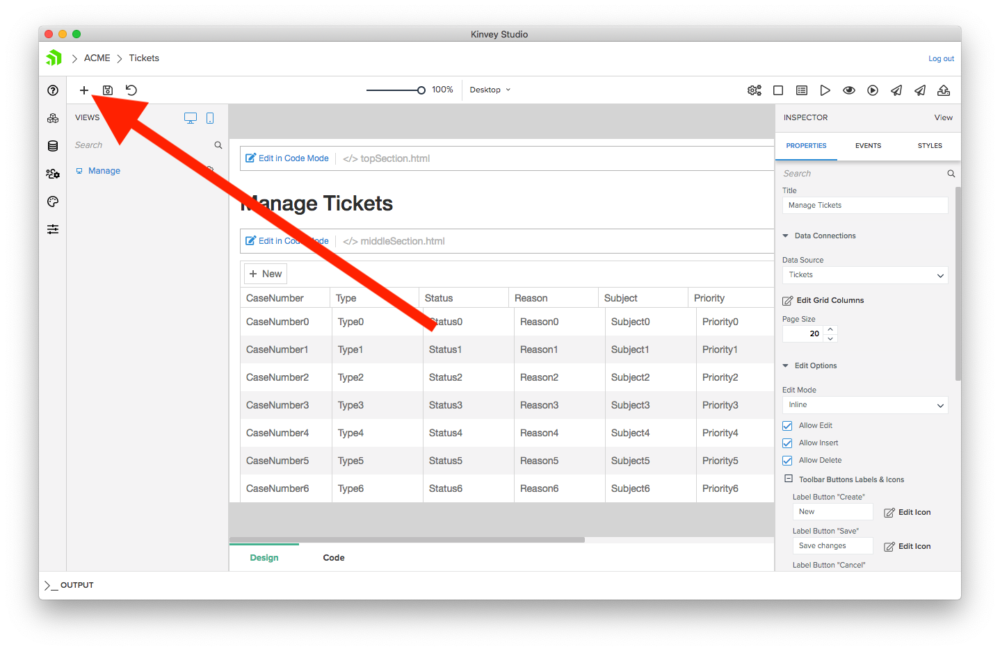
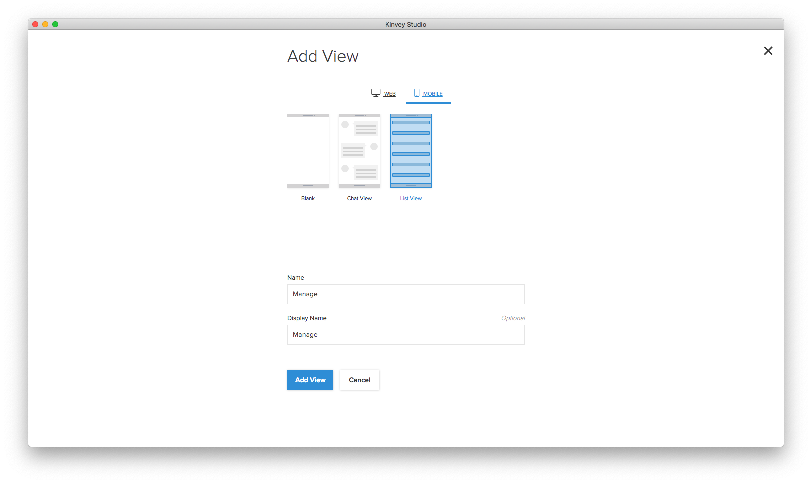

# Chapter 2: Working with UI and data

Kinvey Studio makes it easy to quick scaffold views for your applications and connect those views to data. In this chapter you’ll build a view for managing a list of data, and use the list in both your web and mobile apps.

Let’s start by taking a look at the data you’ll be working with.

## Table of contents

* [2.1: Working with data](#2.1)
* [2.2: Building with modules and views](#2.2)
* [2.3: Creating a web UI](#2.3)
* [2.4: Creating a mobile UI](#2.4)

<h2 id="2.1">2.1: Working with data</h2>

Kinvey Studio allows you to easily use data to build user interfaces fast. To view the data you’ll use in this tutorial, click the **Edit providers** button on the left-hand side of Kinvey Studio.

On this page you’ll see a list of your application’s data sources, which, because you started your app with a sample backend, lists a few collections for you to use in this tutorial.

> **TODO**: The above screenshot is not accurate because the tickets data source is not in the sample dataset—yet. Until it is you’ll be unable to directly follow along with the rest of this tutorial, but you can read through to get an idea of Kinvey Studio’s workflows and such.

For the purposes of this tutorial we’re going to suppose the ACME organization uses the **tickets** collection to store tasks for their field technicians, and as such, the tickets collection is the data source you’ll be using throughout this tutorial.

If you click on the tickets collection you can see a list of fields that make up the data source, such as its Status and Subject.

On this screen you have the ability to configure properties about each field, such as their types. Configuring these properties can help Kinvey Studio pick appropriate user interface elements for each field, such as using a date picker for a date field, or a number picker for numeric data.

> **TODO**: When we have the final tickets collection in place, we’ll probably need to have a step where the user has to change the type of some of the fields. Holding off on that until the collection is ready to go though.

For now though just make note that this collection exists, and let’s look at how to this data to build an app.

<h2 id="2.2">2.2: Building with modules and views</h2>

Kinvey Studio applications are made up of a set of modules, which are logical ways to organize your application’s functionality—kind of like a folder. On the main dashboard of your app (which you can return to by clicking the **Edit App** button on the left-hand side of the screen), you can see that you currently have one module named **Application**.

The Application module is a special module, as it contains several application-wide views, such as your application’s login page. You’ll return to this module in the next chapter when we discuss authentication.

For now, go ahead and hit the plus button in the top-left corner of Studio to create a new module for your app.

On the next page, give your module a Name and Display Name of **Tickets**. You can also configure an icon for your module using the picker on the right of the first textfield; you’ll see where this icon gets used momentarily.

> **NOTE**: You can change a module’s icon at any time, so feel free to pick any icon and color you’d like, as you can easily change these values later.

Once you have everything ready, click the **Add Module** button to finish creating your module.

Now that you have a new module, you’re ready to create your first view, which are the screens that users actually see in your app. To create a view, go ahead and hit the plus button in the top-left corner of your module’s dashboard.

You should see a screen that looks like this.

Kinvey Studio provides a number of pre-configured views to make building your apps fast and easy.

In Kinvey Studio there are separate views for web and mobile, and you can toggle between them using the selector at the top of the screen. For most scenarios you’ll want to create two views for each unit of functionality in your apps—one for web, and one for mobile. Doing so allows you to build a user interface that’s optimized for each device’s form factor.

To see this in action, let’s start by building a web UI for your first view.

<h2 id="2.3">2.3: Creating a web UI</h2>

In this section you’ll build a new view for working with the tickets collection.

Let’s return to the view picker from the previous section.

There are two types of views in Kinvey Studio—blank views and data-bound views. Blank views, as their name implies, are empty screens that allow you to build up your interfaces from individual components. You’ll use blank views in upcoming sections, but for now select a **Data Grid** view (which is data-bound), and give your view both a Name and Display Name of **Manage**.

Next, hit the **Add View** button to finish creating your view. At this point you should see your view’s canvas, which is the screen you’ll use to get your view ready to go.

For data-bound views, most of the changes you’ll make will happen **PROPERTIES** pane on the right-hand side of the screen.

Make the following changes to customize your data grid.

* Change the **Title** of the view to **Manage Tickets** (as this is a view for ACME employees to alter ticket information).

* Make sure the **Data Source** is set to **Tickets**, so that this data grid operates on the ticket data we looked at earlier.

* Click **Edit Grid Columns** and drag-and-drop the _id and Origin columns to the **EXCLUDED COLUMNS** list. When you’re done the screen should look like the screenshot below. Click **Save** and you should the _id and Origin columns disappear from your canvas.

* Change the **Edit Mode** to **Inline** to allow users to make changes to the tickets.

With these changes in place, tap the save icon in the top-left corner of the screen to save the changes you’ve made.

After that, tap the **Generate** button in the top-right corner of the screen.

If your web server is still running from the previous chapter, your browser will refresh with the new changes. (If you don’t have a web server running, you can start one by clicking the **Start** button next to the Generate button, and then clicking the **Open in browser** button to open your app in your default browser.)

By default your app starts on a login screen. (We’ll discuss authentication in the next chapter if you want to change that.) The sample data includes a default user with a User Name and Password of **admin**, so go ahead and provide those values to log in.

> **INTERNAL NOTE**: A default user is not in the sample data—yet. To continue you’ll have to create a new user in Kinvey Console that you can use to log in.

After you log in you should see a screen that lets you add, edit, and delete tickets in a data grid.

And that’s all there is to it! Within a few minutes, you were able to create a completely functional grid for managing your data source.

Feel free to experiment with altering tickets on this page to get a sense of how the data grid works. You might also want to take a few minutes to play with this view’s configuration in Kinvey Studio to get accustomed to the development workflow.

> **CHALLENGE**: Notice how the case number column shows “Invalid Date” for all entries. This is because the case number is currently configured as a date field when it should be a number field. See if you can fix that in the **Edit Providers** section of Kinvey Studio.

Now that your web view is done, let’s move on to see how you can make use of the same data in a mobile app.

<h2 id="2.4">2.4: Creating a mobile UI</h2>

One of the biggest benefits of working in Kinvey Studio is that you’re able to build web apps and native mobile apps at the same time. Under the hood, the two apps are even sharing the same architecture and code that you can extend later.

To create a mobile view for managing tickets, head back to your existing Manage view in Kinvey Studio, and click the plus button at the top-left side of the screen, which is how you create new views.

On the next screen, switch to the MOBILE tab and select the **List View** view type, which is a data-bound mobile view. After that, give the view both a Name and Display Name of **Manage**, and click the **Add View** button.

## Next Steps

* [Continue to chapter 3—Users and authentication](#3.md)