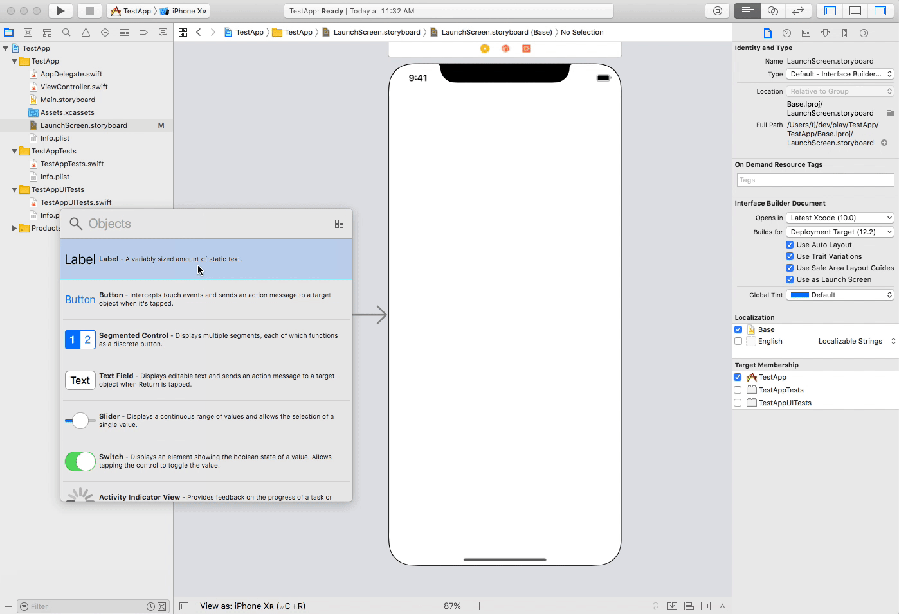
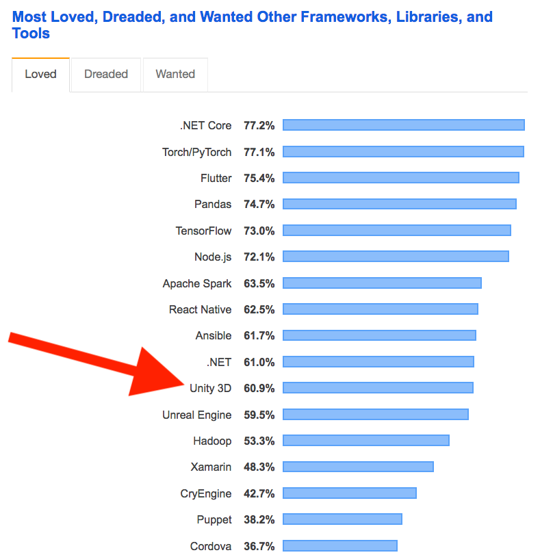
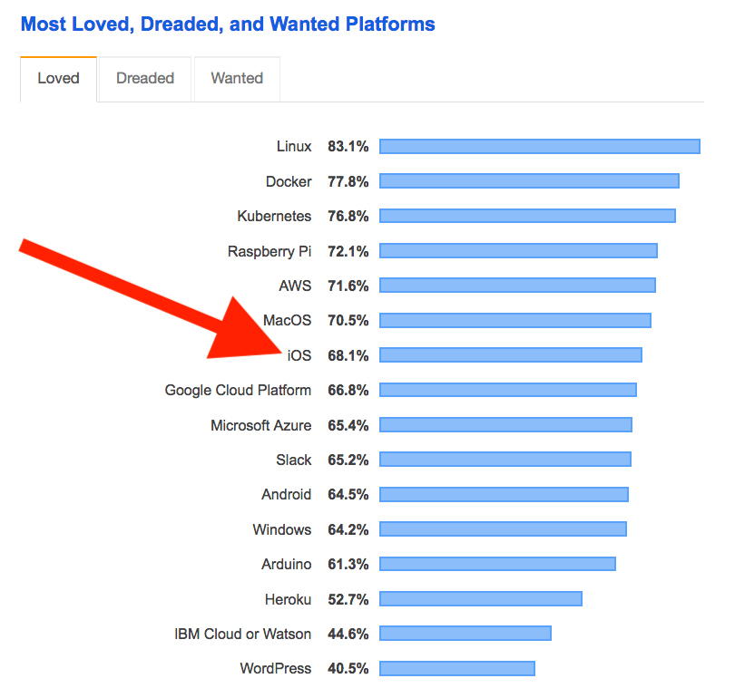
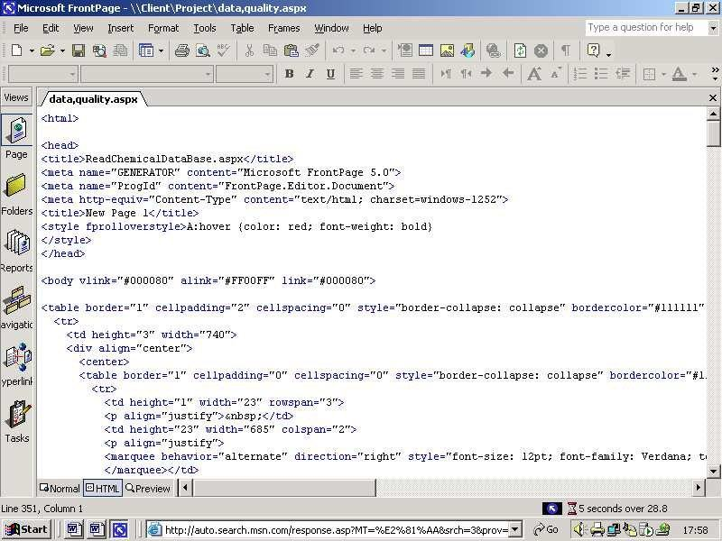
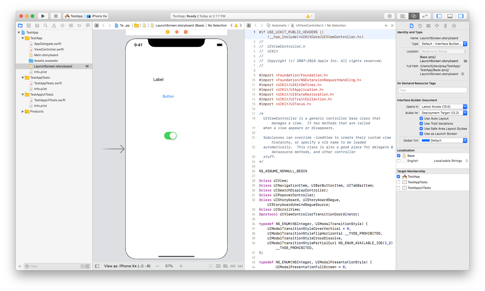
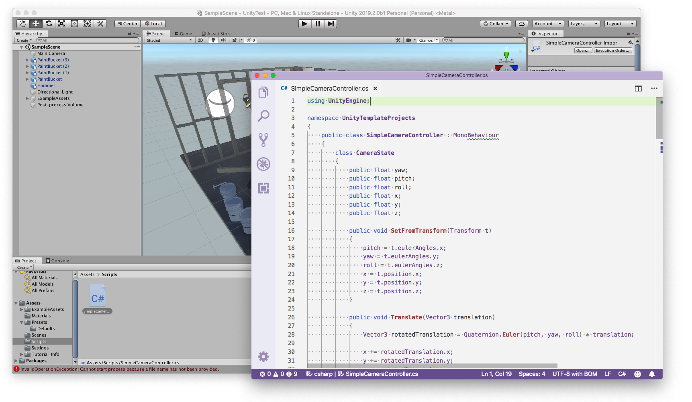
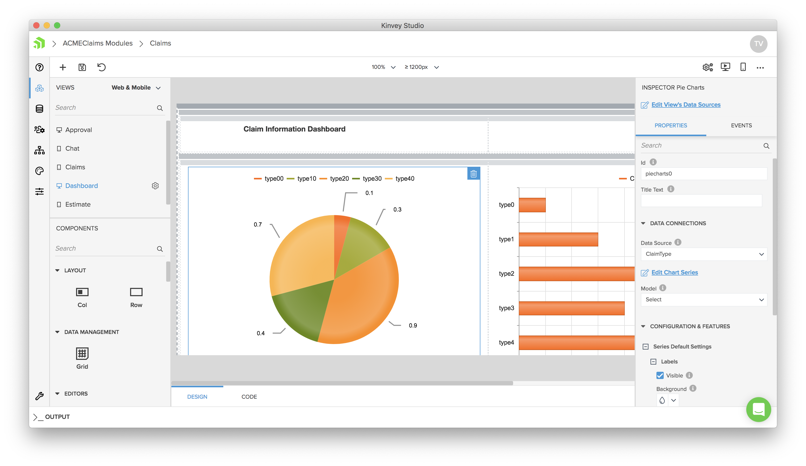
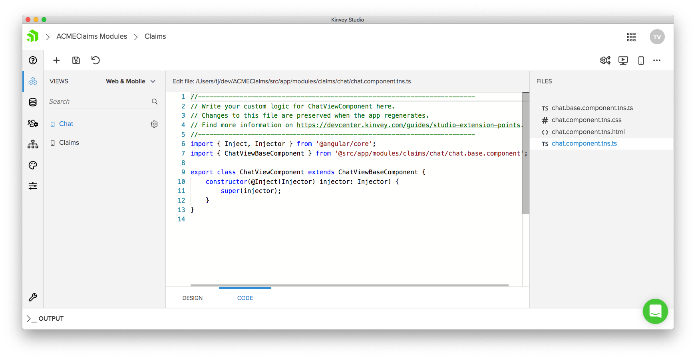

# Why Low Code Doesn’t Have to Be Awful

Before I worked at Progress I had a nine-to-five job building apps at a rather large insurance company here in the US. I liked working there, but at some point, our executive team decided that the development team wasn’t creating apps fast enough. To address this lack of pace they purchased a “low code” tool that, for this article’s purposes, we’ll call AppMaker2000.

AppMaker2000 had a gorgeous homepage that promised everything you can imagine and more. Build apps fast! No development skills needed! Yet, despite its allure, AppMaker2000 quickly became a derogatory slur among developers at the company. It required us to throw out skills we already had, and it built generated apps that we knew we could build better and faster by hand.

My story is not unique, as nearly every developer has used (and hated) a similar tool in their career. But it doesn’t have to be this way.

## Defining low code

Although “low code” has come to represent developer-unfriendly software, the term itself _shouldn’t_ have negative connotations. Low code just means building software with a minimal amount of code, which isn’t a bad thing. After all, one of the main goals of software development is to automate repetitive tasks, and writing code can absolutely be repetitive and error prone.

In fact, many low-code tools are already popular in the development community, even if they don’t use a “low code” label. For example, Xcode, the iOS development platform, recommends using visual Storyboards as the primary means of building iOS views. When developing Storyboards Xcode lets you see the canvas you’re building for, and to drag-and-drop the UI components you need directly.

Unity, the popular game development platform, also allows you to visually add components to your scene, and also provides GUIs for configuring features like lighting, sound, and app assets.

Anecdotally, most developers I talk to have high opinions of the visual tooling in both Xcode and Unity 3D. And the [Stack Overflow 2019 developer survey](https://insights.stackoverflow.com/survey/2019) backs this up, as both the iOS platform and Unity 3D tool appear towards the middle of Stack Overflow’s “Most Loved” lists.

It’s not hard to see what makes visual development tools so appealing. For example, suppose you needed to build a game, and you wanted to start by placing a handful of 3D models on a canvas. If you tried to accomplish that task in code alone, you might have to learn a new language, new APIs for working the the model, and you’d have to figure out how to actually test out the code you write. In contrast, with Unity’s 3D editor you can view a collection of 3D models directly in the tool, and drag those models to their appropriate location on your canvas within a few minutes.

So if that’s the case, and low-code tools do actually provide value to developers, why does the term have a bad name?

## What gives low code tools a bad name?

Although low-code visual tooling _can_ be a huge time saver, that same tooling can oftentimes build slow or buggy apps, or apps that you cannot extend beyond what the visual tooling offers. Let’s look at a few of the downsides of low code in general.

### Reason #1: Bad output

It doesn’t matter how much time a tool saves you if the end result is unacceptable. Low code tools, by nature, help solve generic development problems. And because of that, the code that these tools generate are not as optimized as code you write by hand.

In many cases this tradeoff is acceptable—that is, as long as the app runs well enough, the development cost savings usually outweigh the performance hit. However, many low-code tools generate code that does not meet the good-enough standard, which make the development cost savings irrelevant.

Perhaps the most notorious example of a tool that generates horrible code is the venerable Microsoft FrontPage. Although FrontPage legitimately helped many people build web sites in the web’s early days (including me!), its poor-performing generated code prevented the tool from being used in serious web apps.

I’ve personally hit this limitation of low-code tools several times throughout my career, most notably with the earlier-mentioned AppMaker2000 tool. AppMaker2000 generated web apps, but it generated web apps that only worked in Internet Explorer. At the time we purchased AppMaker2000 this was fine (it was the only browser our users used anyways), but a few years later requirements changed, and when our users demanded Firefox support we had to say no, because the generated code didn’t work in Firefox and there was nothing we could do about it.

### Reason #2: Not extensible

A low-code tool, no matter how comprehensive it may be, can never solve 100% of development problems. Therefore, it’s important that low-code tools offer a variety of ways to extend the apps you build beyond what the tool itself can automate. Unfortunately this is not always the case.

For example, when I first got my hands on AppMaker2000, the first task I attempted was using CSS to alter the visual appearance of the tool-generated applications. These CSS updates worked... until I made any change in AppMaker2000, at which time AppMaker2000 removed any custom changes I made with its build process.

Frustrated but determined, a few of us wrote deployment code that changed the generated CSS before it went to our development and production servers. It’s simultaneously the code I’m most proud and ashamed of, but it’s the exact sort of reason low code has a bad name—developers hate having to go to such extreme lengths to implement trivial functionality.

And it can get worse, because if you run into a project requirements you have no way to accomplish, oftentimes you can’t move away from the tool you’re using.

### Reason #3: Lock in

Because low-code-tool code is usually generated, oftentimes that code is useless outside of the low-code tool itself. For example, Xcode-generated storyboards are only useful in Xcode, and Unity-generated canvases are only useful in Unity 3D.

This exclusiveness isn’t necessarily a bad thing, but it often can be when money gets involved. Low-code tools are often offered as subscription-based services, meaning, you have to continue paying if you want to continue to use the tool, which can lock you in to paying to maintain apps you’ve already deployed—even if you’re ready to move away from the tool itself.

For example, about two years into using AppMaker2000 we realized a most of our apps weren’t a good fit for the tool, and we wanted to move away from the product. However, by this point we had many AppMaker2000-built apps in production with real users, and we therefore couldn’t instantly switch away from the tool. So... we continued to pay to support these apps, and for all I know my ex-company is stilling paying to use AppMaker2000 to this day.

## Doing low code the right way

Although low-code tools have their drawbacks, not all low-code tools are created equally, and some do a good job at mitigating the downsides of low code.

For example, consider the Xcode and Unity 3D examples I gave earlier. One reason developers generally like these tools is that they tend to avoid some of the downsides of low-code tools. Both generate high-quality code that can be used in production apps, and both give plenty of options for extensibility. With storyboards in Xcode, for instance, your code lives right next to your visual editor, allowing you to easily extend what the visual tool alone offers. And Xcode also allows you to code UIs from scratch (without storyboard) for advanced scenarios.

 Unity is also good about extensibility, as it offers numerous hooks in C# for you to control exactly how you want your app to work.

Here at Progress we tried to learn from the mistakes other tools have made, as well the developer-friendly approach tools like Xcode and Unity offer, to build Kinvey Studio.

## Kinvey Studio

[Kinvey Studio](https://www.progress.com/kinvey/studio) is a low-code tool that helps developers build powerful web and mobile apps fast.

We built Kinvey Studio with the limitations of these sorts of tools in mind. For example, Kinvey Studio generates clean code that’s designed to run fast on the web, on iOS, and on Android.

We also built with extensibility in mind, as all Kinvey Studio apps build on top of open source technologies, such as Angular, TypeScript, and Progress’s own [NativeScript](https://www.nativescript.org/). The raw source code is always available in Studio, and we clearly mark which files are editable by developers.

Finally, with Kinvey Studio your apps are never locked in. Because your apps are built on top of open-source technologies, you could take your apps out of Studio and continue to develop them with the tools they’re built on (the Angular CLI and NativeScript).

## Wrapping up

Low code has a bad reputation among developers, as low-code tools are notorious for generating bad apps that aren’t extensible and lock you in.

But not all low-code tools are awful, and tools that can avoid these disadvantages can offer some real productivity benefits for developers. If you want to try out our approach to that here at Progress, [download Kinvey Studio for free](https://www.progress.com/kinvey/studio) to start building apps today.