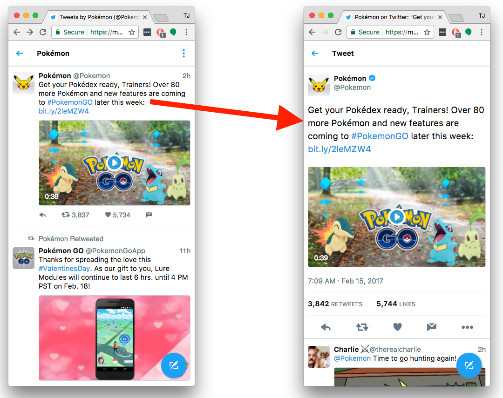
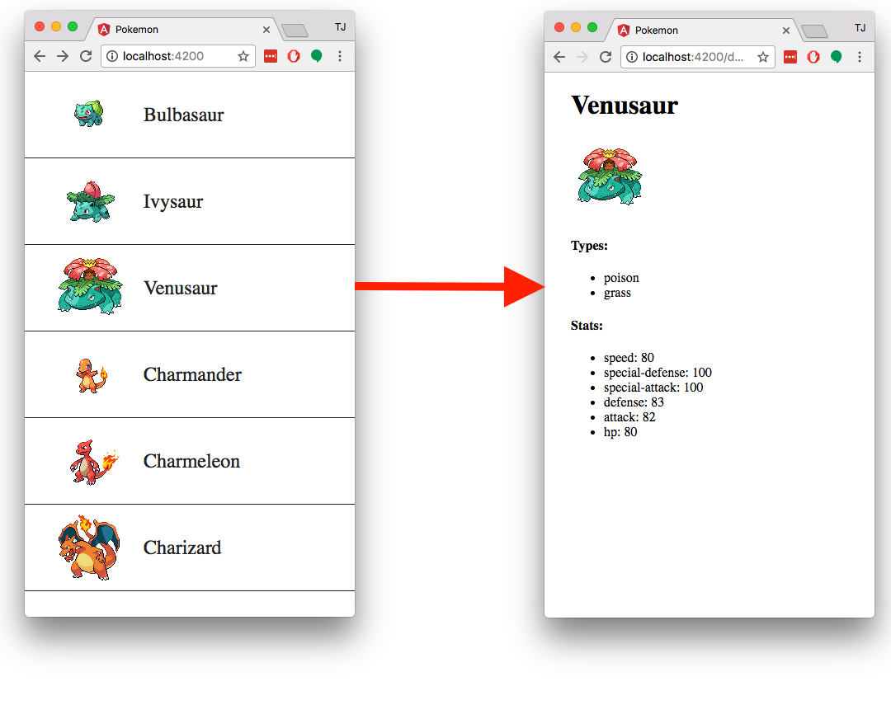
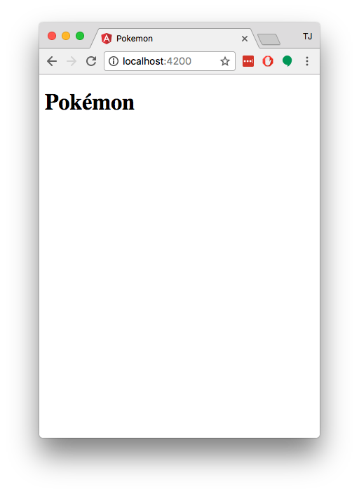
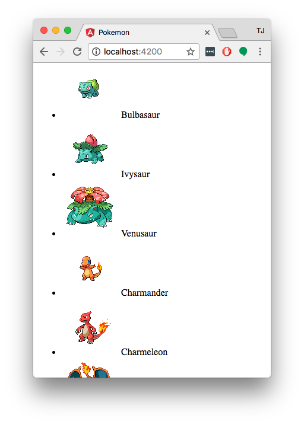
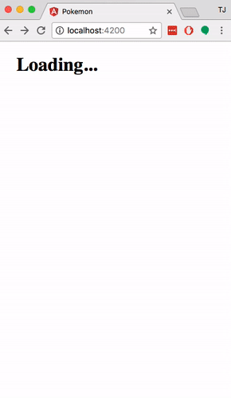

# How to Build Master-Detail User Interfaces with Angular

The master-detail design pattern is an incredibly popular way to build mobile apps, regardless of whether you’re building for native or for the web.

The popular [Angular framework](https://angular.io/) is well suited for implementing this design pattern as it has a number of the necessary features you need baked in, such as data binding, routing, services, and a whole lot more.

This article is a comprehensive step-by-step tutorial for creating master-detail UIs with Angular. If you follow along throughout you should know everything you need to build your own master-detail interfaces for your clients or company. There’s a lot to cover, so let’s jump right in.

> Side note: Angular’s applicability for these sort of mobile-centric user interfaces is one of the reasons the library works so well in frameworks like [NativeScript](https://www.nativescript.org/). Although this tutorial covers using Angular to build a web app, a fully functional NativeScript implementation for building native iOS and Android apps is [available on GitHub](https://github.com/tjvantoll/angular-master-detail) for your reference.

## Setting up

Master-detail interfaces work best when you have a large list of some type of data, and the individual items in the list have details associated with them—details that the user needs to view or modify.

The Twitter mobile app is a perfect example of a master-detail UI in action. The main screen is a giant “master” list of tweets that the user can tap on. When the user does tap, they’re taken to an additional “details” screen with additional information on the tweet.



In this tutorial you’ll use the popular [pokéapi](http://pokeapi.co/) to build a relatively simple app for viewing Pokémon data. When you’re done you’ll have an app that looks like this.



Your Pokémon app will be purposely simple to show off the basic concepts of building master-detail apps with Angular. However, the techniques you learn should be applicable to your own application development. Let’s start building.

## Starting your app

Although there are many ways you can build your Angular apps, the easiest is with the [Angular CLI](https://github.com/angular/angular-cli). If you haven’t already go ahead and [install the Angular CLI](https://github.com/angular/angular-cli#installation), and then run the following commands from your terminal or command prompt  to start a new app named “pokemon”.

```
ng new pokemon
cd pokemon
```

The Angular CLI generates an app with a lot of files, but all you’re interested in for now are the ones in your new app’s `src/app` folder. To set up a structure you’ll need for this tutorial, alter the files in the `src/app` folder to look like the listing shown below. (Don’t worry about the contents of any of these files yet, as we’ll be covering that shortly.)

```
src/app
├── app-routing.module.ts
├── app.component.ts
├── app.module.ts
└── pokemon
    ├── pokemon-list.component.html
    ├── pokemon-list.component.js
    ├── pokemon-list.component.ts
    ├── pokemon-service.ts
    └── pokemon.model.ts
```

## Scaffolding your app

There are a lot of files here so let’s walk through them sequentially, and along the way start the “master” part of the master-detail interface, as it’s the page the user needs to start on.

Angular-built apps start in `src/main.ts`, a small file that bootstraps the Angular app and passes control to an Angular module. In most applications, including this tutorial’s, you’ll want to leave the `main.ts` file alone. So let’s start in the file that `main.ts` passes control to, `app.module.ts`. Open that file in your editor or IDE, and replace the contents of that file with the code below.

```
import { BrowserModule } from "@angular/platform-browser";
import { NgModule } from "@angular/core";
import { FormsModule } from "@angular/forms";
import { HttpModule } from "@angular/http";

import { AppComponent } from "./app.component";
import { AppRoutingModule } from "./app-routing.module";

import { PokemonListComponent } from "./pokemon/pokemon-list.component";

@NgModule({
  imports: [
    AppRoutingModule,
    BrowserModule,
    FormsModule,
    HttpModule,
  ],
  declarations: [
    AppComponent,
    PokemonListComponent
  ]
  bootstrap: [AppComponent]
})
export class AppModule { }
```

The module you define in `app.module.ts` is known as the root module, and the Angular documentation has [an extensive guide on how to use it](https://angular.io/docs/ts/latest/guide/appmodule.html). Succinctly, the app module is where you define all the things you need to use throughout your application. Angular gives you the ability to separate your app into multiple `@NgModule`s to keep your app modular, but for simple apps like the one you’re building keeping everything in the root module makes a lot of sense.

The two things unique to the Pokémon app in this file are the `PokemonListComponent` and `PokemonService`. These are both classes you haven’t created yet, so expect to get a few TypeScript errors in your editor until we get to that point.

The last thing to know about the `AppModule` is its `bootstrap` property, which determines which component Angular should pass control flow over to. Because you passed `AppComponent` as the bootstrap component, that’s the next thing Angular will interpret, so let’s switch over the to `app.component.ts` file that the `AppComponent` is defined in. Open `app.component.ts` in your text editor or IDE and replace its contents with the code below.

```
import { Component } from "@angular/core";

@Component({
  selector: "pk-root",
  template: "<router-outlet></router-outlet>"
})
export class AppComponent { }
```

As with the previous `app.module.ts` file, most of the code you see here is the same you’d see in any Angular app. If you need some background on how Angular components work, head over to the [Angular documentation](https://angular.io/docs/ts/latest/guide/architecture.html#!#components) for a full guide.

The key thing to know here is the string you pass for the component’s `template` property is what Angular renders on the screen. For example using a `template` of `<h1>Hello World</h1>` would print a display a simple heading in your browser.

Things get a little trickier when you get into custom directives (or custom HTML tags) like `<router-outlet>`, as they can have special behavior. The `<router-outlet>` directive specifically tells Angular to render the currently selected route. To see how all that works, let’s shift our discussion over to routing in Angular apps.

## Configuring your app’s routing

To determine what the currently selected route is, and to configure routing in general, go ahead and open your `app-routing.module.ts` file.

Once you have your `app-routing.module.ts` file open go ahead and replace its contents with the following code.

```
import { NgModule } from "@angular/core";
import { RouterModule, Routes } from "@angular/router";

import { PokemonListComponent } from "./pokemon/pokemon-list.component";

const routes: Routes = [
  { path: "", component: PokemonListComponent }
];

@NgModule({
  imports: [
    RouterModule.forRoot(routes)
  ],
  exports: [
    RouterModule
  ]
})
export class AppRoutingModule { }
```

This is again very similar to the default Angular routing configuration, and therefore the [Angular guide on routing](https://angular.io/docs/ts/latest/guide/router.html#) is an excellent reference if you’re looking for exact details.

Quickly though, here you’re configuring a single route in the `routes` constant. The `PokemonListComponent`, which you’ll be creating momentarily, is currently the only route in your app. You make it the default route by giving it a path of `""`, which means you can access the main route when you visit the root URL of your web application. The `PokemonListComponent` is the “master” in the master-detail user interface; you’ll be returning to `app-routing.module.ts` later to add in the “detail” configuration for your app.

Now to take a step back, the reason this routing configuration works is because the `AppRoutingModule` class you export here is already imported in the `app.module.ts` file you created earlier. That’s how Angular knows about the routes you register, and how to render them when it sees the `<router-outlet>` in a directive. With this configuration in place, when you visit the root URL of your app Angular will automatically pass control to the `PokemonListComponent` and render its template.

Therefore, the last thing you need to do to get this app running is to define that `PokemonListComponent` component. To do that open your `pokemon/pokemon-list.component.ts` file and paste in the code below.

```
import { Component } from "@angular/core";

@Component({
  selector: "pk-items",
  moduleId: module.id,
  template: "<h1>Pokémon</h1>"
})
export class PokemonListComponent { }
```

This is another Angular component, much like the one you defined in `app.component.ts`. This component is simple, and renders a single `<h1>` tag. At this point you have a functional, albeit trivial, master screen. To see this page in action head back to your terminal or command prompt, and run the Angular CLI’s `ng serve` command.

```
ng serve
```

If all went well, you should be able to load `localhost:4200` in your browser and see the `<h1>` heading as expected.



This isn’t the most exciting app in the world, but at this point you now have all the setup needed to get started. Your `app.module.ts` file contains your app-level configuration; your `app-routing.module.ts` file contains your routing configuration; and your `app.component.ts` file renders the app’s current route. By default that route is the `PokemonListComponent` in your `pokemon-list.component.ts` file. Let’s start building that component out, and then work our way to additionally define a “details” component that you can navigate to.

## Building out the master view

A master view typically shows a large list of data. Since this is a Pokémon app, let’s put the pieces in place to hit pokéapi to get the data you need to show a giant list of Pokémon on the app’s main screen.

Let’s start by creating a simple service that can retrieve that list of Pokémon for the master screen. Open your app’s `pokemon/pokemon-service.ts` file and paste in the following code.

```
import { Injectable } from "@angular/core";
import { Http, Headers, Response } from "@angular/http";
import "rxjs/add/operator/toPromise";

import { Pokemon } from "./pokemon.model";

@Injectable()
export class PokemonService {
  constructor(private http: Http) { }

  list() {
    let headers = new Headers();
    headers.append("Content-Type", "application/json");

    return this.http.get("http://pokeapi.co/api/v2/pokedex/2/", {
      headers: headers
    })
    .toPromise()
    .then((res: Response) => {
      let data = res.json();
      let allPokemon = [];

      data.pokemon_entries.forEach((entry) => {
        let pokemon = new Pokemon();
        pokemon.name = entry.pokemon_species.name;
        pokemon.id = entry.entry_number;
        allPokemon.push(pokemon);
      });

      return allPokemon;
    })
    .catch(this.handleError);
  }

  private handleError (error: Response | any) {
    let errMsg: string;
    if (error instanceof Response) {
      const body = error.json() || "";
      const err = body.error || JSON.stringify(body);
      errMsg = `${error.status} - ${error.statusText || ""} ${err}`;
    } else {
      errMsg = error.message ? error.message : error.toString();
    }
    console.error(errMsg);
    return Promise.reject(errMsg);
  }
}
```

You can refer to [Angular’s documentation on services](https://angular.io/docs/ts/latest/tutorial/toh-pt4.html) for details on the specific syntax here, but essentially this gives you define a simple `list()` method you can call that returns a `Promise` containing the data you need. The bit of code that works with `pokemon_entries` does a bit of simple formatting to extract data from the APIs format into simple JavaScript objects that your UI can use.

You can see that the service makes use of a `Pokemon` class, and because that class doesn’t yet exist you’ll get syntax errors for now. To fix that open your app’s `pokemon/pokemon.model.ts` file and paste in the following basic class.

```
export class Pokemon {
  name: string;
  id: number;
  types = [];
  stats = [];

  formattedName() {
    return this.name ? 
      this.name[0].toUpperCase() + this.name.substr(1) : "";
  }

  image() {
    return "https://rawgit.com/PokeAPI/sprites/master/sprites/pokemon/" + this.id + ".png"
  }
}
```

Now that you have a model and a service you’re ready to tie this all together in the main list component. Open your app’s `pokemon-list.component.ts` file and paste in the following code.

```
import { Component, OnInit } from "@angular/core";

import { Pokemon } from "./pokemon.model";
import { PokemonService } from "./pokemon-service";

@Component({
  selector: "pk-items",
  moduleId: module.id,
  templateUrl: "./pokemon-list.component.html",
})
export class PokemonListComponent implements OnInit {
  pokemon: Pokemon[];

  constructor(private pokemonService: PokemonService) { }

  ngOnInit(): void {
    this.pokemonService.list()
      .then((pokemon) => {
        this.pokemon = pokemon;
      });
  }
}
```

The addition here is a new [`ngOnInit()` lifecycle hook](https://angular.io/docs/ts/latest/api/core/index/OnInit-class.html), which Anguar calls as soon as your component initializes. You use that hook to call your newly defined service’s `list()` method to get the data you need. When the `list()` method completes, you assign the returned data to the component’s `pokemon` property, which makes the data available to the component’s template.

To define that template open your app’s `pokemon-list.component.html` file and paste in the following code.

```
<h1 *ngIf="!pokemon">Loading...</h1>

<ul class="list-view">
  <li *ngFor="let item of pokemon">
    <a>
      
      <span>{{ item.formattedName() }}</span>
    </a>
  </li>
</ul>
```

Here, you use the [`*ngIf` directive](https://angular.io/docs/ts/latest/api/common/index/NgIf-directive.html) to conditionally show a loading message while you’re asynchronously retrieving data from pokéapi. You then loop over the component’s `pokemon` array with the [`*ngFor` directive](https://angular.io/docs/ts/latest/api/common/index/NgFor-directive.html), and create a `<li>` for each Pokémon in the list.

Your last step to getting this screen running is registering the service you created earlier in your top-level Angular module. Why? Note that in your `pokemon-list.component.ts` file used the following approach to get access to the service.

```
constructor(private pokemonService: PokemonService) { }
```

This is Angular’s dependency injection at work. You can [read more about what dependency injection is and why Angular uses it on the Angular docs](https://angular.io/docs/ts/latest/guide/dependency-injection.html), but essentially, Angular needs you to register all services in an `@NgModule` to be injectable.

To make that happen open your app’s `app.module.ts` file and replace the contents of the file with the code below, which adds a new `providers` array containing your new service.

```
import { BrowserModule } from "@angular/platform-browser";
import { NgModule } from "@angular/core";
import { FormsModule } from "@angular/forms";
import { HttpModule } from "@angular/http";

import { AppComponent } from "./app.component";
import { AppRoutingModule } from "./app-routing.module";

import { PokemonListComponent } from "./pokemon/pokemon-list.component";
import { PokemonService } from "./pokemon/pokemon-service";

@NgModule({
  imports: [
    AppRoutingModule,
    BrowserModule,
    FormsModule,
    HttpModule,
  ],
  declarations: [
    AppComponent,
    PokemonListComponent
  ],
  providers: [
    PokemonService
  ],
  bootstrap: [AppComponent]
})
export class AppModule { }
```

After this change if you return to `localhost:4200` in your browser you should see an app that looks like this.



This is again not super exciting, but you’re making some real progress. You now have a backend-driven list of data, and all the necessary setup done to start to add some more advanced functionality. Now that the master list is functionaly complete, let’s move our switch our discussion to implementing your app’s details screen.

## Building out the detail view

In a typical master-detail setup users tap on an item on the master screen to see more information on that particular item. Depending on the application, sometimes that details screen requires a different backend call to retrieve more data, and sometimes it doesn’t.

If your dataset is relatively small, it may make sense to retrieve all the data you need at once, and maybe even cache that data on the client to avoid subsequent calls. If your dataset is large, or if your data updates relatively frequently, it might make sense to check with your backend every time the user navigates to the details screen.

Every scenario is different, but for our pokéapi example we’ll be taking the latter approach—that is, we’ll make a second call to a different pokéapi endpoint every time the user taps an entry in the master list. In a more complex app we’d implement some sort of caching to avoid duplicate backend calls, but for simplicity’s sake we’ll naively hit the backend every time in this tutorial.

Luckily the details view won’t be much work to build as you’ve already done most of the scaffolding work in this app. Let’s start by defining a new route for the details view. Open your `app-routing.module.ts` file and replace its contents with the code below.

```
import { NgModule } from "@angular/core";
import { RouterModule, Routes } from "@angular/router";

import { PokemonListComponent } from "./pokemon/pokemon-list.component";
import { PokemonDetailComponent } from "./pokemon/pokemon-detail.component";

const routes: Routes = [
  { path: "", component: PokemonListComponent },
  { path: "details/:id", component: PokemonDetailComponent },
];

@NgModule({
  imports: [
    RouterModule.forRoot(routes)
  ],
  exports: [
    RouterModule
  ]
})
export class AppRoutingModule { }
```

The only change here is a new entry in the `routes` array for the details component you’ll be creating momentarily. The `path` of the details components determines the URL you’ll use to access the component. This path is a bit unique in that it makes use of a [wildcard route](https://angular.io/docs/ts/latest/guide/router.html#!#wildcard-route). Essentially this configuration says you access the details route at the URL `/details/id`, where `id` is a variable—so for instance `details/1`, `details/2`, and so forth.

Therefore your next step is to return to the list view and update that page’s `<a>` tags to point at the new details route. To do that open your `pokemon-list.component.html` file and replace its contents with the code below, which adds a new `routerLink` binding.

```
<h1 *ngIf="!pokemon">Loading...</h1>

<ul class="list-view">
  <li *ngFor="let item of pokemon">
    <a [routerLink]="['/details', item.id]">
      
      <span>{{ item.formattedName() }}</span>
    </a>
  </li>
</ul>
```

An [Angular router link](https://angular.io/docs/ts/latest/guide/router.html#!#router-links) is a quick way you can link one component to another. Here you’re telling Angular to generate a link that points at the details component (`/details`), and to pass the `id` of the individual Pokémon that the user tapped on. Therefore if the user taps the first Pokémon they’ll be taken to `/details/1`; if the user taps the second Pokémon they’ll be taken to `/details/2`; and so on.

Now that the user is able to navigate to the details page you have to actually define that component. To do that open your app’s `pokemon-detail.component.ts` file and paste in the following code.

```
import { Component, OnInit } from "@angular/core";
import { ActivatedRoute } from "@angular/router";

import { Pokemon } from "./pokemon.model";
import { PokemonService } from "./pokemon-service";

@Component({
  selector: "pk-details",
  moduleId: module.id,
  templateUrl: "./pokemon-detail.component.html",
})
export class PokemonDetailComponent implements OnInit {
  pokemon = new Pokemon();

  constructor(private pokemonService: PokemonService, private route: ActivatedRoute) {}

  ngOnInit(): void {
    const id = +this.route.snapshot.params["id"];

    this.pokemonService.get(id)
      .then((pokemon) => { this.pokemon = pokemon; });
  }
}
```

There are a few things to note here. The first is the use of Angular’s `ActivatedRoute` API, which you as part of this cryptic-looking line of code.

```
this.route.snapshot.params["id"];
```

In general the `ActivatedRoute` has [a variety of APIs](https://angular.io/docs/ts/latest/api/router/index/ActivatedRoute-interface.html) that give you access to all things routing. The `snapshot` property in particular gives you access to the current route, and you use that to access an “id” URL parameter you passed from the list component.

This gives you the `id` you need to hit the pokéapi and get details about an individual Pokémon, which you’re doing in this line of code.

```
this.pokemonService.get(id)
  .then((pokemon) => { this.pokemon = pokemon; });
```

To define this new function open your `pokemon-service.ts` file and paste the following function directly after the existing `list()` method.

```
get(id: number) {
  let headers = new Headers();
  headers.append("Content-Type", "application/json");

  return this.http.get("http://pokeapi.co/api/v2/pokemon/" + id + "/", {
    headers: headers
  })
  .toPromise()
  .then((res: Response) => {
    let data = res.json();
    let pokemon = new Pokemon();
    pokemon.name = data.name;
    pokemon.id = data.id;

    data.types.forEach((eachType) => {
      pokemon.types.push(eachType.type.name);
    });

    data.stats.forEach((eachStat) => {
      pokemon.stats.push({
        name: eachStat.stat.name,
        value: eachStat.base_stat
      });
    });
    
    return pokemon;
  })
  .catch(this.handleError);
}
```

Like the `list()` method, the `get()` method here hits a pokéapi endpoint, does a little formatting, and returns an object that your user interface components can use. In the case of `list()` that data was an array of `Pokemon` objects; in the case of `get()` that data is a single `Pokemon` object.

With this service in place there are two last things you need to do to get this app fully functional. First open your app’s `pokemon-details.component.html` file and paste in the following code, which renders the Pokeémon data that your newly added `get()` function returns.

```
<h1>{{ pokemon.formattedName() || 'Loading...' }}</h1>

<div *ngIf="pokemon.name" class="details-container">
  

  <h4>Types:</h4>
  <ul>
    <li *ngFor="let type of pokemon.types">
      {{ type }}
    </li>
  </ul>

  <h4>Stats:</h4>
  <ul>
    <li *ngFor="let stat of pokemon.stats">
      {{ stat.name }}: {{ stat.value }}
    </li>
  </ul>
</div>
```

And finally, open your app’s `app.module.ts` file and replace its contents with the following code, which merely adds the new `PokemonDetailComponent` to the list of the root module’s declarations.

```
import { BrowserModule } from "@angular/platform-browser";
import { NgModule } from "@angular/core";
import { FormsModule } from "@angular/forms";
import { HttpModule } from "@angular/http";

import { AppComponent } from "./app.component";
import { AppRoutingModule } from "./app-routing.module";

import { PokemonListComponent } from "./pokemon/pokemon-list.component";
import { PokemonDetailComponent } from "./pokemon/pokemon-detail.component";
import { PokemonService } from "./pokemon/pokemon-service";

@NgModule({
  imports: [
    AppRoutingModule,
    BrowserModule,
    FormsModule,
    HttpModule,
  ],
  declarations: [
    AppComponent,
    PokemonListComponent,
    PokemonDetailComponent
  ],
  providers: [
    PokemonService
  ],
  bootstrap: [AppComponent]
})
export class AppModule { }
```

At this point you have a fully functional master-detail user interface. As one final change, go ahead and open your app’s `src/styles.css` file and paste in the following code, which adds a bit of CSS to make the app look half-way decent.

```
body {
  margin: 0;
  padding: 0;
}
h1 {
  padding-left: 2rem;
}
.list-view {
  margin: 0;
  padding: 0;
  list-style-type: none;
  font-size: 1.5rem;
}
.list-view li {
  border-bottom: 1px solid #222;
}
.list-view a {
  display: flex;
  padding: 0.25rem 2rem;
  color: #222;
  text-decoration: none;
}
.list-view img {
  height: 96px;
  width: 96px;
}
.list-view span {
  align-self: center;
  display: inline-block;
  padding-left: 1rem;
}

.details-container {
  margin-left: 2rem;
}
```

If all went well, if you head back to your browser and refresh `localhost:4200` you should see a completely functional master-detail user interface.



## Where to go from here

Hopefully after following this tutorial you have a better idea of how to build master-detail user interfaces with Angular. The [full code for this app is up on GitHub](https://github.com/tjvantoll/angular-master-detail), so feel free to clone it and alter it to your heart’s desire. The GitHub repo also contains a completely functional NativeScript app , so you can compare and contrast the two approaches, and see just how much code you can share across environments. (Hint: it’s a lot.)
