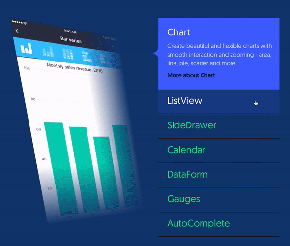
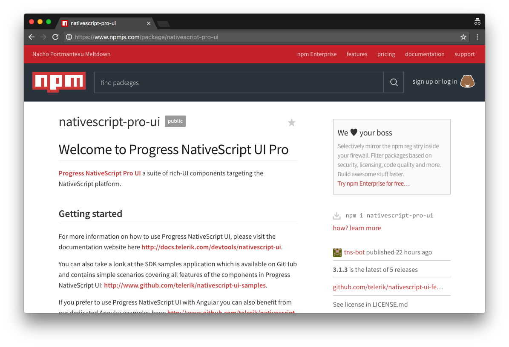
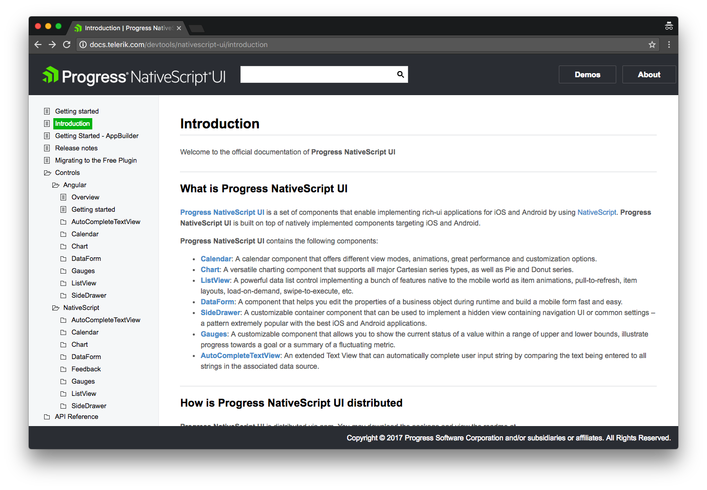
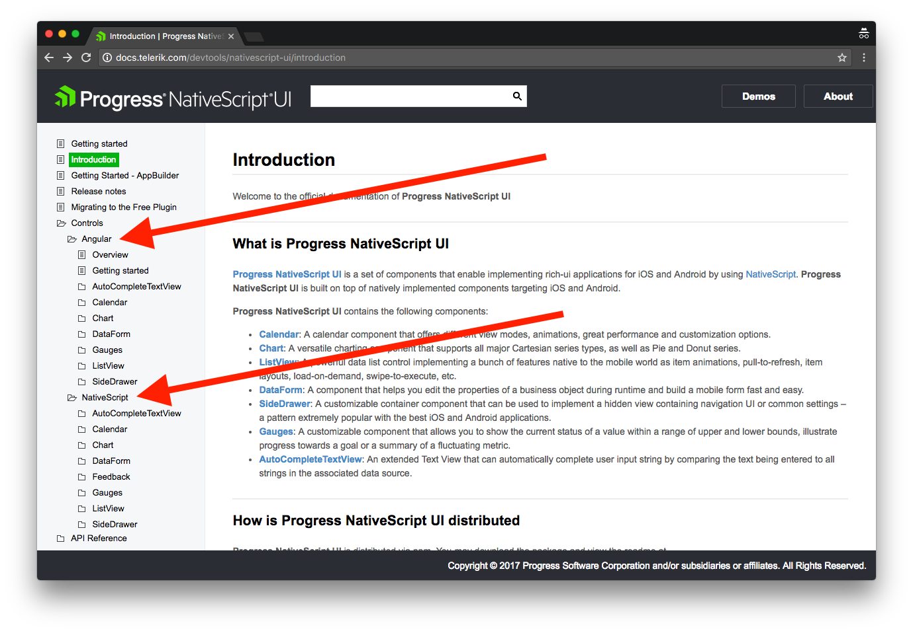

# NativeScript UI is Now Free—Here’s How to Get Started

At [this year’s NativeScript Developer Day](https://www.nativescript.org/blog/nativescript-developer-day-2017-recap) we announced that [NativeScript UI](https://www.nativescript.org/ui-for-nativescript) is now 100% free 🎉

That means you can use all of NativeScript UI’s professional user interface components in your personal and business applications, and you can do so without signing up for anything.

Exciting, right? In this article we’ll look at how to get started with the newly free NativeScript UI controls.

> **NOTE**: If you’re a video learner, you might want to check out this [video introduction to NativeScript UI](https://www.youtube.com/watch?v=4JJVOxybR4E).

## Wait, what’s NativeScript UI again?

NativeScript is a set of seven professional user interface components. All controls are built on top of native controls written in native code, so each component offers the top-notch performance your users demand.



For all its power, NativeScript UI is really easy to get started with. NativeScript UI is packaged up as a NativeScript plugin and distributed through npm. Therefore, adding the professional components to your app is as easy as running `tns plugin add nativescript-pro-ui`.



> **NOTE**: Previously we distributed NativeScript UI on npm through two packages named “nativescript-telerik-ui” and “nativescript-telerik-ui-pro”. We’re leaving those packages on npm to avoid breaking existing apps, but we will not be updating those packages with new versions of NativeScript UI—so please switch your existing apps over to the new “nativescript-pro-ui” package.

## What can I do with NativeScript UI?

Once you have the NativeScript UI plugin installed you’re ready to add some truly powerful functionality to your applications. Here are some resources you should know about as a next step.

**Documentation**: The [NativeScript UI documentation](http://docs.telerik.com/devtools/nativescript-ui/introduction) provides an excellent reference for how to get started, how to install the NativeScript UI plugin, and an extensive list of everything you can do with the controls.



NativeScript UI works in Angular and non-Angular apps, and you’ll find both approaches thoroughly documented in the NativeScript UI docs. Use the “Angular” folder if you’re looking for information on how to use the UI controls in an Angular app, and the “NativeScript” folder if you’re looking for information on how to use the same controls in a non-Angular app.



**Samples**: The NativeScript documentation is great to use as a reference, but the best place to see what NativeScript UI can really do is with one of the official NativeScript UI sample apps.

There are two samples that showcase the same features: [nativescript-ui-samples](https://github.com/telerik/nativescript-ui-samples), which uses NativeScript Core, and [nativescript-ui-samples-angular](https://github.com/telerik/nativescript-ui-samples-angular), which uses NativeScript and Angular.

Cloning these sample apps and running them locally is a great way to get familiar with everything NativeScript UI can do. For example, you can use the following commands to clone and run the NativeScript Core sample.

```
git clone https://github.com/telerik/nativescript-ui-samples.git

cd nativescript-ui-samples/sdk/

# Run one of the following
tns run android
tns run ios
```

And here’s what the samples app looks like in action.


Take a few minutes to peruse the samples app to see if there’s functionality you could use in your own app development. Once you find something you like, copying and pasting from the sample apps is a great way to start adding the NativeScript UI functionality to your applications.

## Where to go next

So what are you waiting for? Go ahead and [download the NativeScript UI plugin from npm](https://www.npmjs.com/package/nativescript-pro-ui) to get started.

If you’re having trouble getting going, or have any questions about using the controls, feel free to reach out for help in the [NativeScript community forum](https://discourse.nativescript.org/).