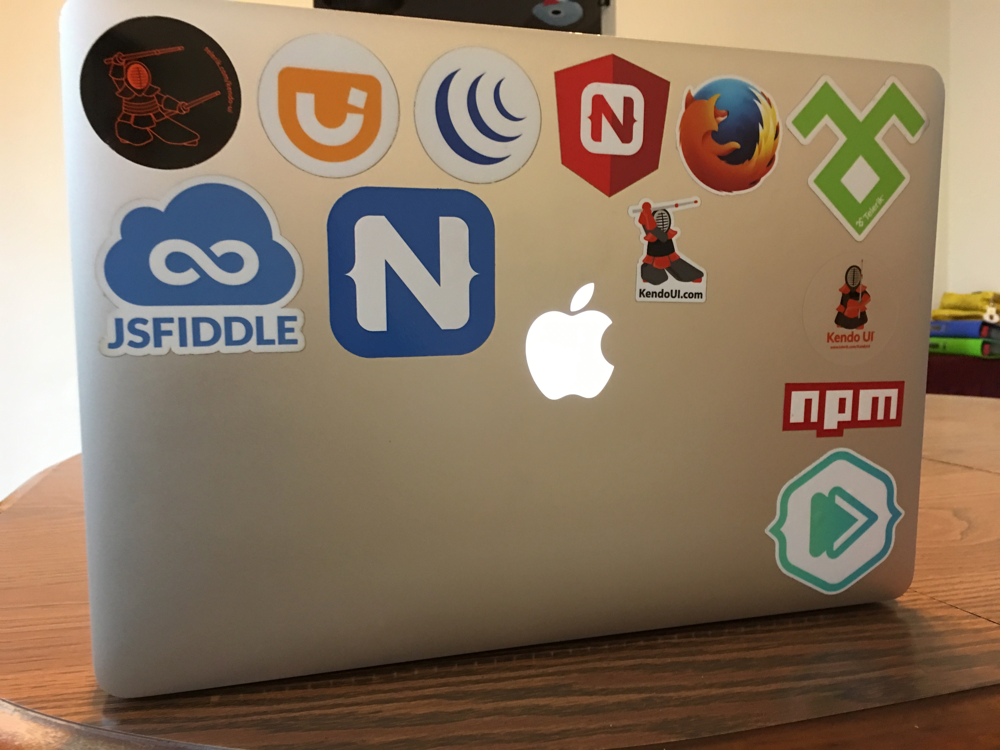
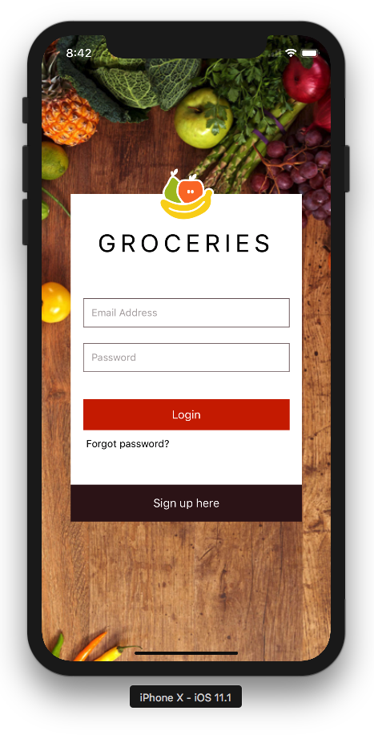
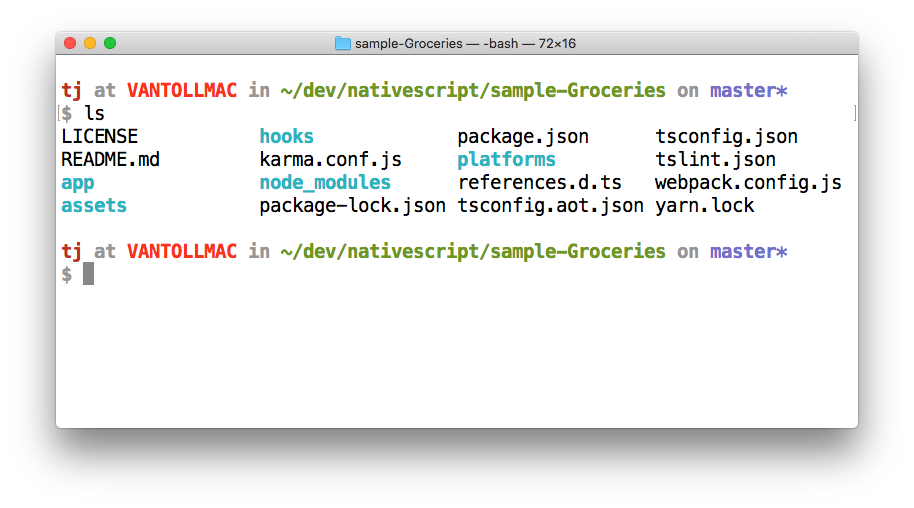
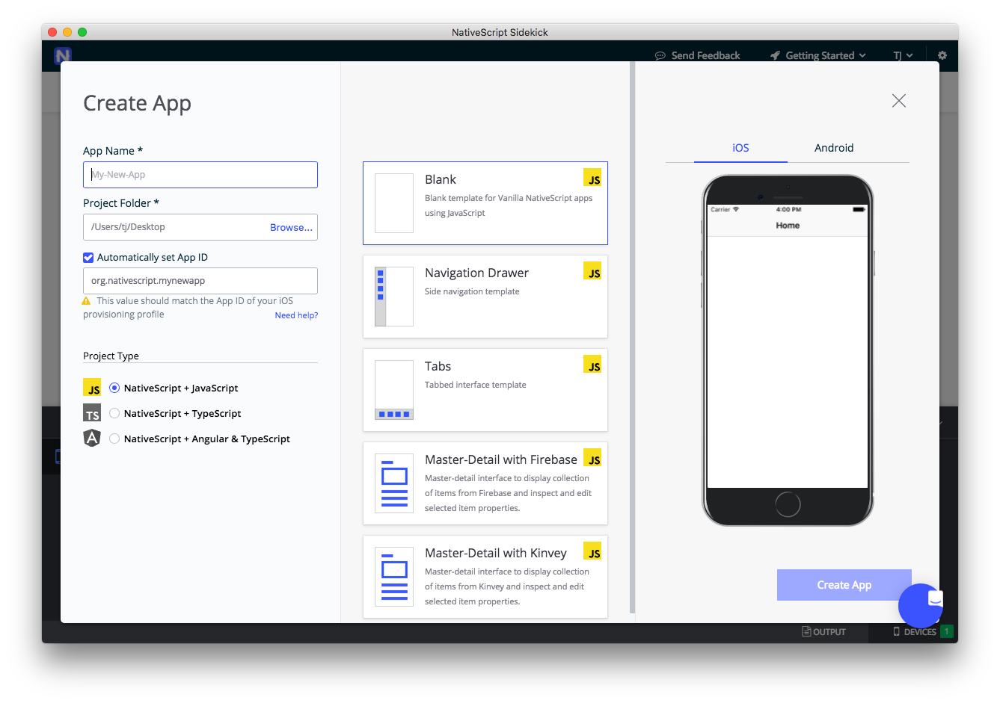
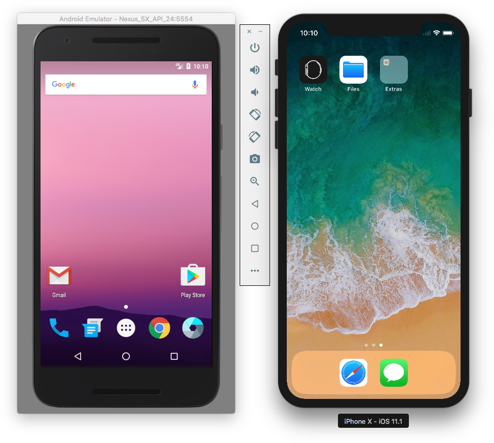
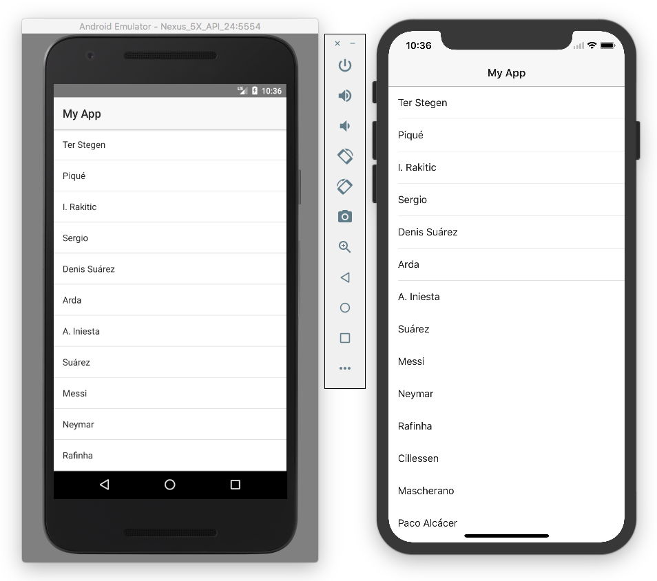
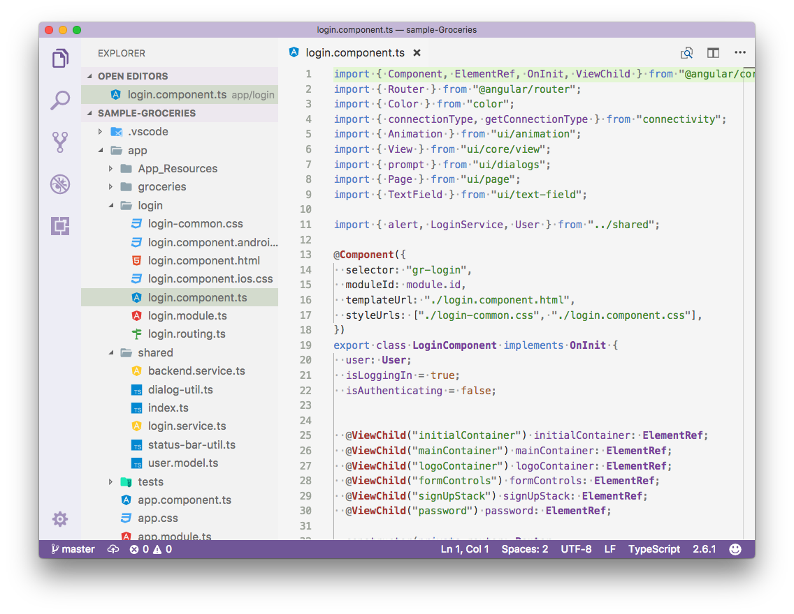
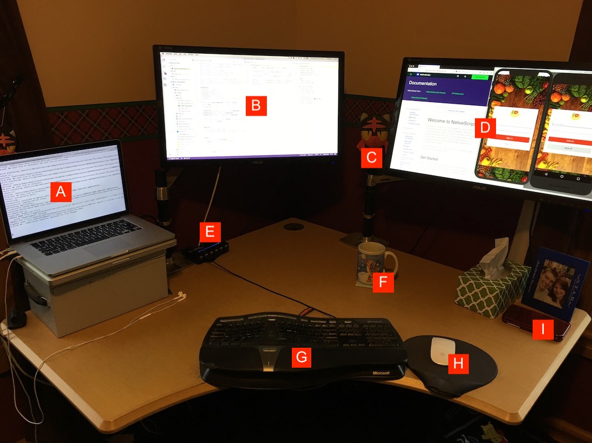

# My NativeScript Development Workflow

I find articles where developers document their development workflow interesting, so I thought I’d write one.

In this article I’ll tell you how I build NativeScript apps. I’ll start with one big disclaimer though—my workflow isn’t the “best” way to build NativeScript apps, or the only way. One of the great things about NativeScript is you have a lot of flexibility in how you build, so you can find a workflow that works for you.

In fact, if you’re a NativeScript developer you should totally write an article like this and share it in the comments 😉  It’d  be great to get different perspectives on how developers build their apps.

Let’s look at how I build.

## Operating system

We’ll start at the top. I work on a Mac. My Mac has important stickers.



Although NativeScript development on Windows and Linux isn’t bad, I like having a Mac for mobile development. As a developer advocate my needs are a little bit different than the average NativeScript developer. I occasionally need to do some native iOS development to compare it to NativeScript development, and so I need an operating system that can support that.

> **NOTE**: I prefer macOS over Windows for a variety of reasons, but I’m not going to go in depth on that here. I’m happy to chat further in the comments or [on Twitter](https://twitter.com/tjvantoll) 😄

Another big reason to work on a Mac is having direct access to iOS simulators. The iOS simulator is amazingly good at simulating the look and behavior of iOS apps, and I’ve very rarely hit scenarios where my apps look differently on simulators and physical iOS devices.



There are a few other macOS apps I use heavily that range from serious productivity enhancers, to tools that help me include emoji in tweets.

* [Divvy](http://mizage.com/divvy/)—A small utility that makes macOS window management way more sane. I have a few shortcuts set up that help me snap windows to one side of the screen, or to make windows take up the full screen.
* [OmniDiskSweeper](https://www.omnigroup.com/more)—An application that makes it simple to find what files and applications are taking up disk space on your Mac. This is especially valuable for mobile developers, as it’s amazing how many gigs random Android and iOS tools can take up.
* [Rocket](http://matthewpalmer.net/rocket/)—A little utility that makes it trivial to type emoji in basically any macOS application. If you type emoji at all you need this. Seriously.

## Terminal

I work on a Mac, and I use the Mac’s built-in Terminal app for most of my NativeScript development.

I’ve experimented with several other terminal clients such as [iTerm 2](https://www.iterm2.com/index.html), but I’ve found that I don’t use those clients’ advanced features enough to move away from the stock terminal. That being said, I do have a few different terminal customizations in place.

Here’s what my terminal looks like.



I use black text on a white background because I do a lot of presentations, and having high contrast is very important when you’re presenting on crappy projectors.

The custom prompt is something I originally got off the internet years ago, but I’ve since customized to meet my needs. For example, I added a new line before each prompt because I like my commands spaced out for readability.

If you’d like to try out this prompt configuration for yourself you can add the following to your `~/.bash_profile` file.

```
# Change the colors of folders when using ls
export CLICOLOR=1
export LSCOLORS=GxFxCxDxBxegedabagaced

# Define some constants for colors
MAGENTA=$(tput setaf 1)
ORANGE=$(tput setaf 160)
GREEN=$(tput setaf 64)
BLUE=$(tput setaf 61)
WHITE=$(tput setaf 245)
BOLD=$(tput bold)
RESET=$(tput sgr0)

parse_git_branch () {
  git branch --no-color 2> /dev/null | sed -e '/^[^*]/d' -e "s/* \(.*\)/\1/"
}
# Set how prompt looks
PS1="\n\[${BOLD}${MAGENTA}\]\u \[$WHITE\]at \[$ORANGE\]\h \[$WHITE\]in \[$GREEN\]\w\[$WHITE\]\$([[ -n \$(git branch 2> /dev/null) ]] && echo \" on \")\[$BLUE\]\$(parse_git_branch)\[$WHITE\]\n\$ \[$RESET\]"
```

Like a lot of things with bash, I copied, pasted, and executed the original version of that code without knowing what 90% of it actually does. There’s at least a 2% chance my computer has been secretly mining bitcoin for the last few years, but as long as I continue getting a bash prompt that I like I’m not going to ask too many questions.

I also have a few aliases set up in my same `~/.bash_profile` file that you might find interesting. First, I create single-letter shortcuts for `git diff` and `git status` because I use those commands all the time.

```
alias d="git diff"
alias s="git status"
```

And second, I have two shortcuts set up for launching iOS simulators and Android virtual devices directly from the command line.

```
alias android-avd="emulator -avd Nexus_5X_API_24 &"

alias ios-simulator="open /Applications/Xcode.app/Contents/Developer/Applications/Simulator.app/"
```

> **TIP**: I go into detail on the aliases I use to launch simulators and emulators in [an article on the Telerik Developer Network](https://developer.telerik.com/topics/mobile-development/launch-android-emulators-ios-simulators-command-line/).

Now that you have some background on my development environment, let’s get to the part where I actually work on NativeScript apps.

## Workflow

I used to create new NativeScript apps from the CLI using `tns create`, but I’ve since switched to [NativeScript Sidekick](https://www.nativescript.org/nativescript-sidekick) because its create app screen keeps me from needing to remember the template names.



After I create my app, I use my `ios-simulator` and `android-avd` aliases to launch an iOS simulator and an Android Virtual Device.



I think it’s important to test on both platforms simultaneously, because if you write code that breaks a single platform it’s good to figure that out immediately, and not have to backtrack to figure out where you went wrong.The NativeScript CLI is really good at handling multiple devices, so there’s really no reason _not_ to run multiple devices during testing.

> **TIP**: If you’re on Windows or Linux, you can use NativeScript Sidekick’s iOS cloud builds to test on physical iOS devices while you also develop for Android.

Although I primarily develop on simulators/emulators, there are two times where I specifically avoid emulators and stick with physical devices.

1. **Performance testing**—Emulators are running on your development machine, which has vastly different performance characteristics than physical iOS and Android devices. If you’re testing the performance of your apps, you need to do that testing on real devices to get accurate data. It’s worth having a few lower-end Android devices around to get an idea of the worst case scenario for your apps in production.
2. **Getting ready for production**—There are certain things you can’t test on simulated devices. Are your buttons big enough? Do your swipe gestures work reliably? Does switching from landscape to portrait modes feel smooth? Before your apps hit the stores it’s worth giving those apps a shot on a handful of physical devices. I have a Nexus 4, Nexus 6, Pixel, iPhone 5, iPhone 6S, and a few iPads around for this exact sort of thing. It’s actually a lot of fun to hook a ton of devices into a USB hub and watch the {N} CLI deploy your app to all of them 😄

Those two exceptions aside, I do most of my early work on new apps using the iOS simulator and Android virtual device that I launched earlier. Once both of those devices are up and running, I use `tns run` from the command line to launch my app to both.



## Editor

Once my apps are running, I edit my source code in [Visual Studio Code](https://code.visualstudio.com/). I’m a recent convert from [Sublime Text](https://www.sublimetext.com/), and it was super hard for me to leave, but there’s just so much good in Visual Studio Code (VS Code) that I had to make the switch. Here’s what my VS Code environment looks like currently.



Here are a few of my configuration settings and extensions you might find interesting.

* Quiet Light Theme—My personal favorite built-in VS Code themes. It has good contrast for presentations and I really like the colo scheme.

> **TIP**: You can preview different VS Code themes using the keyboard shortcut `Ctrl`/`Cmd` + `K` ▶️ `Ctrl`/`Cmd` + `T`. Use the arrow keys to toggle between different themes.

* [Material Icon Theme](https://marketplace.visualstudio.com/items?itemName=PKief.material-icon-theme)—My favorite icon theme. This controls the icons that appear next to file names in the explorer.
* [SpellChecker](https://marketplace.visualstudio.com/items?itemName=swyphcosmo.spellchecker)—This extension isn’t about NativeScript directly, but I really like this spell checker for when I’m writing articles and documentation in VS Code.

Now that I’ve given you a broad overview of some of the things I use independently, let’s put it all together and look at the big picture.

## The complete picture

I do most of my NativeScript development in my office because I value screen real estate. I have two large external monitors, and I dock my MacBook alongside them so I have three displays to look at.



* **A**: I use my laptop as my left monitor and I keep my terminal here. I execute `tns run` to start my NativeScript app, and go back if I need to look at logs or commit something.
* **B**: My center monitor is dedicated to my text editor, and I usually have two or three columns open so I can look at files side by side if necessary.
* **C**: This is Litten. Litten is a Pokémon. There’s a bonus Litten in this picture if you look close enough.
* **D**: My right monitor is where I put my iOS simulator, my Android emulator, and my browser for documenation, Stack Overflow, and so forth.
* **E**: A 10-port USB hub. I plug a ton of devices into this thing when I do production testing of my apps.
* **F**: This is coffee ☕
* **G**: The [Microsoft Ergonomic Keyboard 4000](https://www.microsoft.com/accessories/en-us/products/keyboards/natural-ergonomic-keyboard-4000/b2m-00012). I’m a huge fan.
* **H**: An Apple Magic Mouse 1, aka the the one that does **not** have the [absolutely bizarre charging port](https://gizmodo.com/the-sad-reality-of-the-magic-mouse-2-1746949289).
* **I**: A Nintendo DS. NativeScript apps don’t run on this, but Pokémon Ultra Sun does 😄

And that’s it. I tweak my workflow every so often when I find something that makes me more productive. Before I wrap up I thought I’d mention a few other tools that I frequently use.

* [VectorStock](https://www.vectorstock.com/)—A great place to buy cheap icons.
* [NativeScript Image Builder](http://nsimage.brosteins.com/)—A good resource from the [Brosteins](https://brosteins.com/) for generating images for your app in the correct dimensions for your `App_Resources` folder.
* [DaVinci](https://www.davinciapps.com/)—A tool to help you create app screenshots that look professional.

## How about you?

Do you have any tools or workflows you’d like to share with the NativeScript world? Post them in the comments!

It’s always interesting to hear other perspectives, especially in the NativeScript community, as there are so many ways you can build your apps.


