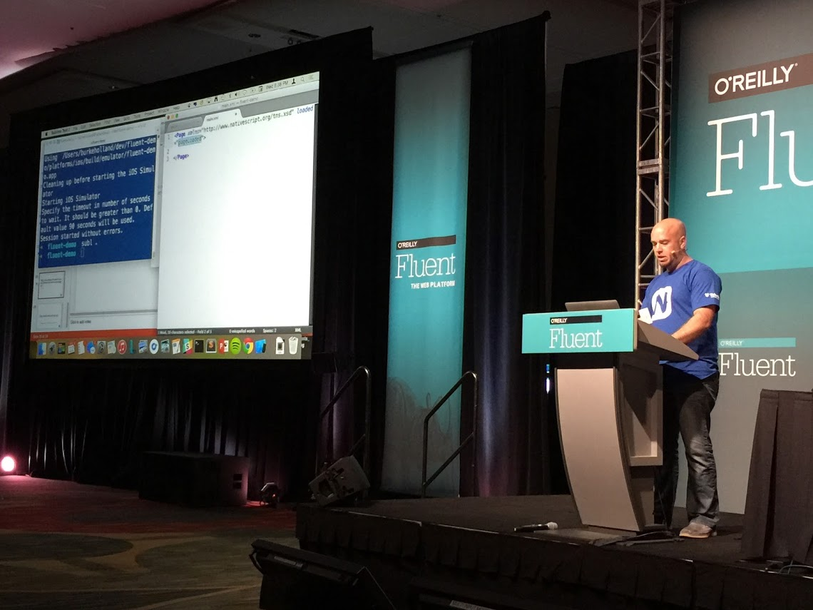
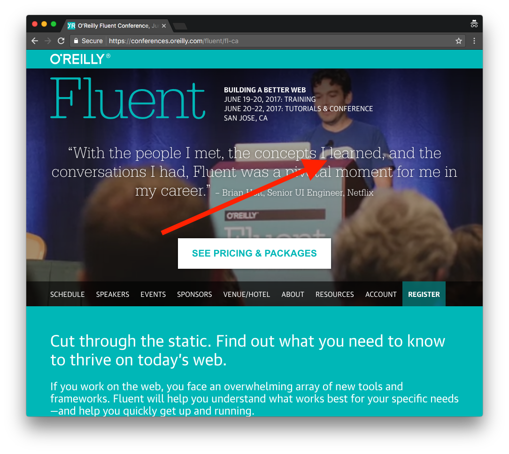
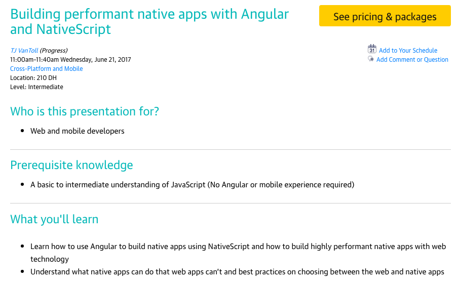
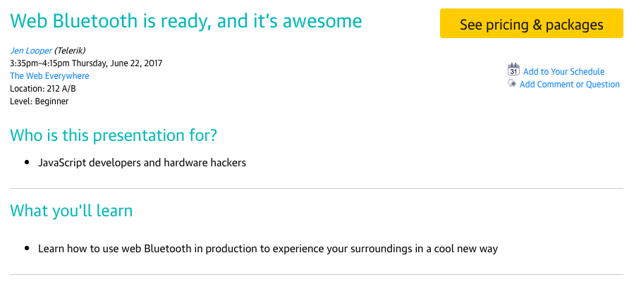
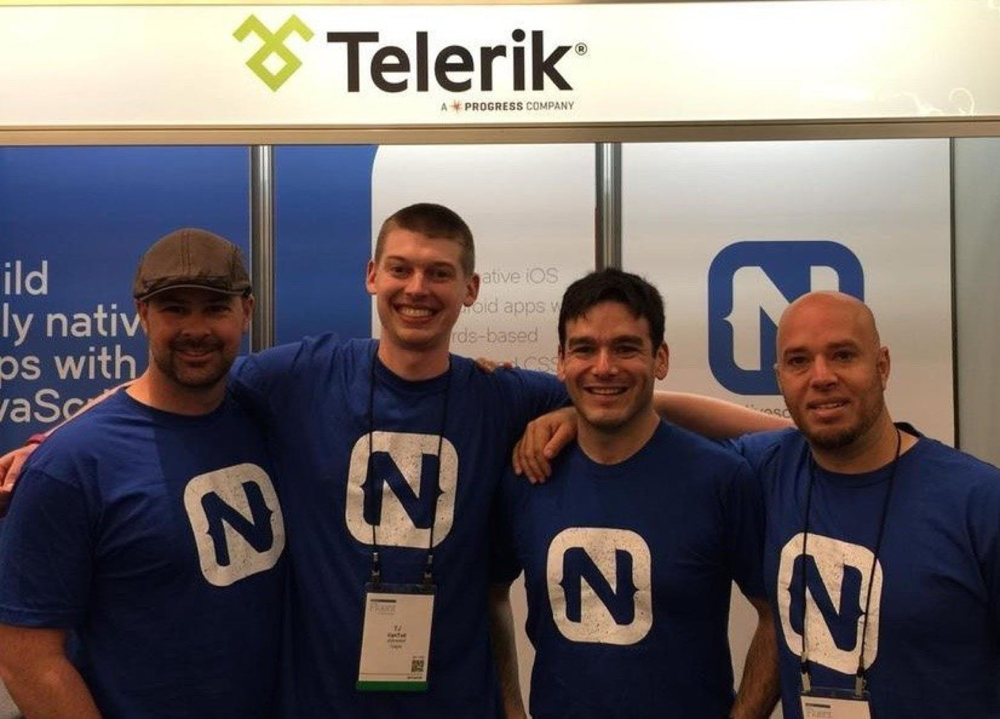
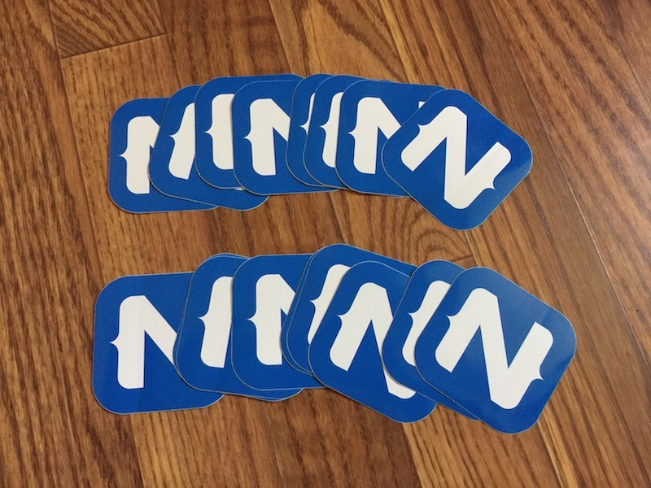
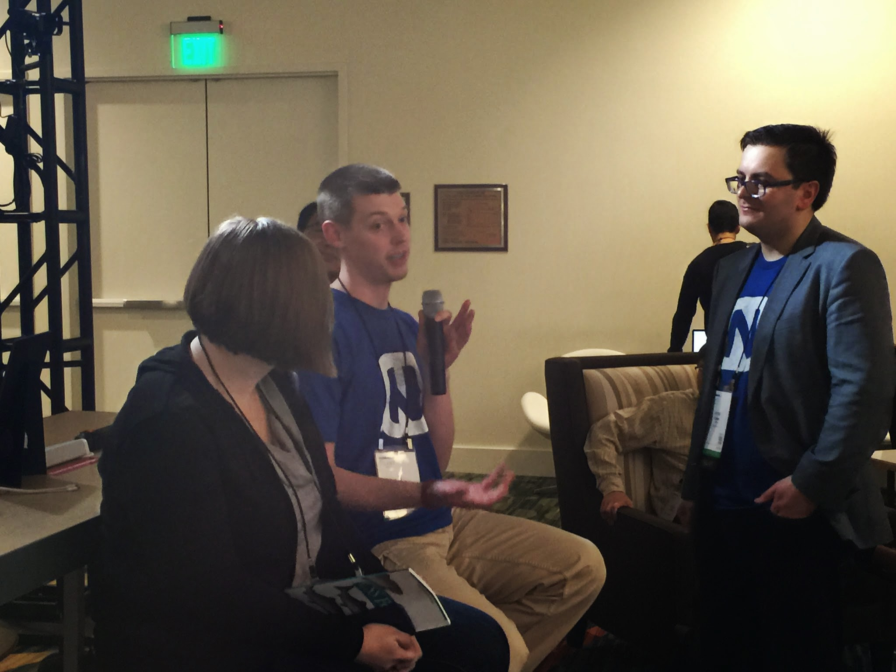

# NativeScript at Fluent Conf 2017

NativeScript and Fluent go way back. Back in ancient times, circa 2015, the one and only Burke Holland [introduced a very new framework called “NativeScript”](https://www.youtube.com/watch?v=umC11SeqtZw) to the Fluent world.

A year later, our very own [Brian Rinaldi](https://twitter.com/remotesynth) delivered a talk on JavaScript static site generators. JavaScript static site generators have nothing to do with NativeScript—BUT—Brian _was_ wearing a NativeScript shirt; a shirt that now appears on the Fluent conf homepage.

This year you can expect even more awesome from NativeScript team at Fluent, as myself, Jen Looper, and Rob Lauer will all be taking Fluent by storm. What can you expect?

A performance-focused talk on NativeScript from yours truly? Check.

A talk on bluetooth from Jen Looper that involves US revolutionary war reenactors? Check.

The physical presence of Rob Lauer, the man behind [nativescriptthemebuilder.com](http://www.nativescriptthemebuilder.com/) and [nsplugins.com](http://www.nsplugins.com/)? You know it.

Will there be a booth? Of course there will.

Will that booth have swag? (If you haven’t figured it out yet these are rhetorical questions, and the answer is always an emphatic yes.)

Will there be embarrassing pictures taken of people in NativeScript shirts? Most likely. This one in particular is just asking for a meme.

So if you’re coming to Fluent, stop by! Say hi, ask NativeScript questions, come see some talks, grab some stickers, and take take pictures you might regret later.
