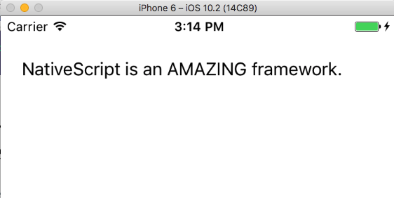
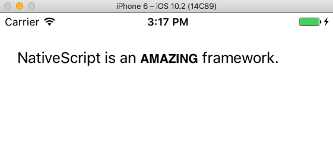
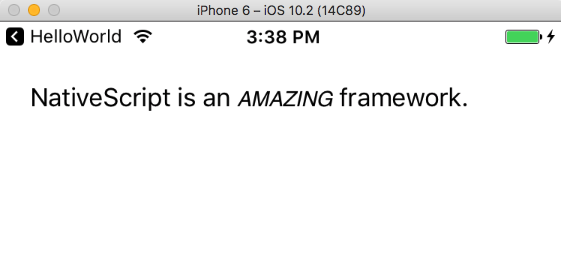
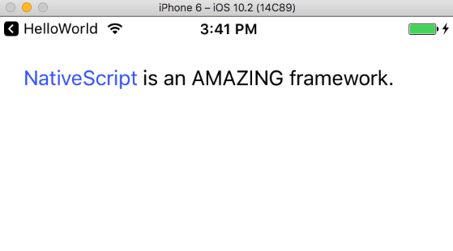
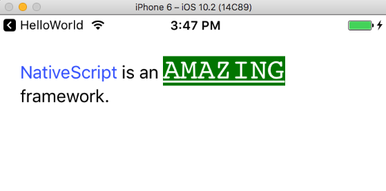
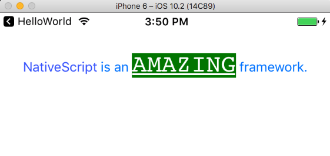
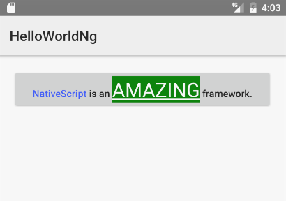
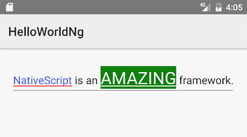

# Bolding, Italicizing, and Underlining Portions of Text in NativeScript

This is a quick tip for anyone that has ever wanted to bold, italicize, underline, or highlight a portion of a label in a NativeScript app. For example, suppose you had the following code in your app.

```
<StackLayout class="p-20">
  <Label textWrap="true"
    text="NativeScript is an AMAZING framework!"></Label>
</StackLayout>
```

This code works, and displays the label as such.



Although this code works, let’s be honest—a sentence without formatting can’t convey how amazing NativeScript really is. If you switch to use the code below you can make AMAZING really stand out in bold.

```
<StackLayout class="p-20">
  <Label textWrap="true">
    <Label.formattedText>
      <FormattedString>
        <FormattedString.spans>
          <Span text="NativeScript is an " />
          <Span text="AMAZING" fontAttributes="Bold" />
          <Span text=" framework." />
        </FormattedString.spans>
      </FormattedString>
    </Label.formattedText>
  </Label>
</StackLayout>
```

> **NOTE**: If you’re using Angular with NativeScript the syntax you’ll need is slightly different—more on that in a moment.

The label now renders like this.



This code leverages NativeScript’s [`FormattedString` class](https://docs.nativescript.org/api-reference/classes/_text_formatted_string_.formattedstring.html), which is a handy little class for altering portions of text in NativeScript apps. Notice how the code breaks the string into three parts, or spans.

```
<Span text="NativeScript is an " />
<Span text="AMAZING" fontAttributes="Bold" />
<Span text=" framework." />
```

Each of these `Span` components can use a number of attributes, such as `backgroundColor`, `fontFamily`, `fontSize`, `foregroundColor`, `strikethrough`, and `underline`. We’ll look at a few examples of this in a moment, but first there’s one caveat we must discuss.

## Angular usage

If you try to copy and paste the above example into a NativeScript & Angular app your live will be full of pain and sorrow—that, or a lot of syntax errors.

But no worries! NativeScript has a special built-in directive to make use the same `FormattedString` class possible, and actually a lot easier. The following code snippet runs just fine in a NativeScript & Angular app.

```
<StackLayout class="page m-20">
  <Label>
    <FormattedString>
      <Span text="NativeScript is an "></Span>
      <Span text="AMAZING" fontAttributes="Bold"></Span>
      <Span text=" framework."></Span>
    </FormattedString>
  </Label>
</StackLayout>
```

And this code renders exactly the same as the previous example.


The syntax is so much nicer that I’m going to use it for the rest of this article, because no one needs more `<Label.formattedText>` and `</FormattedString.spans>` in their lives. If you are using NativeScript without Angular, just know that you’ll need to wrap this article’s subsequent examples with the markup from the first example.

With that out of the way, let’s do some practical and ridiculous things with `<FormattedString>`.

## Fun with FormattedString

For the rest of this article I’m going to show a few code snippets and how they render. You can always look up these APIs your self on the [`FormattedString` API docs](https://docs.nativescript.org/api-reference/classes/_text_formatted_string_.formattedstring.html).

### Italics

```
<StackLayout class="page m-20">
  <Label>
    <FormattedString>
      <Span text="NativeScript is an "></Span>
      <Span text="AMAZING" fontAttributes="Italic"></Span>
      <Span text=" framework."></Span>
    </FormattedString>
  </Label>
</StackLayout>
```



### Underlining

```
<StackLayout class="page m-20">
  <Label>
    <FormattedString>
      <Span text="NativeScript is an "></Span>
      <Span text="AMAZING" underline="true"></Span>
      <Span text=" framework."></Span>
    </FormattedString>
  </Label>
</StackLayout>
```


### Colors

```
<StackLayout class="page m-20">
  <Label>
    <FormattedString>
      <Span text="NativeScript" foregroundColor="#3C5AFD"></Span>
      <Span text=" is an AMAZING framework."></Span>
    </FormattedString>
  </Label>
</StackLayout>
```



### Crazy

```
<StackLayout class="page m-20">
  <Label textWrap="true">
    <FormattedString>
      <Span text="NativeScript" foregroundColor="#3C5AFD"></Span>
      <Span text=" is an "></Span>
      <Span text="AMAZING" fontSize="28" underline="true" backgroundColor="green" foregroundColor="white" fontFamily="Courier"></Span>
      <Span text=" framework."></Span>
    </FormattedString>
  </Label>
</StackLayout>
```



## Other UI Components

Oh yeah, one more thing before you return to the rest of the internet—you can totally use the `FormattedString` with other NativeScript UI components.

In fact, I can change the previous “Crazy” example from a `<Label>` to a `<Button>`, and everything just works.

```
<StackLayout class="page m-20">
  <Button>
    <FormattedString>
      <Span text="NativeScript" foregroundColor="#3C5AFD"></Span>
      <Span text=" is an "></Span>
      <Span text="AMAZING" fontSize="28" underline="true" backgroundColor="green" foregroundColor="white" fontFamily="Courier"></Span>
      <Span text=" framework."></Span>
    </FormattedString>
  </Button>
</StackLayout>
```

The button looks like this on iOS.



And like this on Android.



It’s actually pretty crazy what you can use these APIs to do. Believe it or not, this works.

```
<StackLayout class="page m-20">
  <TextField>
    <FormattedString>
      <Span text="NativeScript" foregroundColor="#3C5AFD"></Span>
      <Span text=" is an "></Span>
      <Span text="AMAZING" fontSize="28" underline="true" backgroundColor="green" foregroundColor="white" fontFamily="Courier"></Span>
      <Span text=" framework."></Span>
    </FormattedString>
  </TextField>
</StackLayout>
```




Fun, huh? Hopefully I’ve shown you that NativeScript’s `FormattedString` class is a powerful way to format any text in your NativeScript apps.

Have you used `FormattedString` to do something cool in your apps? Tell us about it in the comments.


